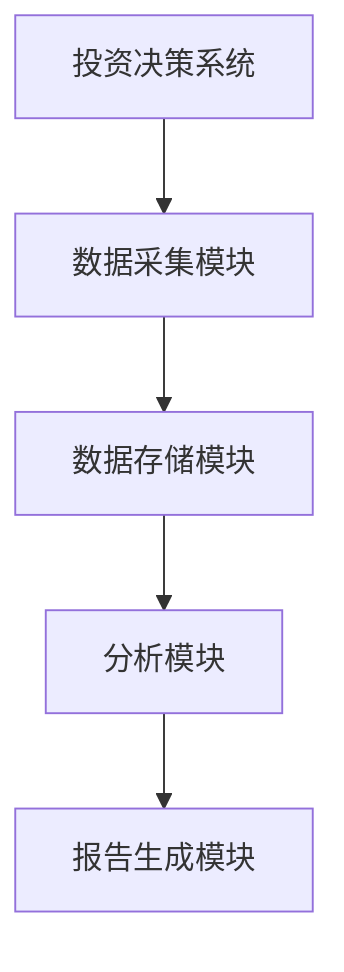
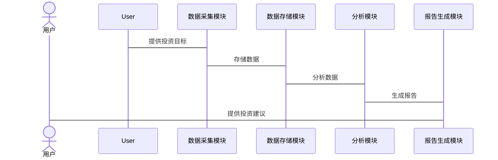

                 

# 彼得林奇的"街头智慧"投资技巧

## 关键词：投资技巧，彼得林奇，价值投资，风险管理，基本面分析，投资策略

## 摘要：彼得·林奇是全球著名的价值投资者，他的“街头智慧”投资技巧以基本面分析和风险管理为核心，强调通过深入研究和合理估值来选择优质股票。本文将详细解读彼得林奇的投资理念、分析方法和实际案例，帮助读者掌握这一经典的投资策略。

---

# 第1章: 投资概述与彼得·林奇的投资理念

## 1.1 投资的基本概念

### 1.1.1 投资的定义与分类
- **投资**：通过购买资产（如股票、债券、房地产等）以期获得未来收益的行为。
- 分类：可分为实物投资（如房地产）、金融投资（如股票、债券）和无形资产投资（如专利）。

### 1.1.2 价值投资与成长投资的区别
- **价值投资**：寻找市场价格低于内在价值的资产进行投资。
- **成长投资**：投资于具有高成长潜力的公司，注重未来收益而非当前价值。

### 1.1.3 投资市场的基本构成
- 投资者：个人、机构投资者。
- 资产：股票、债券、基金等。
- 市场：一级市场（发行市场）和二级市场（交易市场）。

## 1.2 彼得·林奇的简介

### 1.2.1 彼得·林奇的生平与职业历程
- **生平**：彼得·林奇（Peter Lynch）出生于1942年，是美国著名基金经理。
- **职业历程**：曾管理富达麦哲伦基金，创造了年化29%的收益率，被誉为“最伟大的基金经理”。

### 1.2.2 彼得·林奇的投资风格与理念
- **价值投资**：寻找被市场低估的股票。
- **基本面分析**：深入研究公司财务状况、行业地位和竞争优势。
- **长期投资**：注重长期收益而非短期波动。

### 1.2.3 彼得·林奇的著作与影响力
- 著作：《彼得·林奇的成功投资》、《彼得·林奇的股票投资策略》。
- 影响力：他的投资理念影响了全球投资者，尤其强调基本面分析和风险管理。

## 1.3 彼得·林奇的"街头智慧"投资技巧

### 1.3.1 街头智慧的定义与特点
- **定义**：彼得·林奇提出的投资理念，强调通过常识和基本面分析选择投资标的。
- **特点**：注重实际、简单易懂、强调长期价值。

### 1.3.2 街头智慧在投资中的应用
- 通过日常观察和行业知识发现投资机会。
- 例如，通过关注超市货架上的产品变化判断公司前景。

### 1.3.3 街头智慧与传统投资理论的对比
- **传统理论**：依赖复杂的数学模型和市场预测。
- **街头智慧**：注重实际观察和公司基本面分析。

---

# 第2章: 基本面分析与价值评估

## 2.1 基本面分析的核心概念

### 2.1.1 基本面分析的定义与作用
- **定义**：通过对公司财务状况、行业地位、管理团队等方面进行分析，评估其内在价值。
- **作用**：帮助投资者做出理性的投资决策，避免被市场情绪左右。

### 2.1.2 基本面分析的关键指标
- **市盈率（P/E）**：股价与每股收益的比率，用于评估股票是否被高估或低估。
- **市净率（P/B）**：股价与每股净资产的比率，衡量资产是否被低估。
- **ROE（净资产收益率）**：衡量公司盈利能力的重要指标。

### 2.1.3 基本面分析的局限性
- 无法预测市场短期波动。
- 需要大量时间和精力进行深入研究。

## 2.2 价值投资的核心要素

### 2.2.1 价值投资的定义与原则
- **定义**：寻找市场价格低于内在价值的股票进行投资。
- **原则**：长期持有、分散投资、注重安全边际。

### 2.2.2 价值投资的关键指标
- **内在价值**：通过DCF模型（现金流贴现法）计算公司的真实价值。
- **安全边际**：买入价格与内在价值的差距，确保投资的安全性。

### 2.2.3 价值投资的适用场景与限制
- **适用场景**：市场低迷、优质资产被低估时。
- **限制**：需要对多个公司进行深入研究，时间成本较高。

## 2.3 成长股与价值股的对比分析

### 2.3.1 成长股的定义与特点
- **定义**：具有高成长潜力的公司股票，通常市盈率较高。
- **特点**：高增长、高风险，适合长期投资者。

### 2.3.2 价值股的定义与特点
- **定义**：市场价格低于内在价值的股票，通常市盈率较低。
- **特点**：低估值、高稳定性，适合稳健投资者。

### 2.3.3 成长股与价值股的投资策略对比
- **成长股策略**：注重公司未来增长潜力，适合长期投资者。
- **价值股策略**：注重当前市场价格与内在价值的差距，适合稳健投资者。

---

# 第3章: 投资模型与算法原理

## 3.1 投资模型的基本原理

### 3.1.1 投资模型的定义与分类
- **定义**：基于数学和统计学的方法，构建投资决策的工具。
- **分类**：基本面模型、技术分析模型、量化模型。

### 3.1.2 常见的投资模型
- **PEG模型**：市盈率与预期增长率的比率，用于评估成长股的估值。
- **DCF模型**：现金流贴现法，用于计算公司的内在价值。

### 3.1.3 投资模型的优缺点
- **优点**：量化分析，减少主观判断。
- **缺点**：模型假设可能与实际情况不符。

## 3.2 投资策略的数学模型

### 3.2.1 市盈率模型
- 公式：P/E = 市场价格 / 每股收益。
- 应用：评估股票是否被高估或低估。

### 3.2.2 市净率模型
- 公式：P/B = 市场价格 / 每股净资产。
- 应用：衡量资产是否被低估。

### 3.2.3 内在价值模型
- 公式：内在价值 = 现金流的现值。
- 应用：用于价值投资中的股票筛选。

---

# 第4章: 风险管理与投资组合优化

## 4.1 风险管理的核心概念

### 4.1.1 风险的定义与分类
- **定义**：投资中可能面临的损失或收益下降的可能性。
- **分类**：市场风险、流动性风险、信用风险。

### 4.1.2 风险管理的重要性
- 保护本金安全。
- 控制投资组合的波动性。

## 4.2 投资组合优化的策略

### 4.2.1 投资组合的构建原则
- 分散投资：通过多样化降低风险。
- 定期调整：根据市场变化优化持仓。

### 4.2.2 风险调整后的收益分析
- 使用夏普比率衡量投资组合的收益与风险比。

---

# 第5章: 系统分析与投资架构设计

## 5.1 系统功能设计

### 5.1.1 投资决策系统的需求分析
- 数据采集：收集公司财务数据、行业信息。
- 分析模块：进行基本面分析和估值计算。
- 报告生成：输出投资建议和风险提示。

### 5.1.2 系统架构图

### 5.1.3 系统交互序列图

## 5.2 接口设计

### 5.2.1 数据接口规范
- 输入：公司财务数据。
- 输出：估值报告和投资建议。

---

# 第6章: 项目实战与案例分析

## 6.1 项目实战

### 6.1.1 项目背景
- 选择一个具体行业，分析其市场前景和竞争格局。

### 6.1.2 数据采集与分析
- 使用基本面分析工具，计算市盈率、市净率等指标。

### 6.1.3 投资决策
- 根据分析结果，判断是否值得投资。

## 6.2 案例分析

### 6.2.1 案例背景
- 某公司财务数据：收入增长稳定，市盈率低于行业平均水平。

### 6.2.2 分析过程
- 计算PEG和DCF模型，得出内在价值。

### 6.2.3 投资建议
- 买入，因公司估值被低估。

---

# 第7章: 最佳实践与小结

## 7.1 投资策略总结

### 7.1.1 风险管理
- 设置止损点，分散投资。

### 7.1.2 长期投资
- 长期持有优质资产，避免频繁交易。

## 7.2 持续学习与精进

### 7.2.1 行业动态
- 关注行业趋势和公司新闻。

### 7.2.2 知识更新
- 定期学习新的投资理论和工具。

## 7.3 注意事项

### 7.3.1 保持理性
- 避免被市场情绪左右。

### 7.3.2 避免过度杠杆
- 高杠杆可能放大亏损。

---

# 作者：AI天才研究院/AI Genius Institute & 禅与计算机程序设计艺术 /Zen And The Art of Computer Programming

---

这篇文章通过系统地介绍彼得·林奇的“街头智慧”投资技巧，从基本概念到实际应用，帮助读者掌握这一经典的投资策略。

