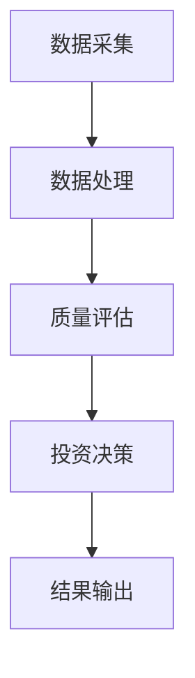

                 


# 彼得林奇的"质量优先"投资策略分析

## 关键词：彼得林奇，质量优先，投资策略，企业质量评估，数学模型

## 摘要：本文系统地分析了彼得林奇的"质量优先"投资策略，从背景、核心概念、算法原理、数学模型到系统架构和项目实战进行了全面阐述。通过实际案例分析，深入探讨了该策略在投资决策中的应用价值，并提出了相应的优化建议。

---

## 第1章: "质量优先"投资策略的背景与核心概念

### 1.1 投资策略的背景介绍

#### 1.1.1 传统投资策略的局限性
传统的投资策略往往注重短期收益和市场波动，忽视了企业质量的核心作用。这种策略可能导致投资者在市场波动中频繁调整投资组合，增加了风险和交易成本。

#### 1.1.2 质量优先策略的提出背景
彼得林奇提出质量优先策略的初衷是帮助投资者选择那些具有持续竞争优势和良好管理的公司。这种策略强调长期投资，减少短期波动的干扰。

#### 1.1.3 质量优先策略的核心目标
通过选择高质量的公司，投资者能够在长期获得稳定的收益，同时降低投资组合的整体风险。

### 1.2 质量优先策略的核心概念

#### 1.2.1 质量优先的定义
质量优先策略是指在投资决策中，优先选择那些具有高质量的企业，而非仅仅关注短期收益。

#### 1.2.2 质量优先策略的关键要素
包括企业盈利能力、成长能力、财务健康、管理团队和行业地位。

#### 1.2.3 质量优先与传统投资策略的对比
质量优先策略更注重企业的内在质量和长期发展潜力，而传统策略更多关注市场波动和短期收益。

---

## 第2章: 质量优先策略的核心原理

### 2.1 质量优先策略的理论基础

#### 2.1.1 基本面分析的核心作用
基本面分析是质量优先策略的基础，通过分析企业的财务报表和行业地位，评估其投资价值。

#### 2.1.2 企业质量评估的五个维度
包括盈利能力、成长能力、财务健康、管理团队和行业地位。

#### 2.1.3 质量优先策略的数学模型
通过综合评估各个维度的指标，构建企业质量指数。

### 2.2 质量优先策略的算法原理

#### 2.2.1 数据分析与特征提取
收集企业的财务数据，提取关键指标。

#### 2.2.2 企业质量评估的流程图
展示从数据收集到最终评估的完整流程。

#### 2.2.3 算法实现的代码框架
提供一个简单的质量评估代码示例。

---

## 第3章: 质量优先策略的数学模型与公式

### 3.1 质量评估的数学模型

#### 3.1.1 企业质量指数的计算公式
$$质量指数 = \sum (权重_i \times 指标_i)$$

#### 3.1.2 质量指数的权重分配
展示各个维度的权重分配比例。

#### 3.1.3 质量指数的验证与调整
通过实证分析，验证模型的有效性并进行调整。

### 3.2 质量优先策略的优化算法

#### 3.2.1 非线性回归模型的应用
介绍如何使用非线性回归模型优化质量评估。

#### 3.2.2 质量优先策略的动态调整公式
展示如何根据市场变化动态调整投资策略。

#### 3.2.3 算法优化的数学推导
详细推导优化算法的数学过程。

---

## 第4章: 系统分析与架构设计方案

### 4.1 投资系统的需求分析

#### 4.1.1 系统目标与功能需求
包括数据收集、质量评估、投资决策等功能。

#### 4.1.2 系统的输入输出设计
定义系统的输入数据和输出结果。

#### 4.1.3 系统的性能指标
确保系统高效稳定运行。

### 4.2 系统架构设计

#### 4.2.1 系统架构的模块划分
包括数据采集模块、质量评估模块、投资决策模块。

#### 4.2.2 每个模块的功能描述
详细描述每个模块的功能和交互关系。

#### 4.2.3 系统架构的流程图
展示系统整体架构和流程。

---

## 第5章: 项目实战与案例分析

### 5.1 环境安装与配置

#### 5.1.1 开发环境的选择
推荐使用Python和相关库进行开发。

#### 5.1.2 数据库的安装与配置
选择合适的数据库存储企业数据。

#### 5.1.3 开发工具的安装
安装Jupyter Notebook、PyCharm等工具。

### 5.2 核心代码实现

#### 5.2.1 数据处理模块的代码
展示如何清洗和处理企业数据。

#### 5.2.2 质量评估模块的代码
实现企业质量指数的计算。

#### 5.2.3 策略执行模块的代码
根据质量指数生成投资建议。

### 5.3 项目小结

#### 5.3.1 项目成果总结
总结项目的实现成果和实际效果。

#### 5.3.2 项目中的问题与解决方案
分享项目中遇到的问题及解决方法。

#### 5.3.3 未来改进方向
提出进一步优化系统的建议。

---

## 第6章: 最佳实践与小结

### 6.1 投资策略的注意事项

#### 6.1.1 策略实施中的常见问题
包括数据获取困难、模型过拟合等。

#### 6.1.2 策略优化的建议
建议定期调整权重和引入新的指标。

#### 6.1.3 策略的风险管理
强调风险管理的重要性，避免过度集中投资。

### 6.2 项目总结与未来展望

#### 6.2.1 项目成果的总结
总结项目的成功经验和不足之处。

#### 6.2.2 未来研究的方向
探讨将机器学习应用于质量评估的潜力。

#### 6.2.3 对投资者的建议
鼓励投资者长期关注企业质量，避免短期波动干扰。

---

## 附录: 质量优先策略的详细代码实现

### 附录A: 数据处理模块的代码

```python
import pandas as pd

# 读取数据
data = pd.read_csv('企业数据.csv')

# 清洗数据
data = data.dropna()
data = data.drop_duplicates()
```

### 附录B: 质量评估模块的代码

```python
def calculate_quality_index(data):
    quality_index = 0
    # 加权计算
    quality_index += data['盈利能力'] * 0.3
    quality_index += data['成长能力'] * 0.2
    quality_index += data['财务健康'] * 0.25
    quality_index += data['管理团队'] * 0.15
    quality_index += data['行业地位'] * 0.05
    return quality_index
```

### 附录C: 系统架构图



---

## 作者：AI天才研究院/AI Genius Institute & 禅与计算机程序设计艺术 /Zen And The Art of Computer Programming

---

通过以上结构，读者可以系统地了解彼得林奇的"质量优先"投资策略，并能够在实际投资中应用这些方法。

