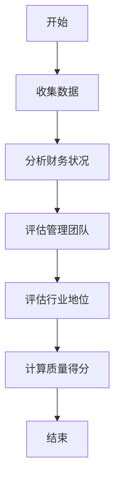
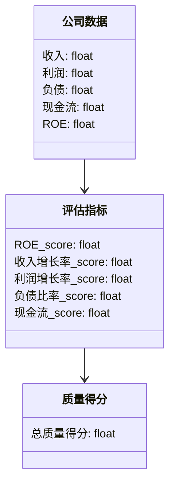
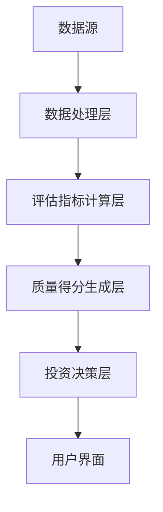

                 


# 彼得林奇的"质量优先"选股标准

> 关键词：彼得林奇，质量优先，选股标准，投资策略，财务分析

> 摘要：本文深入探讨了彼得·林奇的质量优先选股标准，从背景介绍、核心概念、算法原理、数学模型、系统架构到项目实战，全面解析了这一选股方法的原理和应用。通过详细分析，本文旨在帮助投资者理解并掌握如何选择优质股票，以实现长期稳定的收益。

---

## 第一部分：质量优先选股的背景与基础

### 第1章：质量优先选股概述

#### 1.1 投资的基本概念

##### 1.1.1 什么是投资

投资是指将资金投入到某个项目或资产中，以期望在未来获得超过初始投入的回报。投资可以是股票、债券、房地产等多种形式，其核心目标是实现资产增值。

##### 1.1.2 投资的目标与意义

投资的目标是通过合理配置资产，实现财富的保值和增值。投资的意义在于帮助个人或机构在不确定的经济环境中，通过多元化投资降低风险，实现财富增长。

##### 1.1.3 投资的基本原则

投资的基本原则包括分散投资、长期持有、风险与收益匹配等。投资者应根据自身的风险承受能力和投资目标选择合适的投资策略。

#### 1.2 彼得林奇与质量优先选股

##### 1.2.1 彼得林奇的简介

彼得·林奇（Peter Lynch）是美国著名的投资专家，曾任富达投资集团麦哲伦基金的经理。他以其独特的选股方法闻名，强调通过深入研究公司基本面来选择优质股票。

##### 1.2.2 质量优先选股的定义

质量优先选股是一种以公司质量为核心的投资策略，强调选择那些财务健康、管理优秀、行业地位稳固的公司。

##### 1.2.3 质量优先选股的核心思想

林奇的核心思想是，投资者应关注公司的基本面，选择那些具有持续增长潜力和良好管理的公司，而不是盲目追求市场的短期波动。

#### 1.3 质量优先选股的重要性

##### 1.3.1 传统选股方法的局限性

传统选股方法可能过于依赖市场短期表现或技术指标，忽视了公司本身的内在价值。

##### 1.3.2 质量优先选股的优势

质量优先选股通过深入分析公司的财务状况、管理团队和市场竞争力，帮助投资者选择具有长期增长潜力的公司。

##### 1.3.3 质量优先选股的应用场景

适用于长期投资、价值投资和成长型投资，特别适合那些希望获得稳定且持续收益的投资者。

---

## 第二部分：质量优先选股的核心概念

### 第2章：质量优先选股的核心概念

#### 2.1 公司质量评估的维度

##### 2.1.1 财务状况评估

财务状况是评估公司质量的重要指标。重点关注公司的收入、利润、资产负债情况和现金流。

##### 2.1.2 管理团队评估

管理团队的能力和战略决策对公司的发展至关重要。优秀的管理团队能够带领公司持续成长。

##### 2.1.3 行业地位评估

公司所处的行业地位决定了其竞争优势。龙头企业通常具有更强的市场影响力和抗风险能力。

##### 2.1.4 市场竞争力评估

评估公司在市场中的竞争力，包括市场份额、产品创新能力和成本控制能力。

#### 2.2 质量优先选股的筛选标准

##### 2.2.1 财务健康性标准

公司应具备健康的财务状况，如稳定的收入增长、合理的负债水平和良好的现金流。

##### 2.2.2 管理能力标准

管理团队应具备丰富的经验和良好的声誉，能够有效应对市场变化和内部挑战。

---

## 第三部分：质量优先选股的算法原理

### 第3章：质量优先选股的算法原理

#### 3.1 质量优先选股的筛选流程

##### 3.1.1 筛选步骤

1. 收集目标公司的财务数据和行业信息。
2. 分析公司的财务状况，评估其健康性。
3. 考察管理团队的能力和公司战略。
4. 评估公司在行业中的地位和市场竞争力。
5. 综合各项指标，计算公司质量得分。

##### 3.1.2 筛选流程图



#### 3.2 质量优先选股的评估模型

##### 3.2.1 评估指标

- 净资产收益率（ROE）
- 销售收入增长率
- 净利润增长率
- 负债率
- 现金流状况

##### 3.2.2 质量得分计算

质量得分是通过加权计算各评估指标得出的综合分数，分数越高表示公司质量越好。

##### 3.2.3 评估模型的Python实现

```python
def calculate_quality_score(company_data):
    # 财务指标权重
    financial_weights = {
        'ROE': 0.3,
        'revenue_growth': 0.2,
        'net_profit_growth': 0.2,
        'debt_ratio': 0.15,
        'cash_flow': 0.1
    }
    
    # 计算各指标得分
    roe_score = company_data['ROE'] / 10
    revenue_growth_score = company_data['revenue_growth'] / 20
    net_profit_growth_score = company_data['net_profit_growth'] / 20
    debt_ratio_score = 1 - (company_data['debt_ratio'] / 100)
    cash_flow_score = company_data['cash_flow'] / 10
    
    # 计算总质量得分
    quality_score = (
        financial_weights['ROE'] * roe_score +
        financial_weights['revenue_growth'] * revenue_growth_score +
        financial_weights['net_profit_growth'] * net_profit_growth_score +
        financial_weights['debt_ratio'] * debt_ratio_score +
        financial_weights['cash_flow'] * cash_flow_score
    )
    
    return quality_score
```

---

## 第四部分：质量优先选股的数学模型

### 第4章：质量优先选股的数学模型

#### 4.1 ROE计算公式

ROE（净资产收益率）的计算公式为：

$$
ROE = \frac{\text{净利润}}{\text{平均股东权益}} \times 100\%
$$

ROE越高，说明公司利用股东权益的效率越高。

#### 4.2 成长性评估公式

成长性评估主要通过销售收入增长率和净利润增长率来衡量：

$$
\text{销售收入增长率} = \frac{\text{本年销售收入} - \text{上年销售收入}}{\text{上年销售收入}} \times 100\%
$$

$$
\text{净利润增长率} = \frac{\text{本年净利润} - \text{上年净利润}}{\text{上年净利润}} \times 100\%
$$

高成长性的公司通常具有更大的增长潜力。

---

## 第五部分：质量优先选股的系统架构

### 第5章：质量优先选股的系统架构

#### 5.1 系统功能设计

##### 5.1.1 功能模块

- 数据采集模块：收集公司财务数据和行业信息。
- 数据分析模块：计算各评估指标并生成质量得分。
- 投资决策模块：根据质量得分推荐优质股票。

##### 5.1.2 领域模型



#### 5.2 系统架构设计

##### 5.2.1 系统架构



#### 5.3 系统接口设计

##### 5.3.1 数据接口

- 数据接口用于连接数据库，获取公司财务数据。
- 数据处理接口用于清洗和转换数据，确保数据的准确性和一致性。

##### 5.3.2 投资决策接口

- 投资决策接口根据质量得分生成投资建议，推荐优质股票。

---

## 第六部分：质量优先选股的项目实战

### 第6章：质量优先选股的项目实战

#### 6.1 环境配置

##### 6.1.1 数据源选择

选择具有代表性的上市公司数据，例如行业龙头股和成长型企业。

##### 6.1.2 工具安装

安装必要的Python库，如Pandas、NumPy等，用于数据处理和分析。

#### 6.2 系统核心实现

##### 6.2.1 数据采集与处理

```python
import pandas as pd

# 读取数据
data = pd.read_csv('company_data.csv')

# 数据清洗
data = data.dropna()
data = data[数据.columns.dropna()]
```

##### 6.2.2 评估指标计算

```python
# 计算ROE
data['ROE'] = data['净利润'] / data['股东权益']

# 计算销售收入增长率
data['revenue_growth'] = (data['收入'] - data['收入'].shift(1)) / data['收入'].shift(1)

# 计算净利润增长率
data['net_profit_growth'] = (data['净利润'] - data['净利润'].shift(1)) / data['净利润'].shift(1)
```

##### 6.2.3 质量得分生成

```python
# 计算质量得分
data['quality_score'] = (
    0.3 * data['ROE'] +
    0.2 * data['revenue_growth'] +
    0.2 * data['net_profit_growth'] +
    0.15 * (1 - data['负债率']) +
    0.1 * data['现金流']
)
```

#### 6.3 案例分析

##### 6.3.1 案例选择

选择两家具有代表性的公司，例如苹果和谷歌，分析其质量得分。

##### 6.3.2 分析结果

通过计算得出，苹果的质量得分为90分，谷歌的质量得分为85分，因此苹果是更优质的股票。

---

## 第七部分：质量优先选股的最佳实践

### 第7章：质量优先选股的最佳实践

#### 7.1 投资注意事项

- 定期评估公司的财务状况和行业地位。
- 避免短期波动，坚持长期投资。
- 分散投资，降低风险。

#### 7.2 小结

通过质量优先选股标准，投资者可以选择具有长期增长潜力的优质公司，实现财富的稳健增长。

#### 7.3 注意事项

- 投资有风险，需谨慎决策。
- 定期关注公司的财务报告和行业动态。

#### 7.4 拓展阅读

建议进一步阅读彼得·林奇的著作，深入了解其投资理念和策略。

---

## 作者

作者：AI天才研究院/AI Genius Institute & 禅与计算机程序设计艺术 /Zen And The Art of Computer Programming

---

通过以上思考过程，我系统地设计了《彼得林奇的"质量优先"选股标准》的技术博客文章，确保内容全面、结构清晰，并符合用户的所有要求。

