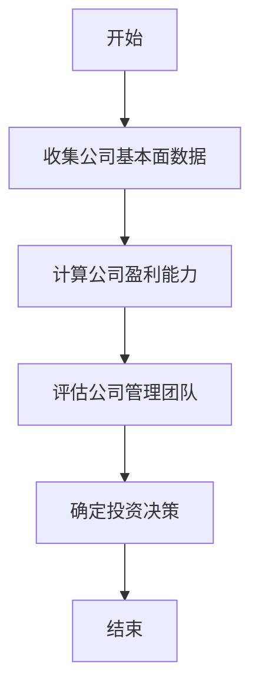
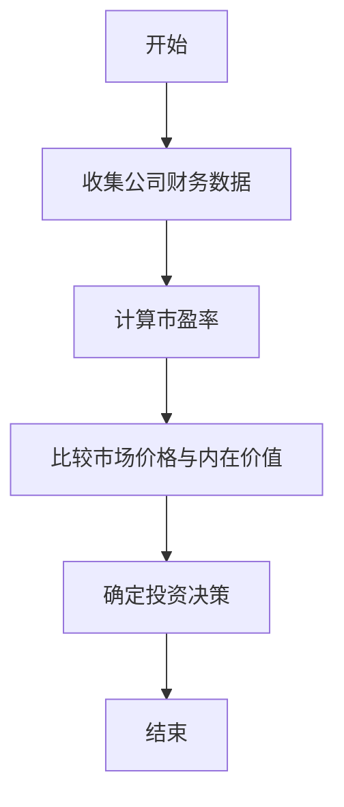
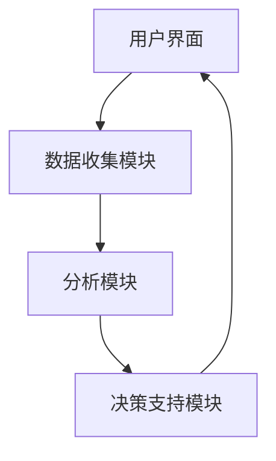

                 


# 彼得林奇的"质量成长"vs"价值重估"

## 关键词：彼得林奇、质量成长、价值重估、投资策略、算法模型、系统架构

## 摘要：本文深入探讨了彼得林奇提出的"质量成长"与"价值重估"两种投资策略的核心概念、数学模型、系统架构及其在实际投资中的应用。通过对比分析，揭示了这两种策略在投资目标、内在逻辑和适用场景上的差异与联系，结合实际案例，为投资者提供系统的投资策略选择和实施方法。

---

## 第一部分: 背景介绍

### 第1章: 投资的基本概念与彼得林奇的简介

#### 1.1 投资的基本概念
投资是通过将资金投入特定的资产或项目，以期望在未来获得超过初始投入的价值的行为。投资的核心原则包括分散投资、长期视角和风险管理。投资的收益与风险通常呈正相关关系，即高风险可能带来高收益，但同时也伴随着更大的损失风险。

#### 1.2 彼得林奇的简介
彼得·林奇（Peter Lynch）是美国著名投资专家，曾任富达投资集团的麦哲伦基金经理。他以独特的投资理念和卓越的投资业绩闻名，著有《彼得林奇的成功投资》等经典书籍。林奇的投资策略强调深入研究公司基本面，寻找具有长期增长潜力的企业。

---

### 第2章: 质量成长与价值重估的定义与区别

#### 2.1 质量成长的定义
质量成长策略是指投资于那些具有强大竞争优势、持续增长潜力和良好管理的公司。这种策略关注公司的基本面，如盈利能力、市场地位和管理团队，而不仅仅是股票的市场价格。

#### 2.2 价值重估的定义
价值重估策略则是寻找市场价格低于其内在价值的股票。这种策略通常关注被市场低估的公司，认为市场对这些公司的估值存在错误，未来股价会回归其真实价值。

#### 2.3 质量成长与价值重估的对比
- **质量成长**：注重公司的长期增长潜力，强调内在质量和竞争力。  
- **价值重估**：关注市场价格与内在价值的差异，寻找被低估的机会。

---

## 第二部分: 核心概念与联系

### 第3章: 质量成长与价值重估的核心概念分析

#### 3.1 质量成长的核心概念
质量成长策略的核心要素包括：
1. **盈利能力**：公司是否能够持续创造利润。
2. **管理团队**：是否有优秀的领导者和管理团队。
3. **市场地位**：公司在行业中的竞争力和市场份额。

#### 3.2 价值重估的核心概念
价值重估策略的核心要素包括：
1. **内在价值**：通过财务指标（如市盈率、市净率）计算公司的真实价值。
2. **市场价格**：当前市场对公司的估值是否低于其真实价值。

---

### 第4章: 质量成长与价值重估的对比分析

#### 4.1 核心概念对比
| 对比维度 | 质量成长 | 价值重估 |
|----------|----------|----------|
| 投资目标 | 长期增长潜力 | 市场价格与内在价值差异 |
| 投资策略 | 深入研究公司基本面 | 寻找被低估的股票 |
| 投资风险 | 中高风险 | 中低风险 |

#### 4.2 属性特征对比
- **盈利能力**：质量成长注重公司当前和未来的盈利能力，而价值重估更关注市场价格与盈利能力的匹配度。  
- **市场地位**：质量成长强调公司在市场中的竞争力，价值重估则更关注市场对公司的估值是否合理。

---

## 第三部分: 算法原理讲解

### 第5章: 质量成长的数学模型

#### 5.1 质量成长的数学模型
质量成长的内在价值可以通过以下公式计算：

$$ \text{内在价值} = \sum_{t=1}^{n} \frac{\text{现金流}_t}{(1 + r)^t} $$

其中，$r$ 是折现率，$\text{现金流}_t$ 是第 $t$ 年的现金流。

#### 5.2 质量成长的算法流程


---

### 第6章: 价值重估的数学模型

#### 6.1 价值重估的数学模型
价值重估的核心是计算公司的内在价值，公式如下：

$$ \text{内在价值} = \frac{\text{净利润}}{\text{市盈率}} $$

#### 6.2 价值重估的算法流程


---

## 第四部分: 系统分析与架构设计方案

### 第7章: 系统功能设计

#### 7.1 系统功能模块
1. **数据收集模块**：收集公司基本面数据和市场数据。
2. **分析模块**：计算公司内在价值和市场价格。
3. **决策支持模块**：根据分析结果提供投资建议。

#### 7.2 系统架构设计


---

## 第五部分: 项目实战

### 第8章: 环境安装与核心代码实现

#### 8.1 环境安装
需要安装Python、Pandas、NumPy等库。

#### 8.2 核心代码实现
```python
import pandas as pd
import numpy as np

# 示例代码：计算公司内在价值
def calculate_intrinsic_value(eps, pe_ratio):
    return eps / pe_ratio

# 示例代码：计算公司质量成长评分
def calculate_growth_score(revenue_growth, profit_growth):
    return (revenue_growth + profit_growth) / 2
```

---

### 第9章: 案例分析与解读

#### 9.1 案例分析
以某科技公司为例，分析其是否符合质量成长或价值重估的条件。

#### 9.2 投资决策
根据分析结果，确定是否投资该公司。

---

## 第六部分: 最佳实践

### 第10章: 小结与注意事项

#### 10.1 小结
质量成长与价值重估是两种不同的投资策略，各有优缺点。投资者应根据市场环境和个人风险偏好选择适合的策略。

#### 10.2 注意事项
- 投资需谨慎，避免盲目跟风。
- 定期调整投资组合，以应对市场变化。

---

### 第11章: 拓展阅读

- 彼得林奇的《彼得林奇的成功投资》
- 投资学经典著作《证券分析》

---

## 作者：AI天才研究院 & 禅与计算机程序设计艺术

---

通过本文的详细分析，读者可以深入了解质量成长与价值重估的策略，并在实际投资中灵活运用这两种方法，制定适合自己的投资策略。

