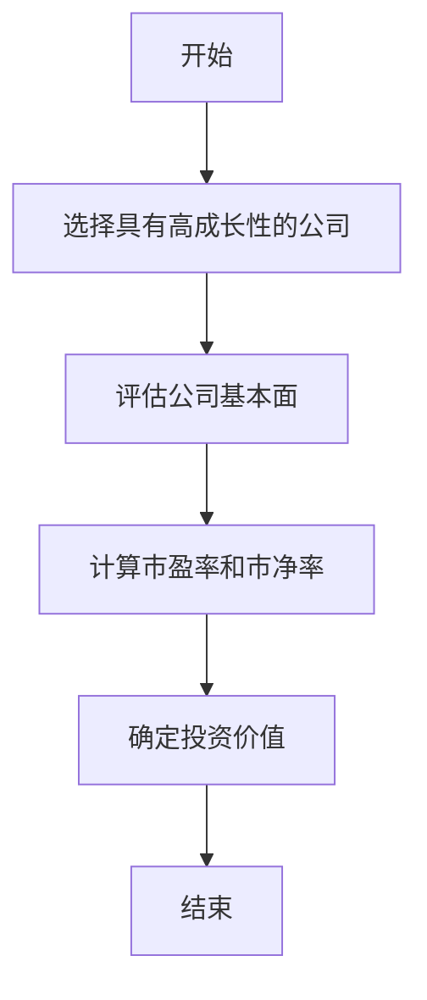
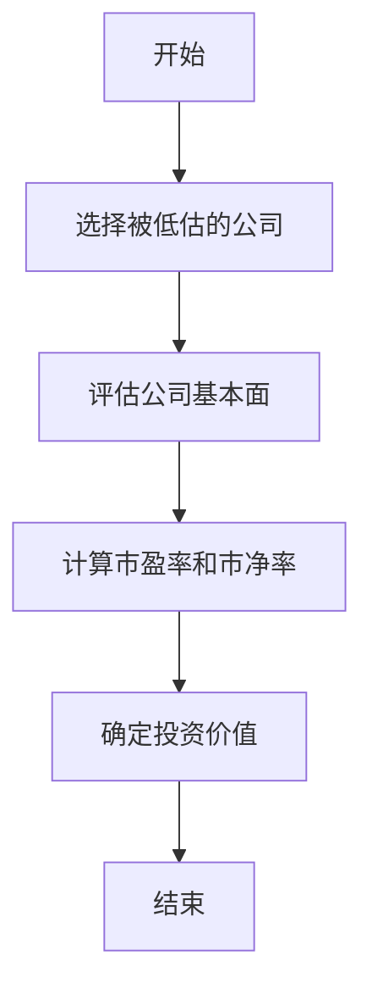
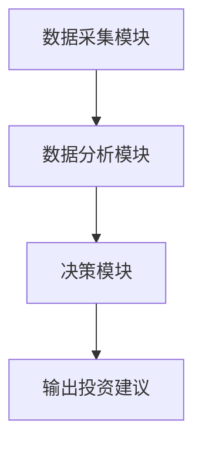

                 


# 彼得林奇的"质量成长"vs"价值重估"在不同市值公司中的应用

## 关键词：彼得林奇，质量成长，价值重估，市值公司，投资策略

## 摘要：本文探讨了彼得林奇提出的“质量成长”和“价值重估”两种投资策略在不同市值公司中的应用。通过分析这两种策略的核心概念、数学模型、算法原理以及系统架构，结合实际案例和项目实战，为投资者提供清晰的指导。

---

# 第一部分: 彼得林奇的"质量成长"与"价值重估"投资策略概述

## 第1章: 彼得林奇投资策略的背景与核心概念

### 1.1 彼得林奇及其投资理念

#### 1.1.1 彼得林奇的生平简介
彼得·林奇（Peter Lynch）是美国著名投资经理，曾任富达投资的基金经理，管理麦哲伦基金期间取得了卓越的投资业绩。他以其独特的投资风格和对市场的深刻理解而闻名。

#### 1.1.2 彼得林奇的投资哲学
彼得林奇主张长期投资，注重基本面分析，强调选择具有持续增长潜力的公司。他提出了“质量成长”和“价值重估”两种投资策略，分别适用于不同类型的公司。

#### 1.1.3 质量成长与价值重估的定义与对比
- **质量成长**：投资于具有强大竞争优势、持续增长潜力且估值合理的公司。
- **价值重估**：投资于被市场低估的公司，通常具有较高的市盈率或市净率，但具备恢复增长的潜力。

---

### 1.2 质量成长与价值重估的核心要素

#### 1.2.1 质量成长的特征与衡量指标
- **特征**：
  - 高成长性：营业收入和净利润持续增长。
  - 市场领导地位：公司在行业内具有竞争优势。
  - 质量稳定：产品或服务具有较高的市场认可度。
- **衡量指标**：
  - 市盈率（P/E）：衡量公司股价与盈利水平的关系。
  - 市净率（P/B）：衡量公司股价与净资产的关系。
  - 营业收入增长率：衡量公司收入增长的速度。

#### 1.2.2 价值重估的特征与衡量指标
- **特征**：
  - 低估值：公司股价低于其内在价值。
  - 周期性行业：公司处于周期性低谷，但具有恢复潜力。
  - 高股息率：公司股息收益率较高。
- **衡量指标**：
  - 市盈率（P/E）：衡量公司股价与盈利水平的关系。
  - 市净率（P/B）：衡量公司股价与净资产的关系。
  - 股东权益增长率：衡量公司股东权益增长的速度。

#### 1.2.3 两种策略的对比分析
- **对比表格**：

| 指标          | 质量成长                     | 价值重估                     |
|---------------|-----------------------------|-----------------------------|
| 投资目标       | 寻找具有持续增长潜力的公司   | 寻找被市场低估的公司         |
| 估值标准       | 市盈率和市净率合理           | 市盈率和市净率较低           |
| 风险承受能力   | 中等风险                   | 较低风险                   |
| 适用场景       | 小盘股和成长型企业         | 大盘股和周期性行业         |

---

## 第2章: 质量成长与价值重估的数学模型与公式

### 2.1 质量成长的评估模型

#### 2.1.1 市盈率（P/E）计算公式
$$ \text{市盈率} = \frac{\text{股价}}{\text{每股收益}} $$

#### 2.1.2 市净率（P/B）计算公式
$$ \text{市净率} = \frac{\text{股价}}{\text{每股净资产}} $$

#### 2.1.3 营业收入增长率公式
$$ \text{营业收入增长率} = \frac{\text{本期营业收入} - \text{上期营业收入}}{\text{上期营业收入}} \times 100\% $$

---

### 2.2 价值重估的评估模型

#### 2.2.1 市盈率（P/E）与内在价值的关系
- **公式**：$$ \text{内在价值} = \frac{\text{每股收益} \times \text{合理市盈率}}{\text{贴现率}} $$
- **解释**：通过合理市盈率和贴现率计算公司内在价值，判断是否被低估。

#### 2.2.2 股东权益增长率公式
$$ \text{股东权益增长率} = \frac{\text{本期股东权益} - \text{上期股东权益}}{\text{上期股东权益}} \times 100\% $$

#### 2.2.3 市盈率与预期收益的关系
- **公式**：$$ \text{预期收益} = \frac{\text{每股收益} \times \text{预期市盈率}}{\text{当前股价}} $$

---

## 第3章: 质量成长与价值重估的算法原理

### 3.1 质量成长策略的算法流程



---

### 3.2 价值重估策略的算法流程



---

## 第4章: 系统分析与架构设计方案

### 4.1 问题场景介绍
- **目标**：构建一个基于彼得林奇策略的投资分析系统，用于分析不同市值公司的投资价值。
- **范围**：涵盖数据采集、分析和决策模块。

### 4.2 系统功能设计

#### 4.2.1 数据采集模块
- **功能**：从股票数据库中获取公司基本面数据，包括市盈率、市净率、营业收入增长率等。

#### 4.2.2 数据分析模块
- **功能**：根据质量成长和价值重估的指标，对股票进行分类和评估。

#### 4.2.3 决策模块
- **功能**：根据评估结果，生成投资建议。

### 4.3 系统架构设计



---

## 第5章: 项目实战

### 5.1 环境安装
- **工具**：Python、Pandas、Matplotlib、Scikit-learn
- **数据来源**：Yahoo Finance API

### 5.2 系统核心实现源代码

#### 5.2.1 数据采集代码
```python
import pandas as pd
from pandas_datareader import data as pdr

# 从Yahoo Finance获取数据
def get_data(ticker, start, end):
    df = pdr.get_data_yahoo(ticker, start=start, end=end)
    return df

# 示例：获取苹果公司数据
apple_data = get_data('AAPL', start='2020-01-01', end='2023-12-31')
print(apple_data.head())
```

#### 5.2.2 数据分析代码
```python
import pandas as pd
import numpy as np

# 计算市盈率
def calculate_pe_ratio(df):
    pe_ratio = df['Close'] / df['EPS']
    return pe_ratio

# 示例：计算苹果公司的市盈率
apple_pe = calculate_pe_ratio(apple_data)
print(apple_pe.head())
```

### 5.3 实际案例分析

#### 5.3.1 质量成长策略案例
- **公司**：苹果（AAPL）
- **分析**：苹果具有强大的市场领导地位和持续增长的营业收入，适合质量成长策略。

#### 5.3.2 价值重估策略案例
- **公司**：通用电气（GE）
- **分析**：通用电气在2020年因行业周期性被低估，适合价值重估策略。

---

## 第6章: 最佳实践、小结与注意事项

### 6.1 小结
- 彼得林奇的“质量成长”和“价值重估”策略分别适用于不同市值和类型的公司。
- 投资者应根据市场环境和公司基本面选择合适的策略。

### 6.2 注意事项
- **风险控制**：投资需分散风险，避免过度集中。
- **市场变化**：策略需根据市场变化进行调整。
- **长期视角**：投资应以长期视角为主，避免短期波动干扰。

### 6.3 拓展阅读
- 《彼得·林奇的投资艺术》
- 《投资学原理》

---

作者：AI天才研究院/AI Genius Institute & 禅与计算机程序设计艺术/Zen And The Art of Computer Programming

