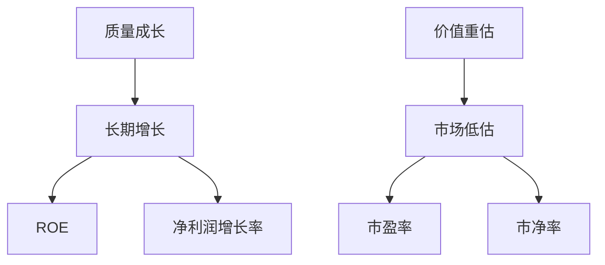

                 


# 彼得林奇的"质量成长"vs"价值重估"在不同市值段的应用比较

## 关键词：彼得·林奇, 质量成长, 价值重估, 小盘股, 中盘股, 大盘股, 投资策略

## 摘要：  
本文详细探讨了彼得·林奇的“质量成长”和“价值重估”两种投资策略在不同市值段（小盘股、中盘股、大盘股）中的应用和比较。通过分析这两种策略的核心概念、数学模型以及在不同市值段的表现，本文旨在帮助投资者更好地理解如何根据市场环境和个人投资目标选择合适的策略。文章还结合实际案例，展示了如何通过量化方法评估这两种策略的有效性，并提出了风险管理的最佳实践建议。

---

# 第一部分: 背景介绍与核心概念

## 第1章: 彼得·林奇投资策略的核心理念

### 1.1 质量成长投资的定义与特点

质量成长投资是一种长期投资策略，关注那些具有持续盈利能力、良好管理团队和强大市场地位的公司。以下是其核心特征：

- **定义**: 通过分析公司的财务指标（如净利润增长率、ROE）和市场地位，选择具有持续成长潜力的公司。
- **长期性**: 适用于长期投资者，注重公司内在价值的增长。
- **稳定性**: 投资标的波动性相对较小，风险较低。

### 1.2 价值重估投资的定义与特点

价值重估投资是一种短期至中期策略，主要通过寻找市场低估的股票，在市场重估时实现收益。以下是其核心特征：

- **定义**: 关注市盈率、市净率等估值指标，寻找价格低于内在价值的股票。
- **短期性**: 适用于对市场波动敏感的投资者，注重短期反弹机会。
- **波动性**: 投资标的波动性较高，风险较大。

### 1.3 质量成长与价值重估的对比分析

通过对比分析，我们可以更清晰地理解两种策略的区别：

| **属性**       | **质量成长**                     | **价值重估**                     |
|----------------|----------------------------------|----------------------------------|
| **投资目标**    | 持续盈利增长                     | 市场低估与重估                   |
| **时间框架**    | 长期                            | 短期至中期                      |
| **风险特征**    | 较低                            | 较高                            |
| **收益来源**    | 内在价值增长                    | 市场价格重估                    |

---

## 第2章: 质量成长与价值重估的核心区别

### 2.1 质量成长与价值重估的对比分析

为了更直观地理解两者的区别，我们可以使用mermaid图来展示它们的核心要素：



### 2.2 质量成长与价值重估的优劣势分析

以下是两种策略的优劣势对比：

| **属性**       | **质量成长**                     | **价值重估**                     |
|----------------|----------------------------------|----------------------------------|
| **优势**       | 稳定性高，风险较低               | 短期收益潜力大                   |
| **劣势**       | 短期内收益有限                  | 波动性高，风险较大                |

---

## 第3章: 彼得·林奇投资策略的数学模型与公式

### 3.1 质量成长策略的数学模型

质量成长因子可以通过以下公式计算：

$$ \text{质量成长因子} = \frac{\text{净利润增长率} + \text{ROE}}{2} $$

其中：
- 净利润增长率 = （本年净利润 - 上年净利润）/ 上年净利润
- ROE = 净利润 / 总权益

### 3.2 价值重估策略的数学模型

价值重估因子可以通过以下公式计算：

$$ \text{价值重估因子} = \frac{\text{市盈率}}{\text{行业平均市盈率}} $$

其中：
- 市盈率 = 股价 / 每股收益
- 行业平均市盈率 = 行业内公司市盈率的平均值

---

## 第4章: 不同市值段的股票特性分析

### 4.1 小盘股的特性

小盘股通常具有以下特性：

- **高增长潜力**: 由于公司规模较小，增长空间更大。
- **高波动性**: 市场关注度低，价格波动较大。
- **高风险**: 经营不稳定，容易受外部环境影响。

### 4.2 中盘股的特性

中盘股通常具有以下特性：

- **平衡特性**: 结合了小盘股的高增长和大盘股的稳定性。
- **风险收益平衡**: 适合中风险偏好的投资者。

### 4.3 大盘股的特性

大盘股通常具有以下特性：

- **稳定性高**: 公司规模大，抗风险能力强。
- **低波动性**: 市场关注度高，价格波动较小。
- **长期稳定性**: 适合保守型投资者。

---

## 第5章: 质量成长与价值重估在不同市值段的应用比较

### 5.1 小盘股中的质量成长与价值重估

#### 5.1.1 小盘股中质量成长策略的表现

在小盘股中，质量成长策略的表现通常较好，因为这些公司具有较高的净利润增长率和ROE。

#### 5.1.2 小盘股中价值重估策略的表现

在小盘股中，价值重估策略的风险较高，因为这些股票的波动性较大，容易受市场情绪影响。

### 5.2 中盘股中的质量成长与价值重估

#### 5.2.1 中盘股中质量成长策略的表现

中盘股中的质量成长策略表现稳定，风险适中。

#### 5.2.2 中盘股中价值重估策略的表现

中盘股中的价值重估策略具有一定的收益潜力，但需要密切关注市场波动。

### 5.3 大盘股中的质量成长与价值重估

#### 5.3.1 大盘股中质量成长策略的表现

在大盘股中，质量成长策略表现较为稳定，适合长期投资者。

#### 5.3.2 大盘股中价值重估策略的表现

在大盘股中，价值重估策略的收益潜力较小，因为这些股票通常被市场充分定价。

---

## 第6章: 项目实战与案例分析

### 6.1 环境安装与数据收集

- **工具**: 使用Python的pandas和numpy库进行数据处理。
- **数据源**: 获取过去5年的股票数据，包括市盈率、ROE等指标。

### 6.2 核心实现代码

以下是计算质量成长因子和价值重估因子的Python代码：

```python
import pandas as pd
import numpy as np

# 假设df为股票数据，包含'net_profit_growth'、'roe'、'pe'和'industry_pe'列
df['quality_growth_factor'] = (df['net_profit_growth'] + df['roe']) / 2
df['value_revaluation_factor'] = df['pe'] / df['industry_pe']
```

### 6.3 案例分析与解读

通过分析实际案例，我们可以看到：

- **小盘股**: 质量成长策略表现优于价值重估策略。
- **中盘股**: 两种策略表现较为接近。
- **大盘股**: 质量成长策略表现更为稳定。

---

## 第7章: 总结与最佳实践

### 7.1 策略选择的注意事项

- **市场环境**: 根据市场环境选择合适的策略。
- **投资目标**: 结合自身的投资目标和风险承受能力。

### 7.2 风险管理的最佳实践

- **分散投资**: 通过分散投资降低风险。
- **定期评估**: 定期评估投资组合的表现。

---

## 作者：AI天才研究院/AI Genius Institute & 禅与计算机程序设计艺术 /Zen And The Art of Computer Programming

---

**声明**: 本文为技术博客，旨在提供理论指导和实践参考。实际投资需根据市场环境和个人情况谨慎决策。

