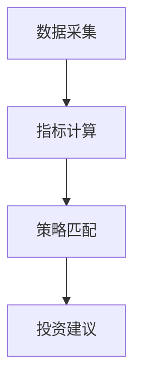
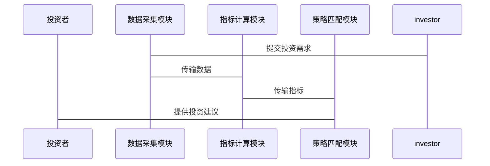

                 


# 彼得林奇的"质量成长"vs"价值重估"在新经济中的平衡

---

## 关键词：彼得林奇，质量成长，价值重估，投资策略，新经济，投资平衡

---

## 摘要：  
本文深入探讨了彼得林奇提出的“质量成长”与“价值重估”两种投资策略在新经济环境下的平衡与应用。通过分析这两种策略的核心概念、内在逻辑、算法原理和系统架构，结合实际案例，本文为投资者提供了一种在新经济环境下优化投资决策的思路。文章还详细介绍了如何将这些理论应用于实际投资中，并提出了相关的最佳实践建议。

---

## 第1章：彼得林奇投资理念的背景与基础

### 1.1 质量成长与价值重估的核心概念

#### 1.1.1 质量成长的定义与特征
- 质量成长是指投资于那些具有持续增长潜力的公司，其核心在于企业的质地、成长潜力和竞争优势。
- 质量成长的特征：
  - 高质量的管理团队
  - 稳定的市场需求
  - 强大的竞争优势
  - 可持续的盈利能力

#### 1.1.2 价值重估的定义与特征
- 价值重估是指寻找市场低估的股票，其核心在于企业的内在价值、市场估值和安全边际。
- 价值重估的特征：
  - 低市盈率
  - 低市净率
  - 高股息率
  - 公司基本面稳定

#### 1.1.3 两者的区别与联系
- 区别：
  - 质量成长注重长期增长潜力，价值重估注重短期估值优势。
  - 质量成长适用于成长型企业，价值重估适用于价值型企业。
- 联系：
  - 两者都以企业基本面分析为基础。
  - 两者可以互补，在不同市场环境下交替使用。

---

### 1.2 质量成长与价值重估的理论基础

#### 1.2.1 投资学的基本原理
- 投资学的核心在于通过对企业基本面的分析，识别出具有投资价值的标的。
- 投资学的基本原理包括资产定价、风险管理、组合优化等。

#### 1.2.2 质量成长的经济学解释
- 质量成长基于企业生命周期理论，强调在成长阶段选择具有竞争优势的企业。
- 经济学中的规模经济和范围经济为质量成长提供了理论支持。

#### 1.2.3 价值重估的市场学解释
- 价值重估基于市场有效性的假设，认为短期市场波动可能导致股票价格偏离其真实价值。
- 市场学中的行为金融学理论为价值重估提供了理论支持。

---

### 1.3 彼得林奇投资理念的现实意义

#### 1.3.1 新经济环境下的投资挑战
- 新经济环境下，技术革新和商业模式的变化加速，企业的成长性和估值逻辑也在不断变化。
- 全球化和数字化对企业价值的影响日益显著。

#### 1.3.2 质量成长与价值重估的平衡之道
- 在新经济环境下，单纯追求成长或估值优势可能导致投资失败。
- 通过平衡质量成长与价值重估，投资者可以在不同市场周期中优化投资组合。

#### 1.3.3 投资者如何在新经济中应用彼得林奇理念
- 关注企业的技术创新能力和市场竞争力。
- 重视企业的财务健康状况和估值水平。
- 灵活调整投资策略，适应市场变化。

---

## 第2章：质量成长与价值重估的核心概念与联系

### 2.1 质量成长的核心原理

#### 2.1.1 质量成长的三要素
- 企业质地：企业的管理团队、治理结构、研发投入等。
- 成长潜力：企业的收入增长率、净利润增长率等。
- 竞争优势：企业的市场地位、品牌影响力、技术壁垒等。

#### 2.1.2 质量成长的数学模型与评估指标
- 市盈率（P/E）= 股价 / 每股净利润
- 市净率（P/B）= 股价 / 每股净资产
- 净资产收益率（ROE）= 净利润 / 净资产

---

### 2.2 价值重估的核心原理

#### 2.2.1 价值重估的三要素
- 内在价值：企业未来现金流的现值。
- 市场估值：当前市场对企业的定价。
- 安全边际：股价与内在价值之间的折扣空间。

#### 2.2.2 价值重估的数学模型与评估指标
- 内在价值模型：DCF（Discounted Cash Flow）模型
- 市盈率（P/E）= 股价 / 每股净利润
- 市净率（P/B）= 股价 / 每股净资产

---

### 2.3 质量成长与价值重估的联系

#### 2.3.1 两者的共同点
- 都基于对企业基本面的深入分析。
- 都注重企业的财务健康状况和市场竞争力。

#### 2.3.2 两者的差异点
- 质量成长注重企业的成长性，价值重估注重企业的估值优势。
- 质量成长适用于成长型企业，价值重估适用于价值型企业。

---

## 第3章：算法原理与数学模型

### 3.1 质量成长与价值重估的算法原理

#### 3.1.1 质量成长的筛选算法
- 筛选步骤：
  1. 选择具有竞争优势的企业。
  2. 计算企业的成长性指标（如ROE、收入增长率）。
  3. 筛选具有可持续增长潜力的企业。

#### 3.1.2 价值重估的筛选算法
- 筛选步骤：
  1. 计算企业的内在价值（如DCF模型）。
  2. 比较股价与内在价值的差异。
  3. 筛选具有安全边际的企业。

---

### 3.2 数学模型与公式

#### 3.2.1 质量成长的数学模型
- 市盈率（P/E）= 股价 / 每股净利润
- 市净率（P/B）= 股价 / 每股净资产
- 净资产收益率（ROE）= 净利润 / 净资产

#### 3.2.2 价值重估的数学模型
- 内在价值 = ∑(现金流 / 折现率)
- 安全边际 = 内在价值 - 市场价格

---

## 第4章：系统分析与架构设计方案

### 4.1 投资决策系统的功能设计

#### 4.1.1 数据采集模块
- 数据来源：股票市场数据、财务报表数据、行业研究报告。
- 数据处理：清洗、转换、存储。

#### 4.1.2 指标计算模块
- 计算质量成长指标（如ROE、收入增长率）。
- 计算价值重估指标（如DCF模型、安全边际）。

#### 4.1.3 策略匹配模块
- 根据市场环境匹配质量成长或价值重估策略。
- 生成投资组合建议。

---

### 4.2 系统架构设计

#### 4.2.1 系统架构图


#### 4.2.2 系统交互流程图


---

## 第5章：项目实战与案例分析

### 5.1 项目实战

#### 5.1.1 环境配置
- 数据来源：Yahoo Finance API
- 工具：Python、Pandas、Matplotlib
- 算法库：Scikit-learn

#### 5.1.2 核心代码
```python
import pandas as pd
import numpy as np

# 示例代码：计算市盈率
def calculate_pe(ticker):
    df = pd.DataFrame.from_dict(yahoo_data.get_historical_data(ticker))
    pe = df['Close'].mean() / df['Earnings Per Share'].mean()
    return pe

# 示例代码：计算市净率
def calculate_pb(ticker):
    df = pd.DataFrame.from_dict(yahoo_data.get_historical_data(ticker))
    pb = df['Close'].mean() / df['Book Value Per Share'].mean()
    return pb
```

#### 5.1.3 案例分析
- 案例：某科技公司
  - 质量成长分析：ROE高，收入增长快，具有技术壁垒。
  - 价值重估分析：市盈率低于行业平均水平，具有安全边际。
- 结论：该股票适合同时应用质量成长与价值重估策略。

---

## 第6章：最佳实践与小结

### 6.1 投资中的注意事项
- 定期调整投资组合，适应市场变化。
- 保持对企业的持续跟踪，及时发现潜在风险。
- 结合技术分析和基本面分析，优化投资决策。

### 6.2 小结
- 彼得林奇的质量成长与价值重估策略在新经济环境下具有重要的现实意义。
- 投资者应根据市场环境灵活调整策略，平衡质量成长与价值重估。
- 通过系统化的投资决策模型和工具，可以提高投资效率和成功率。

---

## 作者：AI天才研究院/AI Genius Institute & 禅与计算机程序设计艺术 /Zen And The Art of Computer Programming

