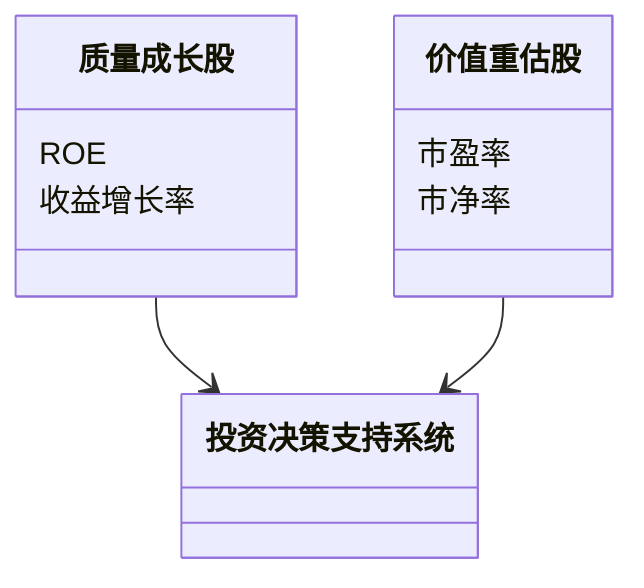
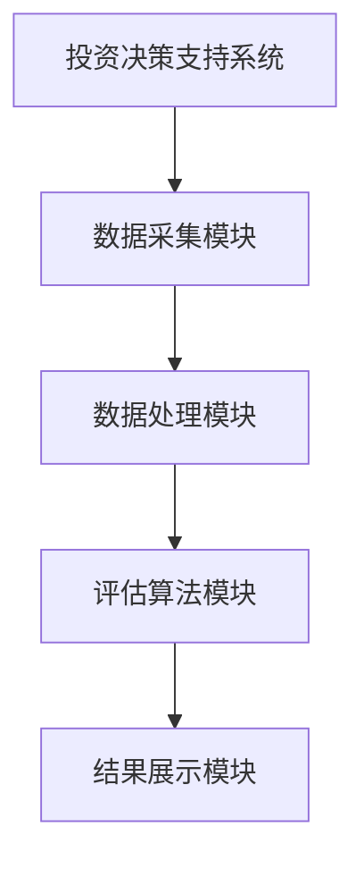

                 


# 彼得林奇的"质量成长"vs"价值重估"在新经济股中的权衡

---

## 关键词：
- 彼得林奇
- 质量成长股
- 价值重估股
- 投资策略
- 新经济股

---

## 摘要：
本文深入探讨了彼得林奇提出的两种投资策略——“质量成长”与“价值重估”——在新经济股中的应用与权衡。通过分析这两种策略的核心概念、评估方法和实际案例，结合数学模型与系统架构，帮助投资者理解如何在新经济环境下选择最优的投资策略。

---

## 第一部分：背景介绍

### 第1章：投资的基本概念与彼得林奇的策略

#### 1.1 投资的基本概念

投资是通过购买资产以期获得未来收益的行为。投资者通常关注资产的内在价值、市场表现和风险水平。投资的基本原则包括分散化、长期视角和风险管理。

#### 1.2 彼得林奇的投资策略

彼得林奇是著名的投资经理，以其对成长股和价值股的深入研究闻名。他提出的两种策略在投资界影响深远：

1. **质量成长股**：指那些业绩稳定增长、具备强大竞争优势的公司。这类股票通常市盈率较高，但其收益和现金流能够持续增长，为投资者带来长期收益。
2. **价值重估股**：指那些被市场低估，但具备潜在价值的股票。这类股票通常市盈率较低，但可能因市场忽视或行业变化而被低估。

#### 1.3 新经济股的特点

新经济股主要指科技、互联网、生物科技等新兴行业的股票。这些行业具有高增长潜力，但也伴随着高风险。新经济股的估值通常基于未来的增长潜力，而非当前的盈利水平。

#### 1.4 质量成长与价值重估的比较

| 属性          | 质量成长股                     | 价值重估股                     |
|---------------|-------------------------------|-------------------------------|
| 估值基础      | 未来增长潜力                   | 当前低估值                     |
| 风险水平      | 较高                          | 较低                          |
| 适用场景      | 高增长行业，如科技、互联网      | 周期性行业，如传统制造业        |
| 投资期限      | 长期                          | 中短期                        |

---

## 第二部分：核心概念与联系

### 第2章：质量成长与价值重估的核心概念

#### 2.1 质量成长的原理

质量成长策略的核心在于寻找那些具备持续增长潜力的公司。彼得林奇强调，这些公司通常具有以下特征：

- 高ROE（净资产收益率）：ROE = 净利润 / 净资产。
- 高收益增长：过去5年年均收益增长率 > 10%。
- 强大的竞争优势：市场领导者或具备创新优势。

#### 2.2 价值重估的原理

价值重估策略关注市场低估的股票。这类股票通常具有以下特征：

- 低市盈率：市盈率 < 市场平均值。
- 低市净率：市净率 < 行业平均值。
- 高股息率：股息收益率较高。

#### 2.3 两者的联系

质量成长和价值重估并非完全对立，而是互补的策略。在新经济环境下，新兴行业可能更适合质量成长策略，而传统行业则可能更适合价值重估策略。投资者需要根据市场环境和行业特点选择合适的策略。

---

## 第三部分：算法原理讲解

### 第3章：质量成长与价值重估的算法原理

#### 3.1 质量成长股的评估算法

1. **ROE计算**：
   $$ \text{ROE} = \frac{\text{净利润}}{\text{净资产}} $$
2. **收益增长率计算**：
   $$ \text{收益增长率} = \frac{\text{今年收益} - \text{去年收益}}{\text{去年收益}} \times 100\% $$

#### 3.2 价值重估股的评估算法

1. **市盈率计算**：
   $$ \text{市盈率} = \frac{\text{股价}}{\text{每股收益}} $$
2. **市净率计算**：
   $$ \text{市净率} = \frac{\text{股价}}{\text{每股净资产}} $$

---

## 第四部分：数学模型与公式

### 第4章：质量成长与价值重估的数学模型

#### 4.1 质量成长的数学模型

$$ \text{质量成长得分} = 0.5 \times \text{ROE} + 0.5 \times \text{收益增长率} $$

#### 4.2 价值重估的数学模型

$$ \text{价值重估得分} = 0.5 \times \text{市盈率} + 0.5 \times \text{市净率} $$

---

## 第五部分：系统分析与架构设计

### 第5章：质量成长与价值重估的系统架构

#### 5.1 领域模型



#### 5.2 系统架构



---

## 第六部分：项目实战

### 第6章：质量成长与价值重估的项目实战

#### 6.1 环境安装

安装Python和相关库（如Pandas、Matplotlib）。

#### 6.2 代码实现

```python
import pandas as pd

def calculate_roe(net_profit, net_asset):
    return net_profit / net_asset

def calculate_pe_ratio(price, eps):
    return price / eps

# 示例数据
data = {
    '公司': ['A', 'B', 'C'],
    'ROE': [0.2, 0.15, 0.18],
    '收益增长率': [0.12, 0.08, 0.1],
    '市盈率': [15, 10, 12],
    '市净率': [2, 1.5, 1.8]
}

df = pd.DataFrame(data)

# 计算质量成长得分
df['质量成长得分'] = 0.5 * df['ROE'] + 0.5 * df['收益增长率']

# 计算价值重估得分
df['价值重估得分'] = 0.5 * df['市盈率'] + 0.5 * df['市净率']

print(df)
```

---

## 第七部分：最佳实践

### 第7章：质量成长与价值重估的最佳实践

#### 7.1 小结

在新经济环境下，投资者需要根据行业特点和市场环境选择合适的策略。质量成长适合高增长行业，而价值重估适合周期性行业。

#### 7.2 注意事项

- 定期评估资产组合，根据市场变化调整策略。
- 结合技术分析和基本面分析，做出更明智的投资决策。

#### 7.3 拓展阅读

- 彼得林奇的《彼得林奇选股法则》
- 《投资学》相关书籍

---

## 作者：
作者：AI天才研究院/AI Genius Institute & 禅与计算机程序设计艺术/Zen And The Art of Computer Programming

--- 

希望这篇文章能够帮助读者更好地理解彼得林奇的两种投资策略，并在实际投资中做出明智的选择。

