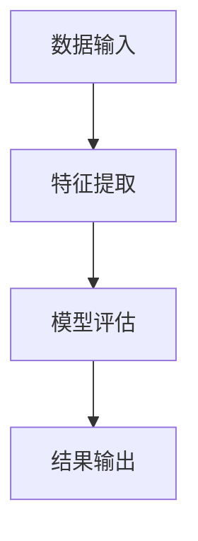
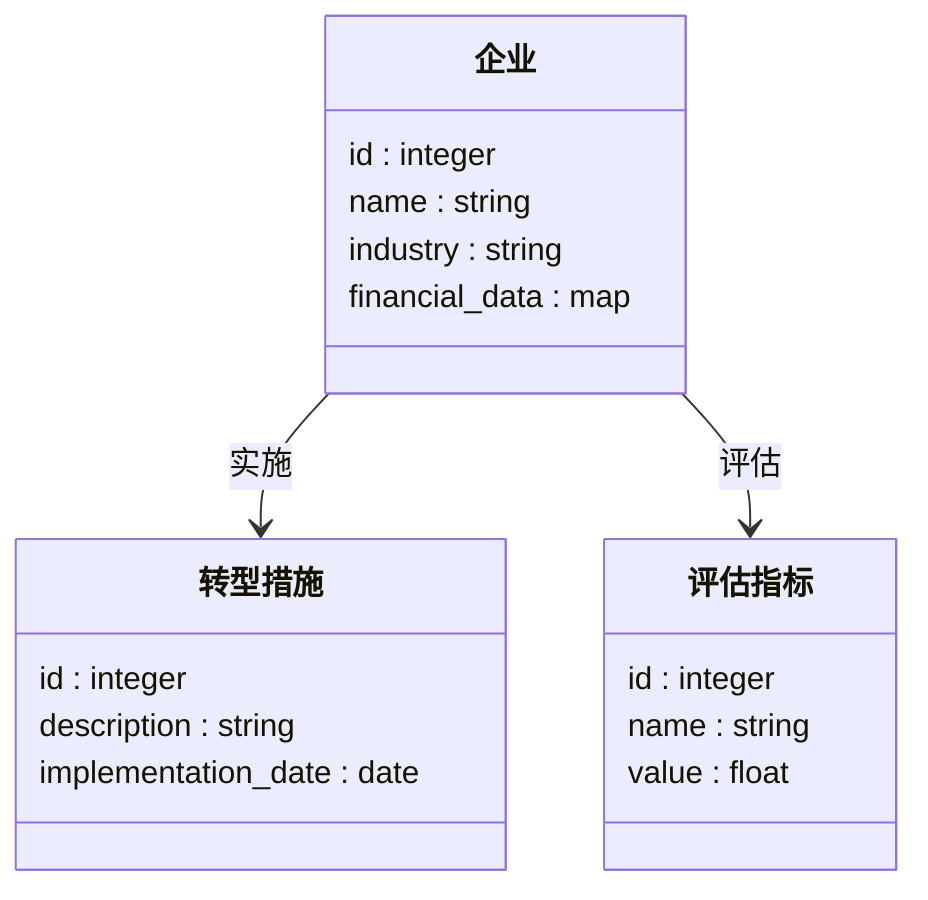

                 


# 彼得林奇的"质量成长"在传统企业转型中的应用

> 关键词：质量成长，彼得·林奇，企业转型，数字化转型，投资策略

> 摘要：本文探讨了彼得·林奇的质量成长投资理念在传统企业转型中的应用，分析了如何通过质量成长策略帮助企业实现可持续发展和数字化转型。文章详细介绍了质量成长的核心概念，分析了其在企业转型中的具体应用，并通过实际案例展示了如何通过算法和系统设计将质量成长理念转化为企业转型的具体措施。

---

# 第一部分: 背景介绍

## 第1章: 质量成长与传统企业转型概述

### 1.1 质量成长的核心概念

#### 1.1.1 质量成长的定义
质量成长（Quality Growth）是指投资于那些具有持续增长潜力和高质量的企业。这类企业通常具备强大的竞争优势、良好的管理团队和健康的财务状况。

#### 1.1.2 质量成长的核心要素
- 企业基本面：包括收入、利润、现金流等财务指标。
- 管理层质量：管理层的战略眼光和执行力。
- 行业地位：企业在行业中的竞争地位。
- 质量成长潜力：企业的增长能力和市场前景。

#### 1.1.3 质量成长与企业转型的关系
质量成长理念强调长期投资于优质企业，这与传统企业转型的目标高度契合。通过质量成长理念，企业可以识别和投资于自身转型中的关键因素，从而实现可持续增长。

### 1.2 彼得·林奇的质量成长投资理念

#### 1.2.1 彼得·林奇的投资者背景
彼得·林奇（Peter Lynch）是美国著名投资经理，以其在富达投资管理公司的长期优异表现而闻名。他强调长期投资于那些具有竞争优势和增长潜力的企业。

#### 1.2.2 质量成长投资的核心原则
- 投资于具有竞争优势的企业。
- 关注企业的管理层质量和战略规划。
- 长期持有，避免短期波动。

#### 1.2.3 质量成长投资的成功案例
例如，彼得·林奇成功投资于可口可乐和强生公司，这些企业在其投资期间实现了持续增长。

### 1.3 传统企业转型的背景与挑战

#### 1.3.1 传统企业的现状分析
传统企业在面临数字化转型时，常常遇到资源不足、管理阻力和技术应用困难等问题。

#### 1.3.2 数字化转型的趋势
随着技术的进步，企业必须适应数字化转型的趋势，否则可能被淘汰。

#### 1.3.3 传统企业转型中的常见问题
包括资源分配不合理、员工抵触变革、技术选型困难等。

---

# 第二部分: 核心概念与联系

## 第2章: 质量成长与企业转型的关系

### 2.1 质量成长与企业转型的核心联系

#### 2.1.1 质量成长理念在企业转型中的应用
通过质量成长理念，企业可以识别和投资于关键转型措施，如技术创新和管理优化。

#### 2.1.2 质量成长与企业可持续发展的关系
质量成长强调长期增长，与企业转型的可持续发展目标一致。

### 2.2 质量成长与企业转型的关键要素对比

| 质量成长要素 | 企业转型要素 |
|--------------|--------------|
| 企业基本面    | 财务健康      |
| 管理层质量    | 企业管理能力  |
| 行业地位      | 市场竞争力    |
| 质量成长潜力  | 创新能力      |

### 2.3 企业转型的ER实体关系图

```mermaid
erDiagram
    customer[顾客] {
        id : integer
        name : string
    }
    company[企业] {
        id : integer
        name : string
        industry : string
    }
    transformation[转型措施] {
        id : integer
        description : string
        implementation_date : date
    }
    customer --|{n} transformation : 采取的转型措施
    company --|{n} transformation : 实施的转型措施
```

---

# 第三部分: 算法原理讲解

## 第3章: 质量成长的算法模型

### 3.1 企业评估模型的数学公式

#### 3.1.1 净资产收益率（ROE）
$$ ROE = \frac{\text{净利润}}{\text{净资产}} $$

#### 3.1.2 收入增长率
$$ \text{收入增长率} = \frac{\text{本年收入} - \text{上年收入}}{\text{上年收入}} $$

### 3.2 企业价值评估模型

```python
import pandas as pd

def calculate_roe(net_profit, total_equity):
    return net_profit / total_equity

def calculate_growth_rate(revenue_current, revenue_previous):
    return (revenue_current - revenue_previous) / revenue_previous

# 示例数据
data = {
    '公司': ['公司A', '公司B'],
    '净利润': [100, 150],
    '净资产': [500, 600],
    '收入当前': [500, 600],
    '收入上期': [400, 500]
}

df = pd.DataFrame(data)
df['ROE'] = df.apply(lambda x: calculate_roe(x['净利润'], x['净资产']), axis=1)
df['收入增长率'] = df.apply(lambda x: calculate_growth_rate(x['收入当前'], x['收入上期']), axis=1)
print(df)
```

### 3.3 质量成长算法的流程图



---

# 第四部分: 系统分析与架构设计

## 第4章: 系统分析与架构设计

### 4.1 问题场景介绍
企业在转型中需要分析自身的财务状况、管理能力和市场竞争力，以制定有效的转型策略。

### 4.2 系统功能设计



### 4.3 系统架构设计


---

# 第五部分: 项目实战

## 第5章: 项目实战

### 5.1 环境配置
- 安装Python和相关库（如pandas、numpy、scikit-learn）。

### 5.2 系统核心实现源代码

```python
import pandas as pd
from sklearn import linear_model

def main():
    # 示例数据
    data = {
        '公司': ['A', 'B', 'C'],
        '收入': [100, 150, 200],
        '利润': [20, 30, 40]
    }
    df = pd.DataFrame(data)
    
    # 使用线性回归模型预测增长潜力
    model = linear_model.LinearRegression()
    model.fit(df[['收入']], df['利润'])
    
    # 预测
    predicted_profit = model.predict(df[['收入']])
    df['预测利润'] = predicted_profit
    
    print(df)

if __name__ == "__main__":
    main()
```

### 5.3 代码应用解读与分析
上述代码通过线性回归模型预测企业的利润，帮助企业评估转型中的增长潜力。

### 5.4 案例分析
以公司A为例，分析其收入和利润的关系，预测未来的利润增长。

### 5.5 项目总结
总结项目成果，经验教训，未来改进方向。

---

# 第六部分: 最佳实践、小结与注意事项

## 第6章: 质量成长的实践与总结

### 6.1 最佳实践
- 强调数据的准确性和模型的适用性。
- 持续监控和调整转型措施。

### 6.2 小结
质量成长理念为企业转型提供了重要的指导，帮助企业识别和投资于关键因素，实现可持续增长。

### 6.3 注意事项
- 数据偏差可能影响模型的准确性。
- 模型的局限性可能导致预测不准确。

### 6.4 拓展阅读
推荐相关书籍和资源，供读者深入学习。

---

作者：AI天才研究院/AI Genius Institute & 禅与计算机程序设计艺术 /Zen And The Art of Computer Programming

