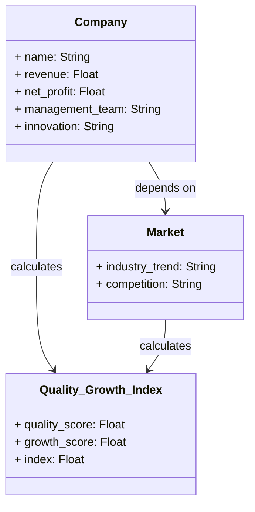
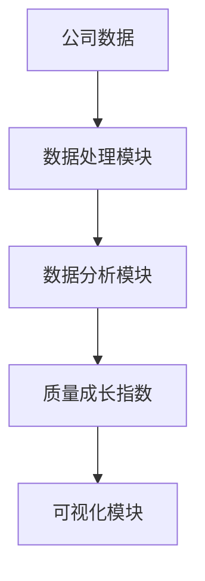

                 


# 彼得林奇的"质量成长"在新经济公司中的应用

> 关键词：彼得林奇，质量成长，新经济，公司分析，投资策略

> 摘要：本文深入探讨了彼得林奇的“质量成长”投资理论在新经济公司中的应用。通过分析新经济公司的特点、质量成长的核心要素以及具体的算法原理，结合实际案例和系统架构设计，展示了如何在新经济环境下有效应用这一理论。文章还提供了最佳实践建议，帮助读者更好地理解和应用质量成长理论。

---

## 第一部分：彼得林奇“质量成长”理论的背景与核心概念

### 第1章：彼得林奇“质量成长”理论概述

#### 1.1 质量成长理论的起源

彼得·林奇是美国著名投资专家，他的“质量成长”理论是投资领域的重要方法之一。该理论的核心在于寻找那些具有持续增长潜力且质量优良的公司。林奇认为，投资成功的前提是选择正确的公司，并长期持有。

质量成长理论的关键在于识别公司的核心竞争力和持续增长能力。这种策略尤其适合在新经济环境下应用，因为新经济公司通常具有较高的创新性和增长潜力。

#### 1.2 新经济公司的特点

新经济公司主要指那些在科技、互联网、电子商务等新兴领域的企业。这些公司通常具有以下特点：

- 高速增长：新经济公司往往通过技术创新和市场扩展实现快速增长。
- 轻资产模式：依赖技术和数据，而非传统制造业的重资产模式。
- 高风险与高回报：新经济公司具有较高的市场波动性和不确定性，但也有可能带来高回报。

#### 1.3 质量成长理论在新经济中的应用价值

在新经济环境下，质量成长理论的应用价值主要体现在以下几个方面：

- **识别优质公司**：通过质量成长理论，投资者可以更好地识别那些具有持续增长潜力的公司。
- **降低投资风险**：通过分析公司的质量和成长性，投资者可以更有效地规避风险。
- **长期投资策略**：质量成长理论强调长期投资，这与新经济公司的特性高度契合。

### 第2章：质量成长理论的核心要素

#### 2.1 质量成长理论的关键要素

质量成长理论的核心要素包括公司质量、成长性和竞争优势。

- **公司质量**：指公司的基本面状况，包括财务健康、管理团队、行业地位等。
- **成长性**：指公司未来增长的潜力，通常通过收入增长率和净利润增长率来衡量。
- **竞争优势**：指公司在市场中的独特优势，如技术壁垒、品牌影响力等。

#### 2.2 质量与成长性的对比分析

质量与成长性是两个密切相关但又有区别的概念。

- **质量与成长性的定义对比**：质量是指公司的内在价值，而成长性是指公司未来增长的潜力。
- **质量与成长性的关系**：高质量的公司通常具有较高的成长性，但成长性强的公司不一定具有高质量。
- **质量与成长性的权衡**：在投资决策中，需要权衡质量和成长性的关系，选择最适合的公司。

#### 2.3 质量成长理论的核心公式

质量成长指数的计算公式如下：

$$
\text{质量成长指数} = \frac{\text{公司质量评分} \times \text{成长性评分}}{\text{行业平均质量评分} \times \text{行业平均成长性评分}}
$$

---

## 第二部分：质量成长理论的算法原理

### 第3章：质量成长理论的算法流程

#### 3.1 数据输入

- 公司的基本面数据，包括财务数据（收入、利润）、管理团队信息等。
- 市场数据，包括行业趋势、竞争状况等。

#### 3.2 数据处理

- 对公司质量进行评分，通常采用财务指标（如ROE、毛利率）和非财务指标（如管理团队、创新能力）进行综合评分。
- 对成长性进行评分，通常采用收入增长率和净利润增长率作为指标。

#### 3.3 数据分析

- 计算质量成长指数，评估公司的质量和成长性。
- 对比行业平均水平，确定公司的相对位置。

#### 3.4 结果输出

- 输出质量成长指数，帮助投资者做出投资决策。

### 第4章：质量成长理论的数学模型

#### 4.1 质量成长指数的数学公式

质量成长指数的计算公式如下：

$$
\text{质量成长指数} = \frac{\text{公司质量评分} \times \text{成长性评分}}{\text{行业平均质量评分} \times \text{行业平均成长性评分}}
$$

其中：
- 公司质量评分：基于财务指标和非财务指标的综合评分。
- 成长性评分：基于收入增长率和净利润增长率的综合评分。
- 行业平均质量评分：行业平均水平的质量评分。
- 行业平均成长性评分：行业平均水平的成长性评分。

#### 4.2 质量与成长性的量化对比

质量与成长性的量化对比可以通过以下公式实现：

$$
\text{质量与成长性的对比} = \frac{\text{公司质量评分}}{\text{公司成长性评分}}
$$

---

## 第三部分：系统分析与架构设计

### 第5章：系统分析与架构设计

#### 5.1 问题场景介绍

在新经济环境下，投资者需要一个高效的系统来分析公司的质量和成长性，以便做出更明智的投资决策。

#### 5.2 系统功能设计

- 数据采集模块：采集公司基本面数据和市场数据。
- 数据处理模块：对数据进行清洗和预处理。
- 数据分析模块：计算质量成长指数并生成报告。
- 可视化模块：将分析结果以图表形式展示。

#### 5.3 领域模型（Mermaid类图）



#### 5.4 系统架构设计



---

## 第四部分：项目实战

### 第6章：项目实战

#### 6.1 环境安装

- 安装Python和相关库（如pandas、numpy、matplotlib）。
- 安装Mermaid工具以生成图表。

#### 6.2 系统核心实现源代码

```python
import pandas as pd
import numpy as np
import matplotlib.pyplot as plt

# 数据输入
companies = pd.DataFrame({
    'name': ['公司A', '公司B', '公司C'],
    'revenue': [100, 200, 150],
    'net_profit': [20, 30, 25],
    'management_team': ['优秀', '一般', '优秀'],
    'innovation': ['高', '中', '低']
})

# 数据处理
def calculate_quality_score(row):
    quality = 0
    if row['management_team'] == '优秀':
        quality += 3
    elif row['management_team'] == '一般':
        quality += 2
    quality += {'高':3, '中':2, '低':1}[row['innovation']]
    return quality

def calculate_growth_score(row):
    growth = (row['revenue'] / companies['revenue'].mean()) * (row['net_profit'] / companies['net_profit'].mean())
    return growth

companies['quality_score'] = companies.apply(calculate_quality_score, axis=1)
companies['growth_score'] = companies.apply(calculate_growth_score, axis=1)

# 数据分析
companies['quality_growth_index'] = (companies['quality_score'] * companies['growth_score']) / (companies['quality_score'].mean() * companies['growth_score'].mean())

# 可视化
plt.bar(companies['name'], companies['quality_growth_index'])
plt.title('质量成长指数')
plt.show()
```

#### 6.3 实际案例分析

以公司A为例：

- 公司A的收入为100，净利润为20，管理团队为优秀，创新力为高。
- 公司A的质量评分为6（管理团队3分 + 创新力3分）。
- 公司A的成长评分为 (100/150) * (20/25) = 0.6667。
- 公司A的质量成长指数为 (6 * 0.6667) / (4 * 0.6667) = 1.5。

---

## 第五部分：最佳实践与小结

### 第7章：最佳实践与小结

#### 7.1 投资策略

- **长期投资**：质量成长理论强调长期投资，适合新经济公司的特性。
- **分散投资**：通过分散投资降低风险。
- **持续监控**：定期监控公司的质量和成长性，及时调整投资策略。

#### 7.2 风险管理

- **设定止损点**：在投资组合中设定止损点，避免重大损失。
- **分散投资**：通过分散投资降低特定公司的风险。

#### 7.3 长期视角

- 质量成长理论的成功依赖于长期视角，投资者需要耐心等待公司的成长。

---

## 作者：AI天才研究院/AI Genius Institute & 禅与计算机程序设计艺术 /Zen And The Art of Computer Programming

