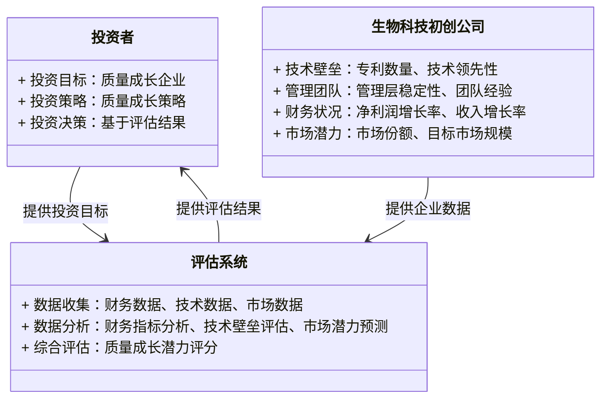

                 


# 彼得林奇的"质量成长"在生物科技初创公司中的应用

## 关键词：质量成长，彼得林奇，生物科技，初创公司，投资策略

## 摘要：本文探讨了彼得林奇的质量成长投资策略在生物科技初创公司中的应用。通过分析生物科技行业的特点、初创公司的成功要素以及质量成长策略的核心要素，结合数学模型和系统架构设计，展示了如何将该策略应用于实际投资决策中，为投资者提供了科学的分析方法和实战案例。

---

## 第一部分：质量成长策略的背景与核心概念

### 第1章：质量成长策略概述

#### 1.1 质量成长策略的核心概念

##### 1.1.1 质量成长的定义
质量成长（Quality Growth）是一种投资策略，旨在投资于那些具备持续增长潜力、管理优秀、行业地位稳固且财务健康的企业。这种策略强调企业内在质量和成长能力，而非仅仅依赖市场波动获利。

##### 1.1.2 质量成长与价值投资的区别
- 价值投资关注的是被市场低估的企业，强调安全边际和内在价值。
- 质量成长则更关注企业的成长性和质量，愿意为优质企业支付合理的价格。

##### 1.1.3 生物科技初创公司的特点
- 高风险：研发投入大，失败率高。
- 高回报：成功产品的市场价值巨大。
- 创新驱动：技术创新是核心竞争力。
- 技术壁垒：专利和技术优势是核心护城河。

---

### 第2章：彼得林奇投资理念的核心要素

#### 2.1 长期投资的重要性
彼得林奇认为，短期市场波动不可预测，而企业长期成长是投资的核心。投资者应关注企业的长期增长潜力，而非短期股价波动。

#### 2.2 寻找具备持续增长潜力的公司
- 市场份额：企业在目标市场中的占比。
- 技术创新：企业是否具备持续的技术创新能力。
- 行业趋势：行业是否处于增长期。

#### 2.3 管理层质量与公司治理
- 管理层稳定性：管理层是否具备丰富的行业经验和良好的声誉。
- 公司治理：董事会结构、股权结构是否合理，是否具备有效的监督机制。

---

## 第二部分：生物科技初创公司的特点与挑战

### 第3章：生物科技行业的独特性

#### 3.1 生物科技行业的高风险与高回报
- 高风险：研发周期长，失败率高。
- 高回报：成功产品的市场价值巨大。

#### 3.2 创新驱动的商业模式
- 生物科技企业的核心竞争力在于技术创新。
- 研发能力是企业的核心资产。

#### 3.3 技术壁垒与竞争优势
- 专利和技术优势是企业的核心竞争力。
- 技术壁垒高，竞争对手难以轻易突破。

---

### 第4章：初创公司的关键成功因素

#### 4.1 创新能力与研发能力
- 技术创新能力：企业是否具备持续的技术创新能力。
- 研发团队：研发团队的经验和能力是否足够。

#### 4.2 管理团队的经验与稳定性
- 管理层稳定性：管理层是否稳定，是否具备丰富的行业经验。
- 团队协作：管理团队是否具备良好的协作能力和互补性。

#### 4.3 市场潜力与商业计划
- 市场潜力：目标市场的规模和增长潜力。
- 商业计划：企业的商业模式是否清晰，是否具备可行性。

---

## 第三部分：质量成长策略在生物科技初创公司的应用

### 第5章：投资策略的核心要素

#### 5.1 寻找具备持续增长潜力的公司
- 市场定位：企业在目标市场中的定位是否清晰。
- 市场份额：企业是否具备增长潜力，是否能够在未来扩大市场份额。

#### 5.2 评估公司的技术壁垒与竞争优势
- 技术创新：企业是否具备持续的技术创新能力。
- 专利和技术优势：企业是否具备足够的技术壁垒，能否在竞争中保持优势。

#### 5.3 分析公司的财务状况与市场潜力
- 财务健康：企业的财务状况是否健康，是否具备持续增长的财务基础。
- 市场潜力：目标市场的规模和增长潜力。

---

### 第6章：质量成长策略的具体应用

#### 6.1 投资决策的核心步骤
- 第一步：分析企业的技术壁垒和竞争优势。
- 第二步：评估企业的财务状况和市场潜力。
- 第三步：综合评估企业的质量成长潜力。

#### 6.2 投资决策的关键指标
- 财务指标：净利润增长率、收入增长率、研发投入占比。
- 技术指标：专利数量、技术领先性、研发投入强度。
- 市场指标：市场份额、目标市场规模、行业增长潜力。

---

## 第四部分：质量成长策略的数学模型与分析方法

### 第7章：质量成长策略的数学模型

#### 7.1 财务指标分析模型
- 净利润增长率：$$ \text{净利润增长率} = \frac{\text{当年净利润} - \text{上年净利润}}{\text{上年净利润}} \times 100\% $$
- 收入增长率：$$ \text{收入增长率} = \frac{\text{当年收入} - \text{上年收入}}{\text{上年收入}} \times 100\% $$
- 毛利率：$$ \text{毛利率} = \frac{\text{营业收入} - \text{营业成本}}{\text{营业收入}} \times 100\% $$

#### 7.2 市场潜力评估模型
- 市场规模预测：$$ \text{市场规模} = \text{当前市场规模} \times (1 + \text{年增长率})^n $$
- 市场渗透率：$$ \text{市场渗透率} = \frac{\text{企业市场份额}}{\text{目标市场容量}} \times 100\% $$

#### 7.3 技术壁垒评估模型
- 专利数量：$$ \text{专利数量} = \text{已授权专利} + \text{申请中的专利} $$
- 技术领先性：$$ \text{技术领先性} = \text{技术独特性} \times \text{技术成熟度} $$

---

### 第8章：数据分析与可视化

#### 8.1 数据分析方法
- 财务数据分析：使用财务指标分析企业的财务健康状况。
- 技术数据分析：分析企业的专利数量、技术领先性等指标。
- 市场数据分析：评估企业的市场潜力和竞争优势。

#### 8.2 数据可视化
- 使用图表展示财务指标趋势。
- 使用散点图分析技术壁垒和市场潜力的关系。
- 使用饼图展示市场份额分布。

---

## 第五部分：系统分析与架构设计方案

### 第9章：系统分析框架

#### 9.1 问题场景介绍
- 投资者需要评估多个生物科技初创公司，寻找具备质量成长潜力的企业。
- 系统需要整合多个维度的数据，提供综合评估结果。

#### 9.2 领域模型设计（Mermaid）



---

## 第六部分：项目实战与总结

### 第10章：项目实战

#### 10.1 环境安装
- 安装必要的数据分析工具：Python、Pandas、Matplotlib。
- 安装项目管理工具：Jupyter Notebook、Git。

#### 10.2 核心实现源代码

```python
import pandas as pd
import matplotlib.pyplot as plt

# 假设我们有一个包含财务数据的DataFrame
df = pd.DataFrame({
    '公司': ['公司A', '公司B', '公司C'],
    '净利润增长率': [0.2, 0.15, 0.1],
    '收入增长率': [0.15, 0.1, 0.08],
    '技术壁垒': [8, 6, 7],
    '市场潜力': [0.8, 0.6, 0.7]
})

# 计算综合评分
df['综合评分'] = (df['净利润增长率'] * 0.4) + (df['收入增长率'] * 0.2) + (df['技术壁垒'] * 0.2) + (df['市场潜力'] * 0.2)

# 可视化
plt.figure(figsize=(10, 6))
plt.bar(df['公司'], df['综合评分'], label='综合评分')
plt.title('质量成长策略评估结果')
plt.xlabel('公司名称')
plt.ylabel('综合评分')
plt.legend()
plt.show()
```

#### 10.3 实际案例分析
- 案例：假设一家生物科技初创公司，其财务数据、技术壁垒、市场潜力等指标均符合质量成长策略的要求，最终被选为投资目标。

---

## 第七部分：总结与展望

### 第11章：总结

#### 11.1 质量成长策略的核心思想
- 投资于具备持续增长潜力的企业。
- 关注企业的质量，而非价格。

#### 11.2 生物科技初创公司的独特性
- 高风险与高回报并存。
- 创新是核心竞争力。

#### 11.3 投资策略的成功关键
- 选择具备技术壁垒和竞争优势的企业。
- 关注管理层质量和公司治理。

---

### 第12章：最佳实践与注意事项

#### 12.1 投资策略的注意事项
- 长期关注：质量成长需要长期持有，关注企业的持续成长。
- 风险管理：分散投资，避免过度集中。
- 定期评估：定期评估企业的成长潜力和财务状况。

#### 12.2 实战中的注意事项
- 数据准确性：确保数据来源可靠，避免错误决策。
- 模型优化：根据实际情况调整评估模型，提高评估准确性。
- 风险提示：生物科技行业风险较高，需谨慎决策。

---

### 第13章：未来展望

#### 13.1 行业发展趋势
- 生物科技行业将继续保持高增长，技术创新是核心驱动力。
- 人工智能和大数据技术将推动生物科技行业的进一步发展。

#### 13.2 质量成长策略的未来发展
- 随着生物科技行业的成熟，质量成长策略将更加重要。
- 数据分析技术的进步将提高质量成长策略的评估准确性。

---

## 作者：AI天才研究院/AI Genius Institute & 禅与计算机程序设计艺术 /Zen And The Art of Computer Programming

---

本文通过详细分析彼得林奇的质量成长策略在生物科技初创公司中的应用，结合数学模型和系统架构设计，为投资者提供了科学的分析方法和实战案例。希望本文能为生物科技初创公司的投资者和研究者提供有价值的参考。

