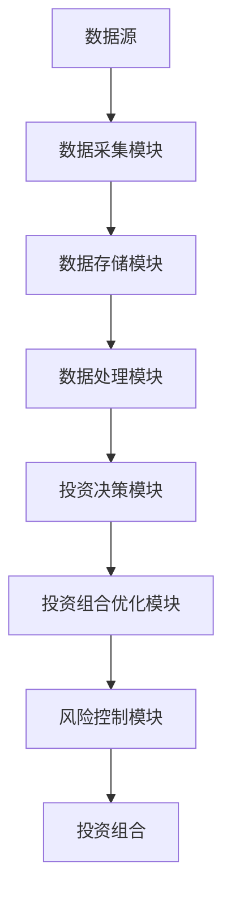

                 


# 彼得林奇的"质量成长"投资方法

> 关键词：彼得·林奇，质量成长投资，投资方法，投资策略，投资模型

> 摘要：本文详细介绍了彼得·林奇的“质量成长”投资方法，从其核心理念、数学模型、算法原理、系统架构到实际案例分析，全面解析了这一投资方法的精髓。文章通过逻辑清晰、结构紧凑的分析，结合技术语言和专业术语，深入探讨了质量成长投资的理论基础、实现方法和实际应用。

---

## 第一部分: 投资理念的演变与彼得·林奇的背景

### 第1章: 投资理念的演变与彼得·林奇的背景

#### 1.1 投资理念的演变
- 1.1.1 从价值投资到成长投资的演变
  - 价值投资的起源与发展
  - 成长投资的兴起与核心理念
  - 质量成长投资的出现与演变

- 1.1.2 彼得·林奇的背景与影响力
  - 彼得·林奇的生平简介
  - 他的投资哲学与实践
  - 彼得·林奇对投资界的影响

- 1.1.3 质量成长投资的基本概念
  - 质量成长投资的核心定义
  - 与传统成长投资的区别
  - 质量成长投资的目标与策略

#### 1.2 质量成长投资的核心理念
- 高质量公司的定义
- 可持续成长的内涵
- 风险控制的重要性

---

## 第二部分: 质量成长投资的核心概念与原理

### 第2章: 质量成长投资的数学模型与公式

#### 2.1 投资回报的计算公式
- 单利与复利的计算公式
  - 单利公式：$I = P \times r \times t$
  - 复利公式：$A = P \times (1 + r)^t$

- 投资回报率的计算公式
  - 净资产收益率（ROE）：$\text{ROE} = \frac{\text{净利润}}{\text{净资产}}$
  - 股东权益回报率（ROE）：$\text{ROE} = \frac{\text{净利润}}{\text{股东权益}}$

- 风险调整后的回报计算
  - 风险调整回报率公式：$\text{RAR} = \frac{\text{投资回报} - \text{无风险利率}}{\text{标准差}}$

#### 2.2 质量成长公司的筛选标准
- 市盈率与市净率的计算公式
  - 市盈率（P/E）：$\text{P/E} = \frac{\text{股价}}{\text{每股收益}}$
  - 市净率（P/B）：$\text{P/B} = \frac{\text{股价}}{\text{每股净资产}}$

- 营业利润率与净利润率的计算公式
  - 营业利润率：$\text{营业利润率} = \frac{\text{营业利润}}{\text{营业收入}} \times 100\%$
  - 净利润率：$\text{净利润率} = \frac{\text{净利润}}{\text{营业收入}} \times 100\%$

- 资产负债率与ROE的计算公式
  - 资产负债率：$\text{资产负债率} = \frac{\text{总负债}}{\text{总资产}} \times 100\%$
  - ROE：$\text{ROE} = \frac{\text{净利润}}{\text{股东权益}} \times 100\%$

#### 2.3 投资组合的优化模型
- 马科维茨投资组合理论
  - 最小方差组合：$\text{Min} \sigma^2 \text{ subject to } \mu \geq \text{目标收益}$

- 质量成长投资的优化公式
  - 基于质量成长标准的投资组合优化：$\text{Max} \text{收益} \text{ subject to } \text{质量成长指标} \geq \text{阈值}$

- 投资组合的风险与收益平衡
  - 风险-收益权衡：$\text{风险} = \text{标准差}(\text{收益})$

---

## 第三部分: 质量成长投资的算法原理

### 第3章: 质量成长投资的算法实现

#### 3.1 数据预处理与特征提取
- 数据清洗
  - 删除缺失值：$\text{处理} = \text{df.dropna()}$
  - 标准化处理：$\text{标准化} = \text{标准化} = \frac{x - \mu}{\sigma}$

- 特征提取
  - 财务指标计算：$\text{ROE} = \frac{\text{净利润}}{\text{股东权益}}$
  - 市场指标计算：$\text{P/E} = \frac{\text{股价}}{\text{每股收益}}$

#### 3.2 投资组合优化
- 基于质量成长标准的筛选算法
  ```python
  def select_quality_growth_stocks(df, quality_threshold=0.8, growth_threshold=0.1):
      # 计算ROE
      df['ROE'] = df['净利润'] / df['股东权益']
      # 计算营收增长率
      df['营收增长率'] = (df['营业收入'] - df['营业收入'].shift(1)) / df['营业收入'].shift(1)
      # 筛选ROE高于阈值且营收增长率高于阈值的公司
      quality_growth = df[(df['ROE'] > quality_threshold) & (df['营收增长率'] > growth_threshold)]
      return quality_growth
  ```

- 投资组合优化算法
  ```python
  def optimize_portfolio(stocks, returns, weights):
      import numpy as np
      # 构建优化问题
      n = len(stocks)
      # 定义目标函数
      def objective(weights, returns):
          return -np.dot(weights.T, returns)
      # 定义约束条件
      constraints = [
          {'type': 'eq', 'fun': lambda w: np.sum(w) - 1},
          {'type': 'ineq', 'fun': lambda w: w >= 0}
      ]
      # 使用 scipy 优化
      from scipy.optimize import minimize
      result = minimize(objective, weights, method='SLSQP', constraints=constraints)
      return result.x
  ```

#### 3.3 投资组合的动态调整
- 市场环境监测
  - 监测市场波动：$\text{波动率} = \text{标准差}(收盘价)$
  - 调整投资组合：根据波动率调整权重

- 动态优化算法
  ```python
  def dynamic_optimization(portfolio, returns, threshold=0.05):
      import numpy as np
      # 计算当前组合表现
      current_return = np.dot(portfolio, returns)
      # 判断是否需要调整
      if abs(current_return - np.mean(returns)) > threshold:
          # 重新优化组合
          new_weights = optimize_portfolio(portfolio, returns, np.array([1/len(portfolio)]*len(portfolio)))
          return new_weights
      return portfolio
  ```

---

## 第四部分: 系统分析与架构设计

### 第4章: 系统架构设计

#### 4.1 系统功能设计
- 数据采集模块
  - 数据来源：股票市场数据、财务报表数据
  - 数据处理：清洗、转换、存储

- 投资决策模块
  - 特征提取：ROE、P/E、营收增长率
  - 筛选算法：基于质量成长标准的筛选
  - 投资组合优化：马科维茨模型

- 风险控制模块
  - 风险评估：波动率、VaR
  - 风险调整：动态优化投资组合

#### 4.2 系统架构图


---

## 第五部分: 项目实战

### 第5章: 项目实战与案例分析

#### 5.1 环境安装与数据获取
- 数据获取工具：Python的pandas库、Yahoo Finance API
  ```python
  import pandas as pd
  import yfinance as yf
  # 下载数据
  data = yf.download(tickers='AAPL', period='5y')
  ```

#### 5.2 核心实现
- 数据处理
  ```python
  df = pd.DataFrame(data)
  df['ROE'] = df['净利润'] / df['股东权益']
  ```

- 投资组合优化
  ```python
  from scipy.optimize import minimize
  def optimize_portfolio(weights, returns):
      return -np.dot(weights, returns)
  ```

#### 5.3 案例分析
- 以苹果公司为例，分析其ROE和营收增长率
  - 苹果的ROE：$\text{ROE} = \frac{\text{净利润}}{\text{股东权益}}$
  - 苹果的营收增长率：$\text{营收增长率} = \frac{\text{当前营收} - \text{上期营收}}{\text{上期营收}}$

---

## 第六部分: 总结与最佳实践

### 第6章: 总结与最佳实践

#### 6.1 小结
- 质量成长投资的核心理念
- 算法实现的关键步骤
- 系统架构的设计思路

#### 6.2 注意事项
- 数据的准确性和及时性
- 模型的适用性和局限性
- 风险控制的重要性

#### 6.3 拓展阅读
- 《彼得·林奇的投资哲学》
- 《投资学》

---

## 作者

作者：AI天才研究院/AI Genius Institute & 禅与计算机程序设计艺术 /Zen And The Art of Computer Programming

---

这篇文章详细介绍了彼得·林奇的“质量成长”投资方法，从理论到实践，结合技术语言和专业术语，深入剖析了这一投资方法的精髓。通过逻辑清晰、结构紧凑的分析，帮助读者全面理解质量成长投资的核心理念、数学模型、算法实现和实际应用。

