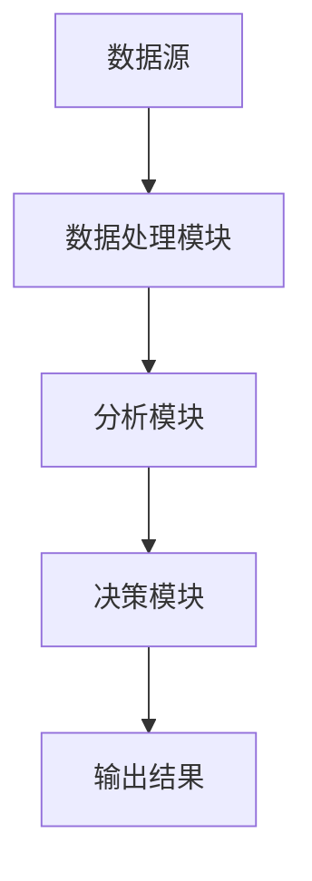
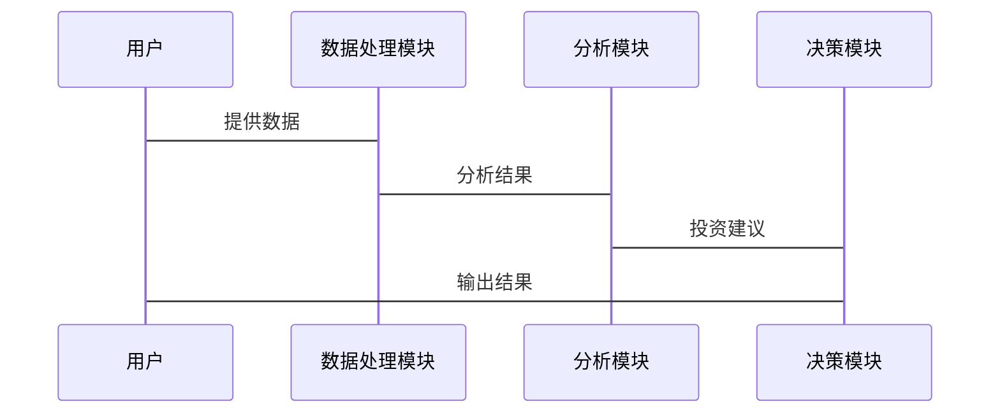

                 


# 彼得林奇的"质量成长"投资案例

## 关键词：质量成长投资，彼得·林奇，投资策略，投资案例，投资分析

## 摘要：本文详细探讨了彼得·林奇的“质量成长”投资策略，通过分析其核心理念、数学模型和实际案例，展示了如何通过投资于具有持续增长潜力和良好管理的公司来实现长期收益。文章结构清晰，内容丰富，适合投资新手和资深投资者参考。

---

# 第一部分：质量成长投资的背景与核心理念

## 第1章：质量成长投资的定义与背景

### 1.1 投资的基本定义
投资是指将资金投入到某个项目或资产中，期望在未来获得收益或资本增值。投资的形式多种多样，包括股票、债券、房地产等。质量成长投资是一种专注于选择具有持续增长潜力和良好管理的公司的投资策略。

### 1.2 质量成长投资的背景
20世纪80年代，彼得·林奇在投资领域提出了质量成长投资的理念。他强调，投资者应该关注公司的基本面，选择那些具有强大竞争优势和良好财务状况的企业。这种方法不同于传统的价值投资，更注重公司的成长性和内在价值。

### 1.3 彼得·林奇的贡献与影响
彼得·林奇以其成功的投资业绩和深入的分析方法闻名。他管理的麦哲伦基金在任期内取得了显著的收益，这使得质量成长投资的理念广为传播，并影响了无数投资者。

---

## 第2章：彼得·林奇的投资理念

### 2.1 质量成长投资的核心要素
质量成长投资的核心在于选择那些具备以下特征的公司：
1. **持续的盈利能力**：公司应有稳定的收益能力，并且能够在未来继续增长。
2. **强大的竞争优势**：公司在市场上应具备独特的竞争优势，如品牌、技术或成本优势。
3. **良好的财务健康状况**：公司应有健康的财务状况，包括合理的债务水平和充足的现金流。

### 2.2 投资策略的目标
质量成长投资的目标是通过长期持有优质股票，获得超越市场平均水平的回报。这种方法强调选择那些能够持续增长的公司，而不是仅仅追求短期的价格波动。

### 2.3 投资方法与传统价值投资的区别
与传统价值投资不同，质量成长投资更注重公司的成长性和内在价值，而不是仅仅寻找被市场低估的股票。这种方法更倾向于投资那些具有强大竞争优势和良好管理的公司。

---

## 第3章：质量成长投资的经典案例

### 3.1 投资可口可乐的案例
彼得·林奇曾投资于可口可乐公司。他选择可口可乐的原因在于其强大的品牌影响力和全球市场地位。可口可乐在当时已经是一个成熟的公司，但仍然具备持续增长的潜力。

### 3.2 投资微软的案例
微软在20世纪80年代末期是一个快速增长的公司。彼得·林奇看到了微软在软件行业的领先地位，以及其巨大的增长潜力，因此选择投资微软。

### 3.3 成功的关键因素
这些成功案例的关键在于彼得·林奇对公司的深入分析和对市场趋势的准确判断。他注重公司的基本面分析，选择那些具有强大竞争优势和良好财务状况的公司。

---

# 第二部分：质量成长投资的核心概念与联系

## 第4章：质量成长投资的核心原理

### 4.1 企业基本面分析
企业基本面分析是质量成长投资的核心部分。彼得·林奇通过分析公司的财务报表，评估公司的盈利能力、资产负债情况和现金流状况。

#### 4.1.1 利润能力分析
盈利能力是评估公司财务健康状况的重要指标。彼得·林奇关注公司的净利润率、毛利率等指标，以判断公司的盈利能力和增长潜力。

#### 4.1.2 资产负债分析
公司资产负债表的分析有助于评估公司的财务风险。彼得·林奇关注公司的债务水平和资产流动性，以判断公司的财务健康状况。

#### 4.1.3 现金流分析
现金流是公司财务健康的重要指标。彼得·林奇关注公司的经营现金流，以判断公司的盈利能力和现金流状况。

### 4.2 竞争优势分析
竞争优势是公司持续增长的关键。彼得·林奇注重分析公司的竞争优势，包括品牌优势、技术优势、成本优势等。

### 4.3 财务指标评估
彼得·林奇使用一系列财务指标来评估公司的质量，包括市盈率（P/E）、市净率（P/B）、股息率等。

---

## 第5章：质量成长投资的数学模型与公式

### 5.1 质量成长投资的关键指标

#### 5.1.1 市盈率（P/E）
市盈率是公司股价与每股收益的比率，用于评估公司的估值。公式如下：
$$ P/E = \frac{\text{股价}}{\text{每股收益}} $$

#### 5.1.2 市净率（P/B）
市净率是公司股价与每股净资产的比率，用于评估公司的估值。公式如下：
$$ P/B = \frac{\text{股价}}{\text{每股净资产}} $$

#### 5.1.3 股息率
股息率是公司每年派发的股息与股价的比率，用于评估公司的分红能力。公式如下：
$$ \text{股息率} = \frac{\text{股息}}{\text{股价}} \times 100\% $$

### 5.2 质量成长投资的算法原理

#### 5.2.1 投资决策流程
以下是质量成长投资的决策流程：
1. 确定投资目标和风险承受能力。
2. 分析公司的基本面，评估其盈利能力、财务状况和竞争优势。
3. 计算关键财务指标，如市盈率、市净率等。
4. 选择具有持续增长潜力和良好财务状况的公司。
5. 长期持有优质股票，定期复检投资组合。

#### 5.2.2 投资组合优化
质量成长投资注重投资组合的优化，以分散风险并提高收益。彼得·林奇通常会分散投资于多个优质公司，以降低单一股票的风险。

---

## 第6章：质量成长投资的系统分析与架构设计

### 6.1 投资分析系统的功能设计

#### 6.1.1 数据收集模块
数据收集模块负责收集公司的财务数据、行业信息和市场数据。

#### 6.1.2 分析模块
分析模块包括基本面分析、竞争优势分析和财务指标评估。

#### 6.1.3 决策模块
决策模块根据分析结果生成投资建议，包括买入、持有或卖出的决策。

### 6.2 系统架构设计

#### 6.2.1 系统架构图


#### 6.2.2 系统交互流程


---

## 第7章：质量成长投资的项目实战

### 7.1 环境配置
需要安装Python和相关的数据分析库，如Pandas、NumPy和Matplotlib。

### 7.2 数据收集
通过API或数据接口获取公司的财务数据和市场数据。

### 7.3 分析模块实现
使用Python代码实现财务指标的计算和公司基本面的分析。

#### 7.3.1 示例代码
```python
import pandas as pd
import numpy as np

# 示例数据
data = {
    '公司名称': ['公司A', '公司B', '公司C'],
    '股价': [100, 80, 120],
    '每股收益': [20, 15, 25],
    '每股净资产': [50, 40, 60]
}

df = pd.DataFrame(data)

# 计算市盈率
df['P/E'] = df['股价'] / df['每股收益']
# 计算市净率
df['P/B'] = df['股价'] / df['每股净资产']

print(df)
```

### 7.4 结果展示
根据计算结果，生成投资建议并展示。

---

## 第8章：质量成长投资的最佳实践

### 8.1 投资注意事项
1. 长期投资：质量成长投资强调长期持有优质股票，避免频繁交易。
2. 风险管理：分散投资，降低单一股票的风险。
3. 定期复检：定期检查投资组合，及时调整。

### 8.2 小结
彼得·林奇的质量成长投资策略强调选择具有持续增长潜力和良好财务状况的公司。通过深入的分析和长期的持有，投资者可以获得超越市场平均水平的回报。

### 8.3 拓展阅读
- 《彼得·林奇的成功投资》
- 《投资之道》

---

# 作者：AI天才研究院/AI Genius Institute & 禅与计算机程序设计艺术 /Zen And The Art of Computer Programming

