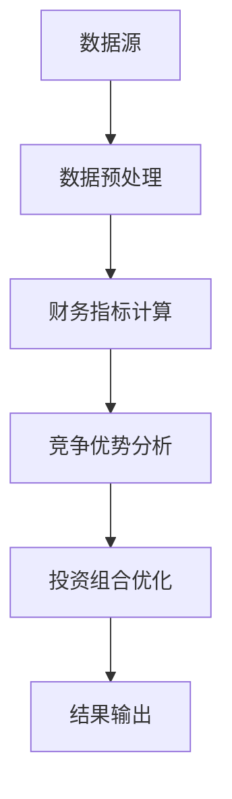

                 


# 彼得林奇的"质量成长"股票特征

> 关键词：彼得林奇，质量成长，股票特征，投资策略，价值投资

> 摘要：本文深入分析了彼得·林奇的“质量成长”股票投资理念，探讨了其核心特征、投资策略以及实际应用。通过详细的财务指标分析、竞争优势评估、投资组合构建与风险管理、实际案例分析，以及系统架构设计等多维度内容，全面阐述了质量成长股票的投资逻辑和实战应用。本文还结合了数学模型和算法流程图，为读者提供了清晰的理论与实践指导。

---

## 第1章：彼得·林奇与“质量成长”投资理念

### 1.1 彼得·林奇及其投资风格

#### 1.1.1 彼得·林奇的生平简介
彼得·林奇（Peter Lynch）是美国著名的投资经理，曾任富达投资集团（Fidelity）麦哲伦基金的经理，以其卓越的投资业绩闻名于世。他被认为是20世纪最成功的基金经理之一，管理的麦哲伦基金在1977年至1990年期间，年平均收益率高达29%，远超市场平均水平。

#### 1.1.2 林奇的投资哲学与风格
林奇的投资哲学强调“质量成长”理念，即投资于那些具有持续增长潜力、财务健康且竞争优势明显的公司。他认为，投资者应该选择那些能够持续增长的公司，而不是仅仅关注市场的短期波动。林奇的投资风格以选股能力强、风险控制严格著称。

#### 1.1.3 林奇与“质量成长”投资理念的形成
林奇的投资理念深受本杰明·格雷厄姆（Benjamin Graham）和菲利普·费雪（Philip Fisher）的影响。他结合了价值投资和成长投资的优点，提出了“质量成长”策略，即选择那些具有强大竞争优势、财务健康且估值合理的成长型公司。

### 1.2 “质量成长”股票的定义与特征

#### 1.2.1 什么是“质量成长”股票
“质量成长”股票是指那些具有强大竞争优势、财务健康、持续增长潜力且估值合理的公司股票。这类股票不仅具备成长性，还具备一定的安全边际，能够在市场波动中保持稳定。

#### 1.2.2 质量成长股的核心特征
- **持续增长潜力**：公司营业收入和净利润持续增长，且增长速度高于行业平均水平。
- **强大竞争优势**：公司在行业内具有显著的竞争优势，如技术领先、品牌优势、成本优势等。
- **财务健康**：公司财务状况稳健，资产负债率低，现金流充足，盈利能力强。
- **合理估值**：股票的估值水平相对于公司基本面具有吸引力，如市盈率（P/E）合理，市净率（P/B）低于行业平均水平。

#### 1.2.3 质量成长股与价值股、成长股的区别
- **价值股**：主要关注低估值的股票，通常属于周期性行业，股价被市场低估。
- **成长股**：主要关注高增长的股票，通常属于新兴行业，估值较高。
- **质量成长股**：结合了成长股和价值股的优点，既有持续的增长潜力，又有合理的估值水平。

### 1.3 质量成长投资的适用场景与边界

#### 1.3.1 质量成长投资的适用市场环境
质量成长投资适用于长期牛市环境，尤其是市场处于上升周期时，具有持续增长潜力的公司更容易获得资金青睐。此外，质量成长投资也适用于经济复苏期，因为此时具有强大竞争优势的公司更容易恢复增长。

#### 1.3.2 质量成长投资的边界与限制
- **市场周期性风险**：在市场低迷或熊市期间，质量成长股可能会出现估值下降，导致股价波动较大。
- **行业限制**：质量成长投资更适合于成长性较强的行业，如科技、消费、医疗等，而周期性行业如能源、材料等则不太适合。
- **个股风险**：单一个股的业绩波动可能会影响投资组合的稳定性。

#### 1.3.3 质量成长投资的长期有效性分析
从长期来看，质量成长投资的有效性主要取决于市场的整体表现和公司的持续增长能力。如果市场整体表现良好，且公司能够持续增长，质量成长投资将表现出色。反之，如果市场低迷或公司增长放缓，质量成长投资的表现可能不佳。

### 1.4 本章小结
本章介绍了彼得·林奇及其“质量成长”投资理念，分析了质量成长股的定义、核心特征以及与价值股和成长股的区别。同时，还探讨了质量成长投资的适用场景和边界，为后续章节的深入分析奠定了基础。

---

## 第2章：质量成长股的财务指标分析

### 2.1 财务指标分析的重要性

#### 2.1.1 财务指标在股票分析中的作用
财务指标是评估公司财务健康状况和投资价值的重要工具。通过对财务指标的分析，投资者可以更好地了解公司的盈利能力、成长潜力和财务风险。

#### 2.1.2 林奇对财务指标的重视
林奇认为，财务指标是评估公司质量的重要依据。他特别关注净利润增长率、营业收入增长率、净资产收益率（ROE）等指标，认为这些指标能够反映公司的持续增长潜力和财务健康状况。

### 2.2 质量成长股的关键财务指标

#### 2.2.1 净利润增长率
净利润增长率是衡量公司盈利能力的重要指标，反映了公司在一定时期内净利润的增加幅度。林奇认为，净利润增长率应该持续保持在合理水平，且增速高于行业平均水平。

#### 2.2.2 营业收入增长率
营业收入增长率是衡量公司业务扩展能力的重要指标，反映了公司在市场中的竞争力和增长潜力。林奇认为，营业收入增长率应该保持稳定增长，且增速高于行业平均水平。

#### 2.2.3 净资产收益率（ROE）
净资产收益率（ROE）是衡量公司盈利能力的重要指标，反映了公司利用股东权益创造利润的能力。林奇认为，ROE应该保持在合理水平，且逐年稳步增长。

#### 2.2.4 每股收益（EPS）
每股收益（EPS）是衡量公司盈利能力的重要指标，反映了公司每普通股的盈利能力。林奇认为，EPS应该逐年增长，且增速与营业收入增长率保持一致。

#### 2.2.5 财务健康性指标（如资产负债率）
资产负债率是衡量公司财务健康状况的重要指标，反映了公司负债与资产的比率。林奇认为，资产负债率应该保持在合理水平，且逐年稳步下降，表明公司财务状况稳健。

### 2.3 财务指标分析的注意事项

#### 2.3.1 财务指标的行业差异性
不同行业的财务指标差异较大，因此在分析财务指标时需要结合行业特点。例如，科技行业的财务指标可能与制造业行业不同。

#### 2.3.2 财务数据的可比性问题
财务数据的可比性是财务指标分析的重要前提。在分析财务指标时，需要确保数据的可比性，例如比较同一行业内的公司，或者在同一公司的不同时间段进行比较。

#### 2.3.3 财务造假与数据质量的风险
财务造假是财务指标分析中需要警惕的问题。投资者需要通过多种渠道验证财务数据的真实性，以确保分析结果的准确性。

### 2.4 本章小结
本章详细分析了质量成长股的关键财务指标，包括净利润增长率、营业收入增长率、净资产收益率（ROE）、每股收益（EPS）和资产负债率等。同时，还探讨了财务指标分析的注意事项，为投资者提供了全面的分析框架。

---

## 第3章：质量成长股的竞争优势分析

### 3.1 什么是竞争优势

#### 3.1.1 竞争优势的定义与分类
竞争优势是指公司在行业内相对于竞争对手的有利因素，能够使公司在市场竞争中获得更高的市场份额和利润。竞争优势可以分为技术优势、成本优势、品牌优势、市场地位优势等。

#### 3.1.2 林奇对竞争优势的重视
林奇认为，竞争优势是质量成长股的核心特征之一。他特别关注那些具有强大竞争优势的公司，认为这些公司能够在行业中持续增长，为投资者带来稳定收益。

### 3.2 质量成长股的核心竞争优势

#### 3.2.1 技术优势
技术优势是指公司在技术研发和创新方面具有领先地位。具有技术优势的公司能够通过技术创新降低成本、提高产品质量，从而在竞争中占据优势。

#### 3.2.2 市场领先地位
市场领先地位是指公司在市场中占据主导地位，拥有较高的市场份额和品牌影响力。具有市场领先地位的公司能够通过规模效应降低成本，进一步巩固市场地位。

#### 3.2.3 产品差异化
产品差异化是指公司通过提供独特的产品或服务，满足特定市场需求，从而在竞争中获得优势。具有产品差异化优势的公司能够通过创新的产品设计吸引更多的客户。

#### 3.2.4 成本优势
成本优势是指公司在生产或运营过程中具有更低的成本，从而能够在价格竞争中占据优势。具有成本优势的公司能够通过降低成本提高利润率，增加股东收益。

### 3.3 竞争优势的持续性分析

#### 3.3.1 行业周期性对竞争优势的影响
行业周期性对竞争优势的影响较大。在行业景气周期，竞争优势明显的公司能够获得更高的增长，而在行业衰退周期，竞争优势可能受到削弱。

#### 3.3.2 竞争对手的威胁分析
竞争对手的威胁是竞争优势分析的重要内容。投资者需要关注行业内主要竞争对手的动态，评估公司竞争优势的持续性。

#### 3.3.3 竞争优势的可复制性
竞争优势的可复制性是指竞争对手是否能够轻易复制公司的竞争优势。如果竞争优势具有较高的壁垒，竞争对手难以复制，公司的竞争优势将更加持久。

### 3.4 本章小结
本章分析了质量成长股的核心竞争优势，包括技术优势、市场地位、产品差异化和成本优势等。同时，还探讨了竞争优势的持续性问题，为投资者提供了全面的竞争优势分析框架。

---

## 第4章：质量成长股的投资策略与风险管理

### 4.1 投资策略与选股标准

#### 4.1.1 林奇的选股标准
林奇的选股标准主要包括以下几点：
1. 公司具有持续增长潜力，且增长速度高于行业平均水平。
2. 公司财务健康，资产负债率低，现金流充足。
3. 公司具有强大的竞争优势，能够在行业内持续增长。
4. 股票估值合理，市盈率和市净率低于行业平均水平。

#### 4.1.2 投资组合构建
林奇认为，投资组合应该多样化，涵盖不同行业和不同规模的公司。他建议投资者将资金分散投资于几只具有质量成长特征的股票，以降低投资风险。

### 4.2 投资风险管理

#### 4.2.1 风险管理的重要性
风险管理是投资过程中不可忽视的重要环节。通过有效的风险管理，投资者可以降低投资组合的波动性，保护投资收益。

#### 4.2.2 风险管理的具体措施
- **分散投资**：通过投资于不同行业和不同规模的公司，降低投资组合的系统性风险。
- **止损策略**：设定止损点，当股价下跌至一定程度时，立即卖出股票，避免更大的损失。
- **定期调整**：根据市场变化和公司基本面，定期调整投资组合，优化资产配置。

#### 4.2.3 数学模型与风险管理
在风险管理中，可以使用夏普比率（Sharpe Ratio）来衡量投资组合的风险调整后收益。夏普比率的计算公式为：

$$
\text{夏普比率} = \frac{\text{投资组合收益} - \text{无风险收益率}}{\text{投资组合收益的标准差}}
$$

夏普比率越高，表明投资组合的风险调整后收益越高。

### 4.3 本章小结
本章介绍了林奇的投资策略与选股标准，分析了投资组合构建和风险管理的具体措施。通过夏普比率等数学模型，为投资者提供了科学的风险管理方法。

---

## 第5章：质量成长股的实际案例分析

### 5.1 微软（Microsoft）的案例分析

#### 5.1.1 微软的公司概况
微软是全球最大的软件公司之一，主要业务包括操作系统、办公软件、云计算服务等。微软在林奇的投资生涯中是一个重要的案例。

#### 5.1.2 微软的增长历程
在林奇管理麦哲伦基金期间，微软经历了高速增长期，营业收入和净利润均保持了较高的增长速度。微软的股价也出现了大幅上涨，为投资者带来了丰厚的回报。

#### 5.1.3 林奇对微软的分析
林奇认为，微软具有强大的竞争优势，特别是在操作系统和办公软件领域。微软的财务状况稳健，具有较高的成长潜力，符合质量成长股的特征。

### 5.2 可口可乐（Coca-Cola）的案例分析

#### 5.2.1 可口可乐的公司概况
可口可乐是全球最大的饮料公司之一，产品覆盖全球市场，具有强大的品牌影响力和市场地位。

#### 5.2.2 可口可乐的增长历程
在林奇的投资期间，可口可乐的营业收入和净利润均保持了稳定的增长，且公司具有强大的品牌优势和市场地位，符合质量成长股的特征。

#### 5.2.3 林奇对可口可乐的分析
林奇认为，可口可乐具有强大的竞争优势，特别是在品牌影响力和市场扩展能力方面。可口可乐的财务状况稳健，具有较高的成长潜力，符合质量成长股的特征。

### 5.3 本章小结
本章通过微软和可口可乐的案例分析，展示了质量成长股的实际应用。这两个案例均符合林奇的质量成长股特征，且在投资期间取得了优异的业绩表现。

---

## 第6章：质量成长股的系统分析与架构设计

### 6.1 系统分析与架构设计方案

#### 6.1.1 问题场景介绍
为了更好地筛选质量成长股，我们需要构建一个基于林奇投资理念的股票筛选系统。该系统将通过数据收集、分析指标设计、算法实现等步骤，帮助投资者快速识别具有质量成长特征的股票。

#### 6.1.2 系统功能设计
- **数据收集模块**：收集目标公司的财务数据、市场数据和公司信息。
- **分析指标模块**：计算和评估关键财务指标，如净利润增长率、营业收入增长率、净资产收益率（ROE）等。
- **竞争优势分析模块**：评估公司的竞争优势，如技术优势、市场地位等。
- **投资组合管理模块**：根据分析结果，构建和优化投资组合。

#### 6.1.3 系统架构设计
以下是系统的架构图：



#### 6.1.4 系统接口设计
系统需要与数据源接口对接，获取实时的财务数据和市场数据。同时，系统还需要与投资组合管理模块对接，输出筛选结果和优化建议。

#### 6.1.5 系统交互设计
以下是系统的交互图：

```mermaid
sequenceDiagram
    participant 用户
    participant 数据源
    participant 数据预处理模块
    participant 财务指标计算模块
    participant 竞争优势分析模块
    participant 投资组合优化模块
    participant 结果输出模块

    用户 -> 数据源：请求数据
    数据源 -> 数据预处理模块：返回数据
    数据预处理模块 -> 财务指标计算模块：传递数据
    财务指标计算模块 -> 竞争优势分析模块：传递数据
    竞争优势分析模块 -> 投资组合优化模块：传递数据
    投资组合优化模块 -> 结果输出模块：传递结果
    结果输出模块 -> 用户：显示结果
```

### 6.2 本章小结
本章通过系统分析与架构设计，展示了如何构建一个基于林奇投资理念的股票筛选系统。该系统能够帮助投资者快速识别具有质量成长特征的股票，为投资决策提供科学依据。

---

## 第7章：总结与展望

### 7.1 总结
本文全面分析了彼得·林奇的“质量成长”股票投资理念，探讨了其核心特征、投资策略以及实际应用。通过详细的财务指标分析、竞争优势评估、投资组合构建与风险管理、实际案例分析，以及系统架构设计等多维度内容，为投资者提供了清晰的理论与实践指导。

### 7.2 投资建议
- **长期投资**：质量成长投资需要长期持有的耐心，避免短期波动的干扰。
- **分散投资**：通过分散投资降低风险，选择具有质量成长特征的多只股票。
- **持续学习**：市场环境不断变化，投资者需要持续学习，优化投资策略。

### 7.3 注意事项
- **市场风险**：市场波动可能会影响质量成长股的表现，投资者需要做好风险管理工作。
- **数据质量**：财务数据的准确性是分析的基础，投资者需要通过多种渠道验证数据的真实性。
- **竞争优势的持续性**：竞争优势可能受到市场变化和竞争对手的影响，投资者需要密切关注行业动态。

### 7.4 拓展阅读
- 《彼得·林奇的成功投资》
- 《投资最重要的事情》
- 《价值投资入门》

### 7.5 本章小结
本章总结了全文的核心内容，并为投资者提供了投资建议和注意事项，同时推荐了相关的拓展阅读资料，帮助读者进一步深入学习。

---

## 作者：AI天才研究院/AI Genius Institute & 禅与计算机程序设计艺术/Zen And The Art of Computer Programming

