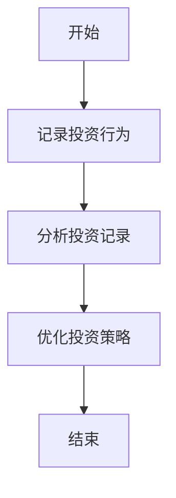
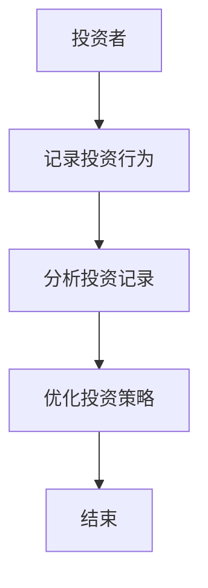
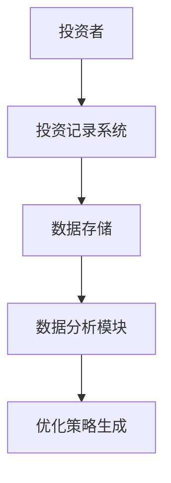
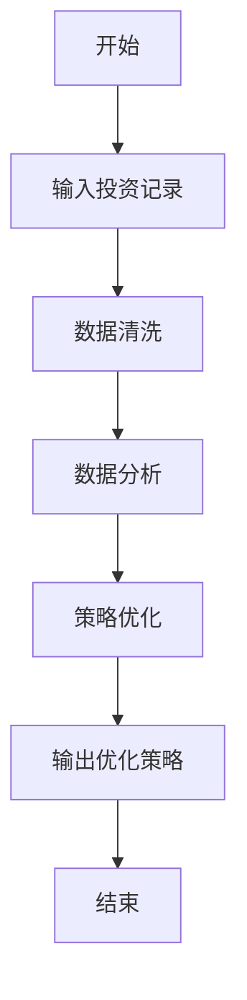

                 


# 彼得林奇的"跟踪记录"投资法

> 关键词：彼得·林奇，跟踪记录，投资法，投资策略，股票分析，投资决策

> 摘要：本文系统地介绍并分析了彼得·林奇的“跟踪记录”投资法，从其核心概念、算法原理、系统架构到实际应用案例，层层展开，详细解读了这一投资方法的精髓。通过本文，读者将全面理解“跟踪记录”投资法的理论基础、数学模型、系统设计以及实际操作步骤，并通过代码实现和案例分析，掌握如何在实际投资中应用这一方法。

---

## 第一部分: 背景介绍

### 第1章: 背景介绍

#### 1.1 问题背景

##### 1.1.1 投资领域的核心问题
在金融投资领域，投资者面临的最大挑战之一是如何在不确定的市场中做出科学的投资决策。市场波动、信息不对称以及个体情绪都可能影响投资结果。传统的投资方法，如基本面分析和技 术分析，虽然提供了丰富的工具和框架，但仍然难以解决投资者在实际操作中面临的诸多问题，例如如何捕捉市场趋势、如何优化投资组合以及如何规避风险等。

##### 1.1.2 彼得·林奇投资法的背景
彼得·林奇（Peter Lynch）是美国著名的投资专家，曾任富达麦哲伦基金的经理。他在任职期间取得了卓越的投资业绩，平均年回报率超过29%。林奇的成功不仅在于他的投资能力，更在于他提出了一系列简单而有效的投资方法，其中之一就是“跟踪记录”投资法。这种方法的核心思想是通过持续记录和分析投资行为，发现市场中的潜在机会和风险。

##### 1.1.3 跟踪记录法的核心目标
跟踪记录法的核心目标是通过系统化地记录和分析投资行为，帮助投资者发现市场趋势，优化投资决策，并最终实现超额收益。这种方法强调的是“知行合一”，通过持续的记录和反思，将理论与实践相结合，从而提升投资能力。

#### 1.2 问题描述

##### 1.2.1 投资决策中的信息不对称
在股票市场中，信息不对称是普遍存在的问题。机构投资者通常拥有更多的信息和分析工具，而普通投资者则难以获取这些资源。这使得普通投资者在做出投资决策时处于劣势。

##### 1.2.2 股票市场的不确定性
股票市场的波动性使得投资决策充满不确定性。投资者需要在不确定的环境中做出决策，这对投资方法提出了更高的要求。

##### 1.2.3 跟踪记录法的适用场景
跟踪记录法适用于所有类型的投资者，尤其是那些希望通过系统化的方法来优化投资决策的投资者。这种方法特别适合那些缺乏足够的市场信息和分析工具的普通投资者。

#### 1.3 问题解决

##### 1.3.1 跟踪记录法的核心思路
跟踪记录法的核心思路是通过持续记录和分析投资行为，发现市场中的潜在机会和风险。具体来说，投资者需要记录每笔投资的买入和卖出时间、金额、原因以及结果，并通过分析这些记录发现投资中的规律和问题。

##### 1.3.2 跟踪记录法的实施步骤
1. **记录投资行为**：投资者需要记录每笔投资的详细信息，包括买入和卖出的时间、金额、原因以及结果。
2. **分析投资记录**：通过对投资记录的分析，发现投资中的规律和问题。
3. **优化投资策略**：根据分析结果，优化投资策略，调整投资组合。

##### 1.3.3 跟踪记录法的优缺点
**优点**：
- 系统化：通过持续记录和分析，帮助投资者建立系统化的投资方法。
- 个性化：投资者可以根据自己的投资风格和目标进行调整。
- 可操作性：方法简单易行，适合各种类型的投资者。

**缺点**：
- 时间成本：持续记录和分析需要投入大量时间。
- 依赖性：方法的有效性依赖于记录的完整性和准确性。

#### 1.4 边界与外延

##### 1.4.1 跟踪记录法的适用范围
跟踪记录法适用于所有类型的投资者，包括个人投资者和机构投资者。无论投资者的投资规模和目标如何，都可以通过这种方法优化投资决策。

##### 1.4.2 跟踪记录法的局限性
尽管跟踪记录法在优化投资决策方面具有显著优势，但它也有一些局限性。例如，该方法无法完全消除市场的不确定性，也无法预测市场的重大转折点。

##### 1.4.3 跟踪记录法与其他投资方法的对比
与其他投资方法相比，跟踪记录法的独特之处在于其强调持续记录和分析投资行为，而不是仅仅依赖于市场分析或技术指标。这种方法更注重投资者自身的投资行为，帮助其发现和改进投资中的问题。

#### 1.5 概念结构与核心要素

##### 1.5.1 跟踪记录法的核心要素
- **记录**：持续记录每笔投资的详细信息。
- **分析**：通过对记录的分析，发现投资中的规律和问题。
- **优化**：根据分析结果，优化投资策略。

##### 1.5.2 跟踪记录法的逻辑框架


##### 1.5.3 跟踪记录法的数学模型
通过记录和分析投资行为，我们可以建立一个数学模型来预测未来的投资结果。例如，我们可以使用线性回归模型来分析投资记录中的相关性。

$$ y = \beta_0 + \beta_1x + \epsilon $$

其中，$y$ 是投资收益，$x$ 是投资金额，$\beta_0$ 是截距，$\beta_1$ 是斜率，$\epsilon$ 是误差项。

---

## 第二部分: 跟踪记录法的核心概念与联系

### 第2章: 核心概念与联系

#### 2.1 跟踪记录法的原理

##### 2.1.1 跟踪记录的核心思路
跟踪记录法的核心思路是通过持续记录和分析投资行为，发现市场中的潜在机会和风险。这种方法强调的是“知行合一”，通过持续的记录和反思，将理论与实践相结合，从而提升投资能力。

##### 2.1.2 跟踪记录法的数学模型
通过记录和分析投资行为，我们可以建立一个数学模型来预测未来的投资结果。例如，我们可以使用线性回归模型来分析投资记录中的相关性。

$$ y = \beta_0 + \beta_1x + \epsilon $$

其中，$y$ 是投资收益，$x$ 是投资金额，$\beta_0$ 是截距，$\beta_1$ 是斜率，$\epsilon$ 是误差项。

##### 2.1.3 跟踪记录法的实施步骤
1. **记录投资行为**：投资者需要记录每笔投资的详细信息，包括买入和卖出的时间、金额、原因以及结果。
2. **分析投资记录**：通过对投资记录的分析，发现投资中的规律和问题。
3. **优化投资策略**：根据分析结果，优化投资策略，调整投资组合。

#### 2.2 核心概念的属性特征对比

##### 2.2.1 跟踪记录法的属性特征
- 系统性：通过持续记录和分析，帮助投资者建立系统化的投资方法。
- 个性化：投资者可以根据自己的投资风格和目标进行调整。
- 可操作性：方法简单易行，适合各种类型的投资者。

##### 2.2.2 其他投资方法的属性特征
- 基本面分析：依赖于公司财务数据和行业分析，需要丰富的行业知识。
- 技术分析：依赖于价格和成交量数据，需要掌握多种技术指标。
- 价值投资：依赖于对公司内在价值的评估，需要长期持股的耐心。

##### 2.2.3 跟踪记录法与其它方法的对比分析
与其他投资方法相比，跟踪记录法的独特之处在于其强调持续记录和分析投资行为，而不是仅仅依赖于市场分析或技术指标。这种方法更注重投资者自身的投资行为，帮助其发现和改进投资中的问题。

#### 2.3 ER实体关系图架构

##### 2.3.1 跟踪记录法的实体关系
```mermaid
erDiagram
    investor {
        id : integer
        name : string
        investment_record : string
    }
    investment_record {
        id : integer
        investor_id : integer
        buy_time : date
        buy_price : float
        sell_time : date
        sell_price : float
        reason : string
        result : string
    }
    investment_analysis {
        id : integer
        investment_record_id : integer
        analysis_result : string
        optimization_strategy : string
    }
```

##### 2.3.2 跟踪记录法的流程图


##### 2.3.3 跟踪记录法的系统架构


---

## 第三部分: 跟踪记录法的算法原理讲解

### 第3章: 算法原理

#### 3.1 跟踪记录法的算法流程

##### 3.1.1 算法输入
- 投资者的历史投资记录，包括买入和卖出的时间、价格、原因和结果。

##### 3.1.2 算法处理
1. **数据清洗**：对投资记录进行清洗，去除无效数据。
2. **数据分析**：通过对投资记录的分析，发现投资中的规律和问题。
3. **策略优化**：根据分析结果，优化投资策略，调整投资组合。

##### 3.1.3 算法输出
- 优化后的投资策略。
- 投资组合的调整建议。

#### 3.2 算法原理的数学模型

##### 3.2.1 数学模型的定义
通过记录和分析投资行为，我们可以建立一个数学模型来预测未来的投资结果。例如，我们可以使用线性回归模型来分析投资记录中的相关性。

$$ y = \beta_0 + \beta_1x + \epsilon $$

其中，$y$ 是投资收益，$x$ 是投资金额，$\beta_0$ 是截距，$\beta_1$ 是斜率，$\epsilon$ 是误差项。

##### 3.2.2 数学模型的公式推导
通过最小二乘法，我们可以估计出$\beta_0$和$\beta_1$的值。

$$ \hat{\beta}_1 = \frac{\sum_{i=1}^n (x_i - \bar{x})(y_i - \bar{y})}{\sum_{i=1}^n (x_i - \bar{x})^2} $$

$$ \hat{\beta}_0 = \bar{y} - \hat{\beta}_1 \bar{x} $$

##### 3.2.3 数学模型的实现代码
```python
import numpy as np

def linear_regression(x, y):
    x_mean = np.mean(x)
    y_mean = np.mean(y)
    numerator = np.sum((x - x_mean) * (y - y_mean))
    denominator = np.sum((x - x_mean) ** 2)
    beta_1 = numerator / denominator
    beta_0 = y_mean - beta_1 * x_mean
    return beta_0, beta_1

x = np.array([1, 2, 3, 4, 5])
y = np.array([2, 3, 5, 6, 8])
beta_0, beta_1 = linear_regression(x, y)
print(f"beta_0 = {beta_0}, beta_1 = {beta_1}")
```

#### 3.3 算法流程图

##### 3.3.1 算法流程图的绘制


##### 3.3.2 算法流程图的解读
1. **开始**：投资者需要输入其历史投资记录。
2. **数据清洗**：对投资记录进行清洗，去除无效数据。
3. **数据分析**：通过对投资记录的分析，发现投资中的规律和问题。
4. **策略优化**：根据分析结果，优化投资策略，调整投资组合。
5. **输出优化策略**：输出优化后的投资策略。
6. **结束**：完成投资优化。

##### 3.3.3 算法流程图的优化
通过持续的记录和分析，投资者可以不断优化其投资策略，从而提高投资收益。

---

## 第四部分: 跟踪记录法的系统分析与架构设计

### 第4章: 系统分析与架构设计

#### 4.1 问题场景介绍

##### 4.1.1 投资决策
投资者需要通过持续记录和分析投资行为，优化其投资策略。

---

## 作者：AI天才研究院/AI Genius Institute & 禅与计算机程序设计艺术 /Zen And The Art of Computer Programming

