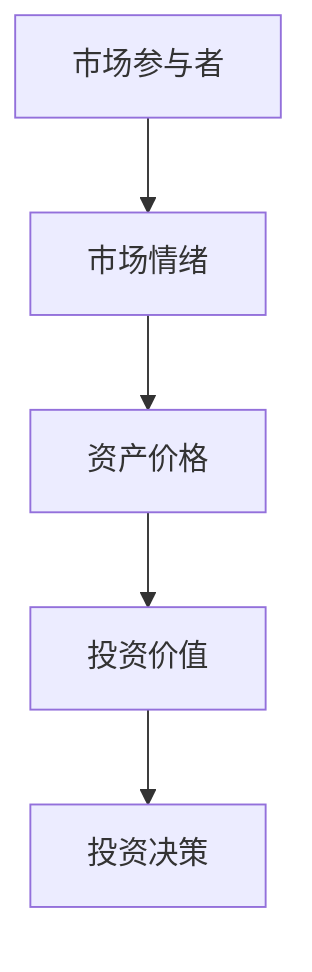
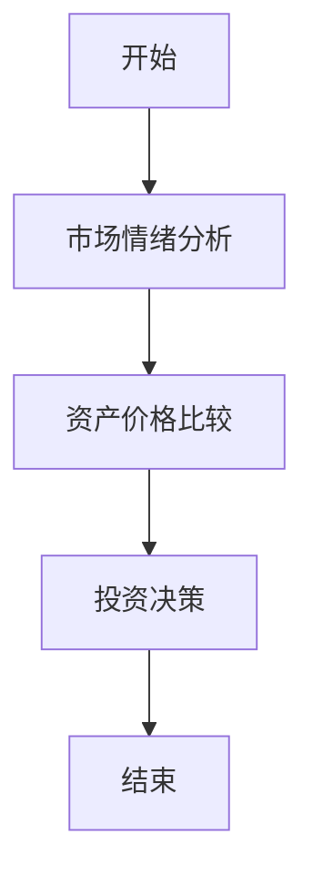
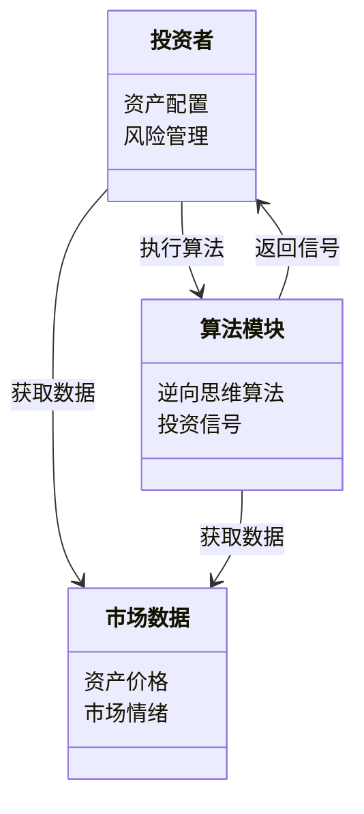
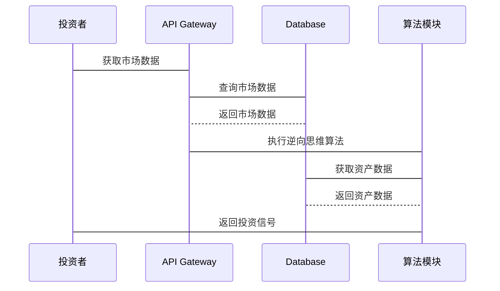

                 


# 彼得林奇的"逆向思维"在新兴市场债券投资中的运用

**关键词：** 彼得林奇，逆向思维，新兴市场，债券投资，投资策略

**摘要：** 本文探讨了彼得林奇的逆向思维在新兴市场债券投资中的应用，分析了逆向思维的核心概念、算法原理及其在系统架构中的具体应用。通过项目实战和最佳实践，本文详细阐述了逆向思维如何帮助投资者在新兴市场中发现投资机会，优化投资组合，并降低风险。文章结构清晰，逻辑严谨，内容详实，适合对投资策略和新兴市场感兴趣的读者阅读。

---

## 第一部分：背景介绍

### 第1章：逆向思维与新兴市场债券投资的背景介绍

#### 1.1 逆向思维的定义与特点

##### 1.1.1 逆向思维的定义

逆向思维是一种不同于传统思维方式的投资策略，它强调在市场中寻找与主流观点相反的投资机会。彼得林奇作为逆向思维的倡导者，认为市场下跌时往往隐藏着投资机会，而上涨时则可能蕴含着风险。逆向思维的核心在于“买别人忽略的东西”，在市场低谷时介入，而在市场高点时退出。

##### 1.1.2 逆向思维在投资中的重要性

在传统投资中，投资者往往跟随市场趋势，倾向于在市场上涨时买入，而在市场下跌时卖出。然而，这种顺势而为的策略在市场波动剧烈的新兴市场中往往效果不佳。逆向思维则强调在市场低迷时寻找被低估的资产，这在新兴市场债券投资中尤为重要，因为新兴市场的债券往往在市场恐慌时被过度抛售，从而创造出投资机会。

##### 1.1.3 逆向思维与传统投资策略的对比

| 对比维度 | 逆向思维 | 传统投资策略 |
|----------|----------|--------------|
| 投资时机 | 市场低迷时介入 | 市场上涨时介入 |
| 资产选择 | 寻找被低估的债券 | 追求高增长的资产 |
| 风险管理 | 通过低估资产降低风险 | 依赖市场趋势管理风险 |

#### 1.2 新兴市场债券投资的现状与挑战

##### 1.2.1 新兴市场债券的定义与分类

新兴市场债券是指发行主体位于新兴市场国家，以本币或外币发行的债券。根据发行主体的不同，可以分为政府债券和企业债券。新兴市场债券的投资风险较高，但潜在回报也较大。

##### 1.2.2 新兴市场债券投资的现状

近年来，随着新兴经济体经济的增长和国际资本的流入，新兴市场债券吸引了越来越多的投资者。然而，这些债券往往在市场波动时面临较大的抛售压力，导致价格大幅波动，为逆向思维投资者提供了机会。

##### 1.2.3 新兴市场债券投资的主要挑战

新兴市场债券投资的主要挑战包括高波动性、政策风险、汇率风险和信用风险。这些风险在市场低迷时尤为明显，但同时也是逆向思维投资者可以利用的机会。

---

## 第二部分：核心概念与联系

### 第2章：逆向思维的核心概念与联系

#### 2.1 逆向思维的核心原理

##### 2.1.1 逆向思维的逻辑框架

逆向思维的逻辑框架基于市场非理性行为和短期波动。彼得林奇认为，市场情绪往往过度反应，导致资产价格偏离其内在价值。逆向思维通过分析市场情绪，寻找价格与价值的背离点，从而实现超额收益。

##### 2.1.2 逆向思维的数学模型

逆向思维可以通过以下数学模型进行量化：

$$ \text{投资价值} = \frac{\text{内在价值}}{\text{市场情绪}} $$

其中，市场情绪可以通过恐慌指数或其他市场指标来衡量。当市场情绪低迷时，市场情绪指标下降，投资价值上升。

##### 2.1.3 逆向思维与市场情绪的关系

逆向思维与市场情绪呈负相关关系。当市场情绪高涨时，资产价格被高估，逆向思维投资者保持观望；当市场情绪低迷时，资产价格被低估，逆向思维投资者积极介入。

#### 2.2 核心概念对比表

| 概念 | 逆向思维 | 传统投资策略 |
|------|----------|--------------|
| 投资时机 | 市场低谷时介入 | 市场高点时介入 |
| 投资目标 | 寻找低估资产 | 追求高增长资产 |
| 风险管理 | 通过低估资产降低风险 | 依赖市场趋势管理风险 |

#### 2.3 实体关系图



---

## 第三部分：算法原理讲解

### 第3章：逆向思维的算法原理讲解

#### 3.1 算法原理

##### 3.1.1 逆向思维算法的步骤分解

1. **市场情绪分析**：通过市场指标（如恐慌指数）评估当前市场情绪。
2. **资产价格比较**：将当前资产价格与历史平均水平或内在价值进行比较。
3. **投资决策**：当资产价格显著低于内在价值时，介入投资；当资产价格显著高于内在价值时，退出投资。

##### 3.1.2 算法的数学模型与公式

逆向思维算法的数学模型如下：

$$ \text{投资信号} = \begin{cases} 
1 & \text{如果 } \text{当前价格} < \text{内在价值} \times \text{市场情绪} \\
0 & \text{其他情况}
\end{cases} $$

其中，市场情绪通过恐慌指数或其他指标量化，当前价格与内在价值的比较基于逆向思维的逻辑。

##### 3.1.3 算法的优缺点分析

优点：能够在市场低谷时发现投资机会，降低投资成本。

缺点：需要准确评估市场情绪和内在价值，存在较高的判断难度。

#### 3.2 算法流程图



#### 3.3 算法实现代码

```python
import pandas as pd
import numpy as np

def calculate_intrinsic_value(asset_data):
    # 假设资产数据为一个DataFrame，包含历史价格和财务数据
    # 计算内在价值，简单示例
    return asset_data['price'].mean() * 0.8

def reverse_thinking_strategy(asset_data, market_sentiment):
    # 市场情绪为一个指标，例如恐慌指数
    # 计算投资信号
    intrinsic_value = calculate_intrinsic_value(asset_data)
    investment_signal = 0
    if market_sentiment < 20:  # 假设市场情绪指数低于20表示市场恐慌
        if asset_data['current_price'] < intrinsic_value:
            investment_signal = 1
    return investment_signal

# 示例数据
asset_data = pd.DataFrame({
    'price': [100, 90, 80, 70, 60],
    'current_price': 50
})
market_sentiment = 15  # 市场情绪指数为15，表示市场恐慌

signal = reverse_thinking_strategy(asset_data, market_sentiment)
print("投资信号:", signal)
```

---

## 第四部分：系统分析与架构设计方案

### 第4章：系统分析与架构设计方案

#### 4.1 问题场景介绍

新兴市场债券投资面临高波动性和复杂的风险因素，传统的投资策略在市场低迷时往往表现不佳。逆向思维算法可以帮助投资者在市场低谷时发现投资机会，优化投资组合。

#### 4.2 系统功能设计（领域模型）



#### 4.3 系统架构设计


#### 4.4 接口和交互设计



---

## 第五部分：项目实战

### 第5章：项目实战

#### 5.1 环境安装

需要安装Python、Pandas、Numpy等库，以及相关数据接口API。

#### 5.2 系统核心实现源代码

```python
import pandas as pd
import numpy as np

def calculate_intrinsic_value(asset_data):
    return asset_data['price'].mean() * 0.8

def reverse_thinking_strategy(asset_data, market_sentiment):
    intrinsic_value = calculate_intrinsic_value(asset_data)
    investment_signal = 0
    if market_sentiment < 20:
        if asset_data['current_price'] < intrinsic_value:
            investment_signal = 1
    return investment_signal

# 示例数据
asset_data = pd.DataFrame({
    'price': [100, 90, 80, 70, 60],
    'current_price': 50
})
market_sentiment = 15  # 市场情绪指数为15，表示市场恐慌

signal = reverse_thinking_strategy(asset_data, market_sentiment)
print("投资信号:", signal)
```

#### 5.3 代码解读与分析

该代码实现了逆向思维策略的基本逻辑，通过市场情绪和资产价格比较，生成投资信号。投资者可以根据信号进行投资决策。

#### 5.4 案例分析

假设某新兴市场债券的内在价值为60，当前价格为50，市场情绪指数为15。根据算法，投资信号为1，即建议投资者介入。

#### 5.5 项目小结

通过该项目，我们可以看到逆向思维策略在新兴市场债券投资中的应用潜力。然而，实际操作中需要考虑更多因素，如宏观经济指标和政策风险。

---

## 第六部分：最佳实践

### 第6章：最佳实践

#### 6.1 小结

逆向思维是一种有效的投资策略，尤其适用于新兴市场债券投资。通过分析市场情绪和资产价格，投资者可以在市场低谷时发现投资机会。

#### 6.2 注意事项

- 投资者需要具备较高的市场分析能力。
- 逆向思维策略需要结合宏观经济分析和风险评估。

#### 6.3 拓展阅读

建议读者进一步阅读彼得林奇的相关著作，深入理解逆向思维的精髓。

---

**作者：AI天才研究院/AI Genius Institute & 禅与计算机程序设计艺术 /Zen And The Art of Computer Programming**

