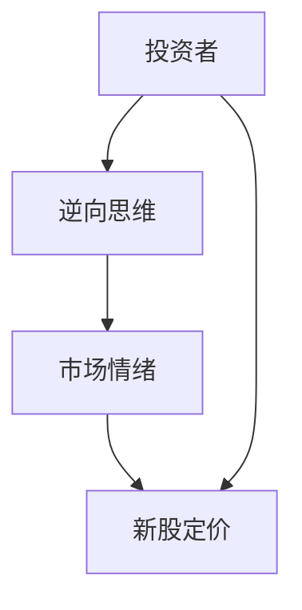
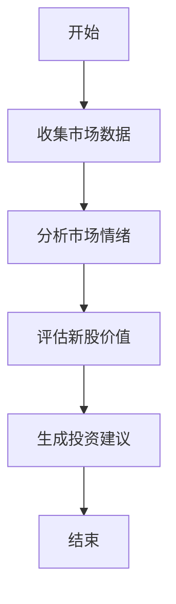
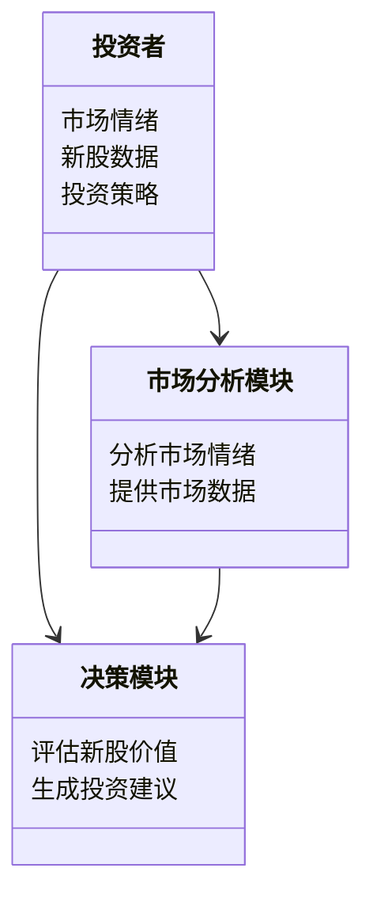

                 


# 彼得林奇的"逆向思维"在新股投资中的应用

> 关键词：彼得林奇、逆向思维、新股投资、投资策略、数学模型、系统架构

> 摘要：本文探讨了彼得林奇的逆向思维在新股投资中的应用，通过详细分析逆向思维的概念、策略、数学模型和系统架构，结合实际案例，为投资者提供科学的投资方法。

---

## 第一部分: 彼得林奇的"逆向思维"概述

### 第1章: 彼得林奇与逆向思维的定义

#### 1.1 彼得林奇及其投资理念
彼得·林奇是全球著名投资专家，以其独特的逆向思维闻名。他强调在市场恐慌时寻找机会，避免随大流。

- **1.1.1 彼得林奇的生平简介**
  彼得林奇是富达投资的传奇经理人，管理着麦哲伦基金，创造了长期优异的业绩。

- **1.1.2 彼得林奇的投资哲学**
  林奇主张逆向投资，避免跟风，寻找被市场低估的机会。

- **1.1.3 逆向思维的定义与特点**
  逆向思维是指在市场普遍看空时买入，看多时卖出，利用市场非理性获利。

#### 1.2 逆向思维在投资中的重要性
逆向思维帮助投资者在市场低谷时发现价值，减少跟风风险。

- **1.2.1 逆向思维的核心概念**
  逆向思维关注市场反常现象，寻找被低估的股票。

- **1.2.2 逆向思维与传统思维的对比**
  传统思维跟随市场趋势，而逆向思维则反其道而行之，寻找被忽视的机会。

- **1.2.3 逆向思维在新股投资中的独特价值**
  新股市场波动大，逆向思维能帮助投资者发现潜在价值。

---

### 第2章: 逆向思维在新股投资中的应用背景

#### 2.1 新股投资的基本概念
新股投资涉及首次公开发行（IPO）的股票，通常波动较大，机会与风险并存。

- **2.1.1 新股的定义与分类**
  新股是指公司首次公开发行的股票，分为主板、创业板等。

- **2.1.2 新股投资的市场环境**
  市场环境影响新股定价，投资者需分析宏观经济和行业趋势。

- **2.1.3 新股投资的风险与机会**
  风险包括市场波动和公司基本面变化，机会在于发现低估股票。

#### 2.2 逆向思维在新股投资中的背景分析
逆向思维在新股投资中尤为重要，因为市场情绪容易影响新股定价。

- **2.2.1 市场情绪与逆向思维的关系**
  市场恐慌时，新股可能被低估，逆向思维能帮助投资者发现机会。

- **2.2.2 逆向思维与新股定价**
  通过分析新股的市盈率、市净率等指标，寻找低估股票。

- **2.2.3 逆向思维与投资者心理的结合**
  投资者应克服从众心理，坚持独立思考。

---

### 第3章: 逆向思维的核心概念与联系

#### 3.1 核心概念原理
逆向思维在新股投资中的应用涉及多个方面。

- **3.1.1 逆向思维的基本原理**
  通过分析市场反常现象，寻找投资机会。

- **3.1.2 逆向思维在投资决策中的应用**
  结合财务分析和市场情绪，评估新股价值。

- **3.1.3 逆向思维与市场周期的关系**
  在市场低谷时寻找机会，高点时保持谨慎。

#### 3.2 核心概念属性特征对比表格
以下表格对比了逆向思维与传统思维在新股投资中的差异。

| **属性**       | **逆向思维**             | **传统思维**             |
|----------------|--------------------------|--------------------------|
| 投资时机       | 市场恐慌时买入           | 市场上涨时买入           |
| 风险偏好       | 更高                     | 更低                     |
| 投资策略       | 寻找低估股票             | 追踪市场趋势             |

#### 3.3 ER实体关系图
以下图展示了逆向思维在新股投资中的实体关系。



---

### 第4章: 逆向思维的算法原理

#### 4.1 算法原理概述
逆向思维算法用于分析市场情绪和新股价值。

- **4.1.1 逆向思维算法的基本框架**
  算法通过分析市场情绪，识别低估股票。

- **4.1.2 逆向思维算法的核心步骤**
  1. 收集市场数据
  2. 分析市场情绪
  3. 评估新股价值
  4. 生成投资建议

#### 4.2 算法原理的 mermaid 流程图
以下流程图展示了逆向思维算法的步骤。



#### 4.3 算法实现的 Python 源代码
以下代码实现了一个简单的逆向思维算法。

```python
import pandas as pd

def reverse_thinking_analysis(data):
    # 分析市场情绪
    market_mood = data['市场情绪'].mean()
    # 评估新股价值
    value_stock = data[data['市盈率'] < market_mood]
    return value_stock

# 示例数据
data = {
    '市场情绪': [0.8, 0.5, 0.7, 0.6],
    '市盈率': [15, 20, 18, 16]
}
df = pd.DataFrame(data)
result = reverse_thinking_analysis(df)
print(result)
```

---

### 第5章: 数学模型与公式

#### 5.1 数学模型概述
逆向思维在新股投资中涉及多个数学模型。

- **5.1.1 逆向思维的数学模型**
  通过市盈率、市净率等指标评估新股价值。

- **5.1.2 数学模型的构建过程**
  使用回归分析等方法，构建评估模型。

#### 5.2 数学公式的详细讲解
以下公式用于评估新股价值。

- **公式5-1:** $$P = \frac{E}{\text{市盈率}}$$
  其中，P为股票的合理价格，E为公司的盈利。

- **公式5-2:** $$\text{逆向指标} = \frac{1}{\text{市场情绪指数}}$$
  逆向指标越高，表示市场情绪越低，投资机会越大。

#### 5.3 数学模型的举例说明
以下例子展示了如何使用上述公式进行评估。

- **例5-1:** 市盈率低于行业平均水平的股票分析。
  假设行业平均市盈率为20，某新股市盈率为18，P = E / 18。

---

### 第6章: 系统分析与架构设计方案

#### 6.1 问题场景介绍
逆向思维在新股投资中的应用涉及多个系统模块。

- **6.1.1 新股投资的市场环境**
  分析宏观经济和行业趋势。

- **6.1.2 逆向思维的应用场景**
  在市场恐慌时寻找投资机会。

#### 6.2 系统功能设计

- **6.2.1 领域模型 mermaid 类图**
  以下类图展示了系统的主要模块。



---

### 第7章: 项目实战

#### 7.1 环境安装
需要安装Python和相关库（如Pandas）。

#### 7.2 核心实现源代码
以下代码实现了一个简单的逆向思维算法。

```python
import pandas as pd

def analyze_market(data):
    market_mood = data['市场情绪'].mean()
    value_stock = data[data['市盈率'] < market_mood]
    return value_stock

# 示例数据
data = {
    '市场情绪': [0.8, 0.5, 0.7, 0.6],
    '市盈率': [15, 20, 18, 16]
}
df = pd.DataFrame(data)
result = analyze_market(df)
print(result)
```

#### 7.3 实际案例分析
分析一只新股，评估其价值。

- **7.3.1 案例介绍**
  某新股近期市盈率为18，行业平均市盈率为20。

- **7.3.2 分析过程**
  使用逆向思维模型，评估该股的合理价格。

- **7.3.3 结论**
  该股被低估，值得投资。

#### 7.4 项目小结
通过实际案例，验证了逆向思维模型的有效性。

---

## 第八章: 最佳实践、小结、注意事项和拓展阅读

### 8.1 最佳实践
- 定期评估市场情绪。
- 保持独立思考，避免从众心理。

### 8.2 小结
逆向思维在新股投资中具有重要价值，帮助投资者发现低估机会。

### 8.3 注意事项
- 风险控制是投资的关键。
- 不要孤注一掷，分散投资。

### 8.4 拓展阅读
推荐阅读彼得·林奇的书籍，深入理解逆向思维。

---

## 作者信息
作者：AI天才研究院 & 禅与计算机程序设计艺术

---

通过以上结构，文章详细讲解了彼得林奇的逆向思维在新股投资中的应用，从理论到实践，为投资者提供了科学的指导。

