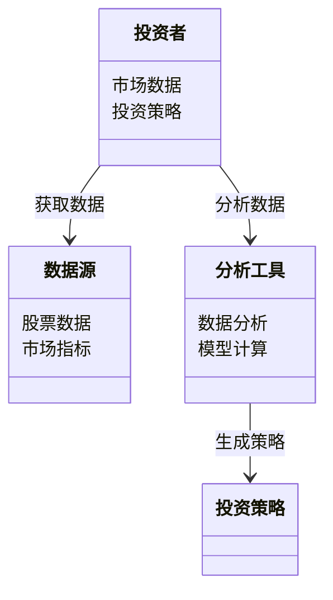

                 


# 彼得林奇的"逆向思维"在牛熊市的应用

## 关键词：逆向思维, 投资策略, 彼得林奇, 牛市, 熊市, 投资系统, 系统设计

## 摘要：本文探讨了彼得·林奇的逆向思维在股票投资中的应用，特别是在牛熊市中的具体策略。通过分析逆向思维的定义、特点及与其他投资策略的区别，结合市场周期理论和量化模型，展示了如何在不同市场环境下应用逆向思维进行投资决策。文章还通过具体案例分析，详细讲解了逆向思维在实际投资中的应用，并提出了系统的架构设计和数学模型，帮助投资者更好地理解和应用逆向思维。

---

## 第一部分：引言

### 1.1 彼得·林奇及其投资理念

#### 1.1.1 彼得·林奇的背景与成就
彼得·林奇（Peter Lynch）是美国著名的职业基金经理，被誉为“共同基金之王”。他在富达投资管理公司管理麦哲伦基金期间，取得了卓越的投资业绩，年均回报率超过29%，并连续13年排名第一。林奇的成功部分归功于他独特的投资理念和逆向思维的应用。

#### 1.1.2 逆向思维在投资中的重要性
逆向思维是指在市场情绪与主流观点相反时，寻找投资机会。在牛市中，市场情绪高涨，投资者往往忽视风险；而在熊市中，市场情绪低落，优质资产被低估。逆向思维帮助投资者在市场底部买入，顶部卖出，从而获得超额收益。

#### 1.1.3 本书的目的与结构
本文旨在通过分析彼得·林奇的逆向思维，探讨其在牛熊市中的应用策略。文章结构包括引言、核心概念、理论分析、系统设计、项目实战和总结等部分，旨在为投资者提供系统化的投资方法。

---

## 第二部分：逆向思维的核心概念

### 2.1 逆向思维的定义与特点

#### 2.1.1 逆向思维的定义
逆向思维是一种与市场情绪相反的投资策略。当市场乐观时，寻找被高估的资产；当市场悲观时，寻找被低估的资产。

#### 2.1.2 逆向思维与正向思维的对比
| 对比维度 | 正向思维 | 逆向思维 |
|----------|----------|----------|
| 市场情绪 | 追随市场情绪 | 反向于市场情绪 |
| 投资时机 | 市场繁荣时投资 | 市场低迷时投资 |
| 风险管理 | 风险意识较弱 | 风险意识较强 |

#### 2.1.3 逆向思维在投资中的优势
逆向思维的优势在于能够捕捉市场错误定价的机会，从而在长期获得超额收益。尤其是在熊市中，逆向思维能够帮助投资者在市场底部买入优质资产，避免在顶部被套牢。

### 2.2 逆向思维与牛熊市的关系

#### 2.2.1 牛市与熊市的定义与特征
- **牛市**：市场情绪高涨，投资者信心充足，股价普遍上涨。
- **熊市**：市场情绪低落，投资者信心不足，股价普遍下跌。

#### 2.2.2 逆向思维在牛市中的应用
在牛市中，市场情绪过于乐观，投资者可能忽视潜在风险。逆向思维提醒投资者在市场顶部保持谨慎，寻找被高估的资产并逐步卖出。

#### 2.2.3 逆向思维在熊市中的应用
在熊市中，市场情绪低落，优质资产往往被低估。逆向思维指导投资者在市场底部买入，抓住反弹机会。

---

## 第三部分：逆向思维的理论基础

### 3.1 投资组合理论

#### 3.1.1 马科维茨的有效前沿理论
马科维茨的有效前沿理论指出，最优投资组合应平衡风险与收益。逆向思维通过在熊市中增加优质资产权重，优化投资组合的风险调整后收益。

#### 3.1.2 如何应用逆向思维优化投资组合
- 在牛市中，降低高估资产的权重。
- 在熊市中，增加低估资产的权重。

#### 3.1.3 投资组合的风险与收益平衡
逆向思维通过在不同市场环境下调整资产配置，平衡投资组合的风险与收益，追求长期超额收益。

### 3.2 市场周期理论

#### 3.2.1 市场周期的四个阶段
- **复苏期**：市场从底部开始复苏。
- **上升期**：市场逐步上涨，投资者信心恢复。
- **成熟期**：市场达到顶峰，投资者过于乐观。
- **衰退期**：市场开始下跌，投资者信心崩溃。

#### 3.2.2 逆向思维在市场周期中的应用
- **复苏期**：逐步增加投资。
- **成熟期**：减少投资，保持谨慎。
- **衰退期**：积极买入，抓住低估机会。

---

## 第四部分：逆向思维的算法原理

### 4.1 逆向思维的量化模型

#### 4.1.1 市盈率（P/E）分析
市盈率是衡量股票估值的重要指标。当市盈率低于历史平均水平时，股票可能被低估。

#### 4.1.2 市净率（P/B）分析
市净率是股价与每股净资产的比率。当市净率低于行业平均水平时，股票可能被低估。

#### 4.1.3 股息率分析
股息率是衡量股票收益能力的指标。当股息率高于行业平均水平时，股票可能具有投资价值。

### 4.2 逆向思维的数学模型

#### 4.2.1 市场情绪指标
市场情绪指标可以通过投资者情绪、成交量等指标综合评估。当市场情绪过热时，考虑逆向思维卖出；当市场情绪低迷时，考虑逆向思维买入。

#### 4.2.2 投资组合优化模型
通过马科维茨的有效前沿理论，构建逆向思维下的投资组合优化模型。目标函数为最大化预期收益，约束条件为风险可控。

---

## 第五部分：系统分析与架构设计

### 5.1 系统功能设计

#### 5.1.1 问题场景介绍
投资者需要在不同市场环境下，应用逆向思维进行投资决策。系统需要提供数据收集、分析、策略制定和执行功能。

#### 5.1.2 领域模型设计
Mermaid 类图：


#### 5.1.3 系统架构设计
Mermaid 架构图：
```mermaid
architecturalDiagram
    client --> server: HTTP 请求
    server --> database: 查询数据
    server --> analysis: 分析数据
    analysis --> server: 返回结果
    server --> client: 返回页面
```

---

## 第六部分：项目实战

### 6.1 环境安装

#### 6.1.1 Python 环境配置
安装 Python 和必要的库，如 pandas、numpy、matplotlib。

### 6.2 核心实现源代码

#### 6.2.1 数据获取与处理
```python
import pandas as pd
import numpy as np

# 获取股票数据
data = pd.read_csv('stock_data.csv')
data['市盈率'] = data['股价'] / data['每股收益']
data['市净率'] = data['股价'] / data['每股净资产']
```

#### 6.2.2 市场情绪分析
```python
def 市场情绪指标(data):
    市场情绪 = data['成交量'].rolling(20).mean() / data['成交量'].std()
    return 市场情绪
```

#### 6.2.3 投资策略制定
```python
def 逆向思维策略(data, 市场情绪):
    低估股票 = data[data['市盈率'] < data['市盈率'].mean()]
    return 低估股票
```

---

## 第七部分：总结

### 7.1 最佳实践 tips
- 保持耐心，避免追涨杀跌。
- 持续学习，更新投资知识。
- 结合技术分析和基本面分析，提高投资决策的准确性。

### 7.2 小结
彼得·林奇的逆向思维是一种有效的投资策略，尤其在牛熊市中表现突出。通过量化模型和系统设计，投资者可以更好地应用逆向思维，实现长期的超额收益。

### 7.3 注意事项
- 逆向思维需要结合市场环境灵活运用。
- 投资者需具备扎实的基本面分析能力。
- 风险管理是投资成功的关键。

### 7.4 拓展阅读
- 彼得·林奇的书籍：《彼得·林奇的成功投资》
- 投资理论书籍：《投资学》（书籍名称）

---

## 作者：AI天才研究院/AI Genius Institute & 禅与计算机程序设计艺术 /Zen And The Art of Computer Programming

---

本文通过详细分析彼得·林奇的逆向思维，结合理论与实践，为投资者提供了系统化的投资方法。希望读者能够通过本文，掌握逆向思维在牛熊市中的应用，从而在投资中获得更好的收益。

