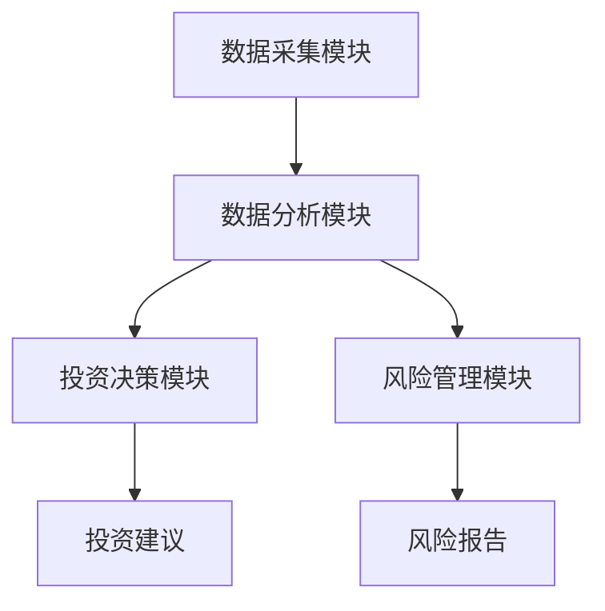
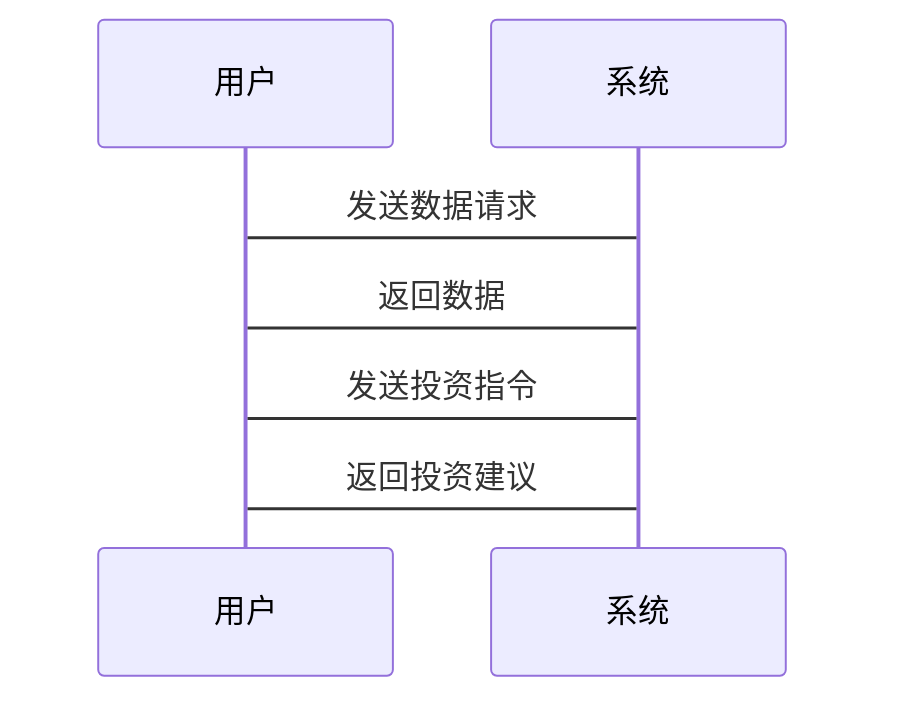

                 


# 彼得林奇的"逆向思维"投资技巧

> 关键词：逆向思维，投资技巧，彼得林奇，价值投资，风险管理

> 摘要：本文深入探讨了彼得林奇的逆向思维投资技巧，分析了其核心理念、选股标准、数学模型以及系统架构设计，并通过实际案例展示了如何在投资中应用这些技巧。文章从理论到实践，详细阐述了逆向思维在投资中的重要性及具体应用方法，帮助读者更好地理解和掌握这一投资策略。

---

## 第1章: 逆向思维投资概述

### 1.1 逆向思维在投资中的重要性

#### 1.1.1 投资中的常见误区
在投资领域，许多投资者容易陷入从众心理和市场情绪的干扰中。当市场热门时，大家一拥而上；当市场低迷时，又纷纷离场。这种行为往往导致追涨杀跌，错失长期收益。逆向思维提醒我们，要在市场冷清时寻找机会，在市场火爆时保持冷静。

#### 1.1.2 逆向思维的定义与特点
逆向思维是一种与传统思维相反的思考方式。在投资中，逆向思维意味着寻找市场低估的机会，避开市场过热的领域。其特点包括：
- **反周期性**：在市场低谷时寻找价值。
- **反直觉性**：避免跟随市场情绪。
- **长期视角**：关注长期价值而非短期波动。

#### 1.1.3 逆向思维在投资中的优势
逆向思维可以帮助投资者在市场底部买入优质资产，在市场顶部避免重大损失。通过逆向思维，投资者可以发现被市场忽视的投资机会，获得超额收益。

---

### 1.2 彼得林奇的投资理念

#### 1.2.1 彼得林奇的生平简介
彼得·林奇（Peter Lynch）是美国著名的投资专家，曾任富达麦哲伦基金的经理，以其卓越的投资业绩闻名。他主张长期投资，注重基本面分析，强调对公司的深入了解。

#### 1.2.2 彼得林奇的投资哲学
林奇认为，成功的投资需要耐心和对市场的深刻理解。他强调：
- **价值投资**：寻找被市场低估的公司。
- **分散投资**：避免过度集中。
- **长期持有**：坚持持有优质资产。

#### 1.2.3 彼得林奇的成功案例
林奇在麦哲伦基金的管理期间，基金规模从1800万美元增长到140亿美元，年均回报率超过29%。他的成功部分归功于对市场低估机会的精准捕捉。

---

### 1.3 逆向思维投资的核心概念

#### 1.3.1 逆向思维的基本原理
逆向思维的核心在于“反向思考”。在投资中，这意味着：
- 当大多数投资者看空市场时，寻找买入机会。
- 当大多数投资者看多市场时，保持谨慎。

#### 1.3.2 投资中的逆向思维策略
逆向思维策略包括：
- **低估策略**：寻找市盈率、市净率低于行业平均水平的公司。
- **恐慌策略**：在市场恐慌时买入优质资产。
- **耐心策略**：等待市场调整到位后再行动。

#### 1.3.3 逆向思维与价值投资的关系
逆向思维是价值投资的重要组成部分。价值投资者通过分析公司的基本面，寻找市场低估的股票。逆向思维帮助投资者在市场低迷时发现这些低估机会。

---

### 1.4 逆向思维投资的边界与外延

#### 1.4.1 逆向思维的适用范围
逆向思维适用于市场周期性波动较大的情况，尤其在市场底部或顶部时效果显著。然而，它并不适用于所有市场环境，需要结合市场实际情况灵活运用。

#### 1.4.2 逆向思维的局限性
逆向思维的局限性包括：
- **市场不可预测性**：市场波动难以完全预测。
- **短期波动影响**：短期内市场情绪可能影响股价，但长期来看，基本面更重要。
- **信息不对称**：逆向思维需要对市场有深刻理解，这需要大量研究和经验积累。

#### 1.4.3 逆向思维与其他投资策略的对比
与趋势投资、技术分析等策略相比，逆向思维更注重长期价值和市场周期。它适合那些愿意长期持有的投资者，而趋势投资则更适合短期交易者。

---

## 第2章: 彼得林奇的选股标准

### 2.1 公司基本面分析

#### 2.1.1 财务报表分析
财务报表是选股的核心依据。需要重点关注以下指标：
- **收入与利润**：公司收入是否稳定增长，利润是否健康。
- **资产负债表**：公司是否有过度负债，资产是否优质。
- **现金流**：公司现金流是否健康，能否支持持续经营。

#### 2.1.2 行业分析与竞争地位
选择具有强大竞争优势的行业和公司。例如，行业龙头通常具有更强的议价能力和市场影响力。

#### 2.1.3 管理团队评估
优秀的管理团队是公司长期发展的关键。需要考察管理团队的经验、诚信和战略眼光。

---

### 2.2 市场情绪与估值分析

#### 2.2.1 市场情绪的判断方法
通过新闻、社交媒体和市场指标（如恐慌指数）判断市场情绪。当市场情绪过于乐观时，可能是卖出机会；当市场情绪过于悲观时，可能是买入机会。

#### 2.2.2 估值指标的计算与应用
常用的估值指标包括：
- **市盈率（P/E）**：$$\text{市盈率} = \frac{\text{股价}}{\text{每股收益}}$$
- **市净率（P/B）**：$$\text{市净率} = \frac{\text{股价}}{\text{每股净资产}}$$
- **股息率**：$$\text{股息率} = \frac{\text{每股股息}}{\text{股价}} \times 100\%$$

#### 2.2.3 逆向投资的时机选择
逆向投资的最佳时机通常在市场底部或市场顶部。例如，当市盈率远低于行业平均水平时，可能是买入机会；当市盈率远高于行业平均水平时，可能是卖出机会。

---

### 2.3 风险控制与投资心态

#### 2.3.1 风险管理的基本原则
- **分散投资**：避免过度集中于某一行业或公司。
- **止损策略**：设定止损点，避免重大损失。
- **长期持有**：避免频繁交易，降低交易成本。

#### 2.3.2 投资心态的自我调节
投资者需要保持冷静，避免被市场情绪左右。在市场恐慌时保持理性，在市场狂热时保持克制。

#### 2.3.3 避免情绪化决策的方法
- **制定计划**：在市场波动时，按照既定计划行动。
- **定期复盘**：分析投资决策的正确性，总结经验教训。

---

## 第3章: 逆向思维投资的数学模型与公式

### 3.1 市盈率与市净率的计算

#### 3.1.1 市盈率公式
$$\text{市盈率} = \frac{\text{股价}}{\text{每股收益}}$$

#### 3.1.2 市净率公式
$$\text{市净率} = \frac{\text{股价}}{\text{每股净资产}}$$

---

### 3.2 投资组合优化模型

#### 3.2.1 马科维茨投资组合理论
马科维茨的现代投资组合理论（MPT）通过优化资产配置，实现风险与收益的最佳平衡。公式如下：
$$\text{最优组合} = \argmin_w \left( \sigma^2 \right) \text{ subject to } \mathbf{w}^T \mathbf{1} = 1$$

#### 3.2.2 投资组合的风险与收益平衡
通过调整资产配置比例，实现风险与收益的平衡。例如，增加高风险资产的比例可以提高预期收益，但也增加了风险。

---

### 3.3 股票估值模型

#### 3.3.1 现金流折现模型
现金流折现模型（DCF）用于评估公司的真实价值。公式如下：
$$\text{企业价值} = \sum_{t=1}^{n} \frac{\text{自由现金流}}{(1 + r)^t} + \frac{\text{终值}}{(1 + r)^n}$$
其中，$$r$$为折现率。

#### 3.3.2 市盈率与市净率的比较分析
通过比较市盈率和市净率，可以更全面地评估公司的价值。例如，市盈率适用于利润稳定的公司，市净率适用于资产密集型行业。

---

## 第4章: 系统分析与架构设计

### 4.1 投资系统的构建

#### 4.1.1 数据收集与处理
- **数据源**：包括公司财务报表、行业数据、市场情绪指标等。
- **数据处理**：清洗、转换和分析数据，提取有用的信息。

#### 4.1.2 分析工具的选择与应用
- **工具选择**：根据需求选择合适的分析工具，如Excel、Python、R等。
- **工具应用**：利用工具进行数据可视化、统计分析和建模。

#### 4.1.3 投资决策流程的设计
- **流程设计**：从数据收集到决策输出，设计完整的投资决策流程。
- **流程优化**：通过自动化和智能化手段，提高决策效率。

---

### 4.2 系统架构设计

#### 4.2.1 系统功能模块划分
- **数据采集模块**：负责收集市场数据。
- **数据分析模块**：进行数据清洗和分析。
- **投资决策模块**：基于分析结果生成投资建议。
- **风险管理模块**：监控和管理投资风险。

#### 4.2.2 系统架构的Mermaid图



---

### 4.3 系统接口与交互设计

#### 4.3.1 系统接口的定义
- **输入接口**：接收市场数据和用户指令。
- **输出接口**：提供投资建议和风险报告。

#### 4.3.2 系统交互的Mermaid序列图



---

## 第5章: 项目实战

### 5.1 环境安装与数据准备

#### 5.1.1 投资分析工具的安装
- **工具安装**：安装Excel、Python等分析工具。
- **环境配置**：配置开发环境，如安装Pandas、Matplotlib等库。

#### 5.1.2 数据源的获取与处理
- **数据获取**：从金融数据库获取历史数据。
- **数据处理**：清洗数据，提取有用信息。

---

### 5.2 核心代码实现

#### 5.2.1 财务指标计算代码

```python
import pandas as pd

# 假设df为包含财务数据的DataFrame
def calculate_profitability(df):
    df['市盈率'] = df['股价'] / df['每股收益']
    df['市净率'] = df['股价'] / df['每股净资产']
    df['股息率'] = df['每股股息'] / df['股价'] * 100
    return df

data = calculate_profitability(df)
print(data)
```

---

#### 5.2.2 估值模型的实现代码

```python
def discounted_cash_flow(value, cash_flows, discount_rate):
    n = len(cash_flows)
    terminal_value = cash_flows[-1] * (1 + discount_rate) ** n
    present_value = 0
    for t in range(n):
        present_value += cash_flows[t] / (1 + discount_rate) ** t
    total_value = present_value + terminal_value / (1 + discount_rate) ** n
    return total_value

# 示例
cash_flows = [100, 150, 200]
discount_rate = 0.08
value = discounted_cash_flow(0, cash_flows, discount_rate)
print(value)
```

---

### 5.3 案例分析与解读

#### 5.3.1 彼得林奇的经典投资案例
林奇在管理麦哲伦基金期间，成功投资了多家被低估的公司。例如，他曾在市场低迷时投资于某家制药公司，最终获得了丰厚的回报。

#### 5.3.2 案例分析与经验总结
通过分析具体案例，总结逆向思维的应用方法和成功经验。例如，在市场恐慌时，如何识别真正被低估的公司，如何制定投资计划等。

---

## 第6章: 总结与展望

### 6.1 逆向思维投资的总结
逆向思维是一种有效的投资策略，尤其适合长期投资者。通过逆向思维，投资者可以在市场底部买入优质资产，在市场顶部避免风险。

### 6.2 最佳实践 tips
- **保持冷静**：避免被市场情绪左右。
- **深入研究**：对投资标的进行充分了解。
- **长期持有**：坚持持有优质资产。

### 6.3 注意事项
- **市场风险**：逆向思维并不能完全避免市场风险。
- **信息获取**：需要及时获取市场信息，保持对市场的敏感性。
- **个人能力**：逆向思维需要投资者具备一定的分析能力和经验。

### 6.4 拓展阅读
推荐相关书籍和资源，帮助读者进一步学习逆向思维投资技巧。

---

## 作者：AI天才研究院/AI Genius Institute & 禅与计算机程序设计艺术 /Zen And The Art of Computer Programming

