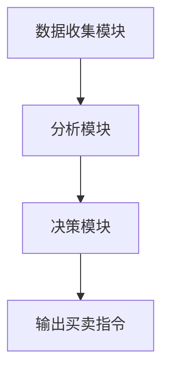

                 


# 彼得林奇的"逆向投资"在市场恐慌时期的操作

## 关键词：逆向投资，彼得林奇，市场恐慌，投资策略，恐慌指数，基本面分析，风险管理

## 摘要：逆向投资是一种在市场恐慌时期买入，在市场疯狂时期卖出的投资策略。本文将详细探讨彼得林奇的逆向投资理念，分析恐慌时期市场的特点，提供具体的选股标准和风险管理策略，并通过数学模型和系统架构设计，展示如何在恐慌时期有效实施逆向投资。文章还结合实际案例，展示逆向投资的实战应用。

---

## 第一部分: 逆向投资概述

### 第1章: 逆向投资的基本概念

#### 1.1 逆向投资的定义与核心理念
逆向投资是一种反向思维的投资策略，强调在市场恐慌时买入，在市场狂热时卖出。其核心理念是利用市场的非理性波动，寻找被市场低估的投资标的。

- **逆向投资的定义**：逆向投资是指在市场情绪低落、投资者恐慌时，买入被市场错杀的优质资产；在市场情绪高涨、投资者疯狂时，卖出高估的资产。
- **逆向投资的核心理念**：
  1. 市场情绪的非理性：市场恐慌时，理性投资者可以通过逆向操作获利。
  2. 价值投资的延伸：逆向投资强调基本面分析，寻找价格低于内在价值的资产。
  3. 长期视角：逆向投资要求投资者具备长期持有的耐心，等待市场回归理性。

#### 1.2 彼得林奇的投资风格
彼得林奇是逆向投资的代表人物，他强调对企业基本面的深入研究和长期持有的投资策略。

- **彼得林奇的个人投资理念**：
  1. 长期投资：彼得林奇相信长期持有优质资产能够带来稳定收益。
  2. 基本面分析：他注重对企业财务状况、管理团队和行业地位的分析。
  3. 逆向思维：在市场恐慌时买入，市场狂热时卖出。

- **成功投资案例**：
  - 例如，他在2008年金融危机期间，逆势买入优质股票，获得了丰厚的回报。
  - 他的投资理念在《彼得林奇的投资之道》一书中得到了详细阐述。

- **对市场的独特见解**：
  彼得林奇认为，市场的短期波动是机会的来源，而长期趋势取决于企业的基本面。

---

### 第2章: 市场恐慌时期的定义与特征

#### 2.1 市场恐慌的定义
市场恐慌是指投资者因情绪影响，产生非理性交易行为，导致市场价格剧烈波动。

- **多维定义**：
  - 市场恐慌是投资者情绪的极端表现，通常由突发事件或市场下跌引发。
  - 市场恐慌可能导致资产价格的过度波动，偏离其内在价值。

- **量化指标**：
  - 使用恐慌指数（如VIX指数）来衡量市场的波动性和投资者情绪。
  - 市场恐慌指数的计算公式为：
    $$ \text{VIX指数} = \sqrt{ \sum_{t=1}^{n} (r_t - \mu)^2 \cdot w_t } $$
    其中，\( r_t \) 是收益率，\( \mu \) 是均值，\( w_t \) 是权重。

- **周期性分析**：
  市场恐慌具有周期性，通常每隔几年出现一次，持续时间长短不一。

#### 2.2 投资者行为分析
在市场恐慌时期，投资者的行为往往表现出非理性特征。

- ** herd behavior**：
  投资者倾向于跟随市场趋势，导致价格的进一步下跌。
- **非理性决策**：
  投资者可能因恐慌而抛售资产，导致亏损扩大。
- **情绪影响**：
  恐慌情绪可能导致投资者忽视基本面，仅关注短期价格波动。

---

### 第3章: 逆向投资在市场恐慌时期的策略

#### 3.1 逆向投资的核心策略
逆向投资在市场恐慌时期的策略包括选股、估值和风险管理。

- **选股标准**：
  1. 选择基本面良好、财务健康的企业。
  2. 股价远低于内在价值。
  3. 行业地位稳固，具备竞争优势。

- **估值分析**：
  使用市盈率（P/E）、市净率（P/B）等指标判断股票是否被低估。

  公式：
  $$ \text{市盈率} = \frac{\text{股价}}{\text{每股收益}} $$
  $$ \text{市净率} = \frac{\text{股价}}{\text{每股净资产}} $$

- **风险控制**：
  设置止损点，避免过度亏损。

#### 3.2 彼得林奇的恐慌时期投资法则
彼得林奇在恐慌时期的投资法则包括：

- **价值发现**：
  寻找那些被市场忽视的优质资产。
- **长期持有**：
  抵制短期波动的干扰，坚持长期投资。
- **分散投资**：
  通过分散投资降低风险。

---

## 第二部分: 数学模型与算法原理

### 第4章: 逆向投资的数学模型与算法实现

#### 4.1 逆向投资的数学模型
逆向投资的数学模型包括市场情绪分析和股票估值模型。

- **市场情绪模型**：
  使用恐慌指数（VIX）量化市场情绪。

  $$ \text{VIX指数} = \sqrt{ \sum_{t=1}^{n} (r_t - \mu)^2 \cdot w_t } $$

- **股票估值模型**：
  通过市盈率和市净率判断股票是否被低估。

  $$ \text{估值比} = \frac{\text{当前股价}}{\text{内在价值}} $$

#### 4.2 算法实现
使用Python代码实现逆向投资的算法。

```python
import pandas as pd
import numpy as np

# 数据获取与预处理
data = pd.read_csv('stock_data.csv')
data['PE'] = data['股价'] / data['每股收益']
data['PB'] = data['股价'] / data['每股净资产']

# 计算恐慌指数
def calculate_vix(data):
    mu = np.mean(data['收益率'])
    var = np.array(data['收益率'] - mu)
    vix = np.sqrt(np.sum(var**2 * data['权重']) / len(data))
    return vix

vix = calculate_vix(data)
print("VIX指数:", vix)
```

---

## 第三部分: 系统架构设计

### 第5章: 逆向投资系统架构

#### 5.1 系统功能设计
逆向投资系统包括数据收集、分析和决策模块。

- **数据收集模块**：
  获取市场数据，如股价、收益率等。
- **分析模块**：
  计算恐慌指数和股票估值。
- **决策模块**：
  根据分析结果发出买卖指令。

#### 5.2 系统架构图


---

## 第四部分: 项目实战

### 第6章: 逆向投资实战分析

#### 6.1 环境安装
安装必要的Python库，如pandas、numpy等。

#### 6.2 核心代码实现
```python
import pandas as pd
import numpy as np

# 数据获取与预处理
data = pd.read_csv('stock_data.csv')
data['PE'] = data['股价'] / data['每股收益']
data['PB'] = data['股价'] / data['每股净资产']

# 计算恐慌指数
def calculate_vix(data):
    mu = np.mean(data['收益率'])
    var = np.array(data['收益率'] - mu)
    vix = np.sqrt(np.sum(var**2 * data['权重']) / len(data))
    return vix

vix = calculate_vix(data)
print("VIX指数:", vix)
```

#### 6.3 案例分析
以2020年新冠疫情为例，分析恐慌时期的逆向投资策略。

---

## 第五部分: 总结与展望

### 第7章: 总结与展望

#### 7.1 最佳实践
- 逆向投资需要深入的基本面分析和长期视角。
- 在恐慌时期，保持冷静，避免非理性决策。

#### 7.2 小结
逆向投资是一种有效的市场策略，尤其在市场恐慌时期，能够帮助投资者抓住机会，实现超额收益。

#### 7.3 注意事项
- 风险控制：设置止损点，避免过度亏损。
- 信息获取：及时获取市场信息，把握投资机会。
- 长期视角：坚持长期投资，避免短期波动干扰。

#### 7.4 拓展阅读
推荐阅读《彼得林奇的投资之道》和《价值投资：寻找伟大企业》。

---

## 作者：AI天才研究院 & 禅与计算机程序设计艺术

---

通过本文的详细分析，读者可以深入了解彼得林奇的逆向投资策略，掌握在市场恐慌时期的操作方法，并通过实际案例和代码实现，提升自己的投资能力。

