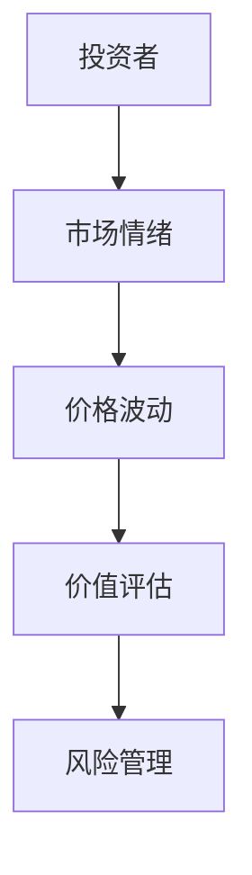
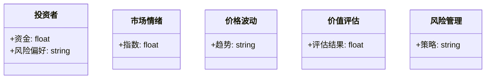

                 


# 彼得林奇的"逆向投资"成功案例分析

## 关键词
逆向投资、彼得林奇、市场情绪、价值评估、风险管理、投资策略

## 摘要
本文深入分析了彼得林奇的逆向投资策略，探讨其成功背后的理论基础、核心概念和实际应用。通过案例分析、算法原理、系统设计和项目实战，详细阐述了逆向投资的定义、背景、核心要素，以及如何通过数学模型和系统架构实现投资决策优化。本文旨在为读者提供一个全面理解逆向投资的框架，帮助他们在实际投资中应用这些策略。

## 目录

### 第1章：逆向投资的背景与核心概念

#### 1.1 逆向投资的定义与背景
- 1.1.1 逆向投资的起源与演变
- 1.1.2 逆向投资的核心理念
- 1.1.3 逆向投资在金融市场的地位

#### 1.2 彼得·林奇的背景介绍
- 1.2.1 彼得·林奇的生平简介
- 1.2.2 林奇的投资哲学与风格
- 1.2.3 林奇在逆向投资中的地位

#### 1.3 逆向投资与传统投资的区别
- 1.3.1 传统投资的定义与特点
- 1.3.2 逆向投资与传统投资的对比
- 1.3.3 逆向投资的优势与劣势

#### 1.4 逆向投资的核心要素
- 1.4.1 市场情绪分析
- 1.4.2 价值评估方法
- 1.4.3 风险管理策略

### 第2章：逆向投资的核心概念与联系

#### 2.1 逆向投资的原理与机制
- 2.1.1 市场情绪与价格波动的关系
- 2.1.2 逆向投资的逻辑基础
- 2.1.3 逆向投资的数学模型

#### 2.2 核心概念的联系
- 2.2.1 逆向投资与价值投资的对比
- 2.2.2 逆向投资与趋势投资的对比
- 2.2.3 逆向投资与套利策略的对比

#### 2.3 逆向投资的ER实体关系图


### 第3章：逆向投资的算法原理

#### 3.1 市场情绪分析算法
- 3.1.1 算法概述
- 3.1.2 算法步骤
- 3.1.3 算法实现的代码示例


#### 3.2 Python代码实现
```python
import numpy as np
import pandas as pd

def calculate_market_mood(sentiment_scores):
    return np.mean(sentiment_scores)

# 示例数据
sentiment_data = [0.8, 0.6, 0.7, 0.5, 0.9]
market_mood = calculate_market_mood(sentiment_data)
print(f"市场情绪指数为: {market_mood}")
```

#### 3.3 数学模型与公式
- 逆向投资的CAPM模型
  $$ E(R_i) = R_f + \beta_i (R_m - R_f) $$

### 第4章：逆向投资的系统架构设计

#### 4.1 问题场景介绍
- 投资者如何利用逆向投资策略进行决策

#### 4.2 系统功能设计


#### 4.3 系统架构设计


### 第5章：逆向投资的项目实战

#### 5.1 环境安装
- 安装必要的Python库：pandas, numpy, matplotlib

#### 5.2 核心代码实现
```python
import pandas as pd
import numpy as np

def calculate_market_mood(data):
    return np.mean(data)

# 示例数据
sentiment_data = [0.8, 0.6, 0.7, 0.5, 0.9]
market_mood = calculate_market_mood(sentiment_data)
print(f"市场情绪指数为: {market_mood}")
```

#### 5.3 案例分析与解读
- 案例背景：2008年金融危机期间的投资策略
- 数据分析与结果展示
- 投资决策的优化建议

#### 5.4 项目小结
- 项目成果
- 经验总结
- 改进建议

### 第6章：逆向投资的最佳实践

#### 6.1 小结
- 逆向投资的核心要点回顾

#### 6.2 注意事项
- 风险管理的重要性
- 市场情绪的波动性
- 长期投资的耐心

#### 6.3 拓展阅读
- 推荐书籍和资源
- 进一步学习的方向

## 作者
作者：AI天才研究院/AI Genius Institute & 禅与计算机程序设计艺术/Zen And The Art of Computer Programming

