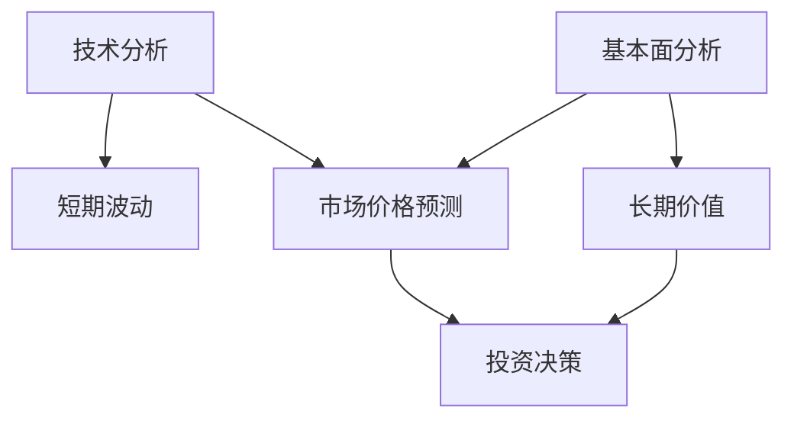
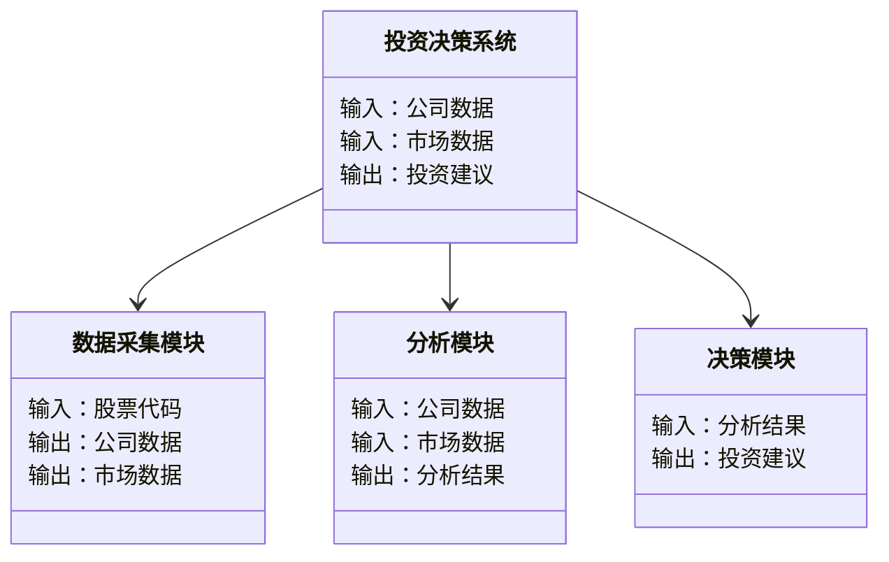

                 


# 彼得林奇的"长期价值"vs"短期波动"

> 关键词：彼得林奇，长期价值，短期波动，投资策略，价值投资，市场波动

> 摘要：本文探讨了彼得林奇的长期价值投资理念与短期市场波动之间的关系，分析了如何在投资决策中平衡长期价值与短期波动的影响。通过详细的技术分析和实际案例，本文为投资者提供了实用的策略和方法。

---

## 第一部分: 彼得林奇的"长期价值"与"短期波动"概述

### 第1章: 长期价值与短期波动的定义与关系

#### 1.1 长期价值的定义与特征
- **长期价值的定义**：长期价值是指公司在未来较长时期内创造收益和增长的潜力，关注的是公司的基本面、管理和行业地位等因素。
- **长期价值的核心特征**：
  - 稳定的收益增长
  - 强大的竞争优势
  - 可持续的商业模式
  - 良好的管理团队

#### 1.2 短期波动的定义与特征
- **短期波动的定义**：短期波动是指股票价格在短时间内由于市场情绪、新闻事件或技术因素引起的涨跌。
- **短期波动的核心特征**：
  - 受市场情绪影响大
  - 易受外部事件影响
  - 高度不可预测性

#### 1.3 长期价值与短期波动的关系
- **长期价值与短期波动的相互作用**：
  - 短期波动可能干扰长期价值的实现，但长期价值是投资的核心。
  - 投资者应避免被短期波动左右，专注于长期价值。

### 第2章: 彼得林奇的投资理念与方法

#### 2.1 彼得林奇的生平与投资风格
- **彼得林奇的生平简介**：著名投资经理人，管理富达麦哲伦基金，创造了辉煌的投资业绩。
- **投资风格**：注重基本面分析，寻找具有长期增长潜力的公司。

#### 2.2 彼得林奇的投资策略
- **长期价值投资的核心策略**：
  - 选择具有强大竞争优势的公司。
  - 关注公司的财务状况和管理层能力。
  - 长期持有，避免频繁交易。

---

## 第二部分: 长期价值与短期波动的核心概念

### 第3章: 核心概念与联系

#### 3.1 长期价值与短期波动的特征对比
| 特征            | 长期价值                          | 短期波动                          |
|-----------------|-----------------------------------|------------------------------------|
| 时间跨度        | 长期（数年甚至更长）              | 短期（数周或数月）                |
| 影响因素        | 公司基本面、管理、行业地位       | 市场情绪、新闻事件、技术分析      |
| 可预测性        | 较高                             | 较低                             |
| 投资策略        | 买入并持有                      | 短期交易、套利                    |

#### 3.2 长期价值与短期波动的ER实体关系图
```mermaid
er
  entity 长期价值 {
    id
    公司基本面
    管理层能力
    行业地位
  }
  entity 短期波动 {
    id
    市场情绪
    外部事件
    技术指标
  }
  长期价值 --|{o}-- 投资决策
  短期波动 --|{o}-- 投资决策
```

---

## 第三部分: 算法原理与技术分析

### 第4章: 算法原理

#### 4.1 技术分析与基本面分析


#### 4.2 长期价值评估算法
```python
def calculate_intrinsic_value(company_data):
    # 计算市盈率
    pe_ratio = company_data['市盈率']
    # 计算ROE
    roe = company_data['ROE']
    # 计算未来现金流
    fcff = company_data['自由现金流']
    # 使用FCFF模型计算内在价值
    return fcff / (required_return - growth_rate)
```

#### 4.3 短期波动预测算法
```python
def predict_short_term_fluctuations(prices, window=20):
    # 计算移动平均线
    ma = prices.rolling(window).mean()
    # 计算波动率
    volatility = prices.rolling(window).std()
    return ma, volatility
```

---

## 第四部分: 数学模型与公式

### 第5章: 数学模型

#### 5.1 内在价值公式
$$ \text{内在价值} = \frac{\text{自由现金流}}{\text{折现率} - \text{增长率}] $$

#### 5.2 市盈率公式
$$ \text{市盈率} = \frac{\text{股价}}{\text{每股收益}} $$

---

## 第五部分: 系统分析与架构设计

### 第6章: 系统架构

#### 6.1 系统功能设计


---

## 第六部分: 项目实战

### 第7章: 项目实战

#### 7.1 案例分析：苹果公司
```python
import pandas as pd
import numpy as np

# 假设我们有苹果公司的数据
apple_data = {
    '营业收入': 3943.8,
    '净利润': 1001.4,
    '自由现金流': 932.7,
    'ROE': 27.8,
    '市盈率': 28.6
}

# 计算内在价值
def calculate_intrinsic_value(financial_data):
    required_return = 0.1
    growth_rate = 0.05
    fcff = financial_data['自由现金流']
    return fcff / (required_return - growth_rate)

intrinsic_value = calculate_intrinsic_value(apple_data)
print(f"苹果公司的内在价值为：{intrinsic_value}")
```

---

## 第七部分: 总结与最佳实践

### 第8章: 总结

- **核心观点**：
  - 彼得林奇强调长期价值，认为短期波动不应影响长期投资决策。
  - 投资者应关注公司的基本面，选择具有长期增长潜力的公司。

### 第9章: 最佳实践

- **投资策略**：
  - 长期持有优质股票，避免频繁交易。
  - 定期评估投资组合，调整权重。
  - 保持分散投资，降低风险。

---

## 作者信息

作者：AI天才研究院 & 禅与计算机程序设计艺术

---

希望这篇文章能为读者提供清晰的思路和实用的策略，帮助他们在投资中平衡长期价值与短期波动的影响。

