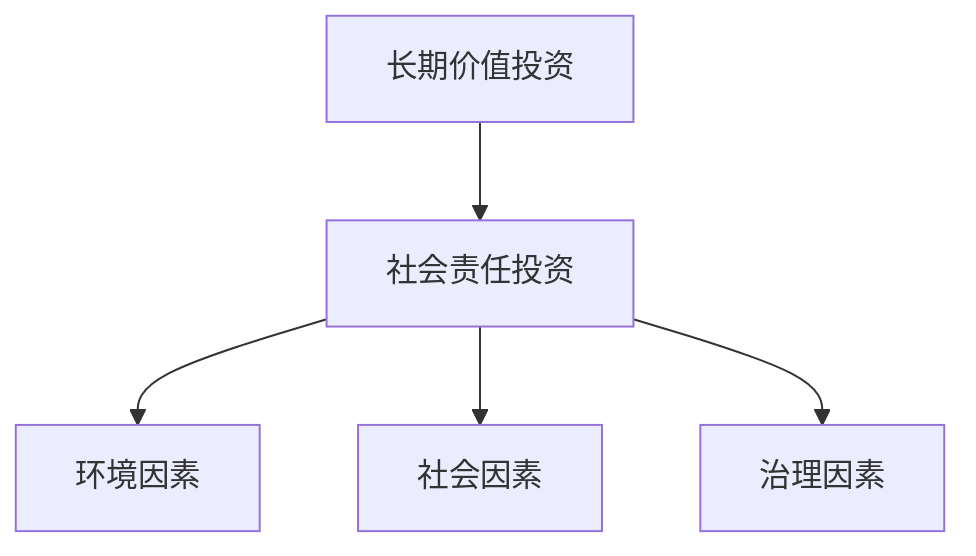
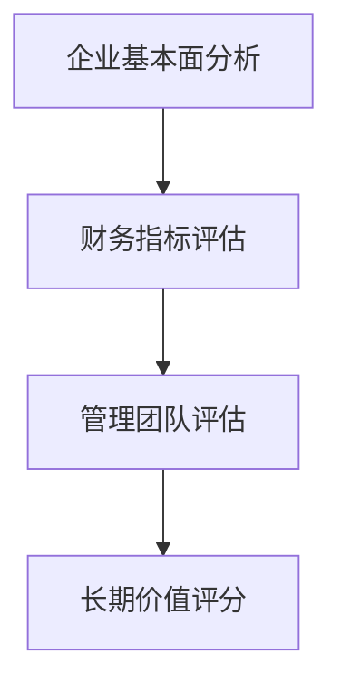
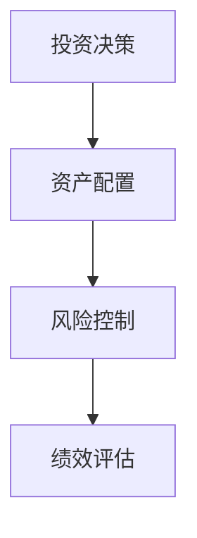
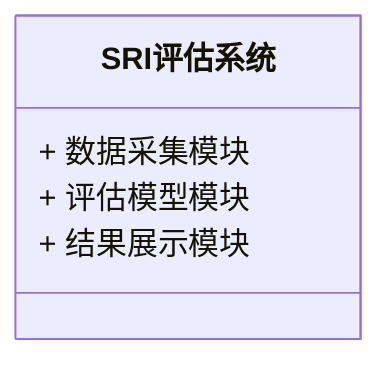

                 


```markdown
# 彼得林奇的"长期价值"在社会责任投资中的体现

## 关键词：彼得林奇、长期价值、社会责任投资、投资策略、企业治理

## 摘要：
本文探讨了彼得·林奇的长期价值投资理念在社会责任投资（SRI）中的应用。通过分析长期价值与社会责任投资的核心要素，结合实际案例和系统架构，展示了如何将长期价值理念与社会责任投资相结合，以实现可持续的投资回报。

---

## 第一部分: 引言

### 1.1 社会责任投资的定义与背景
社会责任投资（SRI）是一种关注环境、社会和治理（ESG）因素的投资策略，旨在通过投资促进社会进步和环境保护。近年来，随着全球对可持续发展的关注增加，SRI在全球范围内的影响力日益增强。

### 1.2 彼得·林奇的长期价值投资理念
彼得·林奇是著名投资专家，强调通过深入研究企业基本面，寻找具有长期增长潜力的企业进行投资。他的理念注重企业的长期价值，而非短期市场波动。

### 1.3 长期价值在社会责任投资中的意义
将长期价值理念融入社会责任投资，不仅关注企业的财务表现，还考虑其对社会和环境的影响，从而实现投资回报与社会责任的双重目标。

---

## 第二部分: 理论基础

### 2.1 长期价值投资的核心要素
长期价值投资关注企业的盈利能力、管理团队和行业地位。以下是长期价值投资的核心要素对比：

| 核心要素 | 描述 |
|----------|------|
| 盈利能力 | 企业持续创造利润的能力 |
| 管理团队 | 高效且诚信的管理团队 |
| 行业地位 | 在行业中的领先地位 |

### 2.2 社会责任投资的框架
社会责任投资关注企业在环境、社会和治理（ESG）方面的表现。以下是三者的对比：

| 维度 | 描述 |
|------|------|
| 环境 | 环境影响评估 |
| 社会 | 社会责任履行 |
| 治理 | 公司治理结构 |

### 2.3 长期价值与社会责任投资的结合
长期价值投资与社会责任投资的结合可以通过以下步骤实现：



---

## 第三部分: 投资策略

### 3.1 社会责任投资的筛选标准
筛选标准是社会责任投资的核心，以下是环境、社会和治理三个维度的具体指标：

| 维度 | 指标 |
|------|------|
| 环境 | 碳排放、能源消耗 |
| 社会 | 劳工权益、社区贡献 |
| 治理 | 董事会结构、透明度 |

### 3.2 长期价值评估方法
长期价值评估方法可以通过以下流程实现：



### 3.3 投资组合管理
投资组合管理需要动态调整，以适应市场变化和企业表现。以下是管理流程：



---

## 第四部分: 案例分析

### 4.1 案例一：XYZ公司的社会责任投资
XYZ公司在环境、社会和治理方面表现优异，以下是具体分析：

| 维度 | 表现 |
|------|------|
| 环境 | 碳排放低于行业平均水平 |
| 社会 | 积极参与社区公益 |
| 治理 | 董事会结构透明，高管薪酬合理 |

### 4.2 案例二：ABC公司的长期价值投资
ABC公司具备长期价值投资的特征，以下是具体分析：

| 维度 | 表现 |
|------|------|
| 盈利能力 | 连续五年保持增长 |
| 管理团队 | 团队稳定且高效 |
| 行业地位 | 市场占有率领先 |

---

## 第五部分: 系统架构

### 5.1 SRI评估系统的功能设计
以下是SRI评估系统的功能模块：



### 5.2 系统实现
以下是Python代码示例：

```python
import pandas as pd

def calculate_sri_score(data):
    # 计算社会责任评分
    score = data['环境'] * 0.4 + data['社会'] * 0.3 + data['治理'] * 0.3
    return score

data = pd.DataFrame({
    '环境': [85, 90, 75],
    '社会': [80, 75, 90],
    '治理': [90, 85, 80]
})

sri_scores = data.apply(lambda x: calculate_sri_score(x), axis=1)
print(sri_scores)
```

---

## 第六部分: 项目实战

### 6.1 环境配置
安装必要的库：

```bash
pip install pandas numpy
```

### 6.2 核心代码实现
以下是核心代码示例：

```python
import pandas as pd
import numpy as np

def evaluate_sri_factors(data):
    # 环境因素评分
    environmental_score = np.mean(data['环境'])
    # 社会因素评分
    social_score = np.mean(data['社会'])
    # 治理因素评分
    governance_score = np.mean(data['治理'])
    return environmental_score, social_score, governance_score

data = pd.DataFrame({
    '环境': [85, 90, 75],
    '社会': [80, 75, 90],
    '治理': [90, 85, 80]
})

env_score, social_score, gov_score = evaluate_sri_factors(data)
print(f"环境评分：{env_score}\n社会评分：{social_score}\n治理评分：{gov_score}")
```

---

## 第七部分: 结论与建议

### 7.1 结论
通过将彼得林奇的长期价值理念与社会责任投资相结合，投资者可以在追求财务回报的同时，促进社会和环境的可持续发展。

### 7.2 建议
1. **动态调整投资组合**：根据市场变化和企业表现，定期调整投资组合。
2. **关注企业治理**：企业治理是社会责任投资的重要组成部分，需重点关注。
3. **技术辅助决策**：利用大数据和人工智能技术，提高社会责任投资的效率和准确性。

---

## 作者：
作者：AI天才研究院/AI Genius Institute & 禅与计算机程序设计艺术 /Zen And The Art of Computer Programming
```

