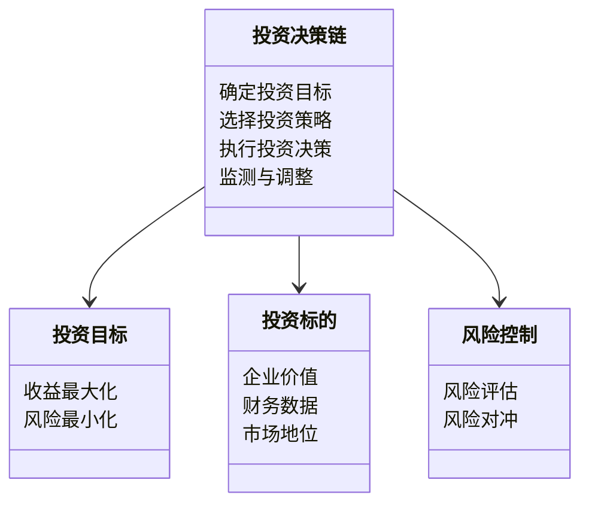
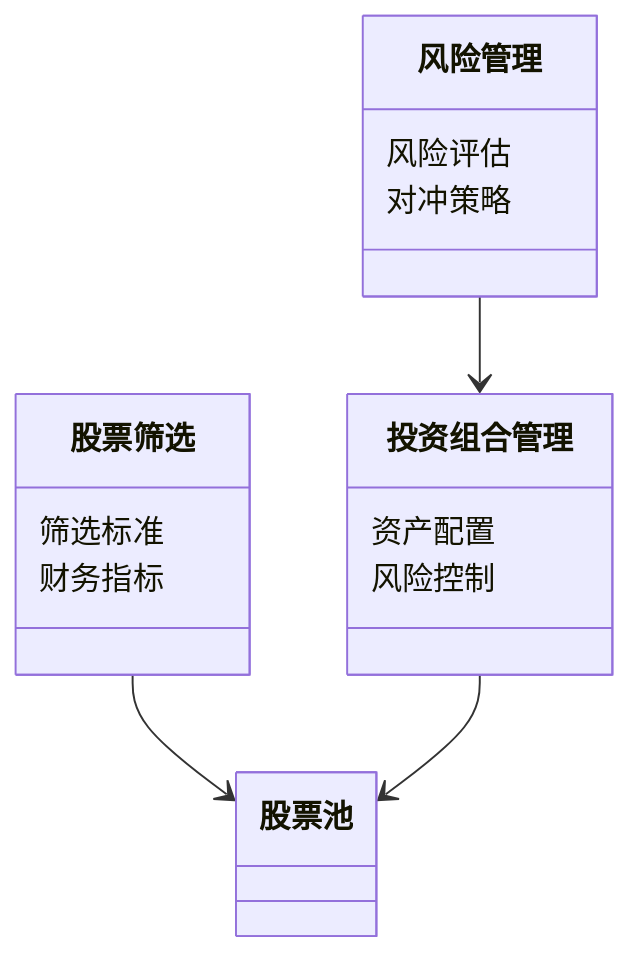
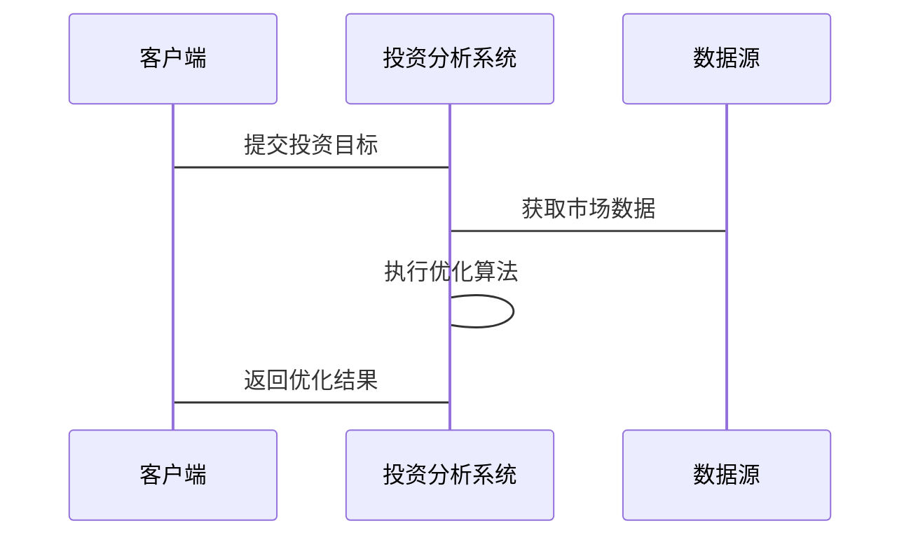

                 


# 彼得林奇的"长期价值"投资案例分析

> 关键词：彼得林奇，长期价值投资，投资案例，投资策略，价值评估

> 摘要：本文通过分析彼得林奇的长期价值投资理念，探讨其核心策略、数学模型和实际案例。从投资哲学到系统架构，再到风险控制，系统性地拆解投资成功的奥秘。本文不仅适合投资领域的读者，也适合技术人员理解价值投资的数学本质。

---

# 第一部分：长期价值投资的背景与核心理念

---

# 第1章：长期价值投资的基本概念

## 1.1 投资的核心问题与目标

投资的核心问题可以归结为：如何在不确定的市场中，通过科学的方法最大化资产收益并控制风险。

**投资的目标**：

1. **资产增值**：通过投资实现财富的保值与增值。
2. **风险控制**：在市场波动中保持资产的稳定性。
3. **长期收益**：通过长期价值投资获得持续的收益。

---

## 1.2 长期价值投资的定义与特点

### 1.2.1 长期价值投资的定义

长期价值投资是一种以长期持有优质资产为核心策略的投资方法。其核心在于识别具有持续竞争优势的企业，以合理价格买入并长期持有，等待其价值的逐步实现。

### 1.2.2 长期价值投资的特点

| 特点 | 描述 |
|------|------|
| 长期性 | 强调长期持有，避免频繁交易 |
| 价值导向 | 以企业内在价值为导向，而非短期市场波动 |
| 优质企业 | 投资具有强大竞争优势的企业 |
| 价格敏感性 | 注重买入价格的合理性 |

---

## 1.3 长期价值投资的核心概念结构

### 1.3.1 投资目标与决策链

Mermaid 类图：  


---

# 第2章：彼得林奇投资模型的算法原理

## 2.1 投资价值评估的数学模型

### 2.1.1 投资价值公式

$$ V = \frac{E}{k} $$

其中：
- \( V \) 表示投资的内在价值
- \( E \) 表示企业的预期收益
- \( k \) 表示折现率

### 2.1.2 预期收益计算

$$ E = \sum_{t=1}^{n} \frac{C_t}{(1 + r)^t} $$

其中：
- \( C_t \) 表示第 \( t \) 年的现金流
- \( r \) 表示贴现率
- \( n \) 表示预测年数

---

## 2.2 投资组合优化的算法实现

### 2.2.1 投资组合优化的数学模型

$$ \text{最大化} \sum_{i=1}^{n} w_i R_i - \lambda \sum_{i=1}^{n} w_i^2 \sigma_i^2 $$

其中：
- \( w_i \) 表示第 \( i \) 只股票的权重
- \( R_i \) 表示第 \( i \) 只股票的预期收益
- \( \sigma_i^2 \) 表示第 \( i \) 只股票的收益波动率
- \( \lambda \) 表示风险惩罚系数

### 2.2.2 Python 实现代码

```python
import numpy as np
import pandas as pd

def portfolio_optimization(returns, cov_matrix, target_return):
    n = len(returns)
    # 定义目标函数
    def objective(weights):
        return - (weights.T @ returns) + (weights.T @ cov_matrix @ weights)
    
    # 定义约束条件
    constraints = [
        ('sum', weights, 1),
        ('in', weights, 0, 1)
    ]
    
    # 使用 scipy 优化器
    from scipy.optimize import minimize
    result = minimize(objective, np.ones(n)/n, constraints=constraints)
    return result.x
```

---

# 第3章：长期价值投资的系统架构设计

## 3.1 投资分析系统的功能设计

### 3.1.1 领域模型的 Mermaid 类图



---

## 3.2 系统架构的 Mermaid 架构图


---

## 3.3 投资决策的交互流程

### 3.3.1 Mermaid 序列图



---

# 第4章：彼得林奇的股票筛选方法

## 4.1 股票基本面分析的数学模型

### 4.1.1 财务指标的量化分析

$$ P/E = \frac{市价}{每股收益} $$

---

## 4.2 股票组合优化的数学模型

### 4.2.1 组合优化的算法实现

$$ W_i = \frac{R_i - R_f}{(R_m - R_f) \times \sigma_i} $$

其中：
- \( W_i \) 表示第 \( i \) 只股票的权重
- \( R_i \) 表示第 \( i \) 只股票的预期收益
- \( R_f \) 表示无风险利率
- \( R_m \) 表示市场预期收益
- \( \sigma_i \) 表示第 \( i \) 只股票的收益波动率

---

# 第5章：彼得林奇的投资组合管理

## 5.1 投资组合的构建策略

### 5.1.1 资产配置的基本原则

$$ \text{权重} = \frac{\text{资产规模}}{\text{总市值}} $$

---

## 5.2 投资组合的风险管理

### 5.2.1 风险评估的数学模型

$$ \text{VaR} = \text{正态分布} \times \sigma \times \sqrt{T} $$

其中：
- \( \text{VaR} \) 表示在险价值
- \( \sigma \) 表示收益的标准差
- \( T \) 表示时间窗口

---

# 第6章：彼得林奇的风险控制方法

## 6.1 风险评估的数学模型

### 6.1.1 风险指标的量化分析

$$ \text{最大回撤} = \max_{i}(P_i - \min_{j \leq i} P_j) $$

其中：
- \( P_i \) 表示第 \( i \) 个时间点的价格
- \( \min_{j \leq i} P_j \) 表示从时间点 \( 1 \) 到 \( i \) 的最小价格

---

# 结语

彼得林奇的长期价值投资理念不仅是一种投资策略，更是一种系统化的方法论。通过数学模型和系统架构的设计，我们可以更好地理解和实现这一投资理念。希望本文能够为读者提供有价值的分析和启发。

---

作者：AI天才研究院/AI Genius Institute & 禅与计算机程序设计艺术 /Zen And The Art of Computer Programming

