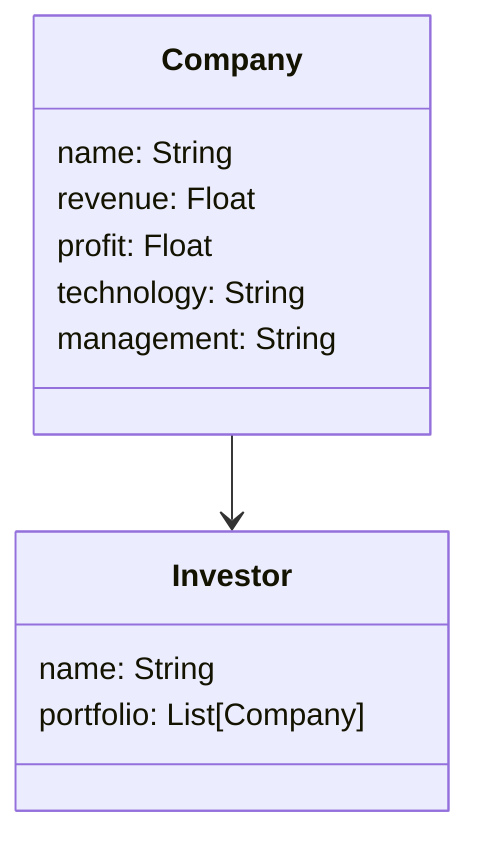

                 


# 彼得林奇的"长期增长"潜力在人工智能行业的识别方法

## 关键词：
- 彼得林奇
- 长期增长
- 人工智能
- 投资方法
- 行业分析

## 摘要：
本文旨在探讨如何将彼得·林奇的长期增长投资理念应用于人工智能行业。通过分析彼得·林奇的核心投资方法，结合人工智能行业的特点，提出一套系统化的评估框架，帮助投资者识别具备长期增长潜力的人工智能公司。文章内容涵盖投资理念、行业分析、评估方法、系统设计和项目实战等多个方面，深入浅出地剖析长期增长潜力在人工智能行业的识别方法。

---

## 第1章：引言

### 1.1 背景介绍
人工智能（AI）作为当前科技领域的热点，正在快速改变多个行业。彼得·林奇作为著名投资家，提出了“长期增长”投资理念，强调选择那些能够在未来持续增长的公司。本文将探讨如何将这一理念应用于人工智能行业。

### 1.2 核心概念术语说明
- **长期增长公司**：指在较长时期内收入和利润持续增长的公司。
- **人工智能行业**：涵盖AI技术开发、应用和相关服务的行业。

---

## 第2章：彼得·林奇的长期增长投资理念

### 2.1 长期增长公司的定义与特征
长期增长公司具备以下特征：
1. **持续的收入增长**：收入年增长率稳定且高于行业平均水平。
2. **强大的盈利能力**：净利润率较高且持续增长。
3. **竞争优势明显**：具备技术、品牌或市场等竞争优势。
4. **管理团队优秀**：管理团队经验丰富且稳定。

### 2.2 彼得·林奇的投资方法论
林奇提出了五项核心标准：
1. **竞争优势明显**：公司具备独特的竞争优势。
2. **财务健康**：财务数据健康，无重大财务风险。
3. **管理层优秀**：管理层具备良好的道德和管理能力。
4. **成长性良好**：公司具备持续增长的潜力。
5. **估值合理**：股价与内在价值相符。

---

## 第3章：人工智能行业的现状与趋势

### 3.1 人工智能行业的技术发展
1. **核心技术**：机器学习、深度学习、自然语言处理等。
2. **主要应用领域**：医疗、金融、教育、交通等。

### 3.2 人工智能行业的市场趋势
1. **市场增长预测**：预计未来几年AI市场规模将快速增长。
2. **竞争格局**：巨头公司如谷歌、亚马逊、微软等占据主导地位，但也涌现出许多新兴公司。

---

## 第4章：彼得·林奇评估方法在人工智能行业的应用

### 4.1 人工智能行业公司的评估标准
1. **财务数据的分析**：收入、利润、利润率等指标。
2. **竞争优势的评估**：技术、数据、品牌等方面的优势。
3. **管理层的评估**：团队经验和稳定性。

### 4.2 人工智能行业的投资策略
1. **选择具备技术优势的公司**：如深度学习算法领先的企业。
2. **关注市场需求**：选择市场需求增长迅速的领域。
3. **分散投资**：降低风险。

---

## 第5章：系统分析与架构设计

### 5.1 问题场景介绍
为了系统地评估人工智能公司的长期增长潜力，我们需要构建一个评估框架，涵盖技术、财务、市场等多个维度。

### 5.2 项目介绍
本项目旨在构建一个基于彼得·林奇投资理念的AI公司评估系统，帮助投资者快速识别具备长期增长潜力的公司。

### 5.3 系统功能设计
#### 领域模型


#### 系统架构设计
```mermaid
graph TD
    Investor --> Company: 选择公司
    Company --> DataCollector: 提供数据
    DataCollector --> Analyzer: 分析数据
    Analyzer --> Output: 输出结果
```

---

## 第6章：项目实战

### 6.1 环境安装
1. **工具安装**：安装Python、Jupyter Notebook、Mermaid工具。
2. **数据获取**：收集人工智能公司的财务数据和市场数据。

### 6.2 核心代码实现
```python
import pandas as pd
import numpy as np

def calculate_growth(company_data):
    growth = (company_data['revenue'].pct_change() * 100).mean()
    return f"收入增长率：{growth:.2f}%"

def assess_competitive Advantage(company_data):
    competitors = company_data['competitors'].tolist()
    company_technology = company_data['technology']
    advantage = 0
    for competitor in competitors:
        if competitor['technology'] < company_technology:
            advantage += 1
    return f"竞争优势得分：{advantage}"

# 示例数据
data = {
    'revenue': [100, 120, 150, 180],
    'profit': [20, 25, 30, 35],
    'technology': ['AI', 'ML', 'NLP', 'CV'],
    'competitors': [{'technology': 'ML'}, {'technology': 'CV'}, {'technology': 'NLP'}, {'technology': 'AI'}]
}

df = pd.DataFrame(data)
print(calculate_growth(df))
print(assess_competitive_Advantage(df))
```

---

## 第7章：总结与建议

### 7.1 最佳实践 tips
1. **持续学习**：关注人工智能行业的最新动态。
2. **风险控制**：分散投资，降低风险。
3. **长期视角**：选择具备长期增长潜力的公司。

### 7.2 小结
通过将彼得·林奇的长期增长投资理念应用于人工智能行业，投资者可以更系统地识别具备潜力的公司。

### 7.3 注意事项
1. **数据准确性**：确保数据来源可靠。
2. **模型局限性**：评估模型可能无法涵盖所有因素。

### 7.4 拓展阅读
1. 彼得·林奇的书籍《投资最重要的事情》。
2. 人工智能领域的最新研究论文。

---

## 作者：AI天才研究院/AI Genius Institute & 禅与计算机程序设计艺术 /Zen And The Art of Computer Programming

