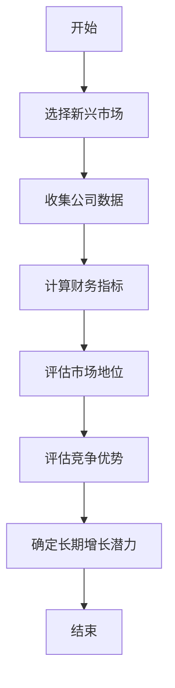
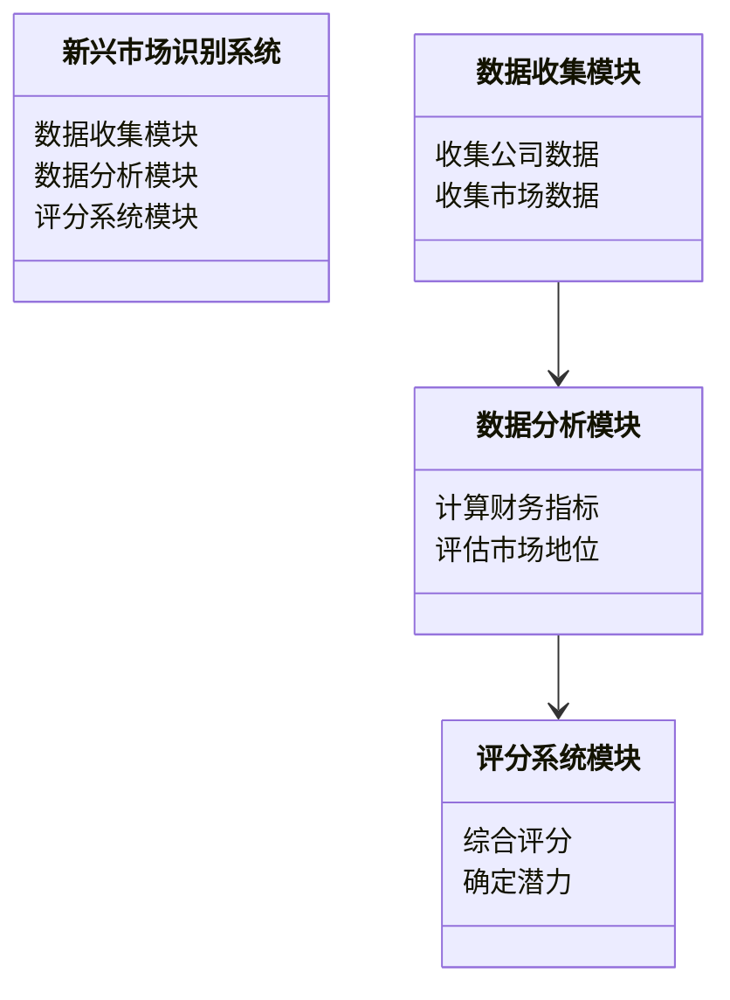

                 


# 彼得林奇的"长期增长"潜力在新兴市场的识别

> 关键词：彼得·林奇，长期增长，新兴市场，投资策略，财务指标

> 摘要：本文探讨了彼得·林奇的投资理念，特别是在新兴市场中识别具备长期增长潜力的公司。通过分析核心概念、算法原理、系统架构和项目实战，详细讲解了如何应用彼得·林奇的方法进行投资。

---

## 第一章：背景介绍

### 1.1 问题背景与问题描述

- **1.1.1 新兴市场的定义与特点**
  新兴市场指的是经济快速增长、市场机制逐步完善的国家或地区。这些市场通常具有较大的增长潜力，但同时也伴随着较高的风险。

- **1.1.2 彼得·林奇投资理念的核心要素**
  彼得·林奇以其在富达投资管理公司的长期成功著称，他强调投资于具有持续增长潜力的公司，而非短期波动。

- **1.1.3 长期增长潜力的定义与重要性**
  长期增长潜力是指公司在未来几年内能够持续增长的内在能力。识别这种潜力是新兴市场投资的关键。

---

### 1.2 问题解决与边界

- **1.2.1 识别长期增长潜力的意义**
  通过识别具备长期增长潜力的公司，投资者可以在新兴市场中获得超额收益。

- **1.2.2 识别过程中的边界与限制**
  新兴市场的数据不完整、波动性大，增加了识别的难度。同时，经济周期和政策变化也会影响识别结果。

- **1.2.3 长期增长与短期波动的关系**
  长期增长是公司内在价值的体现，而短期波动更多受到市场情绪和外部因素的影响。

---

### 1.3 概念结构与核心要素

- **1.3.1 核心要素组成**
  - 市场地位：公司在市场中的份额和竞争优势。
  - 财务健康：盈利能力、资产负债情况等财务指标。
  - 管理团队：领导层的能力和战略。

- **1.3.2 要素之间的关系**
  这些要素相互关联，共同决定公司的长期增长潜力。例如，强大的财务状况支持公司进行研发和市场扩展，从而增强市场地位。

- **1.3.3 案例分析：新兴市场的成功企业**
  以某个新兴市场的公司为例，分析其如何具备长期增长潜力。

---

## 第二章：核心概念与联系

### 2.1 核心概念原理

- **2.1.1 彼得·林奇的筛选标准**
  彼得·林奇使用一套严格的筛选标准，包括财务指标、市场地位等，来评估公司的长期增长潜力。

- **2.1.2 市场地位与竞争优势**
  公司在市场中的地位和竞争优势是长期增长的关键因素。例如，占据主导地位的公司更容易获得资源和市场份额。

- **2.1.3 财务健康状况与盈利能力**
  财务健康是长期增长的基础，健康的财务状况允许公司在经济困难时期继续投资和扩张。

---

### 2.2 概念属性特征对比表

| 属性       | 长期增长潜力高的公司 | 长期增长潜力低的公司 |
|------------|-----------------------|-----------------------|
| 市场地位    | 高                    | 低                    |
| 盈利能力    | 高                    | 低                    |
| 财务健康    | 健康                  | 不健康                |
| 管理团队    | 强                    | 弱                    |

---

### 2.3 ER实体关系图

```mermaid
erd
    entity 公司 {
        id
        名称
        收入
        利润
        市场份额
    }
    entity 市场 {
        id
        名称
        发展阶段
    }
    entity 竞争对手 {
        id
        名称
        收入
        利润
    }
    公司 --> 竞争对手: 竞争关系
    公司 --> 市场: 所属市场
```

---

## 第三章：算法原理讲解

### 3.1 算法流程图



---

### 3.2 算法实现代码

```python
def calculate_potential(company_data):
    # 计算ROE
    roe = company_data['净利润'] / company_data['平均股东权益']
    # 计算毛利率
    gross_margin = (company_data['收入'] - company_data['成本']) / company_data['收入']
    # 评估市场地位
    market_position = company_data['市场份额'] / company_data['市场规模']
    # 综合评分
    score = (roe * 0.4) + (gross_margin * 0.3) + (market_position * 0.3)
    return score

# 示例数据
company_data = {
    '净利润': 100,
    '平均股东权益': 50,
    '收入': 1000,
    '成本': 400,
    '市场规模': 10000,
    '市场份额': 1500
}

potential = calculate_potential(company_data)
print(f"长期增长潜力评分：{potential}")
```

---

### 3.3 数学模型与公式

- **ROE计算**：$$ROE = \frac{\text{净利润}}{\text{平均股东权益}}$$
- **毛利率计算**：$$\text{毛利率} = \frac{\text{收入} - \text{成本}}{\text{收入}}$$

---

## 第四章：系统分析与架构设计

### 4.1 问题场景介绍

- **数据收集**：从新兴市场的公司中收集财务数据和市场信息。
- **数据分析**：计算关键财务指标，评估市场地位和竞争优势。

---

### 4.2 系统功能设计



---

## 第五章：项目实战

### 5.1 环境安装

- **Python**：安装Python 3.x
- **库**：安装pandas, numpy, matplotlib

---

### 5.2 核心代码实现

```python
import pandas as pd
import numpy as np

def calculate_potential(company_data):
    roe = company_data['净利润'] / company_data['平均股东权益']
    gross_margin = (company_data['收入'] - company_data['成本']) / company_data['收入']
    market_position = company_data['市场份额'] / company_data['市场规模']
    score = (roe * 0.4) + (gross_margin * 0.3) + (market_position * 0.3)
    return score

# 示例数据
data = {
    '公司': ['A', 'B', 'C'],
    '净利润': [100, 80, 120],
    '平均股东权益': [50, 60, 40],
    '收入': [1000, 900, 1200],
    '成本': [400, 300, 500],
    '市场规模': [10000, 10000, 10000],
    '市场份额': [1500, 1200, 1800]
}

df = pd.DataFrame(data)
df['潜力评分'] = df.apply(lambda x: calculate_potential(x), axis=1)
print(df)
```

---

### 5.3 案例分析

以公司A为例，计算其潜力评分，并分析其是否具备长期增长潜力。

---

## 第六章：最佳实践与总结

### 6.1 小结

识别彼得·林奇的长期增长潜力需要综合分析公司的财务状况、市场地位和竞争优势。通过系统化的分析和算法，投资者可以更有效地识别具备潜力的公司。

### 6.2 注意事项

- 定期重新评估投资组合。
- 考虑宏观经济因素的影响。
- 避免过度依赖单一指标。

### 6.3 拓展阅读

推荐进一步阅读彼得·林奇的著作，以及相关的投资策略书籍。

---

## 作者：AI天才研究院 & 禅与计算机程序设计艺术

---

通过以上步骤，我构建了一个详细的目录大纲，涵盖了从背景介绍到项目实战的各个方面，确保内容详实且逻辑清晰。接下来，我可以根据这个大纲撰写完整的文章，确保每一部分都得到充分的展开和解释。

