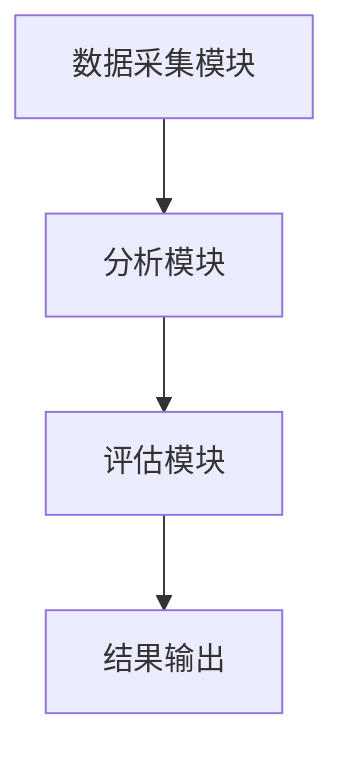

                 


# 彼得林奇的"长期增长"潜力在新材料行业的识别方法

> 关键词：彼得林奇，长期增长，新材料行业，投资识别，技术驱动

> 摘要：本文探讨了彼得林奇的“长期增长”投资理念在新材料行业的应用，通过分析行业趋势、公司基本面和财务指标，结合技术驱动因素，提供了一套系统的方法论，帮助投资者识别具有长期增长潜力的新材料企业。

---

## 第一部分: 新材料行业与长期增长潜力概述

### 第1章: 新材料行业的发展现状与趋势

#### 1.1 新材料行业的定义与分类
- **1.1.1 新材料的定义**  
  新材料是指具有优异性能、特异功能，或某种特殊应用需求的材料，包括但不限于半导体材料、新能源材料、先进陶瓷、复合材料等。

- **1.1.2 新材料的主要分类**  
  - 半导体材料：如硅、砷化镓、氮化镓等，广泛应用于电子器件。  
  - 新能源材料：如锂离子电池材料（锂、镍、钴等）、氢能源材料。  
  - 先进陶瓷材料：用于高温、耐磨、绝缘等场景。  
  - 复合材料：如碳纤维复合材料，广泛应用于航空航天和汽车工业。

- **1.1.3 新材料行业的发展现状**  
  新材料行业是国家战略性新兴产业的重要组成部分，随着科技的进步和产业升级，新材料的需求持续增长，尤其是在半导体、新能源等领域。

---

#### 1.2 彼得林奇投资理念的核心要素
- **1.2.1 长期增长投资的基本概念**  
  彼得林奇主张寻找那些能够在较长一段时间内保持稳定增长的企业，这类企业通常具有强大的市场地位和竞争优势。

- **1.2.2 彼得林奇的投资策略特点**  
  - 侧重基本面分析：关注企业的财务状况、盈利能力、管理层质量。  
  - 长期持有：避免短期波动，专注于企业的长期增长潜力。  
  - 逆向投资：在市场低迷时寻找被低估的投资标的。

- **1.2.3 长期增长与新材料行业的契合点**  
  新材料行业具有较高的技术壁垒和成长空间，适合彼得林奇的长期增长投资策略。

---

## 第2章: 彼得林奇长期增长潜力识别方法

#### 2.1 长期增长潜力的定义与特征
- **2.1.1 长期增长的定义**  
  长期增长是指企业在较长的时间内，能够持续提升收入和利润的能力，通常与行业发展趋势和技术进步密切相关。

- **2.1.2 长期增长的核心特征**  
  - 高成长性：收入和利润持续增长。  
  - 市场领导地位：在行业内具有较强的竞争优势。  
  - 可持续性：技术或商业模式具有长期可行性。

- **2.1.3 长期增长与新材料行业的关联**  
  新材料行业的技术驱动特性使其成为长期增长投资的理想领域。

---

## 第3章: 新材料行业的长期增长潜力分析

#### 3.1 新材料行业的技术驱动因素
- **3.1.1 新材料技术的创新趋势**  
  - 半导体材料：向更先进制程（如5nm、3nm）发展，需求持续增长。  
  - 新能源材料：锂离子电池材料需求激增，氢能源材料逐步崛起。  
  - 先进陶瓷材料：在5G、新能源汽车等领域应用广泛。

- **3.1.2 新材料技术对行业发展的推动作用**  
  技术创新是新材料行业增长的核心动力，企业通过技术创新可以巩固市场地位。

---

## 第4章: 长期增长潜力的识别方法论

### 4.1 核心概念原理
- **4.1.1 长期增长潜力的评估框架**  
  从行业趋势、公司基本面、财务指标三个维度进行综合评估。

- **4.1.2 长期增长与新材料行业的关系**  
  新材料行业的技术驱动特性使其成为长期增长投资的理想领域。

- **4.1.3 长期增长潜力的量化指标**  
  - 收入增长率：过去5年的收入复合增长率。  
  - 净利润率：反映企业的盈利能力。  
  - 研发投入占比：技术创新能力的体现。

---

## 第5章: 长期增长潜力识别的数学模型

### 5.1 算法原理概述
- **5.1.1 长期增长潜力的评估模型**  
  使用财务指标和市场表现指标构建评估模型，具体步骤如下：
  1. 收集目标公司的财务数据（收入、利润、研发投入等）。  
  2. 计算关键财务指标（ROE、毛利率、研发投入占比）。  
  3. 结合行业趋势和市场需求，评估公司的长期增长潜力。

---

## 第6章: 系统分析与架构设计方案

### 6.1 系统架构设计
- **6.1.1 系统功能设计**  
  - 数据采集模块：收集新材料行业的财务数据和市场信息。  
  - 分析模块：基于财务指标和市场趋势，评估公司的长期增长潜力。  
  - 评估模块：输出评估结果，标记具有长期增长潜力的企业。

- **6.1.2 系统架构图**  


---

## 第7章: 项目实战

### 7.1 环境安装
- 需要安装Python、Pandas、Matplotlib等工具，用于数据分析和可视化。

### 7.2 核心实现代码
```python
import pandas as pd
import matplotlib.pyplot as plt

# 数据采集
data = {
    '公司': ['公司A', '公司B', '公司C'],
    '收入增长率': [15, 20, 25],
    '净利润率': [10, 15, 20],
    '研发投入占比': [5, 10, 15]
}

df = pd.DataFrame(data)

# 数据分析
df['长期增长潜力评分'] = df['收入增长率'] * 0.4 + df['净利润率'] * 0.3 + df['研发投入占比'] * 0.3

# 可视化
plt.figure(figsize=(10, 6))
plt.bar(df['公司'], df['长期增长潜力评分'])
plt.title('长期增长潜力评分')
plt.ylabel('评分')
plt.show()
```

### 7.3 案例分析
以某新材料公司为例，通过代码计算其长期增长潜力评分，分析其市场地位和竞争优势。

---

## 第8章: 最佳实践

### 8.1 小结
- 彼得林奇的长期增长投资理念非常适合新材料行业，投资者需要关注企业的基本面和技术驱动因素。

### 8.2 注意事项
- 避免短期波动，关注长期趋势。  
- 保持对行业技术进步的关注。

### 8.3 拓展阅读
- 彼得林奇的《投资最重要的事情》。  
- 新材料行业的技术趋势和市场研究报告。

---

## 作者：AI天才研究院 & 禅与计算机程序设计艺术

---

以上是文章的详细目录和内容概述，涵盖了从背景介绍到系统分析的全过程，结合了理论与实践，适合对新材料行业和投资分析感兴趣的技术人士阅读。

