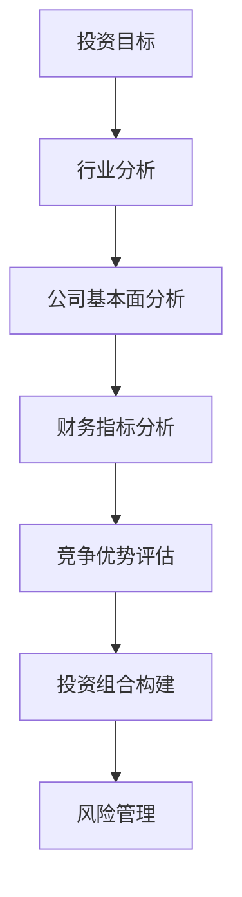
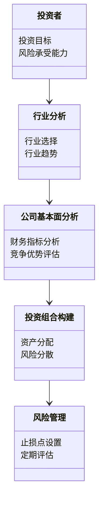

                 

# 彼得林奇的"长期增长"潜力识别方法

## 关键词：彼得林奇，长期增长，投资方法，财务指标，竞争优势

## 摘要：  
彼得·林奇作为全球著名投资专家，其“长期增长”潜力识别方法在投资界具有深远影响。本文将深入分析彼得林奇的核心投资理念，详细解读其在识别具有长期增长潜力的公司时所采用的标准和方法。通过结合财务指标分析、竞争优势评估、行业趋势分析等多维度的系统方法，本文旨在为投资者提供一套科学、实用的选股策略，并通过实际案例和系统架构图的展示，帮助读者更好地理解和应用这些方法。

---

# 第一部分：彼得林奇投资理念概述

## 第1章：彼得林奇投资理念的核心思想

### 1.1 长期投资的重要性  
长期投资是一种基于对公司基本面和市场趋势的深入理解的投资策略，其核心在于寻找那些具有持续增长潜力的公司，并在较长的时间跨度内持有这些公司股票，以获得资本增值和分红收益。彼得林奇认为，长期投资能够有效降低市场波动带来的风险，同时为投资者提供稳定的投资回报。

#### 1.1.1 长期投资的基本概念  
长期投资是指投资者将资金投入到某种资产（如股票、债券等）中，并在较长时间内持有这些资产，以期获得资本增值或收益。与短期交易相比，长期投资更注重资产的基本面分析和长期趋势判断。

#### 1.1.2 长期投资与短期投资的区别  
- **短期投资**：以快速买卖交易为主，关注市场的短期波动和价格变化，风险较高，回报不稳定。  
- **长期投资**：以持有资产为主，关注公司的基本面和长期增长潜力，风险较低，回报相对稳定。

#### 1.1.3 彼得林奇对长期投资的诠释  
彼得林奇强调，长期投资的核心在于对公司基本面的深入分析，以及对市场趋势的准确判断。他主张选择那些具有持续增长潜力的公司，并在市场低迷时买入，在市场高涨时卖出。

### 1.2 彼得林奇的选股标准  
彼得林奇在选股时注重公司的基本面和竞争优势，他提出了以下几个关键标准：  
1. **公司基本面**：包括收入、利润、资产负债表等财务指标的健康状况。  
2. **竞争优势**：公司是否具有独特的竞争优势，例如技术优势、成本优势、品牌优势等。  
3. **管理团队**：管理团队的能力和诚信是公司长期增长的重要保障。  

#### 1.2.1 公司基本面分析的重要性  
公司基本面分析是选股的核心步骤，主要关注以下几个方面：  
- **收入**：公司收入的增长趋势和质量。  
- **利润**：公司利润的来源和可持续性。  
- **资产负债表**：公司的资产、负债和所有者权益状况。  

#### 1.2.2 公司财务状况评估  
财务状况评估是判断公司长期增长潜力的重要依据。通过分析公司的财务报表，可以了解公司的盈利能力、偿债能力、运营效率等关键指标。

#### 1.2.3 管理团队的能力考察  
管理团队的能力是公司长期增长的关键因素。彼得林奇认为，一个优秀的管理团队能够带领公司克服困难，抓住机遇，实现持续增长。

### 1.3 市场周期与投资策略  
市场周期对投资策略有重要影响。彼得林奇提出了在不同市场周期下的投资策略：  
1. **牛市**：增加对优质股票的投资，关注具有长期增长潜力的公司。  
2. **熊市**：寻找被市场低估的优秀公司，进行长期投资布局。  
3. **震荡市**：保持投资组合的分散性，避免过度集中风险。  

---

## 第2章：财务指标分析  

### 2.1 主要财务指标解读  
财务指标是衡量公司基本面健康状况的重要工具。以下是彼得林奇常用的几个关键财务指标：  

#### 2.1.1 每股收益（EPS）  
每股收益是衡量公司盈利能力的重要指标，计算公式为：  
$$ EPS = \frac{\text{净利润}}{\text{总股本}} $$  
EPS越高，说明公司每股的盈利能力越强。  

#### 2.1.2 市盈率（P/E）  
市盈率是衡量公司股票价值的重要指标，计算公式为：  
$$ P/E = \frac{\text{股票价格}}{\text{每股收益}} $$  
市盈率越低，说明股票的相对估值越低，投资价值越高。  

#### 2.1.3 净资产收益率（ROE）  
净资产收益率是衡量公司资产使用效率的重要指标，计算公式为：  
$$ ROE = \frac{\text{净利润}}{\text{净资产}} $$  
ROE越高，说明公司利用资产创造利润的能力越强。  

---

## 第3章：竞争优势分析  

### 3.1 企业竞争优势的定义  
竞争优势是公司相对于竞争对手的独特优势，包括技术优势、成本优势、品牌优势等。彼得林奇认为，具有强大竞争优势的公司更容易实现长期增长。

#### 3.1.1 核心竞争力的概念  
核心竞争力是指公司能够在市场上长期保持竞争优势的关键能力，例如技术创新、成本控制等。  

#### 3.1.2 市场地位的重要性  
市场地位是公司竞争优势的重要体现，包括市场份额、品牌影响力等。  

#### 3.1.3 技术创新的推动作用  
技术创新是许多高科技公司实现长期增长的核心动力，例如苹果、微软等公司通过持续的技术创新保持了竞争优势。  

### 3.2 竞争优势的评估方法  
彼得林奇提出了多种竞争优势评估方法，包括五力模型、SWOT分析等。  

#### 3.2.1 五力模型的应用  
五力模型（Porter's Five Forces）由迈克尔·波特提出，用于分析行业竞争环境。五力模型包括：  
1. 新进入者的威胁  
2. 替代品的威胁  
3. 供应商的议价能力  
4. 客户的议价能力  
5. 竞争对手之间的竞争程度  

#### 3.2.2 SWOT分析法  
SWOT分析法用于评估公司的优势（Strengths）、劣势（Weaknesses）、机会（Opportunities）和威胁（Threats）。  

---

## 第4章：行业分析与投资机会  

### 4.1 行业选择的基本原则  
行业选择是长期投资的重要步骤，彼得林奇提出了以下基本原则：  
1. 选择具有长期增长潜力的行业。  
2. 关注行业内的龙头公司。  
3. 避免选择夕阳行业。  

#### 4.1.1 行业生命周期的分析  
行业生命周期包括导入期、成长期、成熟期和衰退期。投资者应选择处于成长期或成熟期的行业。  

#### 4.1.2 行业增长潜力的评估  
行业增长潜力可以通过市场规模、增长率、市场需求等因素进行评估。  

#### 4.1.3 行业风险的考量  
行业风险包括政策风险、经济周期风险、技术风险等。  

### 4.2 不同行业的长期增长潜力  
彼得林奇认为，不同行业的长期增长潜力差异较大。例如，科技行业具有较高的增长潜力，而传统制造业的增长潜力相对较低。  

#### 4.2.1 高科技行业的特点  
高科技行业具有技术创新快、市场增长快、利润率高等特点。  

#### 4.2.2 消费行业的稳定性  
消费行业具有需求稳定、市场波动小等特点，是长期投资的理想选择。  

#### 4.2.3 制造业的转型趋势  
随着技术的进步，传统制造业正在向智能化、自动化方向转型，具有较大的增长潜力。  

### 4.3 行业趋势与投资策略  
彼得林奇提出了以下行业趋势与投资策略：  
1. 关注政策支持的行业。  
2. 投资具有技术优势的公司。  
3. 分散投资不同行业的公司。  

---

## 第5章：投资组合构建与风险管理  

### 5.1 投资组合的构建策略  
投资组合的构建需要综合考虑资产分配、风险分散等因素。彼得林奇提出了以下构建策略：  
1. 根据风险承受能力分配资产比例。  
2. 选择具有长期增长潜力的公司。  
3. 定期调整投资组合。  

#### 5.1.1 资产分配的原则  
资产分配是投资组合构建的核心步骤，需要根据投资者的风险承受能力、投资目标和市场环境进行调整。  

#### 5.1.2 风险分散的策略  
通过分散投资不同行业、不同地区的公司，可以有效降低投资风险。  

### 5.2 风险管理策略  
风险管理是投资过程中不可忽视的重要环节。彼得林奇提出了以下风险管理策略：  
1. 设置止损点。  
2. 定期评估投资组合的风险。  
3. 避免过度集中投资。  

---

## 第6章：彼得林奇投资方法的系统架构  

### 6.1 系统架构图  
以下是一个基于彼得林奇投资方法的系统架构图：  

### 6.2 系统功能设计  
以下是系统功能设计的类图：  

---

## 第7章：彼得林奇投资方法的实际案例  

### 7.1 案例分析：苹果公司  
以苹果公司为例，分析彼得林奇投资方法的实际应用：  
1. **行业分析**：科技行业具有较高的增长潜力。  
2. **公司基本面分析**：苹果公司财务状况健康，净利润持续增长。  
3. **竞争优势评估**：苹果公司在技术创新和品牌建设方面具有强大的竞争优势。  
4. **投资组合构建**：将苹果公司纳入投资组合，并定期调整持股比例。  

---

## 第8章：彼得林奇投资方法的最佳实践  

### 8.1 最佳实践  
1. **长期持有优质股票**：彼得林奇强调长期投资的重要性，建议投资者长期持有具有长期增长潜力的公司股票。  
2. **分散投资**：通过分散投资不同行业和地区的公司，降低投资风险。  
3. **定期评估投资组合**：定期评估投资组合的绩效，并根据市场变化进行调整。  

### 8.2 小结  
彼得林奇的“长期增长”潜力识别方法是一种科学、实用的投资策略，通过深入分析公司的基本面、竞争优势和行业趋势，投资者可以更好地识别具有长期增长潜力的公司，并制定合理的投资策略。

### 8.3 注意事项  
1. 投资有风险，投资者需谨慎决策。  
2. 长期投资需要耐心和信心，避免受短期市场波动的影响。  
3. 定期评估和调整投资组合，以适应市场变化。  

### 8.4 拓展阅读  
1. 《彼得·林奇的成功投资》  
2. 《投资学基础》  
3. 《技术分析入门》  

---

## 作者：AI天才研究院 & 禅与计算机程序设计艺术  

---

**（完）**

