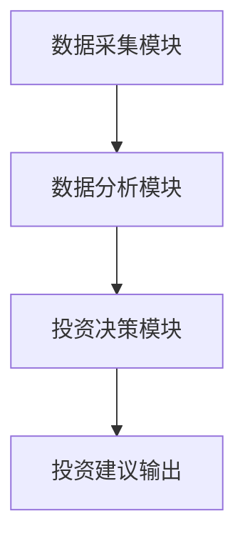

                 


# 彼得林奇的"长期增长"选股策略

> 关键词：彼得林奇，长期增长，选股策略，投资哲学，高增长公司

> 摘要：本文详细分析了彼得林奇的“长期增长”选股策略，从策略的核心概念、数学模型、系统架构到项目实战，深入探讨了该策略在投资中的应用和优势。通过详细的技术分析和实际案例，帮助读者理解如何在投资中实现长期增长。

---

# 第一部分: 长期增长策略的核心概念

## 第1章: 投资的基本概念与彼得林奇的投资哲学

### 1.1 投资的基本概念

#### 1.1.1 投资的定义与分类
投资是将资金投入到能够产生收益的资产中，通常分为股票、债券、房地产等多种形式。股票投资是最常见的投资方式之一，其核心在于通过持有公司的股权获得收益。

#### 1.1.2 股票投资的核心要素
股票投资的核心要素包括公司基本面、行业地位、财务健康状况、管理层能力等。投资者需要综合考虑这些因素，才能做出明智的投资决策。

#### 1.1.3 长期投资与短期投资的区别
长期投资强调持有资产的时间跨度较长，注重公司的长期发展潜力；而短期投资则关注短期价格波动，追求快速收益。长期投资更注重风险控制和稳健增长，而短期投资则更看重市场波动和交易技巧。

### 1.2 彼得林奇的投资哲学

#### 1.2.1 彼得林奇的生平简介
彼得·林奇（Peter Lynch）是美国著名的投资专家，被誉为“股神”之一。他以管理麦哲伦基金而闻名，该基金在他的管理下取得了卓越的业绩，为投资者带来了丰厚的回报。

#### 1.2.2 彼得林奇的投资理念
彼得林奇强调“长期增长”投资策略，主张选择那些具有长期增长潜力的公司进行投资。他认为，投资的核心在于选择那些能够持续增长的公司，并且长期持有这些股票，以获得稳定的收益。

#### 1.2.3 彼得林奇的成功案例
彼得林奇管理的麦哲伦基金在20世纪80年代至90年代初期取得了卓越的业绩，年平均回报率高达29%，远超市场平均水平。他的成功主要归功于他对公司基本面的深刻理解和对长期增长策略的坚持。

---

## 第2章: 长期增长策略的定义与特点

### 2.1 长期增长策略的定义

#### 2.1.1 长期增长的内涵
长期增长策略是指选择那些具有持续增长潜力的公司进行投资，并长期持有这些股票，以获得稳定的收益。这种策略注重公司的长期发展潜力，而非短期价格波动。

#### 2.1.2 长期增长的核心目标
长期增长策略的核心目标是通过选择具有持续增长潜力的公司，实现投资收益的长期稳健增长。这种策略强调公司的基本面分析，关注公司的收入增长、利润增长和市场地位。

#### 2.1.3 长期增长的适用场景
长期增长策略适用于那些希望在较长的时间跨度内获得稳定收益的投资者。这种策略特别适合那些能够承受市场短期波动、追求长期稳健增长的投资者。

### 2.2 长期增长策略的特点

#### 2.2.1 长期增长的稳定性
长期增长策略注重公司的基本面分析，选择那些具有稳定增长潜力的公司。这种策略能够有效降低投资风险，提高投资收益的稳定性。

#### 2.2.2 长期增长的持续性
长期增长策略强调公司持续增长的潜力，关注公司的长期发展趋势。这种策略能够帮助投资者在较长的时间跨度内获得稳定的收益，实现财富的持续增长。

#### 2.2.3 长期增长的抗风险性
长期增长策略注重公司基本面的分析，选择那些具有强大竞争优势和良好财务状况的公司。这种策略能够有效降低市场波动对投资收益的影响，提高投资的抗风险能力。

---

## 第3章: 长期增长策略与传统投资策略的区别

### 3.1 传统投资策略的概述

#### 3.1.1 价值投资的定义
价值投资是一种以寻找市场低估的股票为核心的投资策略，强调通过分析公司的内在价值，选择那些市场价格低于内在价值的股票进行投资。

#### 3.1.2 技术分析的定义
技术分析是一种通过分析股票价格和交易量的历史数据，预测未来价格走势的投资策略。这种策略注重市场的技术指标和价格形态，而非公司的基本面。

#### 3.1.3 股市交易的常见策略
除了价值投资和技术分析，股市交易中还存在短线交易、高频交易等多种策略。这些策略通常关注市场的短期波动，而非公司的长期发展。

### 3.2 长期增长策略的独特性

#### 3.2.1 长期增长策略的核心优势
长期增长策略的核心优势在于其注重公司的长期发展潜力，选择那些具有持续增长潜力的公司进行投资。这种策略能够帮助投资者在较长的时间跨度内获得稳定的收益。

#### 3.2.2 长期增长策略的劣势
长期增长策略的劣势在于其对市场的短期波动缺乏敏感性，可能会在市场下跌时承受较大的压力。此外，选择具有长期增长潜力的公司需要进行深入的公司基本面分析，这需要投资者具备较高的分析能力。

#### 3.2.3 长期增长策略与传统策略的对比分析
与价值投资和技术分析相比，长期增长策略更加注重公司的长期发展潜力，强调选择那些具有持续增长潜力的公司。这种策略在长期投资中表现更为稳定，但在短期内可能会面临较大的波动风险。

---

## 第4章: 彼得林奇选股策略的核心要素

### 4.1 彼得林奇选股的标准

#### 4.1.1 公司基本面分析
彼得林奇非常注重公司基本面的分析，包括公司的收入、利润、利润率、资产负债表等。他强调选择那些财务健康、收入持续增长的公司。

#### 4.1.2 公司的竞争优势
彼得林奇认为，选择具有强大竞争优势的公司是实现长期增长的关键。他关注公司的市场地位、产品竞争力、品牌影响力等因素。

#### 4.1.3 管理层的能力与诚信
彼得林奇非常重视公司的管理层能力与诚信。他认为，一个优秀的管理层能够带领公司实现持续增长，而管理层的诚信则是公司长期发展的基础。

### 4.2 长期增长公司的特征

#### 4.2.1 高增长公司的定义
高增长公司是指那些收入和利润持续增长，且增长速度高于行业平均水平的公司。这种公司的增长潜力巨大，能够为投资者带来稳定的收益。

#### 4.2.2 高增长公司的财务特征
高增长公司的财务特征包括高收入增长率、高净利润率、低债务水平等。这些特征表明公司具有强大的财务健康状况和增长潜力。

#### 4.2.3 高增长公司的行业地位
高增长公司的行业地位通常较为稳固，具有较强的市场竞争力。这些公司在行业内具有较高的市场份额和品牌影响力，能够持续推动公司的增长。

---

## 第5章: 彼得林奇选股策略的数学模型与公式

### 5.1 长期增长模型的数学表达式

#### 5.1.1 收入增长率的计算公式
收入增长率的计算公式为：
$$ \text{收入增长率} = \frac{\text{当年收入} - \text{上一年收入}}{\text{上一年收入}} \times 100\% $$

#### 5.1.2 利润增长率的计算公式
利润增长率的计算公式为：
$$ \text{利润增长率} = \frac{\text{当年利润} - \text{上一年利润}}{\text{上一年利润}} \times 100\% $$

#### 5.1.3 市盈率的计算公式
市盈率的计算公式为：
$$ \text{市盈率} = \frac{\text{股票价格}}{\text{每股净利润}} $$

#### 5.1.4 市净率的计算公式
市净率的计算公式为：
$$ \text{市净率} = \frac{\text{股票价格}}{\text{每股净资产}} $$

### 5.2 长期增长策略的数学模型

#### 5.2.1 长期增长模型的构建
长期增长模型的构建需要综合考虑公司的收入增长率、利润增长率、市盈率和市净率等因素。通过分析这些指标，可以评估公司的长期增长潜力，并选择那些具有较高增长潜力的公司进行投资。

#### 5.2.2 长期增长模型的优化
长期增长模型的优化需要根据市场环境和公司实际情况进行调整。例如，在市场环境不佳时，可以适当降低对收入增长率的要求，以降低投资风险。

---

## 第6章: 彼得林奇选股策略的系统架构

### 6.1 系统功能设计

#### 6.1.1 数据采集模块
数据采集模块负责采集公司的财务数据、行业数据等信息。这些数据是后续分析的基础。

#### 6.1.2 数据分析模块
数据分析模块负责对采集到的数据进行分析，计算公司的收入增长率、利润增长率等关键指标。

#### 6.1.3 投资决策模块
投资决策模块根据分析结果，生成投资建议。例如，选择那些具有较高增长潜力的公司进行投资。

### 6.2 系统架构设计

#### 6.2.1 系统架构图
以下是系统架构图的 Mermaid 描述：



#### 6.2.2 系统交互流程
系统交互流程包括数据采集、数据分析和投资决策三个主要步骤。通过这些步骤，系统能够为投资者提供科学的投资建议。

---

## 第7章: 项目实战

### 7.1 环境安装

#### 7.1.1 Python 环境的安装
需要安装 Python 3.8 或更高版本，并安装必要的库，例如 pandas、numpy、matplotlib 等。

#### 7.1.2 数据采集工具的安装
可以使用 requests 和 BeautifulSoup 等工具进行数据采集。

### 7.2 核心实现

#### 7.2.1 数据采集与处理
以下是数据采集与处理的 Python 代码示例：

```python
import requests
from bs4 import BeautifulSoup

url = "https://www.example.com/company_data"
response = requests.get(url)
soup = BeautifulSoup(response.text, 'html.parser')

# 提取公司财务数据
income_growth = float(soup.find('td', {'class': 'income_growth'}).text)
profit_growth = float(soup.find('td', {'class': 'profit_growth'}).text)
```

#### 7.2.2 数据分析与建模
以下是数据分析与建模的 Python 代码示例：

```python
import pandas as pd
import numpy as np

# 计算收入增长率和利润增长率
df['收入增长率'] = df['收入'].pct_change()
df['利润增长率'] = df['利润'].pct_change()

# 计算市盈率和市净率
df['市盈率'] = df['股票价格'] / df['每股净利润']
df['市净率'] = df['股票价格'] / df['每股净资产']
```

#### 7.2.3 投资决策与建议
以下是投资决策与建议的 Python 代码示例：

```python
# 筛选具有高增长潜力的公司
high_growth_companies = df[(df['收入增长率'] > 0.1) & (df['利润增长率'] > 0.1)]
```

### 7.3 实际案例分析

#### 7.3.1 案例背景
以一家科技公司为例，分析其财务数据，评估其长期增长潜力。

#### 7.3.2 数据分析与解读
通过分析公司的收入增长率、利润增长率等指标，评估其长期增长潜力。

#### 7.3.3 投资建议
根据分析结果，给出投资建议，例如选择那些具有较高增长潜力的公司进行投资。

---

## 第8章: 总结与展望

### 8.1 总结
本文详细分析了彼得林奇的“长期增长”选股策略，从策略的核心概念、数学模型到系统架构，全面探讨了该策略在投资中的应用和优势。通过实际案例分析，帮助读者理解如何在投资中实现长期增长。

### 8.2 展望
未来，随着市场环境的变化和技术的进步，长期增长策略将面临新的挑战和机遇。投资者需要不断优化自己的投资策略，以适应市场的变化，实现长期稳健的增长。

---

作者：AI天才研究院/AI Genius Institute & 禅与计算机程序设计艺术 /Zen And The Art of Computer Programming

