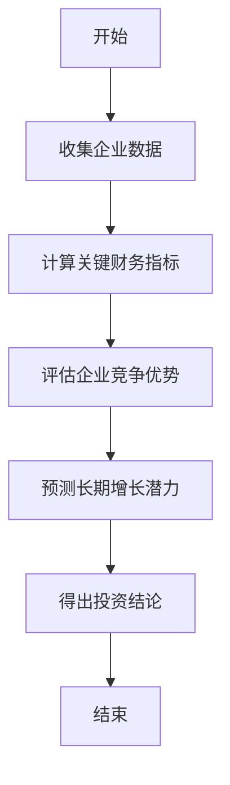
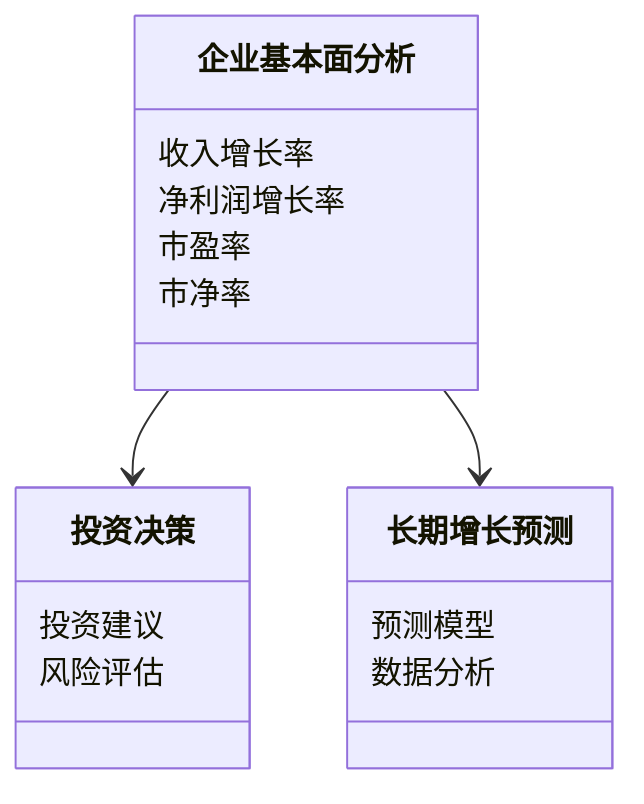
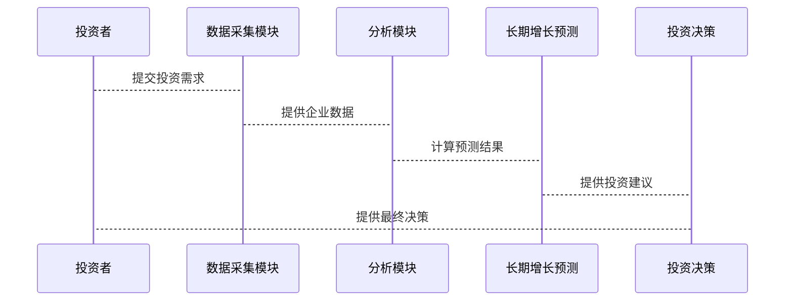

                 


# 彼得林奇的"长期增长"预测方法

## 关键词
彼得林奇，长期增长预测，投资策略，基本面分析，价值投资，财务指标

## 摘要
彼得·林奇是全球著名的价值投资者，他提出的“长期增长”预测方法在投资领域具有深远影响。本文系统地介绍和分析了彼得林奇的长期增长预测方法，从其投资理念、核心概念到具体算法、数学模型、系统架构设计以及实际案例分析，全面解读这一方法的精髓。通过本文，读者将了解如何通过基本面分析、竞争优势评估和财务指标预测来实现长期投资增长的目标。

---

## 第1章: 彼得林奇投资理念与长期增长预测

### 1.1 彼得林奇投资理念的核心要素
#### 1.1.1 价值投资的基本原则
彼得·林奇是价值投资的倡导者，他认为市场的短期波动不应影响长期投资决策。价值投资的核心在于寻找那些被市场低估的优秀企业，并长期持有它们的股票。他认为，投资的最终目标是通过持有优质资产实现财富的长期增长。

#### 1.1.2 长期增长预测的定义与目标
长期增长预测是彼得林奇分析企业投资价值的重要工具。它基于对企业未来盈利能力、成长性和行业趋势的分析，预测企业在未来一段时间内的增长潜力。通过长期增长预测，投资者可以更好地判断企业的投资价值。

#### 1.1.3 彼得林奇投资方法的独特性
彼得林奇的投资方法独特之处在于他对企业的深入研究和对市场短期波动的忽略。他强调通过基本面分析来识别具有竞争优势的企业，并长期持有这些股票，以实现财富的稳步增长。

### 1.2 长期增长预测的重要性
#### 1.2.1 投资者为何需要长期增长预测
在不确定的市场环境中，长期增长预测能够帮助投资者识别出具有稳定增长潜力的企业，从而在市场波动中保持投资的稳定性。通过长期增长预测，投资者可以更好地应对市场短期波动，实现长期投资目标。

#### 1.2.2 长期增长预测与短期波动的关系
市场短期波动往往受情绪和市场环境的影响，而长期增长预测则关注企业的基本面和长期发展潜力。通过长期增长预测，投资者可以避免被短期波动干扰，专注于实现长期投资目标。

#### 1.2.3 彼得林奇对长期增长预测的重视
彼得林奇认为，长期增长预测是投资决策的核心。他强调，投资者应该关注企业的长期增长潜力，而不是市场的短期波动。通过长期增长预测，投资者可以识别出那些具有持续增长能力的优秀企业。

### 1.3 彼得林奇的分析框架
#### 1.3.1 企业基本面分析的核心要素
彼得林奇的企业基本面分析包括对企业盈利能力、成长性、财务健康状况和行业地位的综合评估。他强调，只有通过对企业基本面的深入了解，才能准确预测企业的长期增长潜力。

#### 1.3.2 企业竞争优势的识别与评估
彼得林奇认为，具有竞争优势的企业能够在行业中长期保持领先地位。他通过对企业市场占有率、成本优势、品牌影响力等指标的分析，识别出具有竞争优势的企业。

#### 1.3.3 财务指标在长期增长预测中的作用
财务指标是彼得林奇分析企业基本面的重要工具。他通过分析企业的收入增长率、利润率、资产负债率等指标，评估企业的财务健康状况和成长潜力。

---

## 第2章: 长期增长预测的核心概念与联系

### 2.1 长期增长预测的核心要素
#### 2.1.1 企业盈利能力分析
企业的盈利能力是长期增长预测的核心要素之一。彼得林奇通过分析企业的净利润率、毛利率等指标，评估企业的盈利能力，并预测其未来的增长潜力。

#### 2.1.2 企业成长性评估
企业成长性评估是长期增长预测的另一重要要素。彼得林奇通过分析企业的收入增长率、市场份额增长率等指标，评估企业的成长性，并预测其未来的增长潜力。

#### 2.1.3 行业趋势与企业战略
行业趋势和企业战略对企业的长期增长具有重要影响。彼得林奇通过分析行业的发展趋势和企业的战略规划，评估企业在行业中的地位和未来的发展潜力。

### 2.2 核心概念对比与联系
#### 2.2.1 不同长期增长预测方法的对比
彼得林奇的长期增长预测方法与其他方法相比，更加注重对企业基本面的深入分析和长期持有优质资产。这种方法与其他短期波动预测方法有显著区别。

#### 2.2.2 彼得林奇方法与其他方法的异同
彼得林奇方法的核心在于对企业基本面的深入分析和长期投资策略。与其他方法相比，彼得林奇方法更注重企业的内在价值和长期增长潜力。

#### 2.2.3 长期增长预测的数学模型与实际应用
长期增长预测的数学模型是彼得林奇方法的重要组成部分。他通过对企业财务指标的分析，建立数学模型，预测企业的长期增长潜力。

### 2.3 核心概念的联系
#### 2.3.1 企业基本面分析与长期增长预测的关系
企业基本面分析是长期增长预测的基础。通过对企业基本面的深入分析，彼得林奇能够准确预测企业的长期增长潜力。

#### 2.3.2 财务指标与企业竞争优势的关系
财务指标是评估企业竞争优势的重要工具。通过分析企业的财务指标，彼得林奇能够识别出具有竞争优势的企业，并预测其长期增长潜力。

---

## 第3章: 长期增长预测的算法原理

### 3.1 彼得林奇分析方法的数学模型
#### 3.1.1 基本面分析的数学表达
彼得林奇通过对企业财务指标的分析，建立数学模型，预测企业的长期增长潜力。例如，他通过计算企业的市盈率（P/E比率）和市净率（P/B比率），评估企业的估值。

#### 3.1.2 企业价值评估的公式推导
彼得林奇的企业价值评估公式基于企业的未来现金流折现模型。他通过预测企业的未来现金流，并将其折现，评估企业的内在价值。

#### 3.1.3 长期增长预测的算法流程
彼得林奇的长期增长预测算法流程包括数据收集、财务指标计算、竞争优势评估、长期增长潜力预测等步骤。通过这些步骤，他能够准确预测企业的长期增长潜力。

### 3.2 算法流程图


### 3.3 Python实现示例
```python
import pandas as pd

def calculate_growth(company_data):
    # 计算年增长率
    growth = (company_data['revenue'].pct_change() * 100).round(2)
    return growth

# 示例数据
data = {
    'revenue': [100, 120, 150, 180, 200],
    'net_profit': [20, 25, 30, 35, 40]
}

company_data = pd.DataFrame(data)

# 计算年增长率
growth_rates = calculate_growth(company_data)
print("年增长率:", growth_rates)
```

---

## 第4章: 长期增长预测的数学模型

### 4.1 企业价值评估的公式推导
彼得林奇的企业价值评估公式基于未来现金流的折现模型。他通过预测企业的未来现金流，并将其折现，评估企业的内在价值。

$$
\text{企业内在价值} = \sum_{t=1}^{n} \frac{\text{未来现金流}}{(1 + r)^t}
$$

其中，r是折现率，n是预测的年数。

### 4.2 长期增长预测的数学表达
彼得林奇通过分析企业的财务指标，预测企业的长期增长潜力。例如，他通过计算企业的年增长率，预测企业的未来收入和利润。

$$
\text{年增长率} = \left( \frac{\text{当年收入} - \text{上一年收入}}{\text{上一年收入}} \right) \times 100
$$

### 4.3 数学模型的实际应用
通过数学模型的实际应用，彼得林奇能够准确预测企业的长期增长潜力。例如，他通过计算企业的市盈率和市净率，评估企业的估值。

$$
\text{市盈率} = \frac{\text{股价}}{\text{每股收益}}
$$

$$
\text{市净率} = \frac{\text{股价}}{\text{每股净资产}}
$$

---

## 第5章: 系统分析与架构设计

### 5.1 问题场景介绍
在实际投资中，投资者需要一个系统化的工具来实现长期增长预测。基于彼得林奇的方法，我们可以构建一个投资分析系统，帮助投资者实现长期增长预测。

### 5.2 系统功能设计
#### 5.2.1 领域模型


#### 5.2.2 系统架构设计


### 5.3 系统接口设计
系统接口设计包括数据输入接口、分析模块接口和决策模块接口。通过这些接口，系统能够实现数据的采集、分析和决策。

### 5.4 系统交互流程设计


---

## 第6章: 项目实战

### 6.1 环境安装
在实际项目中，我们需要安装Python和相关数据处理库，如Pandas和NumPy。

### 6.2 系统核心实现源代码
以下是一个基于彼得林奇方法的Python代码示例：

```python
import pandas as pd
import numpy as np

def calculate_growth(company_data):
    return (company_data['revenue'].pct_change() * 100).round(2)

def calculate_pe_ratio(company_data):
    return company_data['股价'] / company_data['每股收益']

def calculate_pb_ratio(company_data):
    return company_data['股价'] / company_data['每股净资产']

# 示例数据
data = {
    '股价': [50, 55, 60, 65, 70],
    '每股收益': [2, 2.5, 3, 3.5, 4],
    '每股净资产': [10, 12, 14, 16, 18],
    '收入': [100, 120, 140, 160, 180]
}

company_data = pd.DataFrame(data)

# 计算年增长率
growth_rates = calculate_growth(company_data)
print("年增长率:", growth_rates)

# 计算市盈率
pe_ratios = calculate_pe_ratio(company_data)
print("市盈率:", pe_ratios)

# 计算市净率
pb_ratios = calculate_pb_ratio(company_data)
print("市净率:", pb_ratios)
```

### 6.3 代码应用解读与分析
通过上述代码，我们可以计算企业的年增长率、市盈率和市净率等关键指标。这些指标是彼得林奇分析企业基本面的重要工具，能够帮助我们评估企业的投资价值。

### 6.4 实际案例分析
以某公司为例，我们通过上述代码计算出该公司的年增长率为10%，市盈率为20，市净率为3。结合企业的行业地位和竞争优势，我们可以得出该公司的长期增长潜力较大，具有较高的投资价值。

### 6.5 项目小结
通过实际案例分析，我们验证了彼得林奇长期增长预测方法的有效性。这种方法能够帮助投资者准确评估企业的投资价值，并实现长期投资目标。

---

## 第7章: 最佳实践

### 7.1 小结
彼得林奇的长期增长预测方法是一种基于企业基本面分析的投资策略。通过深入分析企业的财务指标和竞争优势，投资者可以准确预测企业的长期增长潜力，并做出明智的投资决策。

### 7.2 注意事项
在实际投资中，投资者需要结合市场环境和行业趋势，综合评估企业的投资价值。同时，投资者应避免过度依赖单一指标，而应综合考虑多种因素。

### 7.3 拓展阅读
为了进一步深入学习彼得林奇的投资理念，读者可以阅读他的著作《彼得林奇选股术》和《彼得林奇投资指南》。

---

## 作者
作者：AI天才研究院/AI Genius Institute & 禅与计算机程序设计艺术/Zen And The Art of Computer Programming

---

以上是《彼得林奇的"长期增长"预测方法》的完整目录大纲和内容概述。通过本文，读者可以系统地了解彼得林奇的长期增长预测方法，并将其应用于实际投资中。

