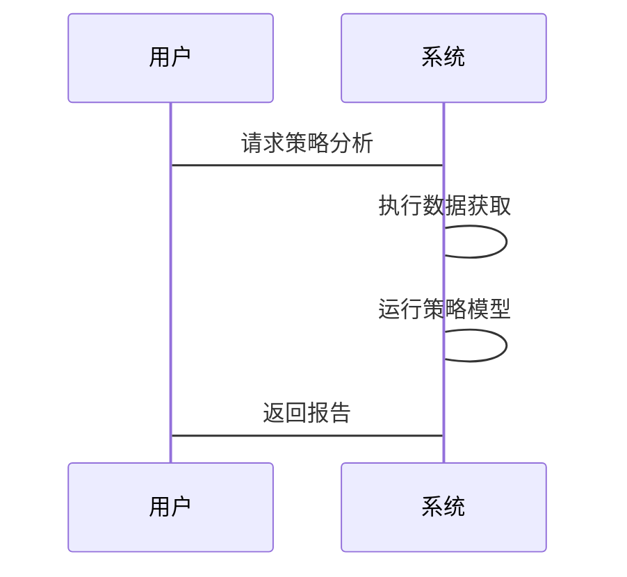

                 


```markdown
# 彼得林奇的"长期持有"vs"短期交易"

> 关键词：彼得林奇，长期持有，短期交易，投资策略，价值投资，技术分析

> 摘要：本文深入分析了彼得林奇的长期持有策略与短期交易策略的对比。通过背景介绍、核心概念对比、数学模型分析、系统架构设计、项目实战和总结展望，详细阐述了两种策略的特点、优劣势及其在投资中的应用。本文结合理论与实践，为投资者提供了全面的视角，帮助读者理解如何在不同市场环境下选择合适的投资策略。

---

## 第一部分: 彼得林奇投资理念的背景介绍

### 第1章: 长期持有与短期交易的定义与特点

#### 1.1 彼得林奇的长期持有策略
- 1.1.1 长期持有的定义
  - 长期持有是指投资者买入股票后，长期持有至企业价值实现的过程。
- 1.1.2 长期持有策略的特点
  - 买入优质资产，长期持有，等待企业成长。
  - 重点关注企业的基本面，而非短期市场波动。
- 1.1.3 长期持有策略的优势
  - 避免频繁交易带来的成本和错误。
  - 利用复利效应，长期实现财富增长。
- 1.1.4 长期持有策略的风险
  - 短期市场波动可能导致市值波动。
  - 需要投资者具备较高的选股能力。

#### 1.2 短期交易策略的定义与特点
- 1.2.1 短期交易的定义
  - 短期交易是指投资者在较短时间内买入卖出股票以获利的交易行为。
- 1.2.2 短期交易策略的特点
  - 依赖市场波动，通过高频交易获利。
  - 需要关注技术指标和市场情绪。
- 1.2.3 短期交易策略的优势
  - 可以快速捕捉市场机会，获得短期收益。
  - 适合市场波动较大时的操作。
- 1.2.4 短期交易策略的风险
  - 需要承担较高的交易成本。
  - 市场波动可能导致较大亏损。

#### 1.3 长期持有与短期交易的对比
- 1.3.1 投资目标对比
  - 长期持有：追求长期资本增值。
  - 短期交易：追求短期价差收益。
- 1.3.2 时间跨度对比
  - 长期持有：数年甚至数十年。
  - 短期交易：数天或数小时。
- 1.3.3 风险承受能力对比
  - 长期持有：较低，市场波动被摊薄。
  - 短期交易：较高，频繁波动可能导致大幅亏损。
- 1.3.4 交易成本对比
  - 长期持有：交易次数少，成本低。
  - 短期交易：交易次数多，成本高。
- 1.3.5 市场参与者的角色对比
  - 长期持有：主要是机构投资者和长期资金管理者。
  - 短期交易：主要是投机者和高频交易者。

---

## 第二部分: 长期持有与短期交易的核心概念对比

### 第2章: 核心概念对比分析

#### 2.1 核心概念对比表格
| 对比维度         | 长期持有策略                | 短期交易策略                |
|------------------|-----------------------------|-----------------------------|
| 投资目标         | 资本长期增值                | 短期价差收益                |
| 时间跨度         | 数年至数十年                | 数天至数小时                |
| 风险承受能力     | 较低                       | 较高                       |
| 交易频率         | 极低                       | 高                        |
| 投资策略         | 价值投资                   | 技术分析和市场情绪分析      |
| 适用场景         | 稳定增长的市场              | 波动较大的市场              |

#### 2.2 长期持有与短期交易的优劣势对比
- 长期持有：
  - 优势：规避短期波动风险，享受企业长期成长。
  - 劣势：需要较长的时间周期，短期内可能跑输市场。
- 短期交易：
  - 优势：能够快速捕捉市场机会，灵活应对市场变化。
  - 劣势：交易成本高，容易受到市场情绪影响。

---

## 第三部分: 长期持有与短期交易的数学模型与算法原理

### 第3章: 长期持有策略的数学模型

#### 3.1 价值投资模型
- 内在价值计算公式：
  $$ V = \frac{Earnings}{Weighted\ Discount\ Rate} $$
- 安全边际计算公式：
  $$ Margin\ of\ Safety = V - P $$
- 示例：
  - 某公司年净利润为100万元，合理估值为10倍市盈率，即1000万元。
  - 当股价为800万元时，安全边际为200万元。

### 第4章: 短期交易策略的数学模型

#### 4.1 技术分析指标
- 移动平均线（MA）：
  $$ MA_n = \frac{1}{n} \sum_{i=1}^{n} P_i $$
- 相对强弱指数（RSI）：
  $$ RSI = \frac{N}{N + M} \times 100 $$
  - N：上涨天数，M：下跌天数。

---

## 第四部分: 长期持有与短期交易的系统架构设计

### 第5章: 投资决策系统的架构设计

#### 5.1 系统功能设计
- 数据获取模块：
  - 从数据源获取股票价格、财务数据等。
- 策略执行模块：
  - 根据策略模型生成买卖信号。
- 结果分析模块：
  - 分析策略表现，生成报告。

#### 5.2 系统架构图

```mermaid
graph TD
    A[数据源] --> B[数据获取模块]
    B --> C[策略执行模块]
    C --> D[结果分析模块]
    D --> E[报告生成]
```


#### 5.3 接口设计
- 数据获取接口：
  - 输入：股票代码，时间范围。
  - 输出：历史数据。
- 策略执行接口：
  - 输入：数据，策略参数。
  - 输出：买卖信号。

#### 5.4 交互流程图


---

## 第五部分: 项目实战与案例分析

### 第6章: 长期持有与短期交易的实战应用

#### 6.1 环境安装
- 安装Python、Pandas、Matplotlib等工具。
  ```bash
  pip install numpy pandas matplotlib
  ```

#### 6.2 核心代码实现
- 长期持有策略实现：
  ```python
  import pandas as pd
  import numpy as np

  def calculate_intrinsic_value(earnings, discount_rate):
      return earnings / discount_rate

  def calculate_margin_of_safety(intrinsic_value, price):
      return intrinsic_value - price
  ```

- 短期交易策略实现：
  ```python
  def calculate_ma(prices, window):
      return prices.rolling(window).mean()

  def calculate_rsi(prices, window):
      delta = (prices - prices.shift(1)).fillna(0)
      up = delta.where(delta > 0, 0)
      down = delta.where(delta < 0, 0)
      rs = up.rolling(window).sum() / down.rolling(window).sum()
      return 100 - (100 - rs.ewm(com=window-1, min_periods=window).mean())
  ```

#### 6.3 案例分析
- 长期持有案例：
  - 选择某龙头公司股票，长期持有，观察其股价走势与内在价值的变化。
- 短期交易案例：
  - 根据技术指标生成买卖信号，进行模拟交易，分析收益情况。

#### 6.4 实战总结
- 长期持有策略：
  - 适合稳健型投资者，需要长期资金和耐心。
- 短期交易策略：
  - 适合激进型投资者，需要较高的市场敏感度和快速反应能力。

---

## 第六部分: 总结与展望

### 第7章: 总结与投资建议

#### 7.1 全文总结
- 彼得林奇的长期持有策略强调价值投资和长期持有，适合稳健型投资者。
- 短期交易策略注重技术分析和市场情绪，适合激进型投资者。
- 两者各有优劣，投资者应根据自身风险承受能力和投资目标选择合适策略。

#### 7.2 投资建议
- 长期持有策略：
  - 选择具有持续盈利能力和良好管理的公司。
  - 定期复检投资组合，调整持仓结构。
- 短期交易策略：
  - 灵活应对市场变化，合理控制仓位。
  - 严格遵守止损纪律，避免重大亏损。

---

## 作者信息

作者：AI天才研究院/AI Genius Institute & 禅与计算机程序设计艺术 /Zen And The Art of Computer Programming

---

感谢您的阅读，希望本文能为您提供有价值的投资思路！
```

