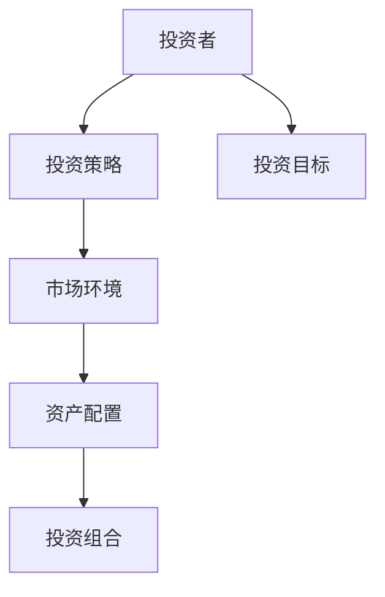
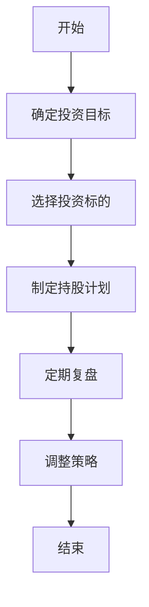
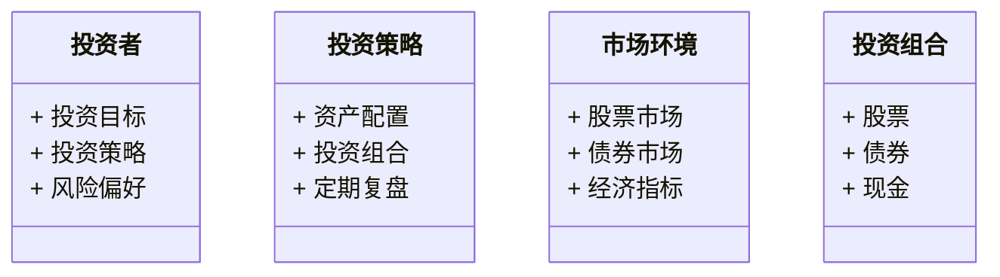
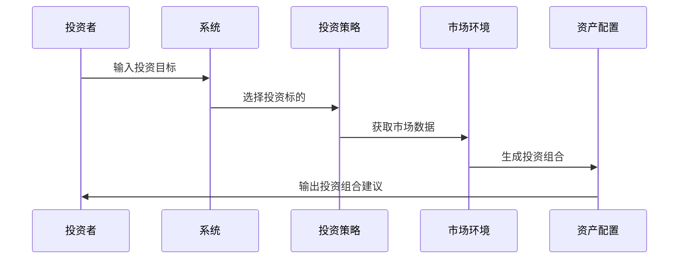

                 


# 彼得林奇的"长期持有"投资策略解析

## 关键词：彼得林奇, 长期持有, 投资策略, 价值投资, 风险管理

## 摘要：  
彼得林奇是全球最著名的价值投资者之一，他的"长期持有"策略强调选择优质企业长期投资，以时间复利创造财富。本文将从背景、原理、算法、系统架构等多维度深入解析这一策略，涵盖数学模型、风险管理、实际案例等，帮助投资者理解和应用。

---

# 第一部分: 长期持有投资策略的背景与基础

## 第1章: 彼得林奇与长期持有投资策略概述

### 1.1 彼得林奇及其投资理念
- 1.1.1 彼得林奇的生平简介
- 1.1.2 彼得林奇的投资哲学
- 1.1.3 长期持有的核心思想

### 1.2 长期持有投资策略的定义与特点
- 1.2.1 长期持有的定义
- 1.2.2 长期持有与其他投资策略的对比
- 1.2.3 长期持有策略的核心要素

### 1.3 长期持有策略的理论基础
- 1.3.1 价值投资理论
- 1.3.2 市场有效性的假设
- 1.3.3 长期持有与复利效应的关系

---

## 第2章: 长期持有投资策略的核心概念与联系

### 2.1 核心概念原理
- 2.1.1 长期持有的核心要素
- 2.1.2 投资标的的选择标准
- 2.1.3 持股期限的确定

### 2.2 核心概念属性特征对比
- 2.2.1 长期持有与短期交易的对比
- 2.2.2 高风险与低风险投资的对比
- 2.2.3 高收益与低收益的对比

### 2.3 ER实体关系图


---

## 第3章: 长期持有投资策略的算法原理

### 3.1 算法原理流程图


### 3.2 算法实现代码
```python
def long_term_holding_strategy(investment_goal, market_condition):
    investment_portfolio = []
    while True:
        selected_asset = select_asset(investment_goal, market_condition)
        investment_portfolio.append(selected_asset)
        performance = evaluate_performance(investment_portfolio)
        if performance < threshold:
            break
        else:
            continue
    return investment_portfolio
```

---

## 第4章: 长期持有投资策略的数学模型与公式

### 4.1 复利计算公式
$$
FV = PV \times (1 + r)^n
$$
其中，FV是终值，PV是现值，r是年化收益率，n是投资年数。

### 4.2 风险调整后的收益公式
$$
夏普比率 = \frac{E[r - r_f]}{\sigma}
$$
其中，\( E[r - r_f] \) 是资产的预期超额收益，\( \sigma \) 是其收益的标准差。

---

## 第5章: 系统架构与设计

### 5.1 系统功能设计


### 5.2 系统架构设计


### 5.3 系统接口设计
- 投资者输入：投资目标、风险偏好
- 系统输出：投资组合建议、定期复盘报告

### 5.4 系统交互设计


---

## 第6章: 项目实战与案例分析

### 6.1 环境配置
```bash
pip install pandas numpy matplotlib
```

### 6.2 核心代码实现
```python
import pandas as pd
import numpy as np

def select_asset(investment_goal, market_condition):
    # 选择投资标的的逻辑
    pass

def evaluate_performance(portfolio):
    # 评估投资组合表现的逻辑
    pass
```

### 6.3 案例分析
- 成功案例：长期持有优质股票的收益分析
- 失败案例：市场波动对投资组合的影响

### 6.4 代码解读与分析
- 代码实现细节
- 代码功能扩展

---

## 第7章: 总结与展望

### 7.1 最佳实践 tips
- 选择优质企业
- 定期复盘调整
- 风险管理优先

### 7.2 小结
长期持有策略的核心在于选择优质企业，通过时间复利创造财富，同时需要定期评估市场环境和投资组合表现。

### 7.3 注意事项
- 避免短期波动干扰
- 保持长期视角
- 分散投资降低风险

### 7.4 拓展阅读
- 《彼得·林奇的投资艺术》
- 《长期投资的数学模型》

---

## 作者：AI天才研究院 & 禅与计算机程序设计艺术

