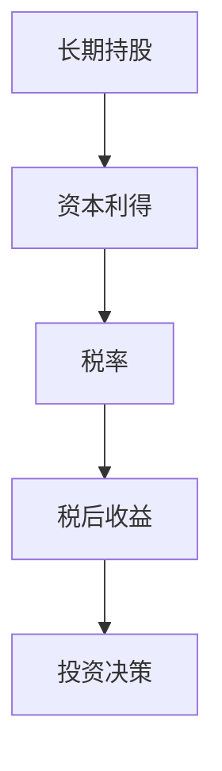
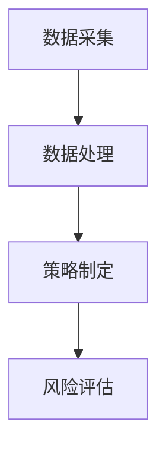

                 


# 彼得林奇的"长期持股"在不同税收政策下的优化

## 关键词
- 彼得林奇，长期持股，税收政策，投资优化，资本利得税

## 摘要
本文探讨了彼得林奇倡导的长期持股策略在不同税收政策下的优化方法。文章首先介绍了长期持股策略的核心理念及其在不同税收环境下的表现，接着分析了税收政策对投资行为的影响机制，详细讲解了如何通过优化算法和数学模型来应对不同的税收政策，最后通过实际案例分析了优化策略的效果，并提出了最佳实践建议。

---

## 正文

### 第一部分：背景介绍

#### 第1章：长期持股策略概述

##### 1.1 长期持股策略的定义
- **1.1.1 长期持股的定义**
  长期持股是指投资者将股票持有较长时间（通常超过一年）以获得资本利得，避免频繁交易带来的高额成本。

- **1.1.2 长期持股的核心理念**
  彼得林奇认为，长期持股的核心在于选择优质企业，耐心持有，避免短期波动干扰。

- **1.1.3 长期持股的优势与劣势**
  - **优势**：资本利得税较低，交易成本减少。
  - **劣势**：需承担市场波动风险，且在高税率环境下税负加重。

##### 1.2 税收政策的基本概念
- **1.2.1 税收政策的定义**
  税收政策是指政府对个人或企业所得征收的税费，直接影响投资收益。

- **1.2.2 不同国家的税收政策特点**
  - 美国：资本利得税分为短期和长期，长期税率较低。
  - 欧洲：部分国家资本利得税较高，且可能涉及其他税费。

- **1.2.3 税收政策对企业投资决策的影响**
  税率高低直接影响投资者的净收益，进而影响投资行为。

##### 1.3 长期持股与税收政策的相互作用
- **1.3.1 税收政策对长期持股的影响**
  税率变化会影响投资者的持有成本和收益。

- **1.3.2 长期持股对税收政策的反馈作用**
  投资者通过长期持股减少交易，降低税务部门的征管成本。

- **1.3.3 长期持股与税收政策的相互关系**
  税收政策影响投资策略，而投资策略又反过来影响税收政策的设计。

---

### 第二部分：核心概念与联系

#### 第2章：税收政策对投资行为的影响机制

##### 2.1 税收政策对投资收益的影响
- **2.1.1 税后收益计算公式**
  净收益 = 恐收益 - 税费。

- **2.1.2 不同税率对收益的影响**
  高税率环境下，长期持股的收益减少，影响投资积极性。

- **2.1.3 税收政策对投资决策的影响**
  投资者会根据税率调整资产配置，选择低税率环境进行投资。

##### 2.2 税收政策对投资风险的影响
- **2.2.1 税收政策对投资风险的调节作用**
  税收优惠政策可以降低投资风险。

- **2.2.2 不同税收政策下的风险评估**
  高税率增加了持有成本，提高了投资风险。

- **2.2.3 税收政策对投资者心理的影响**
  税收政策的不确定性会影响投资者的决策信心。

##### 2.3 长期持股与税收政策的关系
- 使用Mermaid流程图展示长期持股与税收政策的关系：



---

### 第三部分：算法原理

#### 第3章：优化算法的设计与实现

##### 3.1 优化算法的核心思想
- 通过动态规划或遗传算法优化投资组合，考虑税收因素。

##### 3.2 优化算法的实现步骤
- **步骤1**：收集不同税率下的历史数据。
- **步骤2**：建立数学模型，计算税后收益。
- **步骤3**：使用Python代码实现优化算法。

##### 3.3 代码实现
```python
import numpy as np
import pandas as pd

# 示例数据
data = pd.DataFrame({
    '收益': [1.05, 1.03, 1.07, 1.02],
    '税率': [0.15, 0.20, 0.10, 0.25]
})

# 计算税后收益
data['税后收益'] = data['收益'] * (1 - data['税率'])

print(data)
```

---

### 第四部分：数学模型

#### 第4章：数学模型的构建与分析

##### 4.1 投资收益的数学表达
$$\text{税后收益} = \text{收益} \times (1 - \text{税率})$$

##### 4.2 优化目标函数
$$\text{最大化} \sum (\text{收益}_i \times (1 - \text{税率}_i))$$

##### 4.3 约束条件
- 持股时间 ≥ 1年
- 税率范围：0 ≤ 税率 ≤ 0.3

---

### 第五部分：系统分析与架构设计

#### 第5章：系统架构与功能设计

##### 5.1 系统功能模块
- 数据采集模块：收集税率和收益数据。
- 策略制定模块：根据税率优化投资组合。
- 风险评估模块：评估不同税率下的投资风险。

##### 5.2 系统架构图


---

### 第六部分：项目实战

#### 第6章：实际案例分析

##### 6.1 案例背景
- 投资者持有股票A和B，税率分别为15%和20%。

##### 6.2 代码实现
```python
import numpy as np
import pandas as pd

# 数据
data = pd.DataFrame({
    '股票': ['A', 'B'],
    '收益': [1.2, 1.15],
    '税率': [0.15, 0.20]
})

# 计算税后收益
data['税后收益'] = data['收益'] * (1 - data['税率'])

# 找出最优投资组合
max_return = data['税后收益'].max()
optimal_stock = data.loc[data['税后收益'] == max_return, '股票'].values[0]

print(f"最优投资股票为：{optimal_stock}")
```

##### 6.3 结果分析
- 股票A的税后收益为1.2 * 0.85 = 1.02。
- 股票B的税后收益为1.15 * 0.80 = 0.92。
- 最优投资为股票A。

---

### 第七部分：最佳实践

#### 第7章：优化策略与建议

##### 7.1 最佳实践
- 选择低税率环境进行长期投资。
- 定期评估税收政策变化，调整投资组合。

##### 7.2 小结
本文通过分析不同税收政策下的长期持股策略，提出了优化投资组合的方法，为投资者提供了实际指导。

##### 7.3 注意事项
- 税收政策可能变化，需持续关注。
- 投资决策需结合市场环境和个人风险承受能力。

##### 7.4 拓展阅读
- 推荐阅读彼得林奇的相关著作，深入了解长期投资策略。

---

### 作者

**作者：AI天才研究院 & 禅与计算机程序设计艺术**

---

**摘要**：本文探讨了彼得林奇的长期持股策略在不同税收政策下的优化方法，分析了税收政策对投资行为的影响，并通过数学模型和算法优化提出了实际的投资策略。

