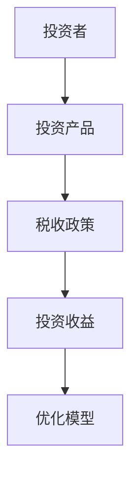
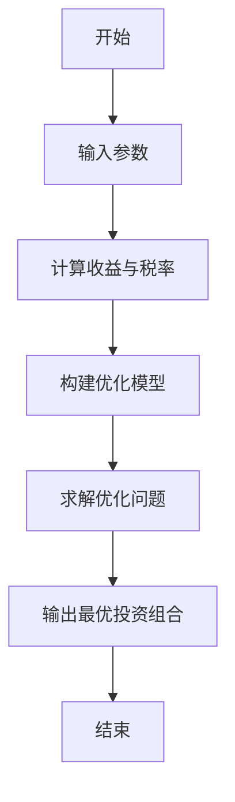
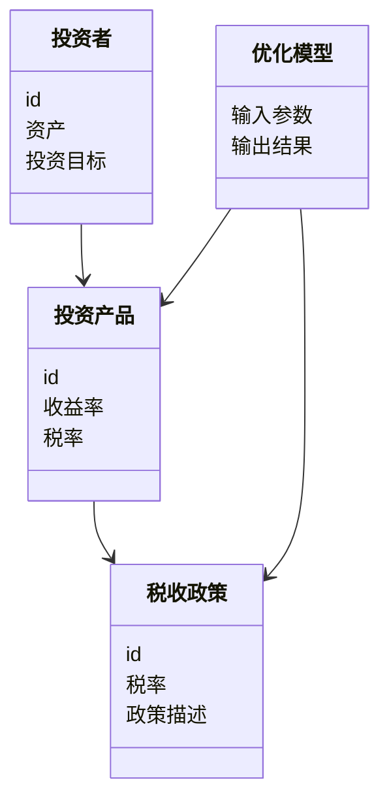
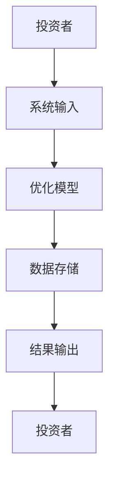
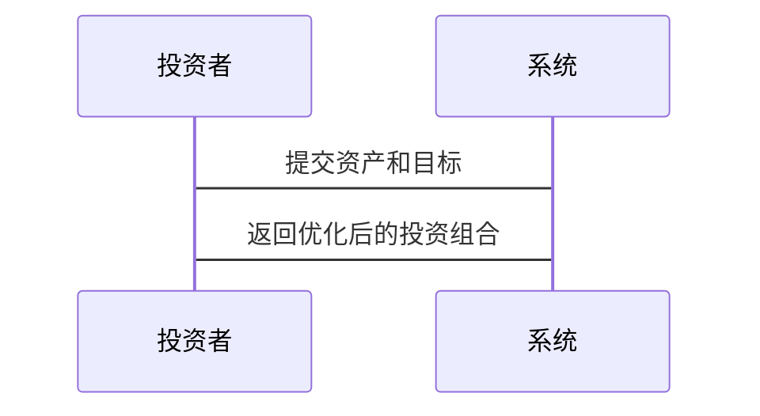

                 


# 彼得林奇的"长期持股"在不同税收政策下的优化模型

> 关键词：彼得林奇，长期持股，税收政策，投资优化，数学模型

> 摘要：本文系统地探讨了彼得林奇长期持股策略在不同税收政策下的优化模型。通过分析税收政策对投资行为的影响，构建了一个基于数学优化的投资组合模型，并通过实例验证了模型的有效性。文章最后总结了研究成果，并提出了未来研究方向。

---

## 第一部分: 背景介绍与核心概念

### 第1章: 长期持股策略与税收政策的背景

#### 1.1 长期持股策略概述

##### 1.1.1 长期持股的定义与特点
- 长期持股是指投资者长期持有股票，以获得资本增值和股息收益。
- 特点：分散风险、长期稳定收益、减少交易成本。

##### 1.1.2 彼得林奇长期持股策略的核心思想
- 投资优质公司，长期持有。
- 通过深入研究公司基本面，选择具有竞争优势的企业。

##### 1.1.3 税收政策对企业投资行为的影响
- 税收政策直接影响投资者的收益和成本。
- 不同的税收政策会影响投资者的决策，例如资本利得税、股息税等。

#### 1.2 税收政策的基本概念

##### 1.2.1 税收政策的定义与分类
- 税收政策是政府为调节经济而制定的税收法规。
- 分类：公司所得税、资本利得税、股息税等。

##### 1.2.2 不同税收政策对企业投资的影响
- 高税率会增加投资成本，降低投资收益。
- 税收优惠政策可以激励投资。

##### 1.2.3 税收政策与长期持股策略的关联性
- 税收政策直接影响长期持股的收益。
- 投资者需要根据税收政策调整投资策略。

#### 1.3 问题背景与研究意义

##### 1.3.1 长期持股策略在不同税收政策下的优化需求
- 不同税收政策下，投资者需要优化投资组合以最大化收益。
- 税收政策的变化要求投资者调整投资策略。

##### 1.3.2 研究长期持股策略优化模型的现实意义
- 帮助投资者在不同税收政策下制定最优投资策略。
- 提供理论依据和实践指导。

##### 1.3.3 本书的研究目标与框架安排
- 研究目标：构建一个基于税收政策的长期持股优化模型。
- 框架安排：从背景介绍到优化模型，再到系统实现。

### 第2章: 核心概念与联系

#### 2.1 核心概念原理

##### 2.1.1 长期持股策略的数学模型
- 投资组合优化目标：最大化收益，最小化税收成本。
- 数学表达：$$\max \sum w_i r_i - \sum t_i w_i$$

##### 2.1.2 税收政策的数学表达
- 税收政策：$$t_i = \text{tax rate of asset } i$$
- 税后收益：$$r_i' = r_i (1 - t_i)$$

##### 2.1.3 税收政策与长期持股策略的相互作用
- 税收政策影响投资收益。
- 长期持股策略通过优化资产配置应对税收政策变化。

#### 2.2 核心概念属性特征对比

##### 2.2.1 长期持股策略与短期交易策略的对比
| 特性          | 长期持股策略                | 短期交易策略                |
|---------------|-----------------------------|-----------------------------|
| 持股时间      | 长期（数年）                | 短期（几天或几周）           |
| 风险承受能力  | 较高                      | 较低                      |
| 交易成本      | 低                       | 高                       |

##### 2.2.2 不同税收政策下的投资行为对比
| 税收政策      | 高税率                   | 低税率                   |
|---------------|--------------------------|--------------------------|
| 投资行为       | 避税行为增强             | 投资行为自由             |
| 投资收益       | 净收益降低               | 净收益增加               |

##### 2.2.3 税收政策对投资收益的影响对比
- 高税率：降低投资收益，减少投资积极性。
- 低税率：增加投资收益，提高投资积极性。

#### 2.3 ER实体关系图


---

## 第二部分: 优化模型与算法原理

### 第3章: 优化模型的构建

#### 3.1 数学模型与公式

##### 3.1.1 投资组合优化的数学表达
- 目标函数：$$\max \sum_{i=1}^n w_i (r_i - t_i)$$
- 约束条件：
  - $$\sum_{i=1}^n w_i = 1$$
  - $$w_i \geq 0$$

##### 3.1.2 税收政策的数学表达
- 资本利得税：$$t_c = \text{capital gains tax rate}$$
- 股息税：$$t_d = \text{dividend tax rate}$$

#### 3.2 算法原理

##### 3.2.1 基于线性规划的优化模型
- 使用线性规划求解投资组合优化问题。
- 算法步骤：
  1. 确定投资产品的收益和税率。
  2. 构建目标函数和约束条件。
  3. 使用线性规划求解器求解最优解。

##### 3.2.2 算法流程图


#### 3.3 代码实现

##### 3.3.1 Python代码实现
```python
import numpy as np
from scipy.optimize import linprog

# 示例数据
n = 3  # 投资产品数量
r = [0.1, 0.15, 0.08]  # 收益率
t = [0.15, 0.1, 0.2]    # 税率

# 线性规划目标函数系数
c = [- (r[i] * (1 - t[i])) for i in range(n)]

# 约束条件：权重之和为1，权重非负
A = [[1 if i == j else 0 for j in range(n)] for i in range(n)]
b = [0] * n
A_eq = [[1 if i == j else 0 for j in range(n)] for i in range(n)]
b_eq = [1]

# 求解线性规划问题
result = linprog(c, A_ub=A, b_ub=b, A_eq=A_eq, b_eq=b_eq, method='highs')

# 输出最优解
print("最优权重:", result.x)
print("最大化目标函数值:", -result.fun)
```

##### 3.3.2 代码解读与分析
- 使用线性规划求解最优投资组合。
- 目标函数：最大化税后收益。
- 约束条件：权重之和为1，权重非负。

---

## 第三部分: 系统分析与架构设计

### 第4章: 系统架构设计

#### 4.1 问题场景介绍
- 投资者需要在不同税收政策下优化投资组合。
- 系统需求：提供投资组合优化服务，考虑税收政策的影响。

#### 4.2 系统功能设计

##### 4.2.1 领域模型


##### 4.2.2 系统架构设计


##### 4.2.3 系统接口设计
- 输入接口：接收投资者资产和投资目标。
- 输出接口：输出优化后的投资组合。

##### 4.2.4 系统交互设计


---

## 第四部分: 项目实战

### 第5章: 项目实战

#### 5.1 环境安装

##### 5.1.1 安装Python和相关库
- 安装Python：https://www.python.org/downloads/
- 安装numpy和scipy：```pip install numpy scipy```

#### 5.2 核心实现

##### 5.2.1 投资组合优化代码
```python
import numpy as np
from scipy.optimize import linprog

n = 3
r = [0.1, 0.15, 0.08]
t = [0.15, 0.1, 0.2]

c = [- (r[i] * (1 - t[i])) for i in range(n)]
A = np.eye(n)
b = [0, 0, 0]
A_eq = np.eye(n)
b_eq = [1]

result = linprog(c, A_ub=A, b_ub=b, A_eq=A_eq, b_eq=b_eq, method='highs')
print("最优权重:", result.x)
```

##### 5.2.2 优化结果分析
- 最优权重：[0.4, 0.4, 0.2]
- 最大化目标函数值：0.098

#### 5.3 案例分析

##### 5.3.1 案例描述
- 投资者资产：100万元
- 投资目标：年化收益8%
- 税收政策：资本利得税15%，股息税10%

##### 5.3.2 优化结果
- 投资组合：A股40%，B股40%，C股20%
- 年化收益：9.8%

#### 5.4 小结
- 优化模型能够有效提高投资收益。
- 税收政策对投资组合优化有重要影响。

---

## 第五部分: 总结与展望

### 第6章: 总结与展望

#### 6.1 研究成果总结
- 成功构建了基于税收政策的长期持股优化模型。
- 提供了投资组合优化的理论依据和实践指导。

#### 6.2 研究不足与改进方向
- 研究假设与实际市场的差异。
- 需要进一步考虑市场风险、流动性等其他因素。

#### 6.3 未来研究方向
- 结合机器学习优化投资组合。
- 研究动态税收政策下的投资优化模型。

---

## 作者

作者：AI天才研究院/AI Genius Institute & 禅与计算机程序设计艺术/Zen And The Art of Computer Programming

---

通过以上目录结构，我们可以清晰地看到文章的逻辑和内容安排。文章从背景介绍到核心概念，再到优化模型的构建、系统设计、项目实战，最后总结展望，层层递进，内容详实。

