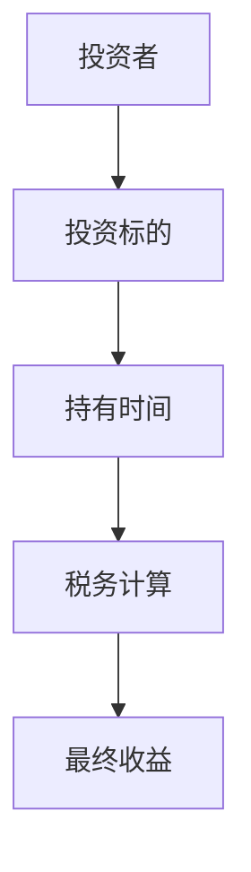
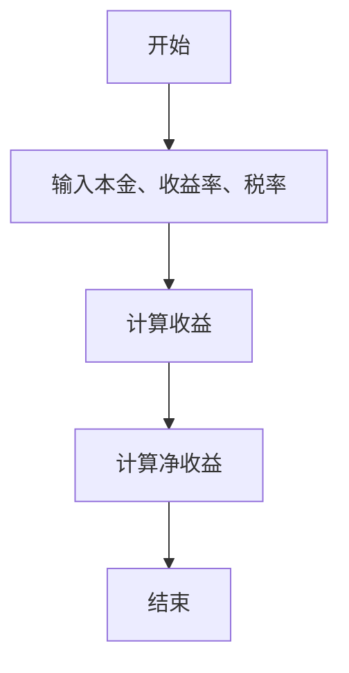

                 


# 彼得林奇的"长期持股"税收优化策略

## 关键词：彼得林奇，长期持股，税收优化，投资策略，资本利得

## 摘要：本文深入分析了彼得·林奇的长期持股策略及其与税收优化的结合，探讨了如何通过优化税务规划来提升投资回报。文章从背景介绍、核心概念、算法原理、数学模型、系统架构到项目实战，全面阐述了这一策略的实施方法和优化技巧，帮助投资者更好地理解和应用这一策略。

---

# 第一部分: 引言

## 1.1 本书的目的与意义
### 1.1.1 长期持股策略的重要性
长期持股是一种经典的投资策略，其核心在于通过长期持有优质资产，避免频繁交易带来的高额交易成本和市场波动风险。彼得·林奇作为投资大师，倡导长期持股理念，强调选择优质企业进行长期投资，以实现财富的稳步增长。

### 1.1.2 税收优化在投资中的作用
税收优化是提升投资回报的重要手段。在投资过程中，资本利得税、股息税等税务支出会对最终收益产生显著影响。通过合理规划税务，可以有效降低税务负担，提升实际投资回报率。

### 1.1.3 结合长期持股与税收优化的必要性
将长期持股与税收优化相结合，不仅能够降低税务负担，还能最大化投资收益。这种结合不仅是投资策略的优化，更是对税务规划的深度应用。

## 1.2 本书的结构与内容
### 1.2.1 各章的核心内容概述
- 第二部分：长期持股策略的背景与基础
- 第三部分：长期持股策略的核心概念与联系
- 第四部分：长期持股策略的算法原理
- 第五部分：长期持股策略的系统架构
- 第六部分：长期持股策略的项目实战
- 第七部分：长期持股策略的最佳实践

### 1.2.2 读者对象与预期收获
本书适合投资者、金融从业者以及对投资策略和税务优化感兴趣的专业人士阅读。通过阅读本书，读者将能够掌握长期持股与税收优化的核心原理，并能够将其应用于实际投资中。

### 1.2.3 本书的创新点与独特价值
本书的创新点在于将长期持股策略与税收优化相结合，通过数学模型和算法原理，系统性地阐述了如何通过优化税务规划来提升投资回报。本书的独特价值在于其理论与实践相结合的深度分析，为投资者提供了可操作的优化策略。

---

# 第二部分: 长期持股策略的背景与基础

## 2.1 长期持股策略的背景介绍
### 2.1.1 长期持股的定义与特点
- **定义**：长期持股是指投资者选择优质资产，持有数年至数十年，通过时间的积累实现财富增值。
- **特点**： 
  - 风险分散：通过长期持有分散投资风险。
  - 时间复利：利用复利效应实现收益最大化。
  - 低交易成本：减少频繁交易的手续费和税收支出。

### 2.1.2 长期持股的历史发展与现状
- **历史发展**：长期持股理念源于巴菲特、彼得·林奇等投资大师的实践，强调价值投资和长期持有。
- **现状**：在当前市场环境下，长期持股策略依然被广泛采用，尤其是在机构投资者和个人投资者中。

### 2.1.3 长期持股在投资组合中的地位
长期持股是投资组合的核心策略之一，尤其适合风险承受能力较强且追求稳定收益的投资者。

## 2.2 税收优化的基本原理
### 2.2.1 税收在投资中的影响
- 税收是投资成本的重要组成部分，影响投资收益。
- 不同类型的投资收益（如资本利得、股息）适用不同的税率，需合理规划。

### 2.2.2 税收优化的核心概念
- **税务合规**：在合法合规的前提下优化税务负担。
- **税率最低化**：通过合理安排投资结构，降低税率。
- **税后收益最大化**：通过优化税务规划，提升实际收益。

### 2.2.3 税收优化与投资策略的关系
- 税收优化是投资策略的重要组成部分，需与投资策略紧密结合。
- 合理的税务规划能够降低投资成本，提升整体收益。

## 2.3 长期持股与税收优化的联系
### 2.3.1 长期持股如何影响税务负担
- 长期持有资产可以享受较低的资本利得税率。
- 长期持股减少频繁交易的税务成本。

### 2.3.2 税收政策对长期持股策略的影响
- 税收政策的变化会影响长期持股的收益和成本。
- 不同国家和地区的税收政策差异需要投资者特别关注。

### 2.3.3 优化税收对投资回报的提升作用
- 通过优化税务规划，可以有效降低税务负担，提升投资回报率。
- 税收优化能够增强长期持股策略的盈利能力。

---

# 第三部分: 长期持股策略的核心概念与联系

## 3.1 核心概念原理
### 3.1.1 长期持股的数学模型
长期持股的收益计算公式：
$$ \text{收益} = \text{本金} \times (1 + r)^t - \text{本金} $$
其中，\( r \) 是年化收益率，\( t \) 是持有时间（年）。

### 3.1.2 税收优化的基本公式
税后收益计算公式：
$$ \text{净收益} = \text{收益} \times (1 - \text{税率}) $$

### 3.1.3 两者结合的优化算法
优化算法的目标是在满足税务合规的前提下，最大化投资收益。

## 3.2 核心概念属性特征对比表格
| 概念       | 特征1         | 特征2         | 特征3         |
|------------|---------------|---------------|---------------|
| 长期持股   | 时间跨度长     | 风险分散      | 收益稳定      |
| 税收优化   | 税率最低化     | 税务合规      | 税后收益最大化|

## 3.3 ER实体关系图


---

# 第四部分: 长期持股策略的算法原理

## 4.1 算法原理概述
### 4.1.1 长期持股的收益计算公式
$$ \text{收益} = \text{本金} \times (1 + r)^t - \text{本金} $$

### 4.2 税收优化算法
税后收益计算公式：
$$ \text{净收益} = \text{收益} \times (1 - \text{税率}) $$

### 4.3 算法流程图


## 4.4 Python实现代码
```python
def calculate_net_profit(principal, rate, tax_rate):
    profit = principal * (1 + rate) ** principal - principal
    net_profit = profit * (1 - tax_rate)
    return net_profit
```

---

# 第五部分: 长期持股策略的系统架构

## 5.1 系统功能设计
- **领域模型**：投资者、资产、持有时间、税率、收益。

## 5.2 系统架构设计


## 5.3 系统接口设计
- **输入接口**：本金、收益率、税率。
- **输出接口**：净收益。

---

# 第六部分: 长期持股策略的项目实战

## 6.1 环境安装
- 安装Python和相关库（如numpy、pandas）。

## 6.2 核心代码实现
```python
import numpy as np

def calculate_net_profit(principal, rate, tax_rate):
    profit = principal * (1 + rate) ** principal - principal
    net_profit = profit * (1 - tax_rate)
    return net_profit

# 示例计算
principal = 10000
rate = 0.07
tax_rate = 0.15
print(calculate_net_profit(principal, rate, tax_rate))
```

## 6.3 案例分析
假设本金为10000元，年化收益率为7%，税率15%，计算净收益。

---

# 第七部分: 长期持股策略的最佳实践

## 7.1 策略总结
- 合理规划税务，降低税收负担。
- 结合长期持股策略，实现收益最大化。

## 7.2 注意事项
- 税收政策变化需及时调整。
- 风险控制是投资的重要部分。

## 7.3 未来趋势
- 税收优化将更加智能化和个性化。
- 投资者需关注全球税收政策变化。

## 7.4 拓展阅读
- 《彼得·林奇的投资哲学》
- 《投资组合的税务优化》

---

# 作者：AI天才研究院/AI Genius Institute & 禅与计算机程序设计艺术 /Zen And The Art of Computer Programming

