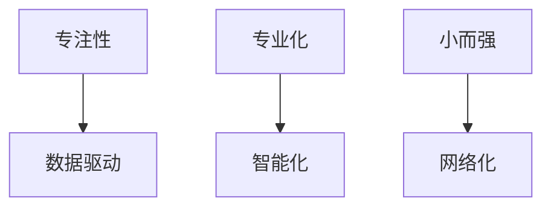
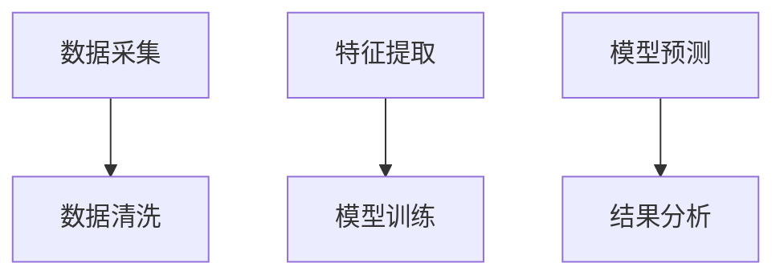

                 


# 彼得林奇的"隐形冠军"在工业互联网时代的特征演变

## 关键词：
彼得林奇、隐形冠军、工业互联网、特征演变、数据驱动、智能化、网络化

## 摘要：
本文深入分析了彼得林奇提出的“隐形冠军”概念在工业互联网时代的特征演变。通过对比传统“隐形冠军”与工业互联网时代的新特征，探讨了数据驱动、智能化和网络化对企业竞争力的影响。文章结合实际案例，详细阐述了算法原理、系统架构设计和项目实战，为读者提供了全面的视角和深度分析。

---

## 第一部分: 彼得林奇"隐形冠军"的背景与演变

### 第1章: 彼得林奇"隐形冠军"的定义与特征

#### 1.1 什么是“隐形冠军”
- **专注性**：专注于特定市场或领域，避免分散资源。
- **专业化**：在细分市场中具备独特的优势。
- **小而强**：规模小但竞争力强，能够与大型企业竞争。

#### 1.2 工业互联网时代的背景
- **数据驱动**：工业互联网通过数据采集和分析，优化企业运营。
- **智能化**：利用AI和机器学习提升决策效率。
- **网络化**：通过物联网和云计算实现协同合作。

#### 1.3 “隐形冠军”与传统冠军企业的区别
- 传统冠军：规模大、市场占有率高，但可能灵活性不足。
- 隐形冠军：专注细分市场，适应性强，能够快速调整策略。

### 第2章: “隐形冠军”在工业互联网时代的特征演变

#### 2.1 传统“隐形冠军”的特征
- 专注性：专注于特定领域，避免分散资源。
- 专业化：在细分市场中具备独特的优势。
- 小而强：规模小但竞争力强，能够与大型企业竞争。

#### 2.2 工业互联网时代的新特征
- 数据驱动：通过数据分析优化生产流程和决策。
- 智能化：利用AI和机器学习提升产品和服务的质量。
- 网络化：通过物联网实现设备、系统和数据的互联互通。

#### 2.3 对比分析
- **表格对比**：
| 特征 | 传统隐形冠军 | 工业互联网时代隐形冠军 |
|------|----------------|--------------------------|
| 专注性 | 高              | 高                      |
| 专业化 | 高              | 极高                    |
| 竞争力 | 强              | 极强                    |
| 数据驱动 | 低              | 高                      |
| 智能化 | 无              | 有                      |
| 网络化 | 低              | 高                      |

- **Mermaid图对比**：


---

## 第二部分: 数据驱动与智能化的算法原理

### 第3章: 数据驱动的决策能力

#### 3.1 数据采集与分析
- **数据采集**：通过传感器、数据库等获取生产过程中的数据。
- **数据分析**：利用大数据技术进行清洗、建模和挖掘，提取有价值的信息。

#### 3.2 数据驱动的算法实现
- **线性回归模型**：
  - 算法步骤：
    1. 数据预处理
    2. 模型训练
    3. 模型预测
    4. 模型评估
  - Python代码示例：
    ```python
    import numpy as np
    from sklearn.linear_model import LinearRegression

    # 示例数据
    X = np.array([1, 2, 3, 4, 5]).reshape(-1, 1)
    y = np.array([2, 4, 5, 4, 6])

    # 训练模型
    model = LinearRegression()
    model.fit(X, y)

    # 预测
    print(model.predict([[6]]))
    ```

- **流程图**：


---

## 第三部分: 系统分析与架构设计

### 第4章: 系统架构设计

#### 4.1 问题场景介绍
- 在工业互联网时代，企业需要构建一个高效的数据分析和决策支持系统。

#### 4.2 系统功能设计
- **领域模型**：
  ```mermaid
  classDiagram
  class 企业系统 {
    +数据源
    +数据处理模块
    +数据分析模块
    +决策模块
  }
  ```

- **系统架构图**：
  ```mermaid
  rectangle 企业系统 {
    component 数据采集模块 {
      --> 数据源
    }
    component 数据处理模块 {
      --> 数据清洗
      --> 特征提取
    }
    component 数据分析模块 {
      --> 模型训练
      --> 模型预测
    }
    component 决策模块 {
      --> 结果分析
    }
  }
  ```

#### 4.3 系统交互设计
- **序列图**：
  ```mermaid
  sequenceDiagram
  user -> 数据采集模块: 发起数据采集请求
  数据采集模块 -> 数据处理模块: 传输数据
  数据处理模块 -> 数据分析模块: 提供处理后的数据
  数据分析模块 -> 决策模块: 返回分析结果
  ```

---

## 第四部分: 项目实战

### 第5章: 制造业中的隐形冠军案例

#### 5.1 环境安装
- 安装Python、Jupyter Notebook和相关库（如pandas、numpy、scikit-learn）。

#### 5.2 代码实现
- **数据清洗**：
  ```python
  import pandas as pd

  # 读取数据
  df = pd.read_csv('manufacturing_data.csv')

  # 删除缺失值
  df.dropna(inplace=True)

  # 标准化处理
  df['revenue'] = df['revenue'].astype(int)
  ```

- **模型训练**：
  ```python
  from sklearn.model_selection import train_test_split
  from sklearn.ensemble import RandomForestRegressor

  # 划分数据集
  X = df[['cost', 'time']]
  y = df['revenue']

  X_train, X_test, y_train, y_test = train_test_split(X, y, test_size=0.2)

  # 训练模型
  model = RandomForestRegressor()
  model.fit(X_train, y_train)

  # 预测
  print(model.score(X_test, y_test))
  ```

#### 5.3 案例分析
- 通过数据驱动优化生产流程，提升效率和产品质量。
- 网络化协同降低生产成本，提高市场响应速度。

---

## 第五部分: 总结与展望

### 第6章: 总结与展望

#### 6.1 小结
- 工业互联网时代，“隐形冠军”需要具备数据驱动、智能化和网络化的新特征。
- 通过算法优化和系统设计，企业能够提升竞争力，抓住市场机遇。

#### 6.2 注意事项
- 数据安全和隐私保护是关键。
- 技术创新和人才培养是企业持续发展的核心。

#### 6.3 拓展阅读
- 推荐阅读《工业互联网白皮书》和《数据驱动的企业决策》。

---

## 作者：AI天才研究院 & 禅与计算机程序设计艺术

--- 

以上是文章的完整目录和部分正文内容，希望对您有所帮助！

