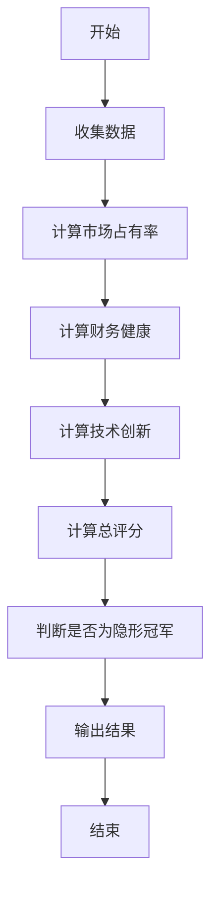
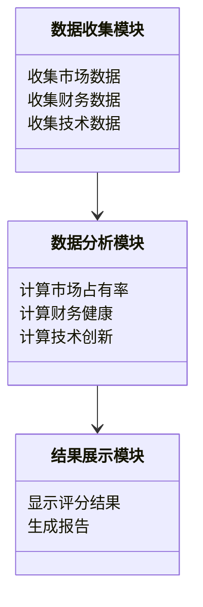

                 


# 彼得林奇的"隐形冠军"在新兴行业的识别

## 关键词：隐形冠军、彼得林奇、新兴行业、识别方法、数学模型、系统架构

## 摘要：本文深入探讨了彼得林奇提出的“隐形冠军”概念，并分析了其在新兴行业中的识别方法。通过详细讲解核心概念、对比分析、数学模型和系统架构设计，结合实际案例，为读者提供了从理论到实践的全面指导，帮助识别具有潜力的隐形冠军企业。

---

### 第一部分：背景介绍

#### 第1章：隐形冠军的概念与背景

##### 1.1 什么是隐形冠军
- **定义**：隐形冠军是指在特定细分市场占据领先地位，但不为大众所熟知的企业。
- **特点**：专注于特定领域，市场份额高，创新能力强，运营高效。
- **与传统冠军的区别**：传统冠军通常是行业巨头，而隐形冠军则在细分市场中占据主导地位。

##### 1.2 隐形冠军在新兴行业的重要性
- **新兴行业趋势**：新兴行业通常由技术创新驱动，市场空间大，竞争激烈。
- **隐形冠军的优势**：在新兴行业，隐形冠军往往能够快速适应变化，利用技术优势占据领先地位。
- **对投资的重要性**：识别隐形冠军可以帮助投资者在早期阶段发现高潜力企业，获得超额回报。

---

### 第二部分：隐形冠军的核心概念与联系

#### 第2章：隐形冠军的核心概念

##### 2.1 核心概念原理
- **市场定位**：隐形冠军通常专注于特定市场，避免与巨头直接竞争。
- **竞争优势**：依赖于技术创新、成本控制或独特的商业模式。
- **可持续发展性**：通过持续创新和优化运营，保持长期竞争优势。

##### 2.2 隐形冠军与新兴行业的关系
- **特征对比**：新兴行业中的隐形冠军通常具有高增长潜力，专注于新兴技术或市场。
- **角色与影响**：隐形冠军在新兴行业中扮演关键角色，推动技术创新和市场扩展。

#### 第3章：隐形冠军的核心要素对比

##### 3.1 隐形冠军与非隐形冠军的对比
- **市场占有率**：隐形冠军在特定市场中份额高，而非隐形冠军则在整体市场中份额较低。
- **财务表现**：隐形冠军通常具有稳定的财务表现和较高的利润率。
- **竞争优势**：隐形冠军依赖于独特的竞争优势，而非隐形冠军则可能依赖于价格或品牌。

##### 3.2 隐形冠军的ER实体关系图
```mermaid
erDiagram
    customer[客户]
    competitor[竞争对手]
    market[市场]
    company[公司]
    technology[技术]
    financial[财务指标]
    company <--- customer
    company <--- competitor
    company <--- market
    company <--- technology
    company <--- financial
```

---

### 第三部分：隐形冠军的识别方法

#### 第4章：识别隐形冠军的步骤

##### 4.1 市场分析法
- **行业分析**：研究新兴行业的市场规模、增长潜力和竞争格局。
- **市场定位分析**：评估公司在市场中的定位和竞争优势。
- **竞争对手分析**：分析竞争对手的市场份额和优势，找出潜在的隐形冠军。

##### 4.2 财务指标分析法
- **指标选择**：选择如净利润率、毛利率、研发投入等关键财务指标。
- **指标计算与分析**：通过财务数据评估公司的盈利能力和发展潜力。
- **综合评价**：结合多个指标进行综合评分，判断公司的财务健康状况。

#### 第5章：识别隐形冠军的算法原理

##### 5.1 算法原理概述
- **输入**：市场数据、财务指标、技术优势等。
- **输出**：隐形冠军的识别结果和评分。

##### 5.2 算法的数学模型
- **评分公式**：
  $$总评分 = 0.4 \times 市场占有率 + 0.3 \times 财务健康 + 0.3 \times 技术创新$$
- **模型解释**：市场占有率占40%，财务健康和技术创新各占30%，综合评估公司的整体竞争力。

##### 5.3 算法流程图


---

### 第四部分：系统分析与架构设计

#### 第6章：系统分析与架构设计

##### 6.1 问题场景介绍
- **目标**：开发一个系统，识别新兴行业中的隐形冠军。
- **范围**：涵盖数据收集、分析和结果展示。
- **约束条件**：数据来源可靠，系统需高效处理大数据。

##### 6.2 系统功能设计
- **领域模型类图**：


---

### 第五部分：项目实战

#### 第7章：项目实战

##### 7.1 环境安装与配置
- **工具**：Python、Pandas、Matplotlib、Mermaid。
- **步骤**：安装必要的库，配置开发环境。

##### 7.2 核心实现源代码
```python
import pandas as pd

# 示例数据
data = {
    '公司名称': ['A', 'B', 'C'],
    '市场占有率': [0.2, 0.15, 0.25],
    '财务健康': [0.8, 0.6, 0.7],
    '技术创新': [0.9, 0.5, 0.8]
}

df = pd.DataFrame(data)

# 计算总评分
df['总评分'] = 0.4 * df['市场占有率'] + 0.3 * df['财务健康'] + 0.3 * df['技术创新']

# 输出结果
print(df)
```

##### 7.3 案例分析
- **选择行业**：人工智能。
- **数据收集**：收集相关公司数据。
- **分析结果**：输出评分，判断哪些公司是隐形冠军。

##### 7.4 项目小结
- **总结**：通过系统化的分析和数学模型，成功识别了新兴行业中的隐形冠军。
- **经验**：数据质量和模型准确性是关键。

---

### 第六部分：总结与展望

#### 6.1 总结
- **核心内容回顾**：从理论到实践，详细讲解了隐形冠军的识别方法。
- **关键点**：结合市场分析、财务指标和数学模型，系统化识别隐形冠军。

#### 6.2 展望
- **未来趋势**：随着技术进步，隐形冠军的识别将更加依赖大数据和人工智能。
- **建议**：持续关注新兴行业，优化识别模型，提高准确性。

---

### 作者

作者：AI天才研究院/AI Genius Institute  
联系邮箱：contact@ai-genius.org  

---

通过本文，读者可以全面了解如何在新兴行业中识别隐形冠军，并通过实际案例和系统设计，掌握具体的识别方法。希望本文能为投资和企业战略决策提供有价值的参考。

