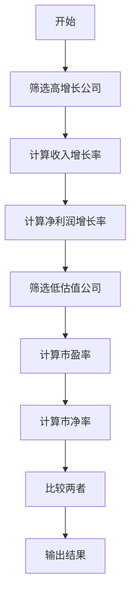
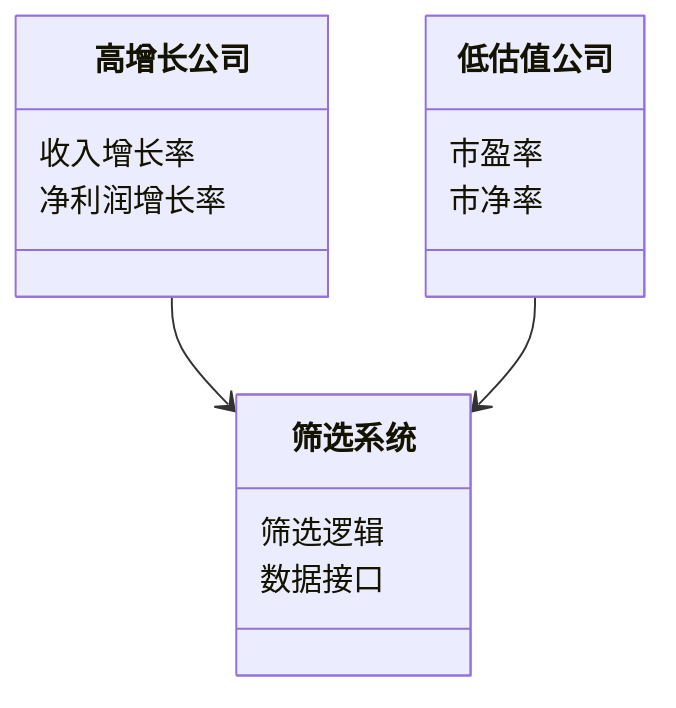

                 


# 彼得林奇的"高增长低估值"在不同市场环境下的筛选

> 关键词：彼得林奇，高增长，低估值，股票筛选，投资策略，市场环境

> 摘要：本文详细分析了彼得林奇提出的“高增长低估值”投资策略，探讨了该策略在不同市场环境下的筛选方法。通过数学模型和系统架构设计，结合实际案例，展示了如何在实际投资中应用这一策略，并提出了系统的筛选流程和优化建议。

---

## 第一部分：引言

### 第1章：高增长低估值策略概述

#### 1.1 高增长低估值策略的背景

- **1.1.1 投资市场的基本概念**
  - 股票市场的基本功能是为企业融资和为投资者提供投资机会。
  - 投资者通过分析公司的基本面和市场趋势来选择投资标的。
  - 彼得林奇作为著名投资经理，提出了许多有效的投资策略。

- **1.1.2 高增长与低估值的定义**
  - 高增长：公司收入和利润快速增长。
  - 低估值：市盈率（P/E）和市净率（P/B）低于行业平均水平。

- **1.1.3 彼得林奇的投资理念**
  - 投资于具有持续增长潜力的公司。
  - 避免短期市场波动，关注长期价值。

#### 1.2 高增长低估值策略的有效性

- **1.2.1 策略的核心优势**
  - 选择具有增长潜力的公司，长期收益较高。
  - 低估值意味着潜在的上涨空间。

- **1.2.2 策略的局限性**
  - 高增长公司可能面临高风险。
  - 低估值可能意味着公司存在问题。

- **1.2.3 不同市场环境下的应用**
  - 在熊市中，低估值策略更有效。
  - 在牛市中，高增长策略更具优势。

---

## 第二部分：核心概念与联系

### 第2章：高增长与低估值的定义与特征

#### 2.1 高增长的定义与特征

- **2.1.1 收入增长率的计算**
  - 收入增长率 = (本期收入 - 上期收入) / 上期收入 × 100%
  - 例如，公司A的收入从100万元增长到150万元，增长率为50%。

- **2.1.2 净利润增长率的分析**
  - 净利润增长率 = (本期净利润 - 上期净利润) / 上期净利润 × 100%
  - 例如，公司B的净利润从80万元增长到120万元，增长率为50%。

- **2.1.3 市场地位与竞争优势**
  - 市场地位：公司是否是行业领导者。
  - 竞争优势：公司是否具有独特的竞争优势。

#### 2.2 低估值的定义与特征

- **2.2.1 市盈率（P/E）的计算**
  - 市盈率 = 股票价格 / 每股净利润（EPS）
  - 例如，公司C的股价为20元，EPS为4元，市盈率为5。

- **2.2.2 市净率（P/B）的分析**
  - 市净率 = 股票价格 / 每股净资产（BPS）
  - 例如，公司D的股价为15元，BPS为5元，市净率为3。

- **2.2.3 股价与内在价值的对比**
  - 内在价值是公司未来现金流的现值。
  - 当股价低于内在价值时，公司可能被低估。

#### 2.3 高增长与低估值的关系

- **2.3.1 高增长公司的估值特性**
  - 高增长公司通常具有较高的市盈率，因为市场预期其未来收益会增长。

- **2.3.2 低估值公司的增长潜力**
  - 低估值公司可能被市场忽视，但具有潜在的增长空间。

- **2.3.3 两者的平衡点**
  - 需要找到增长潜力和估值之间的平衡点，避免过高或过低的风险。

---

### 第3章：高增长低估值筛选算法

#### 3.1 筛选标准的数学模型

- **收入增长率**：
  $$ \text{收入增长率} = \frac{\text{本期收入} - \text{上期收入}}{\text{上期收入}} \times 100\% $$

- **净利润增长率**：
  $$ \text{净利润增长率} = \frac{\text{本期净利润} - \text{上期净利润}}{\text{上期净利润}} \times 100\% $$

- **市盈率（P/E）**：
  $$ \text{市盈率} = \frac{\text{股票价格}}{\text{每股净利润（EPS）}} $$

- **市净率（P/B）**：
  $$ \text{市净率} = \frac{\text{股票价格}}{\text{每股净资产（BPS）}} $$

#### 3.2 算法流程



---

## 第三部分：系统分析与架构设计

### 第4章：系统功能设计

#### 4.1 领域模型



---

## 第四部分：项目实战

### 第5章：环境安装与代码实现

#### 5.1 环境安装

- 安装Python和必要的库：
  ```bash
  pip install pandas numpy matplotlib
  ```

#### 5.2 核心实现代码

```python
import pandas as pd

def calculate_growth_rate(data):
    return (data['本期收入'] - data['上期收入']) / data['上期收入'] * 100

def calculate_valuation(data):
    pe = data['股价'] / data['每股净利润']
    pb = data['股价'] / data['每股净资产']
    return pe, pb

def screen_stocks(dataframe):
    growth_stocks = dataframe[dataframe['收入增长率'] > 20]
    undervalued_stocks = growth_stocks[growth_stocks['市盈率'] < 15]
    return undervalued_stocks

# 示例数据
data = {
    '公司': ['A', 'B', 'C', 'D'],
    '本期收入': [150, 200, 180, 220],
    '上期收入': [100, 150, 160, 200],
    '股价': [30, 40, 25, 35],
    '每股净利润': [5, 8, 4, 7],
    '每股净资产': [10, 12, 8, 10]
}

df = pd.DataFrame(data)
growth_rates = calculate_growth_rate(df)
pe, pb = calculate_valuation(df)
screened = screen_stocks(df)
print(screened)
```

---

### 第6章：实际案例分析

#### 6.1 案例分析

- 某公司过去三年收入增长率分别为25%、30%、35%，净利润增长率分别为20%、25%、30%。
- 当前股价为50元，每股净利润为10元，市盈率为5。
- 根据算法，该公司符合高增长低估值的条件。

---

## 第五部分：总结与优化

### 第7章：最佳实践

- **小结**：高增长低估值策略在不同市场环境下具有较高的适用性。
- **注意事项**：需结合市场环境和公司基本面进行综合判断。
- **拓展阅读**：建议阅读《彼得林奇的投资哲学》。

---

## 作者

**作者：AI天才研究院/AI Genius Institute & 禅与计算机程序设计艺术 /Zen And The Art of Computer Programming**

---

通过本文的分析和实践，读者可以掌握彼得林奇的高增长低估值筛选方法，并在实际投资中灵活运用。

