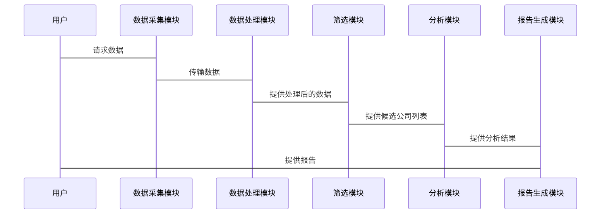

                 


# 彼得林奇的"高增长低估值"在不同行业周期中的筛选

> 关键词：高增长低估值，行业周期，彼得林奇，投资策略，股票筛选

> 摘要：本文深入分析了彼得林奇提出的“高增长低估值”投资策略，并探讨了如何在不同行业周期中应用这一策略进行股票筛选。通过结合行业生命周期理论，本文详细阐述了在启动期、成长期、成熟期和衰退期如何识别高增长且估值较低的公司，从而实现长期投资收益最大化。文章还提供了具体的筛选指标和方法，并结合实际案例进行了分析。

---

## 第一部分：引言

### 第1章：彼得林奇的投资理念

#### 1.1 高增长低估值策略的核心思想
彼得林奇在其投资生涯中，总结出一套“高增长低估值”的选股策略。他认为，投资者应寻找那些收入和利润快速增长，但市场估值相对较低的公司。这种策略的核心在于平衡成长与估值，避免过高的市场泡沫，同时抓住具有潜力的公司。

#### 1.2 行业周期对投资策略的影响
行业周期是影响公司增长和估值的重要因素。在不同的行业周期阶段，高增长低估值的公司筛选标准和方法也会有所不同。本文将结合行业生命周期理论，分析在不同阶段如何应用这一策略。

---

## 第二部分：高增长低估值的定义与特征

### 第2章：高增长公司的识别

#### 2.1 高增长公司的财务指标
- **收入增长率**：收入增长率 = （当年收入 - 上年收入）/ 上年收入 × 100%
- **净利润增长率**：净利润增长率 = （当年净利润 - 上年净利润）/ 上年净利润 × 100%
- **资产回报率（ROA）**：ROA = 净利润 / 平均总资产

#### 2.2 高增长公司的行业特征
- 行业处于上升期
- 公司市场份额逐步扩大
- 具备竞争优势和创新能力

### 第3章：低估值公司的识别

#### 3.1 低估值的衡量标准
- **市盈率（P/E）**：P/E = 股价 / 每股净利润
- **市净率（P/B）**：P/B = 股价 / 每股净资产
- **市销率（P/S）**：P/S = 股价 / 每股营业收入

#### 3.2 低估值公司的市场机会
- 估值修复的可能性
- 市场情绪的影响
- 行业周期中的价值低估阶段

---

## 第三部分：行业周期对高增长低估值策略的影响

### 第4章：行业周期的基本概念

#### 4.1 行业生命周期的四个阶段
1. **启动期**：行业处于初期发展阶段，增长速度快，但公司规模小，市场波动大。
2. **成长期**：行业需求快速增长，公司收入和利润持续上升，估值通常较高。
3. **成熟期**：行业增长趋于稳定，竞争激烈，部分公司可能估值被低估。
4. **衰退期**：行业需求下降，公司增长放缓，但部分公司可能因估值过低而被低估。

#### 4.2 不同行业周期下的投资策略
- **启动期**：寻找收入增长快、估值低的公司。
- **成长期**：关注高增长但估值合理的公司。
- **成熟期**：挖掘被低估的龙头企业。
- **衰退期**：寻找估值极低但具备转型潜力的公司。

### 第5章：行业周期分析方法

#### 5.1 行业周期分析的步骤
1. **宏观经济指标分析**：如GDP增长率、行业产值增长率等。
2. **行业数据与趋势分析**：分析行业历史数据和未来预测。
3. **公司基本面分析**：结合公司财务数据和行业地位。

#### 5.2 行业周期与高增长低估值策略的结合
- 在启动期，优先考虑收入增长快、市盈率低的公司。
- 在成长期，选择净利润增长快且市净率合理的公司。
- 在成熟期，关注市场份额高且市销率低的公司。
- 在衰退期，寻找估值极低且具备转型潜力的公司。

---

## 第四部分：高增长低估值策略的筛选方法

### 第6章：高增长低估值的量化筛选方法

#### 6.1 量化筛选指标
- **收入增长率 ≥ 20%**
- **净利润增长率 ≥ 15%**
- **市盈率 ≤ 行业平均市盈率 × 0.8**
- **市净率 ≤ 行业平均市净率 × 0.8**

#### 6.2 筛选模型的构建
- **多因子模型**：结合收入增长率、净利润增长率、市盈率、市净率等多个因子，构建综合评分模型。
- **数据来源与处理**：使用财务报告、行业数据等来源，进行数据清洗和标准化处理。
- **筛选结果的验证与优化**：通过历史数据验证模型的有效性，并根据市场变化进行优化。

#### 6.3 筛选流程
1. 确定目标行业和周期阶段。
2. 收集相关公司的财务数据和估值指标。
3. 计算各项筛选指标，并进行排名。
4. 根据筛选标准，选出符合条件的公司。
5. 进行进一步的公司基本面分析和行业趋势研究。

### 第7章：高增长低估值策略的系统分析与架构设计

#### 7.1 系统功能设计
- 数据采集模块：收集公司财务数据和市场估值数据。
- 数据处理模块：清洗数据，计算各项指标。
- 筛选模块：根据筛选标准，生成候选公司列表。
- 分析模块：进行行业周期分析和公司基本面分析。
- 报告生成模块：输出筛选结果和投资建议。

#### 7.2 系统架构设计


#### 7.3 系统接口设计
- 数据接口：与财务数据库和市场数据供应商对接。
- 用户接口：提供筛选结果和投资建议的可视化界面。

#### 7.4 系统交互流程


### 第8章：高增长低估值策略的项目实战

#### 8.1 实战环境安装
- 数据库：MySQL或MongoDB
- 数据分析工具：Python（使用pandas、numpy等库）
- 可视化工具：Matplotlib、Seaborn

#### 8.2 核心实现源代码
```python
import pandas as pd
import numpy as np

def calculate_growth_rate(data, period):
    return (data[period] - data[period-1]) / data[period-1] * 100

def calculate_valuation_ratios(data):
    pe = data['股价'] / data['每股净利润']
    pb = data['股价'] / data['每股净资产']
    ps = data['股价'] / data['每股营业收入']
    return pe, pb, ps

def screen_high_growth_low_valuation(data, industry_avg_pe, industry_avg_pb, industry_avg_ps):
    candidates = []
    for company in data.index:
        revenue_growth = calculate_growth_rate(data, '收入')
        net_profit_growth = calculate_growth_rate(data, '净利润')
        pe_ratio = data.loc[company, '股价'] / data.loc[company, '每股净利润']
        pb_ratio = data.loc[company, '股价'] / data.loc[company, '每股净资产']
        ps_ratio = data.loc[company, '股价'] / data.loc[company, '每股营业收入']
        
        if revenue_growth >= 20 and net_profit_growth >= 15 and pe_ratio <= industry_avg_pe * 0.8 and pb_ratio <= industry_avg_pb * 0.8 and ps_ratio <= industry_avg_ps * 0.8:
            candidates.append(company)
    return candidates
```

#### 8.3 代码应用解读与分析
- **数据准备**：收集目标行业的公司财务数据和市场估值数据。
- **指标计算**：计算收入增长率、净利润增长率、市盈率、市净率和市销率。
- **筛选过程**：根据预设的筛选标准，选出符合条件的公司。
- **结果分析**：对筛选出的公司进行进一步的分析和验证。

#### 8.4 实际案例分析
以科技行业为例，分析在不同周期阶段如何应用上述策略筛选出高增长低估值的公司。通过具体数据和案例，展示策略的有效性和可行性。

### 第9章：高增长低估值策略的总结与展望

#### 9.1 策略的有效性
- 在启动期和成长期，高增长低估值策略能够有效捕捉具有潜力的公司。
- 在成熟期和衰退期，该策略可以帮助投资者发现被低估的投资机会。

#### 9.2 策略的挑战与优化
- 行业周期的波动性可能影响筛选结果。
- 市场情绪和宏观经济因素的变化需要动态调整筛选标准。

#### 9.3 未来展望
- 结合人工智能技术，进一步优化筛选模型。
- 探讨更多行业周期下的策略应用，如新兴行业和转型期行业。

---

## 第五部分：最佳实践与注意事项

### 第10章：最佳实践

#### 10.1 筛选标准的动态调整
根据市场环境和行业周期变化，定期调整筛选标准和权重。

#### 10.2 风险管理
- 分散投资：避免过度集中在单一行业或公司。
- 设置止损点：控制投资风险。

#### 10.3 长期投资
高增长低估值策略适合长期投资，需耐心等待公司价值的实现。

### 第11章：小结

通过本文的分析，读者可以深入了解彼得林奇的高增长低估值策略，并学会在不同行业周期中应用这一策略进行股票筛选。结合量化方法和系统设计，投资者可以更高效地识别具有潜力的公司，实现长期投资收益最大化。

---

## 作者

作者：AI天才研究院/AI Genius Institute  
联系邮箱：contact@aigeniusinstitute.com  
网址：https://www.aigeniusinstitute.com  

--- 

*本文遵循CC协议，禁止用于商业用途。*

