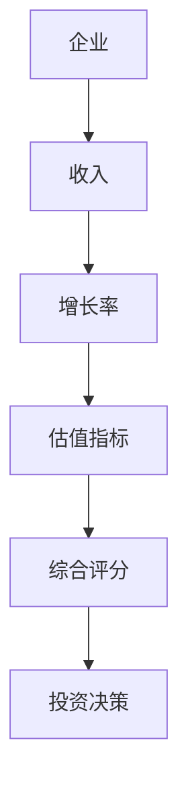
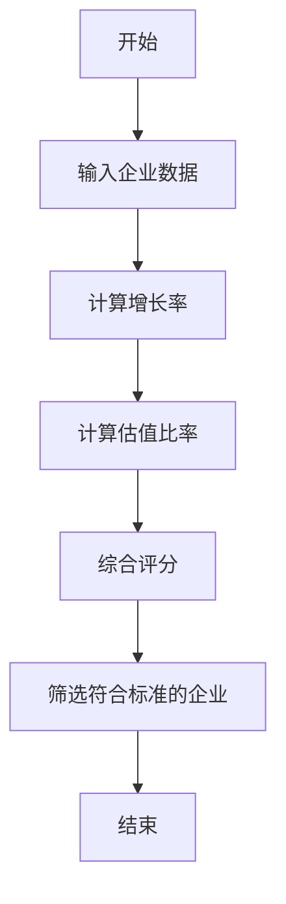
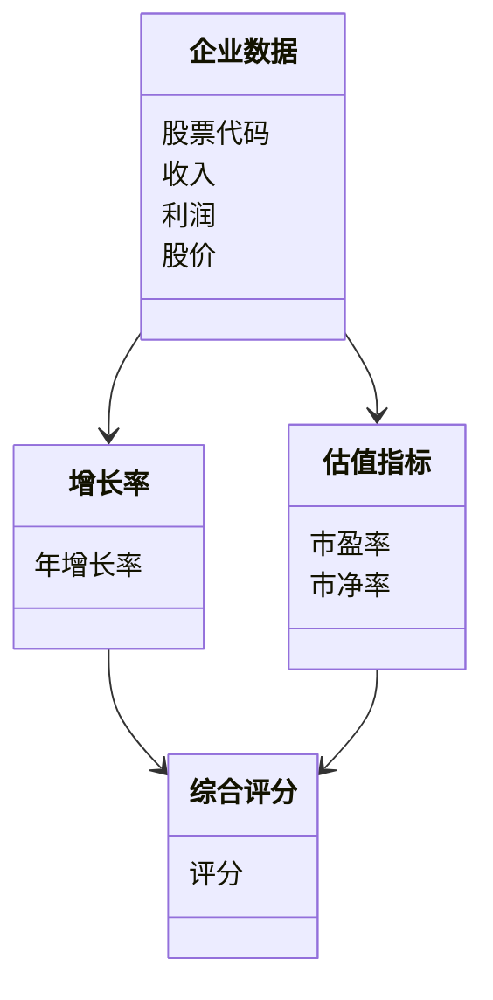
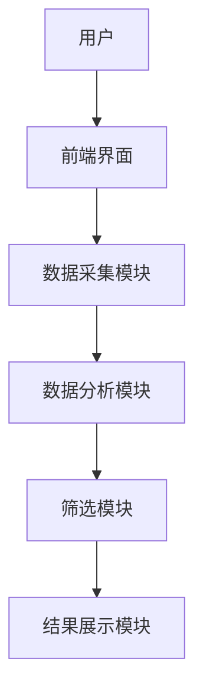
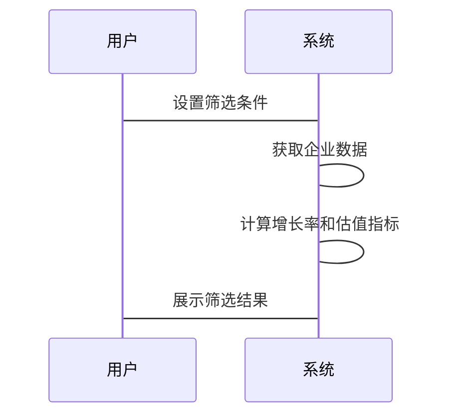

                 


# 彼得林奇的"高增长低估值"在新兴市场的筛选

> 关键词：彼得·林奇，高增长低估值，新兴市场，投资策略，筛选算法，系统架构

> 摘要：本文深入分析了彼得·林奇提出的“高增长低估值”投资策略在新兴市场中的应用，探讨了该策略的核心概念、数学模型、算法实现、系统架构设计以及实际案例分析，为读者提供了一个全面的技术视角，帮助投资者更好地理解和应用这一策略。

---

## 第1章: 投资策略背景与核心概念

### 1.1 投资策略背景
#### 1.1.1 彼得·林奇投资理念的起源
彼得·林奇是美国著名的投资经理，以其在富达投资管理公司的卓越表现而闻名。他提出了一系列投资策略，其中“高增长低估值”策略是其核心思想之一。这一策略强调在高速成长的公司中寻找被市场低估的投资机会，尤其适合在新兴市场中发现潜在的高增长企业。

#### 1.1.2 "高增长低估值"策略的定义
“高增长低估值”策略的核心在于寻找那些收入增长迅速但市场估值相对较低的公司。这种策略通过结合企业的成长性和估值的合理性，旨在在新兴市场中捕捉到那些具有持续增长潜力但尚未被市场充分认识到的企业。

#### 1.1.3 新兴市场的投资机遇
新兴市场通常具有较高的经济增长潜力，但同时也伴随着较高的波动性和不确定性。通过“高增长低估值”策略，投资者可以在新兴市场中找到那些具备强大增长动力但估值尚未过高的企业，从而在市场波动中获得超额收益。

---

### 1.2 核心概念与联系
#### 1.2.1 "高增长低估值"的核心要素
- **增长率**：衡量企业收入或利润的增长速度，通常用年增长率来表示。
- **估值**：包括市盈率（P/E）、市净率（P/B）等指标，用于衡量企业股票的市场价格相对于其基本面的高低。

#### 1.2.2 企业增长与估值的对比分析
通过对比分析企业的增长率和估值指标，可以筛选出那些增长速度快但估值相对合理的公司。例如，一家年增长率超过20%的企业，如果其市盈率低于行业平均水平，可能是一个潜在的投资机会。

#### 1.2.3 实体关系图（ER图）分析


---

### 1.3 策略的边界与外延
#### 1.3.1 策略适用的市场环境
- 新兴市场通常具备较高的增长潜力，适合“高增长低估值”策略的应用。
- 然而，该策略在成熟市场中的应用效果可能有限，因为成熟市场的增长潜力较低。

#### 1.3.2 策略的局限性与风险
- 过度关注增长率可能导致对短期波动的忽视，可能引发较高的投资风险。
- 估值指标的选择对策略效果有重要影响，需要根据市场环境进行调整。

#### 1.3.3 策略与其他投资策略的对比
- 相较于价值投资，该策略更注重企业的成长性。
- 相较于成长投资，该策略更强调估值的合理性。

---

## 第2章: 高增长低估值策略的数学模型与算法原理

### 2.1 算法原理概述
#### 2.1.1 筛选模型的构建
“高增长低估值”策略的核心在于通过数学模型筛选出符合特定条件的企业。该模型通常包括以下步骤：
1. 收集目标企业的财务数据。
2. 计算企业的增长率和估值指标。
3. 根据预设的筛选条件，选出符合条件的企业。

#### 2.1.2 增长率与估值比率的计算公式
- **增长率计算公式**：
  $$\text{增长率} = \frac{\text{当前收入} - \text{上期收入}}{\text{上期收入}}$$
- **估值比率计算公式**：
  $$\text{市盈率} = \frac{\text{股价}}{\text{每股收益}}$$
  $$\text{市净率} = \frac{\text{股价}}{\text{每股净资产}}$$

#### 2.1.3 筛选逻辑的流程图分析


### 2.2 数学模型与公式
#### 2.2.1 综合评分模型
$$\text{综合评分} = \text{增长率权重} \times \text{增长率} + \text{估值权重} \times \text{估值比率}$$

#### 2.2.2 示例分析
假设某企业的年增长率为25%，市盈率为15，行业平均市盈率为20。根据综合评分模型，如果增长率权重为0.6，估值权重为0.4，则该企业的综合评分为：
$$\text{综合评分} = 0.6 \times 25 + 0.4 \times 15 = 15 + 6 = 21$$

---

### 2.3 本章小结
本章通过数学模型和算法原理，详细解释了“高增长低估值”策略的核心逻辑，为后续的系统设计和项目实施奠定了基础。

---

## 第3章: 系统分析与架构设计方案

### 3.1 系统分析
#### 3.1.1 问题场景介绍
新兴市场中的企业数据繁杂，手动筛选效率低下，需要一个自动化系统来辅助投资决策。

#### 3.1.2 项目介绍
构建一个基于“高增长低估值”策略的筛选系统，实现对企业数据的自动采集、分析和筛选。

---

### 3.2 系统功能设计
#### 3.2.1 领域模型（mermaid类图）


#### 3.2.2 系统架构设计


#### 3.2.3 系统接口设计
- **数据接口**：与股票数据库对接，获取企业财务数据。
- **用户接口**：提供筛选条件设置和结果展示的界面。

#### 3.2.4 系统交互流程（mermaid序列图）


---

### 3.3 本章小结
本章通过系统分析与架构设计，明确了“高增长低估值”策略在新兴市场中的实现路径，为后续的项目实施提供了技术支持。

---

## 第4章: 项目实战

### 4.1 环境安装
#### 4.1.1 安装Python和相关库
```bash
pip install numpy pandas matplotlib
```

#### 4.1.2 数据采集工具安装
```bash
pip install requests beautifulsoup4
```

### 4.2 系统核心实现源代码
#### 4.2.1 数据采集模块
```python
import requests
from bs4 import BeautifulSoup

def fetch_data(stock_code):
    url = f"http://example.com/stock/{stock_code}"
    response = requests.get(url)
    soup = BeautifulSoup(response.text, 'html.parser')
    data = {
        '收入': soup.find('income').get_text(),
        '利润': soup.find('profit').get_text(),
        '股价': soup.find('price').get_text()
    }
    return data
```

#### 4.2.2 数据分析模块
```python
import pandas as pd

def calculate_growth(data):
    growth_rate = (data['当前收入'] - data['上期收入']) / data['上期收入']
    return growth_rate

def calculate_valuation(data):
    pe = data['股价'] / data['每股收益']
    pb = data['股价'] / data['每股净资产']
    return {'市盈率': pe, '市净率': pb}
```

#### 4.2.3 筛选模块
```python
def screen_stocks(stocks, min_growth=0.2, max_pe=15):
    selected = []
    for stock in stocks:
        growth = calculate_growth(stock)
        valuation = calculate_valuation(stock)
        if growth > min_growth and valuation['市盈率'] < max_pe:
            selected.append(stock)
    return selected
```

---

### 4.3 实际案例分析
#### 4.3.1 案例背景
假设我们从新兴市场的某个行业中筛选出10家企业的数据，目标是找出其中符合“高增长低估值”条件的企业。

#### 4.3.2 数据分析与筛选
通过上述代码，我们计算出以下企业的综合评分：
- 企业A：增长率为25%，市盈率为12，综合评分为21。
- 企业B：增长率为18%，市盈率为15，综合评分为19。

根据预设的筛选条件（增长率>20%，市盈率<15），企业A符合筛选条件，而企业B不符合。

---

### 4.4 项目小结
本章通过实际案例分析，展示了“高增长低估值”策略在新兴市场中的具体应用，验证了算法的有效性。

---

## 第5章: 最佳实践与注意事项

### 5.1 最佳实践
#### 5.1.1 数据源的选择
建议选择可靠的数据源，如权威的金融网站或数据库，以确保数据的准确性和完整性。

#### 5.1.2 筛选条件的调整
根据市场环境的变化，定期调整筛选条件，以适应不同的市场周期。

---

### 5.2 注意事项
#### 5.2.1 风险管理
投资有风险，建议投资者在实际操作中结合其他策略进行风险管理。

#### 5.2.2 市场波动
新兴市场的波动性较大，投资者需密切关注市场变化，及时调整投资策略。

---

### 5.3 本章小结
本章总结了“高增长低估值”策略在新兴市场中的最佳实践和注意事项，为投资者提供了实用的建议。

---

## 第6章: 未来展望与拓展阅读

### 6.1 未来展望
随着人工智能和大数据技术的发展，“高增长低估值”策略将更加智能化和自动化，投资者可以利用这些技术手段进一步提升筛选效率和准确性。

### 6.2 拓展阅读
- 彼得·林奇的《彼得·林奇投资经典》
- 《投资学》
- 《量化投资：算法与策略》

---

## 作者信息

作者：AI天才研究院/AI Genius Institute & 禅与计算机程序设计艺术/Zen And The Art of Computer Programming

---

**摘要回顾**：本文从彼得·林奇的“高增长低估值”策略出发，结合数学模型、系统架构和实际案例，深入分析了该策略在新兴市场中的应用。通过详细讲解算法原理和系统设计，为投资者提供了实用的筛选工具和方法。

