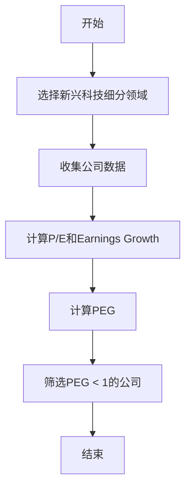
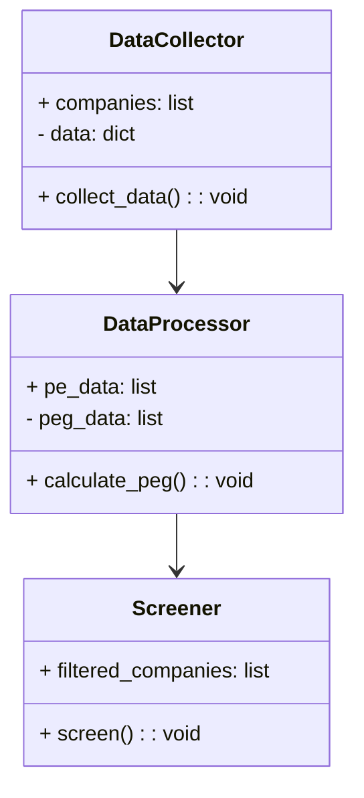

                 


# 彼得林奇的"高增长低估值"在新兴科技细分领域的筛选

## 关键词：
彼得·林奇，高增长，低估值，新兴科技，细分领域，投资策略，算法分析，系统架构，项目实战

## 摘要：
本文深入探讨了彼得·林奇的“高增长低估值”投资策略在新兴科技细分领域的应用。通过分析高增长和低估值的定义与特征，结合新兴科技领域的独特特点，提出了具体的筛选方法和系统架构。文章详细讲解了PEG指标的计算方法，并通过Python代码实现，结合实际案例分析，为投资者提供了实用的指导和建议。

---

## 正文部分：

# 引言

## 1. 彼得·林奇投资理念概述

### 1.1 彼得·林奇的投资者哲学
彼得·林奇是全球著名投资家，强调长期投资和价值发现。他的理念注重公司基本面分析，寻找具有高增长潜力且估值合理的公司。

### 1.2 高增长低估值投资策略的核心思想
高增长与低估值的结合，确保公司在未来有较大的增长空间，同时当前估值合理，降低投资风险。

### 1.3 新兴科技细分领域的投资机会
新兴科技领域变化快，细分领域丰富，适合应用彼得·林奇的策略筛选出高增长且低估值的公司。

---

# 背景与理论基础

## 2. 高增长低估值的核心概念

### 2.1 高增长的定义与衡量标准
高增长公司通常具有稳定的收入增长和较高的净利润增长率。常用指标包括年复合增长率（CAGR）和营业利润率。

### 2.2 低估值的定义与衡量标准
低估值通过市盈率（P/E）、市净率（P/B）等指标衡量，寻找低于行业平均水平的公司。

### 2.3 高增长与低估值的矛盾与统一
高增长可能导致高估值，但通过深入分析，找到估值低于实际价值的公司是关键。

---

# 新兴科技细分领域的特点

## 3. 新兴科技细分领域的投资机会

### 3.1 新兴科技领域的定义与分类
新兴科技包括人工智能、大数据、区块链等领域，细分领域众多，机会与挑战并存。

### 3.2 新兴科技细分领域的增长特征
新兴科技公司增长速度快，但市场波动大，需关注技术创新和市场潜力。

### 3.3 新兴科技细分领域的估值特点
新兴科技公司估值波动大，需结合技术壁垒和市场前景进行综合评估。

---

# 彼得·林奇方法在新兴科技细分领域的应用

## 4. 算法原理与实现

### 4.1 PEG指标的计算
PEG = P/E / Earnings Growth。用于评估市盈率是否合理，寻找低估值的高增长公司。

### 4.2 Python代码实现

```python
import pandas as pd

def calculate_peg(dataframe):
    dataframe['PEG'] = dataframe['P/E'] / dataframe['Earnings Growth (%)']
    return dataframe

# 示例数据
data = {
    'Company': ['TechA', 'TechB', 'TechC'],
    'P/E': [15, 20, 12],
    'Earnings Growth (%)': [20, 15, 10]
}

df = pd.DataFrame(data)
calculate_peg(df)
print(df)
```

### 4.3 算法流程图


---

## 5. 系统分析与架构设计

### 5.1 系统功能设计
- 数据收集模块：获取公司财务数据。
- 数据处理模块：计算P/E和PEG。
- 筛选模块：根据PEG指标筛选公司。

### 5.2 系统架构图


---

## 6. 项目实战

### 6.1 环境安装
安装必要的Python库，如pandas和mermaid。

### 6.2 核心代码实现
```python
import pandas as pd

# 示例数据
data = {
    'Company': ['AI Corp', 'Data Tech', 'Block Chain Inc'],
    'P/E': [18, 22, 10],
    'Earnings Growth (%)': [15, 20, 8]
}

df = pd.DataFrame(data)
df['PEG'] = df['P/E'] / df['Earnings Growth (%)']

# 筛选PEG < 1的公司
filtered_companies = df[df['PEG'] < 1]['Company'].tolist()
print("筛选出的公司：", filtered_companies)
```

### 6.3 实际案例分析
分析某新兴科技公司，计算其PEG，判断是否符合筛选标准。

### 6.4 项目总结
通过代码实现筛选过程，验证彼得·林奇策略的有效性。

---

## 7. 总结与注意事项

### 7.1 总结
新兴科技细分领域潜力大，通过彼得·林奇的高增长低估值策略，结合系统分析和算法，能够有效筛选出优质投资标的。

### 7.2 注意事项
- 数据来源的准确性
- 模型的适用性
- 定期更新和维护

### 7.3 拓展阅读
推荐相关书籍和文章，深入学习投资策略。

---

# 参考文献
1. 彼得·林奇著：《彼得·林奇的投资策略》
2. Python官方文档
3. Mermaid图表工具教程

---

# 作者信息
作者：AI天才研究院 & 禅与计算机程序设计艺术

