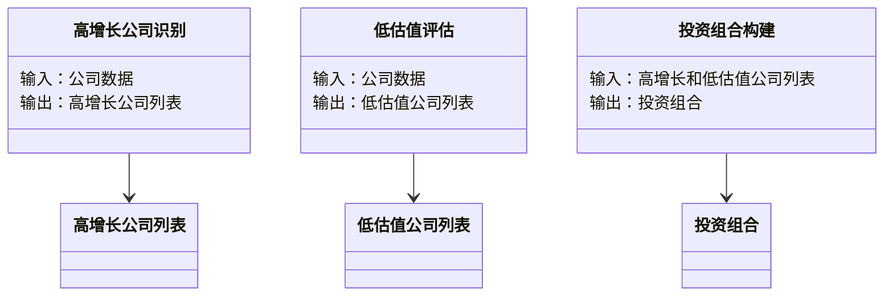
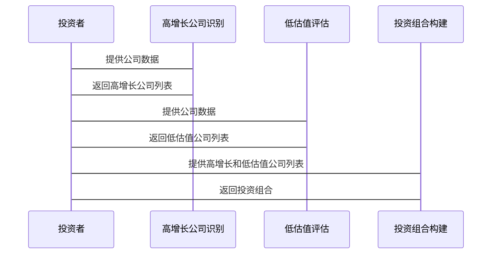

                 


# 彼得林奇的"高增长低估值"案例分析

## 关键词：彼得林奇，高增长低估值，投资策略，案例分析，系统架构

## 摘要

本文详细分析了彼得·林奇的“高增长低估值”投资策略，探讨了其背后的理论基础、具体实施方法和实际案例。通过构建数学模型和系统架构，展示了如何识别高增长公司并评估其低估值状态，最终构建有效的投资组合。文章还结合实际项目，展示了如何利用技术手段辅助投资决策，并提供了最佳实践建议。

---

# 引言

## 1.1 彼得林奇与"高增长低估值"策略

### 1.1.1 彼得林奇的生平与投资风格

彼得·林奇（Peter Lynch）是美国著名的投资专家，以其在共同基金管理领域的卓越表现闻名。他强调基本面分析和长期投资，尤其擅长识别具有高增长潜力的公司。

### 1.1.2 "高增长低估值"策略的提出背景

该策略源于20世纪80年代，当时市场中许多高增长公司因估值过低而被忽视。林奇发现，这些公司具备巨大的增值潜力。

### 1.1.3 该策略的核心思想与目标

通过投资高增长但被低估的公司，林奇实现了长期稳定的收益。这一策略的核心是平衡增长与估值，寻找被市场忽视的潜力股。

---

## 2.1 高增长公司的定义与特征

### 2.1.1 高增长公司的定义

高增长公司指的是收入和利润持续增长的公司，通常处于扩张期，市场占有率不断提升。

### 2.1.2 高增长公司的主要特征

| 特征 | 描述 |
|------|------|
| 收入增长率 | 年增长率超过行业平均水平 |
| 净利润增长率 | 利润持续增长，ROE高 |
| 市场占有率 | 市场份额不断提升 |
| 竞争优势 | 独特的核心竞争力 |

### 2.1.3 高增长公司的财务指标分析

#### 收入增长率模型

$$\text{收入增长率} = \frac{\text{本期收入} - \text{上期收入}}{\text{上期收入}} \times 100\%$$

#### 净利润增长率模型

$$\text{净利润增长率} = \frac{\text{本期净利润} - \text{上期净利润}}{\text{上期净利润}} \times 100\%$$

---

## 2.2 低估值的定义与评估方法

### 2.2.1 低估值的定义

低估值公司是指其股价低于其内在价值的公司，通常表现为市盈率和市净率低于行业平均水平。

### 2.2.2 常用估值指标

| 指标 | 公式 |
|------|------|
| 市盈率（P/E） | $$\text{P/E} = \frac{\text{股价}}{\text{每股收益}}$$ |
| 市净率（P/B） | $$\text{P/B} = \frac{\text{股价}}{\text{每股净资产}}$$ |

### 2.2.3 彼得林奇的估值方法

林奇常用“圆圈理论”来评估低估值公司，即公司价值远低于其实际价值。

---

## 2.3 高增长与低估值的关系

### 2.3.1 高增长与低估值的内在联系

高增长可能导致低估值，因市场可能未充分认识到其增长潜力。

### 2.3.2 高增长可能导致低估值的原因

1. **市场预期不足**：市场低估了公司的增长潜力。
2. **周期性波动**：公司处于低谷期，暂时被低估。

### 2.3.3 低估值公司的潜在价值

低估值公司具备较高的增值空间，一旦市场认识到其价值，股价可能迅速上升。

---

## 3.1 高增长公司的识别标准

### 3.1.1 行业分析与公司选择

选择处于增长行业的公司，分析行业趋势和公司市场份额。

### 3.1.2 财务指标的筛选标准

使用收入增长率和净利润增长率等指标筛选高增长公司。

### 3.1.3 竞争优势的评估

评估公司的核心竞争力，如技术优势、品牌影响力等。

---

## 3.2 低估值公司的评估模型

### 3.2.1 市盈率与市净率的比较

市盈率适用于盈利稳定的公司，市净率适用于资产密集型公司。

### 3.2.2 相对估值法与绝对估值法

相对估值法比较公司与行业平均估值的差异，绝对估值法评估公司内在价值。

### 3.2.3 彼得林奇的“圆圈理论”

公司价值远低于实际价值时，属于低估状态。

---

## 3.3 高增长低估值策略的优势与风险

### 3.3.1 该策略的优势

1. **高增长潜力**：公司具备持续增长能力。
2. **低估值优势**：具备较高的增值空间。

### 3.3.2 可能面临的风险

1. **市场波动**：高增长公司可能受市场波动影响较大。
2. **估值错误**：低估公司的真实价值可能存在困难。

### 3.3.3 如何平衡风险与收益

通过分散投资和持续监控来降低风险，确保投资组合的稳定性。

---

## 4.1 高增长公司的数学模型

### 4.1.1 收入增长率模型

$$\text{收入增长率} = \frac{\text{本期收入} - \text{上期收入}}{\text{上期收入}} \times 100\%$$

### 4.1.2 净利润增长率模型

$$\text{净利润增长率} = \frac{\text{本期净利润} - \text{上期净利润}}{\text{上期净利润}} \times 100\%$$

---

## 4.2 低估值公司的数学模型

### 4.2.1 市盈率模型

$$\text{市盈率} = \frac{\text{股价}}{\text{每股收益}}$$

### 4.2.2 市净率模型

$$\text{市净率} = \frac{\text{股价}}{\text{每股净资产}}$$

---

## 4.3 投资组合构建模型

### 4.3.1 投资组合构建步骤

1. 筛选高增长公司。
2. 评估低估值状态。
3. 构建投资组合，分散投资。

---

## 5.1 高增长低估值策略的系统架构

### 5.1.1 系统功能设计（领域模型）



### 5.1.2 系统架构设计


### 5.1.3 系统交互设计



---

## 6.1 项目实战：环境安装与代码实现

### 6.1.1 环境安装

安装Python和必要的库，如Pandas、NumPy。

### 6.1.2 核心代码实现

```python
import pandas as pd

def calculate_growth(revenue, net_profit):
    revenue_growth = (revenue['current'] - revenue['previous']) / revenue['previous'] * 100
    net_profit_growth = (net_profit['current'] - net_profit['previous']) / net_profit['previous'] * 100
    return revenue_growth, net_profit_growth

data = pd.DataFrame({
    'revenue': [100, 150],
    'net_profit': [20, 30]
})

growth = calculate_growth(data['revenue'], data['net_profit'])
print(growth)
```

### 6.1.3 代码解读与分析

上述代码计算收入和净利润的增长率，帮助识别高增长公司。

---

## 6.2 实际案例分析

### 6.2.1 某公司案例分析

分析某公司的收入增长率、净利润增长率、市盈率和市净率，判断其是否符合高增长低估值标准。

### 6.2.2 投资结果分析

评估投资组合的收益与风险，优化投资策略。

---

## 6.3 项目小结

通过技术手段辅助投资决策，提高了识别高增长低估值公司的效率和准确性。

---

## 7.1 总结

### 7.1.1 核心内容回顾

本文详细分析了彼得林奇的高增长低估值策略，结合数学模型和系统架构，展示了如何识别和投资这类公司。

### 7.1.2 投资建议

投资者应结合基本面分析和技术手段，谨慎选择投资标的，分散投资以降低风险。

### 7.1.3 未来展望

随着技术进步，高增长低估值策略将更加精准，投资者应持续学习和优化策略。

---

## 7.2 最佳实践 Tips

1. **持续学习**：关注行业动态和公司基本面。
2. **分散投资**：降低投资风险。
3. **技术辅助**：利用数据分析工具提高效率。

---

## 7.3 小结

彼得林奇的高增长低估值策略是一种有效的投资方法，通过识别具备高增长潜力且估值低的公司，投资者可以在长期内获得稳定收益。结合技术手段和系统架构，可以进一步提升投资决策的精准性和效率。

---

## 7.4 注意事项

1. **市场风险**：高增长公司可能面临更大的市场波动。
2. **估值错误**：低估公司的真实价值可能存在困难。
3. **持续监控**：定期评估投资组合，及时调整。

---

## 7.5 拓展阅读

1. 彼得·林奇的其他投资策略。
2. 数据分析工具在投资中的应用。
3. 低估值公司的识别方法。

---

## 作者

作者：AI天才研究院/AI Genius Institute & 禅与计算机程序设计艺术 /Zen And The Art of Computer Programming

