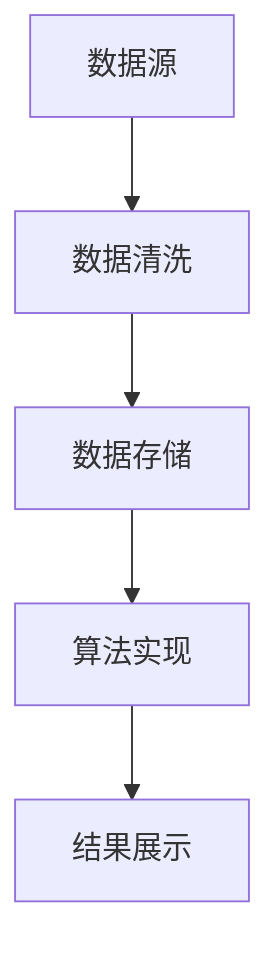
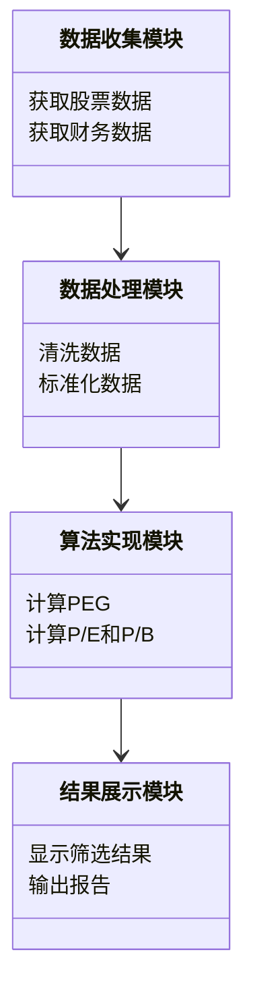
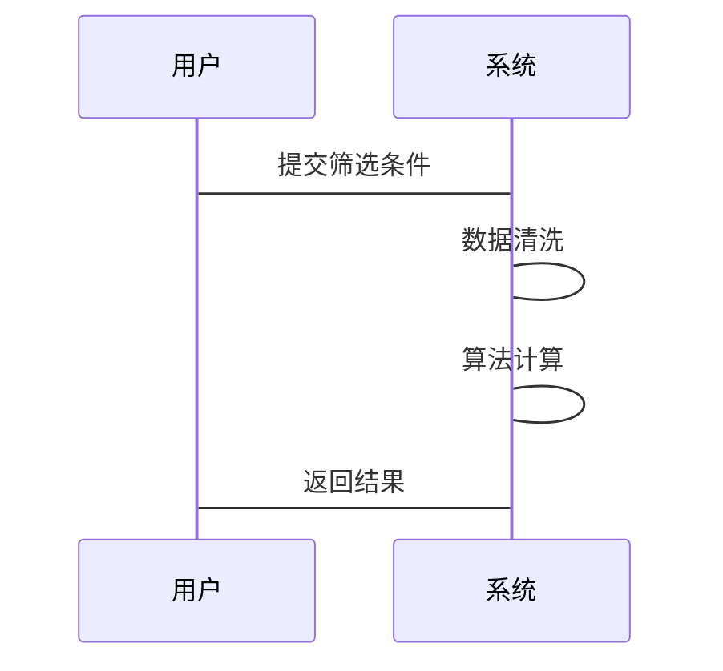

                 


# 彼得林奇的"高增长低估值"选股法

> 关键词：彼得·林奇，高增长低估值，选股法，投资策略，数学模型，系统设计

> 摘要：本文深入探讨了彼得·林奇的"高增长低估值"选股法，结合背景介绍、核心概念、数学模型、系统架构设计和项目实战，全面分析了这一选股方法的原理和应用。通过详细的步骤和实例，展示了如何利用这一方法筛选出具有高增长潜力但价格合理的股票，帮助投资者做出明智的投资决策。

---

## 第一部分: 彼得林奇的"高增长低估值"选股法概述

### 第1章: 高增长低估值选股法的背景与核心概念

#### 1.1 高增长低估值选股法的背景

彼得·林奇是美国著名的投资经理人，以其独特的选股方法闻名。他主张寻找那些具有高增长潜力但价格被市场低估的股票。这种方法结合了成长型投资和价值型投资的理念，旨在在长期获得超额收益。

#### 1.2 高增长与低估值的核心概念

##### 1.2.1 高增长的定义与衡量指标

高增长意味着公司在过去几年中保持了较高的收益增长率。主要的衡量指标包括：

- **年复合增长率(PEG)**：$$PEG = \frac{P}{E \times G}$$，其中P为股价，E为市盈率，G为年复合增长率。
- **净利润增长率**：$$净利润增长率 = \frac{净利润_{current} - 净利润_{previous}}{净利润_{previous}} \times 100\%$$

##### 1.2.2 低估值的定义与衡量指标

低估值意味着股票的价格低于其内在价值。主要的衡量指标包括：

- **市盈率(P/E)**：$$P/E = \frac{股价}{每股收益}$$
- **市净率(P/B)**：$$P/B = \frac{股价}{每股净资产}$$

##### 1.2.3 高增长与低估值的对比分析

| 指标 | 高增长 | 低估值 |
|------|--------|--------|
| 核心 | 收益增长率 | 市盈率、市净率 |
| 优点 | 长期增长潜力大 | 价格被低估，风险较低 |
| 缺点 | 市场波动可能较大 | 需要准确评估内在价值 |

---

### 第2章: 彼得·林奇的选股标准与策略

#### 2.1 彼得·林奇的选股标准

##### 2.1.1 盈利能力分析

盈利能力是衡量公司成长潜力的重要指标。常用的指标包括：

- **净利率**：$$净利率 = \frac{净利润}{营业收入} \times 100\%$$
- **ROE（净资产收益率）**：$$ROE = \frac{净利润}{净资产} \times 100\%$$

##### 2.1.2 市场地位分析

公司应具有强大的市场地位，通常体现在市场份额和行业排名上。可以通过分析公司过去几年的市场份额变化来评估。

##### 2.1.3 管理层能力评估

管理层的素质和战略决策能力直接影响公司的长期发展。可以通过分析管理层的背景和公司战略来评估。

#### 2.2 高增长低估值选股法的策略

##### 2.2.1 增长型股票的特征

- **高PEG值**：$$PEG < 1$$
- **高净利润增长率**：$$净利润增长率 > 20\%$$

##### 2.2.2 估值型股票的特征

- **低P/E值**：$$P/E < 市场平均值$$
- **低P/B值**：$$P/B < 1$$

##### 2.2.3 组合投资策略

彼得·林奇主张分散投资，将资金分配到不同行业的高增长和低估值股票中，以降低风险并提高收益。

---

### 第3章: 高增长低估值选股法的数学模型与公式

#### 3.1 高增长的数学模型

##### 3.1.1 收益增长率公式

$$增长率 = \frac{E_t - E_{t-1}}{E_{t-1}} \times 100\%$$

其中，$$E_t$$和$$E_{t-1}$$分别为当前和上一期的收益。

##### 3.1.2 复合增长率计算

$$复合增长率 = \left( \frac{E_t}{E_0} \right)^{\frac{1}{n}} - 1$$

其中，$$E_0$$为初始收益，$$n$$为时间跨度。

#### 3.2 低估值的数学模型

##### 3.2.1 市盈率（P/E）计算

$$P/E = \frac{P}{E}$$

其中，$$P$$为股价，$$E$$为每股收益。

##### 3.2.2 市净率（P/B）计算

$$P/B = \frac{P}{B}$$

其中，$$P$$为股价，$$B$$为每股净资产。

##### 3.2.3 市盈率相对盈利增长比率（PEG）

$$PEG = \frac{P/E}{G}$$

其中，$$G$$为年复合增长率。

---

### 第4章: 高增长低估值选股法的系统分析与架构设计

#### 4.1 系统分析

##### 4.1.1 选股系统的功能需求

- 数据收集与处理
- 股票筛选算法实现
- 结果展示与分析

##### 4.1.2 数据收集与处理模块

- 数据来源：股票数据库、财务报表等。
- 数据清洗：处理缺失值、异常值。

##### 4.1.3 选股算法实现模块

- 输入：股票数据、筛选条件。
- 输出：符合条件的股票列表。

##### 4.1.4 结果展示与分析模块

- 可视化结果：柱状图、折线图等。
- 分析报告：包括筛选结果、投资建议等。

#### 4.2 系统架构设计

##### 4.2.1 数据流图



##### 4.2.2 模块划分与交互流程



##### 4.2.3 系统接口设计

- 数据接口：与数据库交互。
- 算法接口：调用筛选函数。
- 展示接口：生成可视化结果。

##### 4.2.4 系统交互流程



---

### 第5章: 项目实战——基于彼得·林奇选股法的股票筛选系统

#### 5.1 环境安装与配置

##### 5.1.1 Python环境搭建

- 安装Python 3.x
- 安装必要的库：pandas、numpy、matplotlib、scikit-learn。

##### 5.1.2 数据获取工具安装

- 使用yfinance库获取股票数据：```bash
  pip install yfinance
  ```

##### 5.1.3 数据库连接配置

- 安装数据库驱动，如MySQL。

#### 5.2 核心算法实现

##### 5.2.1 高增长股票筛选代码

```python
import pandas as pd

def calculate_growth_rate(revenue, years):
    growth_rates = []
    for i in range(1, len(years)):
        growth = (revenue[i] - revenue[i-1]) / revenue[i-1] * 100
        growth_rates.append(growth)
    return growth_rates

# 示例数据
revenue = [100, 120, 150, 180]
years = [2018, 2019, 2020, 2021]

growth_rates = calculate_growth_rate(revenue, years)
print("年增长率：", growth_rates)
```

##### 5.2.2 低估值股票筛选代码

```python
import pandas as pd

def calculate_pe_ratio(price, eps):
    pe_ratio = price / eps
    return pe_ratio

# 示例数据
price = 50
eps = 10

pe_ratio = calculate_pe_ratio(price, eps)
print("市盈率：", pe_ratio)
```

##### 5.2.3 组合筛选代码

```python
import pandas as pd

def screen_stocks(df):
    df['PEG'] = df['P/E'] / df['Growth Rate']
    return df[df['PEG'] < 1]

# 示例数据
data = {'P/E': [15, 12, 8, 20], 'Growth Rate': [15, 20, 10, 5]}
df = pd.DataFrame(data)
screened = screen_stocks(df)
print("筛选结果：", screened)
```

#### 5.3 实际案例分析

##### 5.3.1 案例一：科技股筛选

- 数据来源：科技行业股票数据。
- 筛选条件：PEG < 1，P/E < 20。

##### 5.3.2 案例二：消费股筛选

- 数据来源：消费行业股票数据。
- 筛选条件：PEG < 1，P/B < 2。

##### 5.3.3 案例三：周期性行业筛选

- 数据来源：周期性行业股票数据。
- 筛选条件：PEG < 1，P/E < 15。

#### 5.4 项目总结

通过上述代码和案例分析，我们可以看到，基于彼得·林奇选股法的系统能够有效地筛选出符合条件的股票，为投资者提供有力的支持。

---

### 第6章: 最佳实践与小结

#### 6.1 小结

彼得·林奇的高增长低估值选股法结合了成长和价值投资的理念，是一种有效的选股方法。通过系统的数据分析和算法实现，我们可以更准确地筛选出具有投资价值的股票。

#### 6.2 注意事项

- 数据的准确性和及时性至关重要。
- 筛选结果需要结合市场环境和行业趋势进行调整。
- 投资需谨慎，建议分散投资以降低风险。

#### 6.3 拓展阅读

- 彼得·林奇的《选股的艺术》
- 其他选股方法的书籍和文献。

---

## 作者

作者：AI天才研究院/AI Genius Institute & 禅与计算机程序设计艺术/Zen And The Art of Computer Programming

