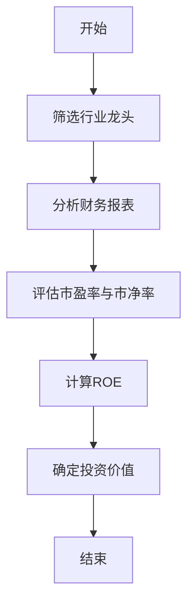

                 


# 彼得林奇选股策略解析

> **关键词**：彼得林奇、价值投资、选股策略、投资哲学、股票分析、数学模型、算法实现  
> **摘要**：本文系统解析了彼得林奇的选股策略，从投资哲学到数学模型，结合实际案例和系统架构设计，深入探讨了彼得林奇选股策略的实现方法。

---

## 第1章 彼得林奇投资哲学概述

### 1.1 彼得林奇的投资理念

#### 1.1.1 价值投资的核心思想
彼得林奇是价值投资的倡导者，他强调买入低于内在价值的股票。他的投资理念基于以下几点：
- **长期投资**：避免短期市场波动，关注企业的长期增长。
- **基本面分析**：通过分析企业的财务报表和行业地位，评估其内在价值。
- **分散投资**：通过投资多个行业和公司，降低风险。

#### 1.1.2 彼得林奇的选股哲学
彼得林奇认为，成功的投资取决于对企业内在价值的准确评估。他提出了以下选股原则：
- **成长性**：选择具有稳定增长潜力的企业。
- **估值**：买入价格低于内在价值的股票。
- **行业地位**：选择行业龙头或具有竞争优势的企业。

#### 1.1.3 长期投资与风险管理
彼得林奇强调长期投资的重要性，并建议投资者避免频繁交易。他通过分散投资和严格的风险管理来降低投资组合的波动性。

---

### 1.2 彼得林奇选股标准的核心要素

#### 1.2.1 选股的基本原则
彼得林奇的选股标准包括以下要素：
- **市盈率（P/E）**：评估股票的盈利能力。
- **市净率（P/B）**：评估股票的资产质量。
- **股东权益回报率（ROE）**：衡量企业的盈利能力。

#### 1.2.2 股票估值的核心方法
彼得林奇的股票估值方法基于以下步骤：
1. **分析企业财务报表**：评估企业的收入、利润和资产质量。
2. **计算内在价值**：使用现金流折现法或ROE模型估算股票的内在价值。
3. **比较市场价与内在价值**：如果市场价格低于内在价值，考虑买入。

#### 1.2.3 行业分析与公司基本面研究
彼得林奇强调行业分析的重要性，他认为选择具有竞争优势和良好行业前景的企业是投资成功的关键。

---

## 第2章 彼得林奇选股标准的数学模型

### 2.1 选股标准的核心要素

#### 2.1.1 股票的内在价值公式
股票的内在价值可以通过以下公式计算：
$$ \text{内在价值} = \frac{\text{未来现金流}}{\text{折现率}} $$

#### 2.1.2 市盈率与市净率的对比
| 指标 | 定义 | 适用场景 |
|------|------|----------|
| 市盈率 | P/E = 价格/每股收益 | 评估盈利能力 |
| 市净率 | P/B = 价格/每股净资产 | 评估资产质量 |

#### 2.1.3 股东权益回报率（ROE）
$$ \text{ROE} = \frac{\text{净利润}}{\text{股东权益}} $$

---

### 2.2 彼得林奇选股模型的流程图



---

## 第3章 系统分析与架构设计

### 3.1 系统功能设计

#### 3.1.1 数据采集模块
- **数据来源**：股票市场数据接口。
- **数据类型**：市盈率、市净率、ROE等。

#### 3.1.2 筛选模块
- **筛选规则**：符合彼得林奇选股标准。
- **输出结果**：潜在投资标的列表。

### 3.2 系统架构设计


---

## 第4章 项目实战

### 4.1 环境安装

```bash
pip install pandas numpy matplotlib
```

### 4.2 核心实现

```python
import pandas as pd

def calculate_intrinsic_value(enterprise_value, free_cash_flow):
    return enterprise_value / free_cash_flow

def filter_stocks(df, max_pe=15, max_pb=2):
    return df[(df['PE'] <= max_pe) & (df['PB'] <= max_pb)]

# 示例数据
data = {
    '公司': ['A', 'B', 'C'],
    'PE': [10, 20, 15],
    'PB': [1, 3, 2]
}
df = pd.DataFrame(data)
filtered = filter_stocks(df)
print(filtered)
```

### 4.3 案例分析

#### 4.3.1 投资组合管理
假设我们有100万元资金，按照彼得林奇的选股标准筛选出5只股票，每只投资20万元。定期复盘并调整投资组合。

#### 4.3.2 风险管理
设定止损点，当某只股票的价格下跌超过20%，立即卖出。

---

## 第5章 最佳实践与小结

### 5.1 本章小结
彼得林奇的选股策略基于价值投资理念，通过基本面分析和数学模型筛选出具有投资价值的股票。结合系统架构设计和项目实战，我们可以更好地理解和应用这一策略。

### 5.2 注意事项
- **数据质量**：确保数据来源可靠。
- **模型优化**：根据市场变化调整选股标准。
- **风险管理**：严格控制投资风险。

### 5.3 拓展阅读
- 彼得林奇的书籍《彼得林奇选股》。
- 其他价值投资书籍，如《聪明的投资者》。

---

## 作者

**作者：AI天才研究院/AI Genius Institute & 禅与计算机程序设计艺术 /Zen And The Art of Computer Programming**

---

通过以上内容，我们详细解析了彼得林奇的选股策略，并结合实际案例和系统架构设计，展示了如何将这一策略应用于投资实践中。希望这篇文章能为投资者提供有价值的参考和启发。

