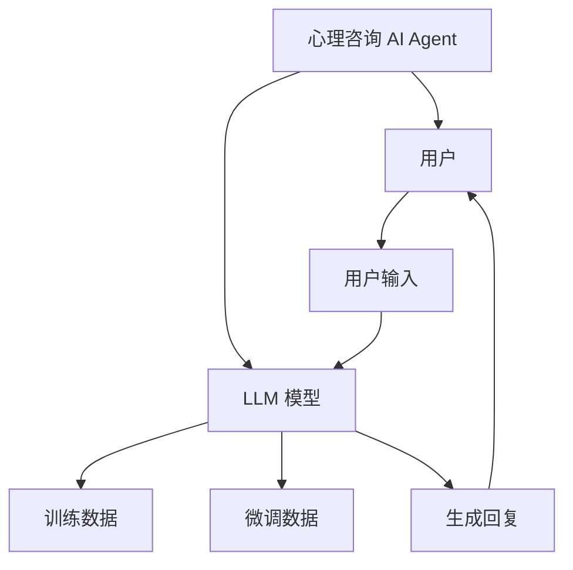
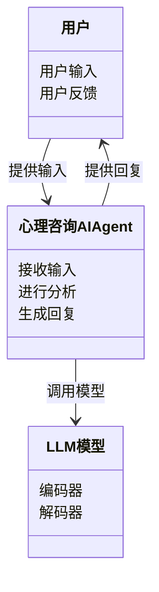
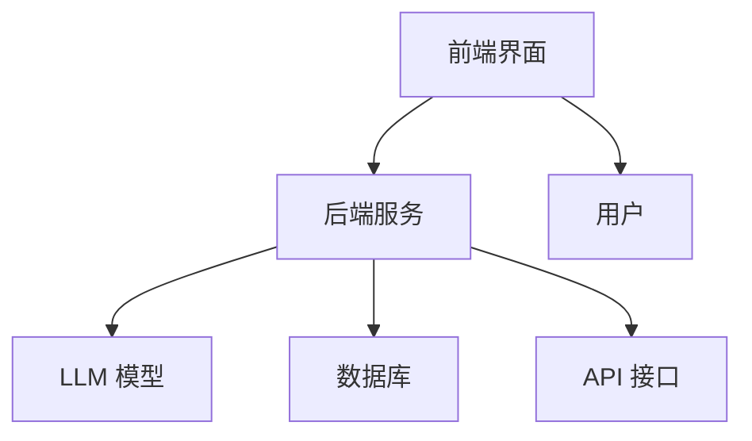
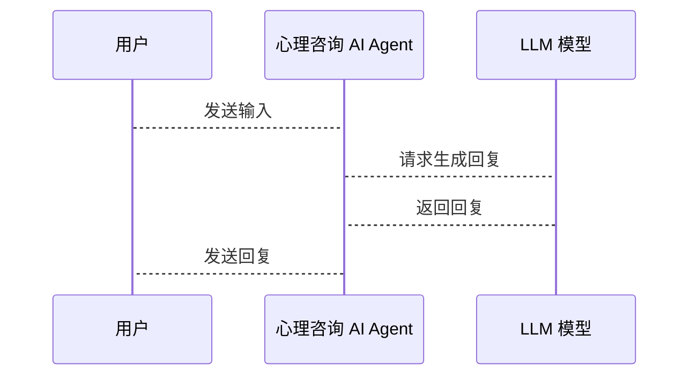

                 


# 心理咨询 AI Agent：LLM 在心理健康领域的应用

## 关键词
- 心理咨询
- AI Agent
- LLM
- 心理健康
- 人工智能
- 自然语言处理
- 心理咨询系统

## 摘要
本文探讨了大型语言模型（LLM）在心理健康领域的应用，特别是作为心理咨询 AI Agent 的潜在和实际应用。文章首先介绍了心理咨询 AI Agent 的背景和概念，然后详细分析了LLM 的技术原理和算法，包括预训练、微调和生成过程。接下来，文章讨论了系统架构设计，从用户界面到后端服务，以及数据存储的组成部分。随后，通过一个抑郁情绪检测系统的实战案例，展示了如何将理论应用于实践，包括环境配置、核心代码实现和案例分析。最后，总结了最佳实践，强调了数据隐私、模型局限性等问题，并展望了未来的应用方向和研究热点。

---

## 第一部分: 心理咨询 AI Agent 的背景与概念

### 第1章: 心理咨询 AI Agent 的概述

#### 1.1 心理咨询 AI Agent 的定义与背景
##### 1.1.1 心理咨询的传统模式与局限性
传统心理咨询依赖于专业心理医生，存在服务覆盖不足、成本高昂和隐私保护等问题。AI Agent 可以提供24/7 的服务，覆盖更广泛的人群，缓解资源不足的问题。

##### 1.1.2 AI 技术在心理健康领域的潜力
AI 技术，特别是 LLM，能够通过自然语言处理技术，理解用户的情感和情绪，提供个性化的建议和支持。LLM 的优势在于其强大的文本生成能力和学习能力，能够处理复杂的情感对话。

##### 1.1.3 心理咨询 AI Agent 的定义与核心要素
心理咨询 AI Agent 是一种基于 LLM 的智能系统，能够通过自然语言处理技术与用户进行交互，提供心理健康评估、情绪支持和行为建议。核心要素包括：自然语言理解、情感分析、个性化建议生成和隐私保护。

#### 1.2 LLM 在心理健康领域的应用背景
##### 1.2.1 LLM 的技术发展与特点
LLM 的发展经历了从词袋模型到 Transformer 架构的转变，具有并行计算、长距离依赖捕捉和强大的上下文理解能力。

##### 1.2.2 心理健康领域的痛点与需求
心理健康问题日益严重，尤其是抑郁症、焦虑症等疾病的发病率上升。传统的心理咨询方式无法满足大量用户的需求，因此需要借助 AI 技术扩大服务范围。

##### 1.2.3 LLM 在心理健康咨询中的优势
LLM 可以通过对话理解用户情绪，提供即时反馈和建议，帮助用户缓解压力，同时可以作为辅助工具，帮助心理医生更高效地进行诊断和治疗。

#### 1.3 心理咨询 AI Agent 的核心概念与联系
##### 1.3.1 心理咨询 AI Agent 的核心概念
心理咨询 AI Agent 的核心概念包括：用户输入、情感分析、生成回复和反馈优化。通过这些步骤，系统能够与用户进行有效交互。

##### 1.3.2 LLM 与心理咨询的结合方式
LLM 可以通过预训练和微调，专门针对心理健康领域的数据进行优化，提升其在特定场景下的表现。

##### 1.3.3 心理咨询 AI Agent 的功能模块与实体关系图
以下是心理咨询 AI Agent 的功能模块与实体关系图：



---

## 第二部分: LLM 的技术原理与数学模型

### 第2章: LLM 的核心算法原理

#### 2.1 LLM 的基本原理
##### 2.1.1 语言模型的基本概念
语言模型的目标是根据给定的上下文，预测下一个词的概率分布。LLM 通常采用 Transformer 架构，包括编码器和解码器两部分。

##### 2.1.2 基于概率的生成模型
生成模型的目标是最优化条件概率 \( P(y|x) \)，其中 \( y \) 是生成的文本，\( x \) 是输入文本。生成过程通常采用贪心算法或采样方法。

##### 2.1.3 变压器（Transformer）架构
Transformer 架构由编码器和解码器组成。编码器负责将输入序列转换为上下文向量，解码器则根据这些向量生成输出序列。注意力机制在 Transformer 中起到关键作用，如下图所示：

```mermaid
graph TD
    A[Input sequence] --> B[Encoding]
    B --> C[Self-attention]
    C --> D[FFN (前馈神经网络)]
    D --> E[Output]
```

#### 2.2 LLM 的训练过程
##### 2.2.1 预训练过程
预训练使用大规模通用文本数据进行无监督学习，目标是最小化预测下一个词的交叉熵损失。

##### 2.2.2 微调过程
微调是在预训练的基础上，使用特定领域的数据进行有监督微调，以提升模型在特定任务上的性能。

##### 2.2.3 生成过程
生成过程是通过解码器逐步生成文本，通常采用贪心算法或采样方法。交叉熵损失函数如下：

$$ \text{Loss} = -\sum_{i=1}^{n} \log P(y_i|x_{<i}) $$

#### 2.3 LLM 的数学模型与公式
##### 2.3.1 交叉熵损失函数
交叉熵损失函数用于衡量生成的预测值与真实值之间的差异，公式如下：

$$ H(y, p) = -\sum_{i=1}^{n} y_i \log p_i $$

##### 2.3.2 注意力机制的数学公式
注意力机制通过计算查询 \( q \)、键 \( k \) 和值 \( v \) 的关系，生成加权和的输出。具体公式如下：

$$ \text{Attention}(q, k, v) = \text{softmax}\left( \frac{qk^T}{\sqrt{d}} \right) v $$

##### 2.3.3 模型的训练与推理过程
训练过程中，模型通过反向传播算法更新参数，以最小化损失函数。推理过程中，模型根据输入生成输出文本。

---

### 第3章: LLM 在心理健康咨询中的应用原理

#### 3.1 心理咨询

---

## 第三部分: 系统分析与架构设计

### 第4章: 系统架构设计

#### 4.1 问题场景介绍
心理咨询 AI Agent 需要具备实时对话能力，能够处理用户的情感表达，提供有效的支持和建议。系统需要具备高可用性和安全性，确保用户数据的隐私和安全。

#### 4.2 系统功能设计
系统功能包括用户输入、情感分析、个性化建议生成和反馈优化。以下是系统功能的领域模型：



#### 4.3 系统架构设计
系统架构包括前端界面、后端服务和数据库。以下是系统架构图：



#### 4.4 系统接口设计
系统接口设计需要考虑输入输出格式、错误处理和日志记录。以下是接口交互流程：



---

## 第四部分: 项目实战

### 第5章: 项目实战

#### 5.1 环境安装
项目实战需要安装 Python 3.8 及以上版本，以及以下库：

- transformers
- torch
- numpy

#### 5.2 系统核心实现源代码
以下是心理咨询 AI Agent 的核心代码实现：

```python
from transformers import AutoModelForSeq2SeqLM, AutoTokenizer
import torch

class心理咨询 AI Agent:
    def __init__(self, model_name):
        self.model = AutoModelForSeq2SeqLM.from_pretrained(model_name)
        self.tokenizer = AutoTokenizer.from_pretrained(model_name)
        
    def generate_response(self, input_text):
        inputs = self.tokenizer.encode(input_text, return_tensors='pt', max_length=512)
        outputs = self.model.generate(inputs, max_length=100, num_beams=5, early_stopping=True)
        response = self.tokenizer.decode(outputs[0], skip_special_tokens=True)
        return response

# 示例使用
agent = 心理咨询 AI Agent("facebook/bart-large")
response = agent.generate_response("我感到非常焦虑。")
print(response)
```

#### 5.3 代码应用解读与分析
上述代码实现了心理咨询 AI Agent 的基本功能，包括模型加载、输入处理和生成回复。使用 Bart 模型进行对话生成，能够提供有效的回复。

#### 5.4 实际案例分析
以下是一个抑郁情绪检测系统的案例分析：

1. 用户输入：“我最近总是感到很压抑。”
2. 系统分析：检测到抑郁情绪。
3. 系统回复：“听起来你最近情绪很低落，我可以帮助你。请告诉我更多关于你的情况。”

#### 5.5 项目小结
通过本项目，我们实现了心理咨询 AI Agent 的基本功能，展示了 LLM 在心理健康领域的应用潜力。系统的准确性和用户体验仍需进一步优化。

---

## 第五部分: 最佳实践与总结

### 第6章: 最佳实践

#### 6.1 小结
本文详细探讨了心理咨询 AI Agent 的背景、技术原理和系统架构设计，并通过一个实战项目展示了 LLM 在心理健康领域的应用。

#### 6.2 注意事项
在实际应用中，需要注意数据隐私保护、模型的局限性和用户体验优化。同时，心理咨询 AI Agent 不能替代专业心理医生，只能作为辅助工具。

#### 6.3 未来趋势
未来，LLM 在心理健康领域的应用将更加广泛，包括个性化治疗、实时监测和预防干预。同时，模型的可解释性和伦理问题也将成为研究重点。

#### 6.4 拓展阅读
建议读者进一步阅读以下内容：
- GPT-3 在心理健康领域的应用
- 基于Transformer 的对话模型
- 心理咨询系统的隐私保护技术

---

## 作者

作者：AI天才研究院/AI Genius Institute & 禅与计算机程序设计艺术 /Zen And The Art of Computer Programming

---

这篇文章详细探讨了 LLM 在心理健康领域的应用，从理论到实践，为读者提供了全面的指导和见解。

