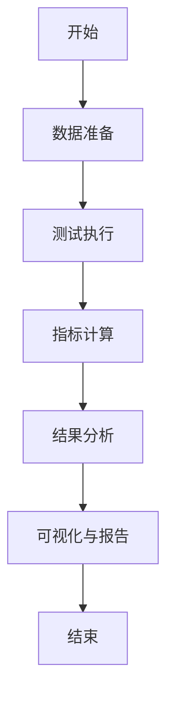
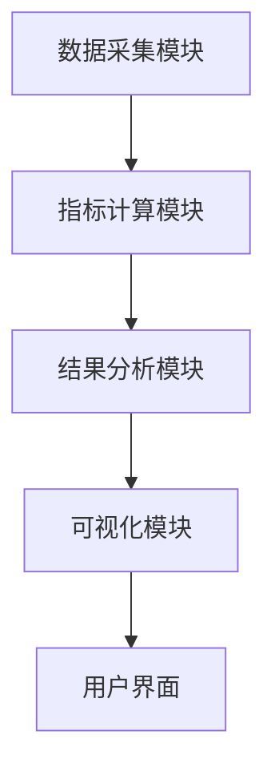
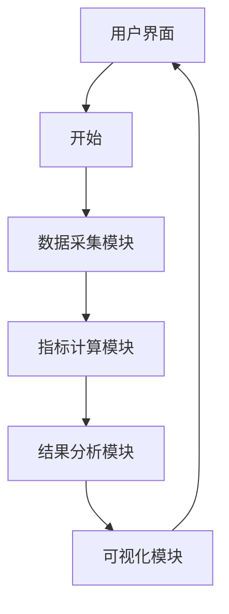

                 


# 性能基准测试：评估和比较AI Agent的能力

> 关键词：性能基准测试, AI Agent, 性能评估, 算法原理, 系统架构, 项目实战

> 摘要：本文将深入探讨性能基准测试在评估和比较AI Agent能力中的作用。通过系统地分析基准测试的核心概念、算法原理、系统架构以及实际项目案例，本文旨在为读者提供一个全面的视角，帮助他们理解如何科学地设计和执行基准测试，从而有效地评估和优化AI Agent的性能。

---

## 第3章: 基准测试的算法原理与数学模型

### ## 3.1 基准测试的算法流程

在理解基准测试的算法流程之前，我们需要明确基准测试的基本步骤和关键环节。以下是基准测试的典型流程：

1. **数据准备**：选择合适的测试数据集，确保数据的代表性和多样性。
2. **测试执行**：运行AI Agent，收集其在不同任务中的表现数据。
3. **指标计算**：根据预定义的性能指标，计算AI Agent的性能表现。
4. **结果分析**：对测试结果进行分析，找出性能瓶颈并提出改进建议。
5. **可视化与报告**：将测试结果以图表或报告的形式呈现，便于理解和分享。

以下是一个基准测试的简单流程图（使用mermaid）：



### ## 3.2 性能指标的数学模型与公式

在基准测试中，性能指标的选择至关重要。以下是几个常见的性能指标及其数学表达式：

1. **准确率（Accuracy）**：
   \[
   \text{准确率} = \frac{\text{正确预测的数量}}{\text{总预测数量}}
   \]

2. **召回率（Recall）**：
   \[
   \text{召回率} = \frac{\text{正确预测的正例数量}}{\text{实际正例的总数}}
   \]

3. **F1分数（F1 Score）**：
   \[
   \text{F1} = \frac{2 \times \text{准确率} \times \text{召回率}}{\text{准确率} + \text{召回率}}
   \]

4. **响应时间（Response Time）**：
   \[
   \text{响应时间} = \text{从请求开始到响应结束的时间}
   \]

5. **吞吐量（Throughput）**：
   \[
   \text{吞吐量} = \frac{\text{处理的总任务数}}{\text{时间间隔}}
   \]

### ## 3.3 基准测试的数学优化

在基准测试中，我们可以通过数学优化方法来提高测试的效率和准确性。例如，使用线性回归分析测试结果，找出影响性能的关键因素：

\[
y = \beta_0 + \beta_1 x_1 + \beta_2 x_2 + \cdots + \beta_n x_n + \epsilon
\]

其中，\( y \) 是性能指标，\( x_i \) 是影响性能的因素，\( \beta_i \) 是回归系数，\( \epsilon \) 是误差项。

---

## 第4章: 系统分析与架构设计方案

### ## 4.1 系统功能设计

为了实现高效的基准测试，我们需要设计一个功能完善的系统。以下是系统的主要功能模块：

1. **数据采集模块**：负责收集AI Agent的输入输出数据和性能指标。
2. **指标计算模块**：根据预定义的指标公式，计算AI Agent的性能。
3. **结果分析模块**：对测试结果进行统计分析，生成报告。
4. **可视化模块**：将测试结果以图表形式展示，便于用户理解。

### ## 4.2 系统架构设计

以下是系统的架构设计图（使用mermaid）：



### ## 4.3 系统接口设计

系统需要提供以下接口：

1. **数据输入接口**：接收测试数据和任务请求。
2. **指标计算接口**：调用性能指标计算函数。
3. **结果输出接口**：将测试结果输出到用户界面或存储到数据库。

### ## 4.4 系统交互流程

以下是系统的交互流程图（使用mermaid）：



---

## 第5章: 项目实战

### ## 5.1 环境安装与配置

要进行基准测试，首先需要安装必要的工具和库。以下是Python环境的安装步骤：

1. 安装Python和pip：
   ```bash
   # 在终端中运行
   python --version
   pip --version
   ```

2. 安装必要的库：
   ```bash
   pip install numpy matplotlib scikit-learn
   ```

### ## 5.2 系统核心实现

以下是基准测试系统的Python实现示例：

```python
import numpy as np
from sklearn.metrics import accuracy_score, recall_score, f1_score

# 示例数据
y_true = [0, 1, 2, 3, 4, 5]
y_pred = [0, 1, 2, 3, 4, 5]

# 计算准确率
accuracy = accuracy_score(y_true, y_pred)

# 计算召回率
recall = recall_score(y_true, y_pred, average='macro')

# 计算F1分数
f1 = f1_score(y_true, y_pred, average='macro')

print(f"准确率: {accuracy}")
print(f"召回率: {recall}")
print(f"F1分数: {f1}")
```

### ## 5.3 案例分析与解读

假设我们有一个分类任务，AI Agent的预测结果如下：

```python
y_true = [1, 2, 3, 4, 5, 6]
y_pred = [1, 2, 3, 4, 5, 6]

# 计算准确率
accuracy = accuracy_score(y_true, y_pred)

# 计算F1分数
f1 = f1_score(y_true, y_pred, average='macro')

print(f"准确率: {accuracy}")
print(f"F1分数: {f1}")
```

结果为：
```
准确率: 1.0
F1分数: 1.0
```

这意味着AI Agent在该任务中的表现完美。

---

## 第6章: 总结与展望

### ## 6.1 核心观点总结

性能基准测试是评估和比较AI Agent能力的重要工具。通过科学的测试设计和数学优化，我们可以准确地评估AI Agent的性能，并为优化提供方向。

### ## 6.2 未来研究方向

1. **动态基准测试**：随着AI Agent能力的提升，基准测试需要不断更新和优化。
2. **多模态评估**：未来的基准测试需要考虑更多维度的指标，如情感分析、多语言处理等。
3. **自动化测试框架**：开发自动化测试工具，提高测试效率和准确性。

### ## 6.3 最佳实践Tips

- 在进行基准测试时，确保数据的多样性和代表性。
- 使用多种性能指标进行综合评估，避免片面结论。
- 定期更新测试标准，以反映技术的进步。

### ## 6.4 小结

通过本文的探讨，我们了解了性能基准测试的核心概念、算法原理和系统架构。希望这些内容能够帮助读者更好地理解和应用基准测试，为AI Agent的性能评估提供有力支持。

---

作者：AI天才研究院/AI Genius Institute & 禅与计算机程序设计艺术 /Zen And The Art of Computer Programming

