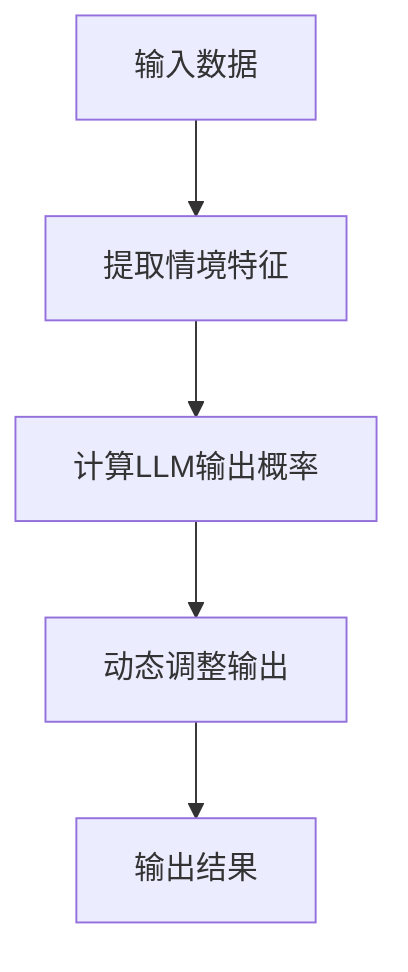
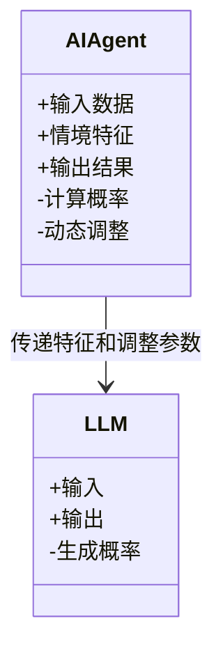

                 


# 情境学习AI Agent：增强LLM的场景适应性

**关键词**：情境学习，AI Agent，LLM，场景适应性，增强方法，数学模型，系统架构

**摘要**：  
本文探讨了情境学习AI Agent如何增强大型语言模型（LLM）在不同场景中的适应性。通过分析情境学习的核心概念、AI Agent的架构及其与LLM的结合，本文提出了数学建模、算法优化和系统设计的方法，展示了如何通过实际项目实现这些理论，并提供了最佳实践建议。

---

## 引言

在人工智能领域，情境学习（Situated Learning）是一种强调环境、互动和上下文理解的学习范式。结合AI Agent的概念，情境学习AI Agent能够根据具体场景动态调整行为，从而显著增强LLM的适应性。本文将详细分析这一结合的原理、方法和应用。

---

## 第一部分: 情境学习AI Agent的核心概念

### 第1章: 情境学习的基本原理

#### 1.1 情境学习的背景与重要性

- **传统学习方法的局限性**：传统LLM在处理特定场景时，缺乏对上下文的理解和动态调整能力。
- **情境学习的定义与特点**：情境学习强调环境、任务和互动，注重动态适应和情境理解。
- **在LLM中的应用前景**：情境学习使LLM能够更好地适应不同场景，提升用户体验和任务处理能力。

#### 1.2 AI Agent的基本概念与功能

- **AI Agent的定义与分类**：AI Agent是能够感知环境并采取行动以实现目标的智能体，分为简单和复杂两类。
- **AI Agent的核心功能模块**：包括感知模块、决策模块和执行模块。
- **情境学习与AI Agent的结合**：通过情境学习，AI Agent能够动态调整策略，适应不同场景需求。

#### 1.3 情境学习与AI Agent的关系

- **情境学习如何增强AI Agent的场景适应性**：通过上下文理解和动态调整，提升AI Agent的灵活性。
- **AI Agent如何支持情境学习的实现**：通过实时数据处理和反馈机制，实现情境学习的闭环。
- **应用场景**：如智能助手、教育辅助、客服系统等。

---

### 第2章: 情境学习AI Agent的核心概念

#### 2.1 情境学习的基本原理

- **情境学习的基本原理**：通过环境互动和上下文理解，实现动态学习和适应。
- **情境特征的提取与表示**：利用特征工程和深度学习方法，提取关键情境信息。
- **情境学习的核心要素与结构**：包括环境、任务、目标、互动和反馈。

#### 2.2 AI Agent的架构与功能

- **AI Agent的典型架构**：基于感知-决策-执行的三阶段模型。
- **核心功能模块**：感知模块（数据采集）、决策模块（策略选择）、执行模块（动作输出）。
- **情境学习AI Agent的独特性**：具备动态调整能力，能够根据情境变化实时优化策略。

#### 2.3 情境学习与AI Agent的关系

- **情境学习如何增强AI Agent的场景适应性**：通过动态调整策略，使AI Agent在不同场景中表现更佳。
- **AI Agent如何支持情境学习的实现**：通过实时数据处理和反馈机制，实现情境学习的闭环。
- **应用场景**：如智能助手、教育辅助、客服系统等。

---

## 第三部分: 情境学习AI Agent的数学模型

### 第3章: 情境学习AI Agent的数学建模

#### 3.1 LLM的基本数学模型

- **变体器模型的基本公式**：  
  $$P_{\theta}(y|x) = \text{softmax}(W_{\theta}y + b_{\theta})$$  
  其中，$x$ 是输入，$y$ 是输出，$\theta$ 是模型参数。
- **激活函数的作用与选择**：常用的激活函数包括ReLU、Sigmoid和Tanh，选择取决于任务需求。
- **注意力机制的数学表达**：  
  $$\text{Attention}(Q, K, V) = \text{softmax}\left(\frac{QK^T}{\sqrt{d_k}}\right)V$$  
  其中，$Q$ 是查询向量，$K$ 是键向量，$V$ 是值向量，$d_k$ 是维度。

#### 3.2 情境学习的数学建模

- **情境特征的提取与表示**：通过卷积神经网络（CNN）或循环神经网络（RNN）提取情境特征。
- **动态调整的数学模型**：基于情境特征，动态调整LLM的输出概率分布：  
  $$P_{\theta}(y|x, c) = \lambda P_{\theta}(y|x) + (1-\lambda)P_{\theta}(y|c)$$  
  其中，$\lambda$ 是调节参数，$c$ 是情境特征。

#### 3.3 情境学习AI Agent的优化目标

- **优化目标的数学表达**：最大化情境适应性的目标函数：  
  $$\mathcal{L}(\theta) = -\sum_{i=1}^{n} \log P_{\theta}(y_i|x_i, c_i)$$  
- **优化方法**：采用梯度下降（如Adam优化器）更新模型参数。

---

## 第四部分: 算法原理与系统架构

### 第4章: 算法原理与流程图

#### 4.1 算法原理

- **训练阶段**：收集多场景数据，提取情境特征，训练模型。
- **推理阶段**：根据输入和情境，动态调整输出。

#### 4.2 流程图



---

### 第5章: 系统架构设计

#### 5.1 功能设计

- **系统功能模块**：数据采集模块、情境分析模块、模型调整模块、结果输出模块。

#### 5.2 系统架构图



#### 5.3 接口设计

- **输入接口**：接收场景数据和用户指令。
- **输出接口**：提供动态调整后的结果。

#### 5.4 交互设计

- **交互流程**：用户输入 -> 提取情境 -> 动态调整 -> 输出结果。

---

## 第五部分: 项目实战

### 第6章: 项目实战

#### 6.1 环境安装

- **Python 3.8+**
- **TensorFlow或PyTorch**
- **Mermaid和LaTeX支持的编辑器**

#### 6.2 核心代码实现

```python
import tensorflow as tf
from tensorflow.keras.layers import Dense, Input

# 定义模型
input_layer = Input(shape=(input_dim,))
dense_layer = Dense(units=units, activation='relu')(input_layer)
output_layer = Dense(units=vocab_size, activation='softmax')(dense_layer)

model = Model(inputs=input_layer, outputs=output_layer)
model.compile(optimizer='adam', loss='sparse_categorical_crossentropy', metrics=['accuracy'])
```

#### 6.3 案例分析

- **案例1**：在客服系统中，动态调整回复策略以适应不同用户情绪。
- **案例2**：在教育辅助中，根据学生学习进度动态调整教学内容。

#### 6.4 项目总结

- **成功经验**：动态调整显著提升了模型的适应性。
- **遇到的挑战**：情境特征提取的难度和计算效率问题。

---

## 第六部分: 最佳实践与小结

### 第7章: 最佳实践

#### 7.1 小结

- 情境学习AI Agent通过动态调整LLM的行为，显著提升了场景适应性。
- 关键技术包括情境特征提取、动态调整模型和实时交互反馈。

#### 7.2 注意事项

- 确保数据质量和多样性。
- 优化算法以提高计算效率。
- 定期更新模型以适应新场景。

#### 7.3 拓展阅读

- 《深度学习》——Ian Goodfellow
- 《模式识别与机器学习》——Christopher Bishop

---

## 作者

**作者**：AI天才研究院/AI Genius Institute & 禅与计算机程序设计艺术/Zen And The Art of Computer Programming

---

通过以上结构，文章详细探讨了情境学习AI Agent如何增强LLM的场景适应性，从理论到实践，为读者提供了全面的技术指导。

