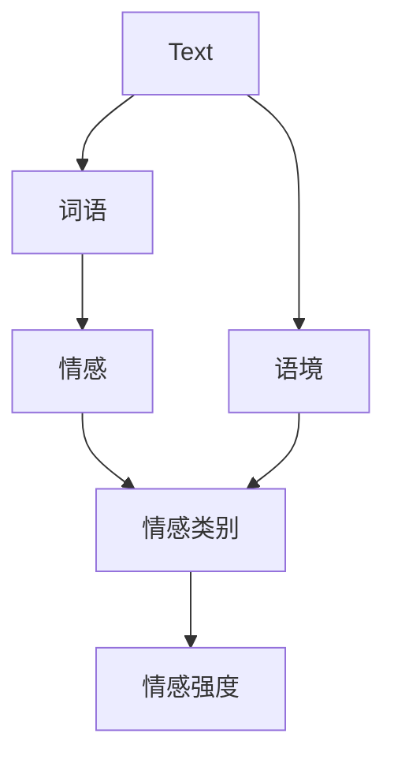
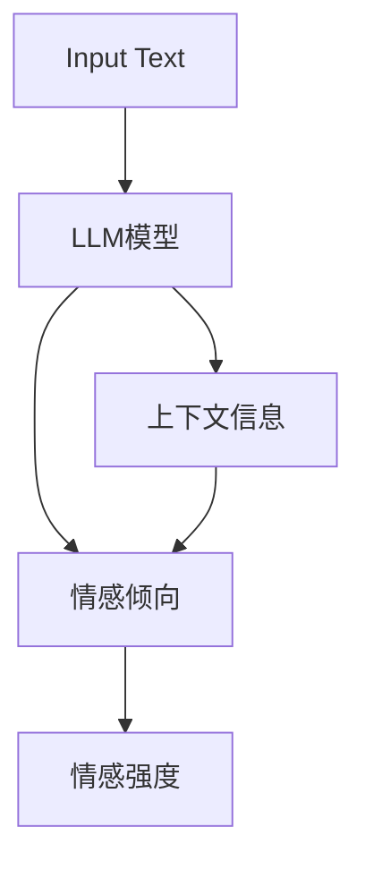
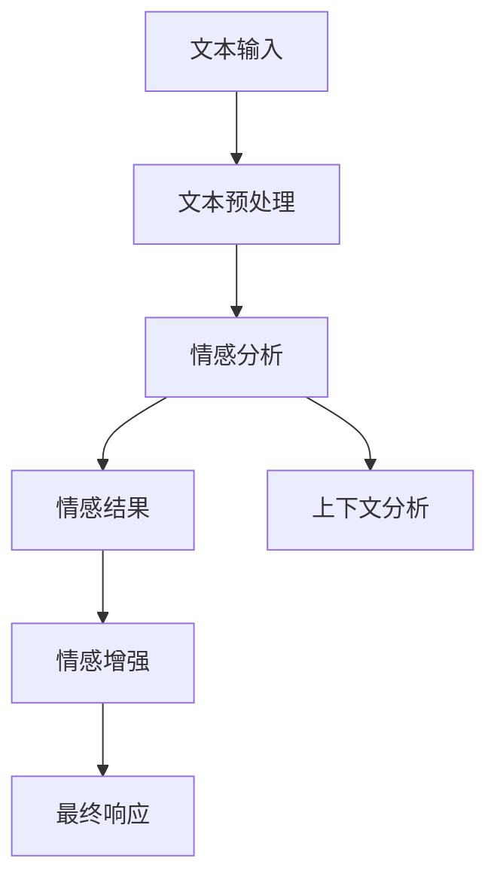

                 


# 情感分析增强AI Agent：利用LLM深入理解文本情感

---

## 关键词：情感分析，AI Agent，大语言模型，LLM，文本情感，自然语言处理

---

## 摘要：本文将深入探讨如何利用大语言模型（LLM）增强AI Agent的情感分析能力，通过背景介绍、核心概念、算法原理、系统架构、项目实战和最佳实践等多个维度，全面解析情感分析的技术本质和应用场景，最终为读者提供一份系统性、实用性和前瞻性的技术指南。

---

## 第一部分: 情感分析与AI Agent概述

### 第1章: 情感分析的背景与应用

#### 1.1 情感分析的定义与核心概念

情感分析（Sentiment Analysis）是一种自然语言处理（NLP）技术，旨在分析文本中的情感倾向，判断文本是正面、负面还是中性。其核心概念包括：

- **文本情感**：文本中表达的情感倾向。
- **情感分类**：将文本划分为不同的情感类别（如正面、负面、中性）。
- **情感强度**：情感的强烈程度（如非常正面、稍微正面）。
- **情感维度**：情感的多维度分析（如情感极性、情感态度）。

#### 1.2 情感分析的背景与问题背景

情感分析起源于20世纪90年代，最初应用于 sentiment analysis of movie reviews。随着NLP技术的发展，情感分析逐渐扩展到社交媒体、客户评论、舆情分析等领域。然而，当前情感分析面临以下问题：

- **数据稀疏性**：情感数据的标注成本高，且难以覆盖所有场景。
- **情感模糊性**：文本中的情感表达可能不明确或模棱两可。
- **情感多样性**：不同领域的情感表达方式差异较大。

#### 1.3 AI Agent与情感分析的关系

AI Agent（人工智能代理）是一种能够感知环境、执行任务并做出决策的智能体。情感分析作为AI Agent的重要能力，帮助其理解用户意图、优化交互体验和提升任务执行效率。AI Agent与情感分析的关系可以总结为：

- **AI Agent需要情感分析**：AI Agent需要理解用户输入的情感倾向，以便更好地理解和响应用户需求。
- **情感分析需要AI Agent**：AI Agent可以为情感分析提供上下文信息和实时反馈，从而提高情感分析的准确性和实用性。

#### 1.4 本章小结

情感分析是一种重要的NLP技术，能够帮助AI Agent更好地理解文本情感。然而，情感分析的复杂性和不确定性为AI Agent的设计带来了挑战。接下来，我们将深入探讨情感分析的核心概念和原理。

---

## 第二部分: 情感分析的核心概念与原理

### 第2章: 情感分析的核心概念

#### 2.1 情感分析的理论基础

情感分析的理论基础主要包括以下几个方面：

1. **语言学基础**：研究词语的情感倾向、语义关系和语法结构。
2. **统计学习**：基于概率模型（如朴素贝叶斯）对情感进行分类。
3. **深度学习**：利用神经网络（如RNN、CNN、Transformer）提取文本特征并进行情感分类。

#### 2.2 情感分析与自然语言处理的关系

情感分析是NLP的一个重要分支，其发展依赖于NLP技术的进步，同时也在推动NLP技术的创新。具体来说：

- **NLP为情感分析提供工具**：如分词、词性标注、句法分析等。
- **情感分析推动NLP发展**：情感分析的需求推动了更先进的模型（如BERT、GPT）的发展。

#### 2.3 情感分析的实体关系图

以下是一个情感分析的实体关系图（Mermaid图）：



---

## 第三部分: 基于LLM的情感分析增强AI Agent

### 第3章: 大语言模型（LLM）的原理与优势

#### 3.1 大语言模型的基本原理

大语言模型（LLM）是一种基于Transformer架构的大型神经网络模型，具有以下特点：

- **自注意力机制**：能够捕捉文本中的长距离依赖关系。
- **预训练-微调模式**：通过大规模数据预训练，然后在特定任务上进行微调。
- **上下文理解能力强**：能够理解文本的上下文关系，从而更好地捕捉情感倾向。

#### 3.2 LLM在情感分析中的优势

与传统的情感分析方法相比，LLM具有以下优势：

- **上下文理解能力**：能够理解文本的上下文关系，从而更准确地判断情感倾向。
- **多任务学习能力**：可以在同一模型上同时处理多种情感分析任务。
- **生成能力**：可以生成情感相关的文本，从而帮助AI Agent更好地与用户交互。

---

### 第4章: 基于LLM的情感分析算法

#### 4.1 情感分类的算法实现

以下是一个基于BERT的情感分类算法实现示例：

```python
import torch
from transformers import BertTokenizer, BertModel

class SentimentClassifier:
    def __init__(self, num_classes=3):
        self.bert = BertModel.from_pretrained('bert-base-uncased')
        self.tokenizer = BertTokenizer.from_pretrained('bert-base-uncased')
        self.classifier = torch.nn.Linear(self.bert.config.hidden_size, num_classes)
    
    def forward(self, input_ids, attention_mask):
        outputs = self.bert(input_ids=input_ids, attention_mask=attention_mask)
        pooled_output = outputs.last_hidden_state[:, 0, :]
        logits = self.classifier(pooled_output)
        return logits
```

#### 4.2 基于LLM的情感分析模型

以下是一个基于LLM的情感分析模型架构图（Mermaid图）：



---

### 第5章: 情感分析增强AI Agent的系统架构

#### 5.1 系统功能设计

情感分析增强AI Agent的系统功能模块包括：

- **文本输入模块**：接收用户输入的文本。
- **情感分析模块**：对文本进行情感分析。
- **情感增强模块**：基于情感分析结果优化AI Agent的响应。

#### 5.2 系统架构设计

以下是一个情感分析增强AI Agent的系统架构图（Mermaid图）：



---

### 第6章: 项目实战

#### 6.1 环境安装与代码实现

以下是一个情感分析增强AI Agent的Python代码实现示例：

```python
from transformers import pipeline

# 初始化情感分析pipeline
sentiment_analyzer = pipeline("sentiment-analysis")

# 定义AI Agent的响应函数
def agent_response(text):
    # 进行情感分析
    result = sentiment_analyzer(text)
    # 获取情感倾向
    sentiment = result[0]['label']
    # 返回增强后的响应
    return f"根据分析，您的情感倾向是 {sentiment}。"
```

#### 6.2 实际案例分析

以下是一个实际案例分析：

```python
text = "我非常喜欢这个产品，它真的很好用！"
result = sentiment_analyzer(text)
print(result)  # 输出：[{'label': 'POSITIVE', 'score': 0.99}]
```

---

### 第7章: 最佳实践与小结

#### 7.1 最佳实践

- **数据质量**：确保训练数据的质量和多样性。
- **模型选择**：根据具体任务选择合适的模型（如BERT、GPT）。
- **实时优化**：根据用户反馈实时优化情感分析模型。

#### 7.2 小结

情感分析是一种重要的NLP技术，能够帮助AI Agent更好地理解文本情感。通过结合大语言模型（LLM）的优势，我们可以进一步提升情感分析的准确性和实用性。

---

## 作者：AI天才研究院/AI Genius Institute & 禅与计算机程序设计艺术 /Zen And The Art of Computer Programming

