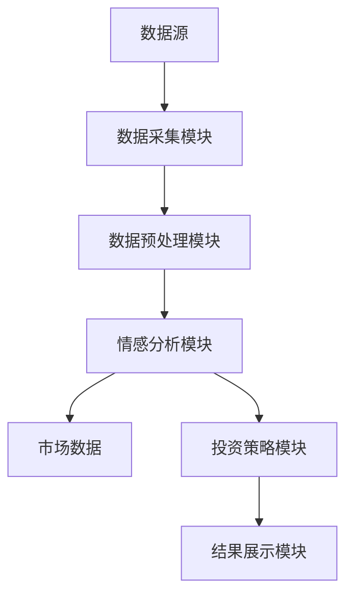

                 


# 第4章: 情感分析技术在投资决策中的系统分析与架构设计

## 4.1 投资决策系统的总体架构

### 4.1.1 系统功能模块划分
投资决策系统主要包含以下几个功能模块：
1. **数据采集模块**：负责从多种数据源（如社交媒体、新闻网站、金融论坛等）获取文本数据。
2. **数据预处理模块**：对采集到的文本数据进行清洗、分词、去停用词等处理。
3. **情感分析模块**：对预处理后的文本进行情感分析，判断文本的情感倾向。
4. **投资策略模块**：根据情感分析结果，结合其他市场数据（如价格、成交量等），制定投资策略。
5. **结果展示模块**：将分析结果以可视化的方式展示，方便投资者决策。

### 4.1.2 系统数据流设计
数据流从数据源开始，经过数据预处理，进入情感分析模块，再结合市场数据，生成投资策略，最后通过可视化模块展示结果。

### 4.1.3 系统性能指标
系统性能指标包括处理速度、准确率、召回率、F1值等。

## 4.2 情感分析模块的设计与实现

### 4.2.1 情感分析模块的功能设计
情感分析模块需要能够处理多种语言和领域的情感分析，支持实时处理和离线处理两种模式。

### 4.2.2 情感分析模块的架构设计
使用分布式架构，前端接收请求，后端处理数据并返回结果。可以使用API网关进行流量控制和鉴权。

## 4.3 系统架构设计

### 4.3.1 系统架构的总体设计
采用微服务架构，各个功能模块独立运行，通过API进行通信。数据库使用分布式存储，支持高并发访问。

### 4.3.2 模块间接口设计
- 数据采集模块与数据预处理模块之间通过消息队列进行通信。
- 情感分析模块与投资策略模块通过RESTful API进行数据交互。

### 4.3.3 系统交互流程
1. 数据采集模块采集数据并存入消息队列。
2. 数据预处理模块从队列中取出数据，处理后存入数据库。
3. 情感分析模块从数据库中读取数据，进行情感分析，结果存入结果数据库。
4. 投资策略模块读取情感分析结果和市场数据，生成投资策略。
5. 结果展示模块从投资策略模块获取策略，并以可视化方式展示。

## 4.4 系统架构的Mermaid图



## 4.5 本章小结

---

# 第5章: 情感分析技术在投资决策中的项目实战

## 5.1 环境安装与配置

### 5.1.1 安装Python环境
使用Anaconda安装Python 3.8及以上版本。

### 5.1.2 安装必要的库
安装以下库：
- `numpy`
- `pandas`
- `scikit-learn`
- `transformers`
- `jieba`

## 5.2 数据预处理与模型训练

### 5.2.1 数据预处理
```python
import pandas as pd
from transformers import AutoTokenizer, AutoModelForSentimentClassification
from sklearn.model_selection import train_test_split
from sklearn.metrics import accuracy_score

# 加载数据
df = pd.read_csv('investment_data.csv')

# 分割数据
train_df, test_df = train_test_split(df, test_size=0.2)

# 数据预处理
def preprocess(text):
    return text.lower().strip()

train_df['text'] = train_df['text'].apply(preprocess)
test_df['text'] = test_df['text'].apply(preprocess)
```

### 5.2.2 模型训练
```python
from sklearn.feature_extraction.text import TfidfVectorizer
from sklearn.svm import SVC

# 特征提取
vectorizer = TfidfVectorizer()
X_train = vectorizer.fit_transform(train_df['text'])
X_test = vectorizer.transform(test_df['text'])

# 模型训练
model = SVC()
model.fit(X_train, train_df['label'])

# 模型评估
y_pred = model.predict(X_test)
print("准确率：", accuracy_score(test_df['label'], y_pred))
```

### 5.2.3 模型优化
使用网格搜索优化模型参数：
```python
from sklearn.model_selection import GridSearchCV

param_grid = {
    'C': [1, 10, 100],
    'kernel': ['linear', 'rbf'],
    'gamma': [0.1, 0.01, 0.001]
}

grid_search = GridSearchCV(SVC(), param_grid, cv=5)
grid_search.fit(X_train, train_df['label'])

print("最佳参数：", grid_search.best_params_)
```

## 5.3 项目实战案例分析

### 5.3.1 案例背景
假设我们有某只股票的社交媒体评论数据，需要分析评论的情感倾向，辅助投资决策。

### 5.3.2 数据分析
使用预处理后的评论数据，进行情感分析，生成情感强度和倾向。

### 5.3.3 投资策略制定
根据情感分析结果，结合股价走势，制定买入、卖出或持有策略。

### 5.3.4 结果可视化
使用Matplotlib或Seaborn绘制情感倾向分布图和股价走势对比图。

## 5.4 本章小结

---

# 第6章: 情感分析技术的优化与提升

## 6.1 情感分析技术的优化方向

### 6.1.1 数据层面优化
- 增加数据多样性
- 使用数据增强技术
- 跨语言情感分析

### 6.1.2 模型层面优化
- 使用更先进的模型结构（如BERT）
- 引入领域特定词典
- 结合上下文信息

## 6.2 情感分析技术的提升策略

### 6.2.1 结合市场数据
将情感分析结果与市场数据（如价格、成交量）结合，提高策略的有效性。

### 6.2.2 引入专家知识
结合专家意见和市场情绪指标，优化情感分析结果。

### 6.2.3 实时处理与反馈
实现实时情感分析，及时捕捉市场情绪变化。

## 6.3 情感分析模型的优化实现

### 6.3.1 使用BERT模型进行情感分析
```python
from transformers import pipeline

sentiment_pipeline = pipeline("sentiment-analysis")

result = sentiment_pipeline("This company's performance is excellent.")
print(result)
```

### 6.3.2 模型优化后的效果对比
通过对比原始模型和优化后模型的准确率、召回率等指标，展示优化效果。

## 6.4 本章小结

---

# 第7章: 情感分析技术在投资决策中的最佳实践与注意事项

## 7.1 最佳实践

### 7.1.1 数据质量管理
确保数据的完整性和准确性，避免噪声数据影响分析结果。

### 7.1.2 模型选择与调优
根据具体场景选择合适的模型，并进行充分的调优。

### 7.1.3 结果解释与可视化
通过可视化工具帮助投资者理解情感分析结果，便于制定投资策略。

## 7.2 注意事项

### 7.2.1 情感分析的局限性
- 受数据质量和数量的限制
- 难以捕捉隐含情感
- 不能完全替代传统金融分析

### 7.2.2 模型的实时性与稳定性
确保模型能够实时运行，并具有良好的稳定性。

### 7.2.3 合规性与伦理问题
注意数据使用合规性，避免侵犯隐私，确保分析过程透明。

## 7.3 拓展阅读

### 7.3.1 情感分析领域的最新研究
- 基于深度学习的情感分析模型
- 跨领域情感分析
- 多模态情感分析

### 7.3.2 投资决策中的其他技术
- 量化交易策略
- 市场情绪指标
- 风险管理

## 7.4 本章小结

---

# 附录

## 附录A: 参考文献

## 附录B: 工具与库安装指南

## 附录C: 代码仓库地址

---

# 作者：AI天才研究院 & 禅与计算机程序设计艺术

