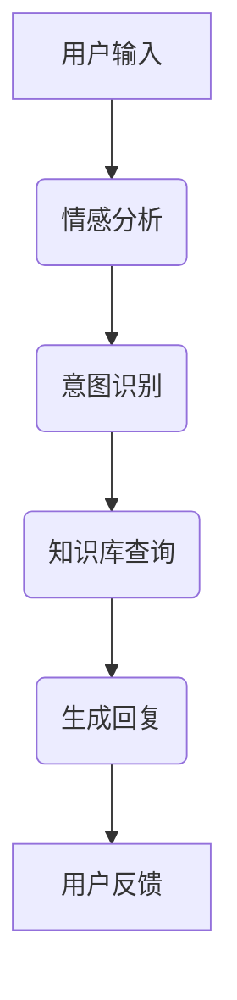
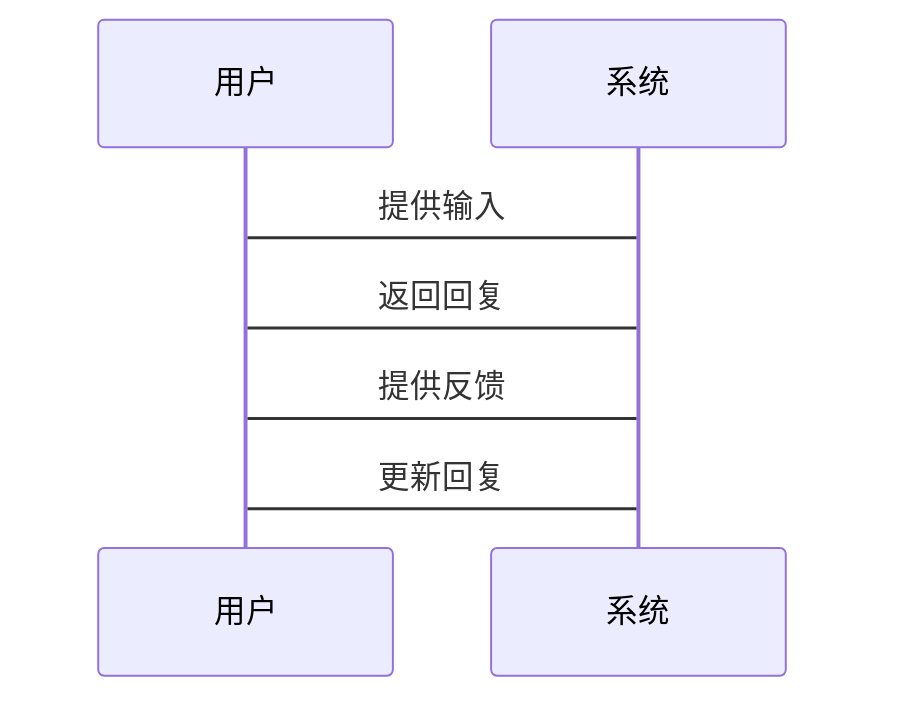

                 


# 情感智能对话AI Agent：LLM驱动的心理健康助手

## 关键词：
- 情感智能对话
- AI Agent
- 大语言模型（LLM）
- 心理健康助手
- 对话生成
- 情感分析

## 摘要：
本文探讨了情感智能对话AI Agent在心理健康支持中的应用，分析了大语言模型（LLM）的技术原理及其在情感智能对话中的潜力，详细设计了系统的架构与实现，并通过实际案例展示了如何利用LLM构建心理健康助手。

---

## 第一部分：情感智能对话AI Agent的背景与基础

### 第1章：情感智能对话AI Agent概述

#### 1.1 情感智能对话的定义与核心概念
- **情感智能对话**：通过AI技术模拟人类情感交流，理解并回应用户的情感需求。
- **核心概念**：情感分析、意图识别、对话生成、情感记忆。
- **应用领域**：心理健康支持、客服咨询、教育辅助。

#### 1.2 AI Agent的基本原理
- **AI Agent**：智能体，能够感知环境并执行任务。
- **情感智能对话AI Agent**：具备情感理解与生成能力，用于提供情感支持。
- **特点**：实时互动、个性化回应、情感记忆。

#### 1.3 大语言模型（LLM）的基本原理
- **LLM**：基于Transformer的深度学习模型，擅长处理自然语言。
- **优势**：上下文理解、生成能力、可扩展性。
- **在情感对话中的应用**：情感分析、对话生成、意图识别。

#### 1.4 本章小结
情感智能对话AI Agent通过LLM技术，为用户提供情感支持，结合心理学知识，帮助用户改善心理健康。

---

## 第二部分：大语言模型（LLM）驱动情感智能对话的技术原理

### 第2章：LLM的数学模型与训练原理

#### 2.1 LLM的数学模型
- **概率语言模型**：计算给定文本的概率，最大化生成文本的概率。
- **Transformer结构**：编码器-解码器结构，处理序列数据。
- **注意力机制**：计算词与词之间的相关性，突出重点。

#### 2.2 LLM的训练方法
- **预训练目标**：预测下一个词，使用交叉熵损失。
- **大规模数据**：利用互联网文本进行无监督预训练。
- **模型调优**：微调任务特定的数据，优化情感对话任务。

#### 2.3 情感智能对话的评估指标
- **准确率**：模型对情感分类的正确性。
- **BLEU/ROUGE**：生成文本与参考答案的相似度。
- **用户满意度**：用户对AI代理回应的满意度。

### 第3章：情感智能对话AI Agent的核心算法

#### 3.1 情感智能对话的算法流程
- **情感分析**：识别用户情感倾向。
- **意图识别**：理解用户需求。
- **对话生成**：基于分析生成回复。

#### 3.2 情感智能对话的流程图


#### 3.3 情感分析的数学模型
- **二分类模型**：使用逻辑回归分类器。
  $$ P(y=1|x) = \sigma(w \cdot x + b) $$
- **多分类模型**：使用Softmax函数。
  $$ P(y=k|x) = \frac{e^{w_k \cdot x + b_k}}{\sum_{j} e^{w_j \cdot x + b_j}} $$

---

## 第三部分：情感智能对话AI Agent的系统架构与设计

### 第4章：系统功能设计与架构

#### 4.1 系统功能模块
- **输入模块**：接收用户输入。
- **情感分析模块**：分析用户情感。
- **意图识别模块**：识别用户需求。
- **知识库模块**：存储心理健康知识。
- **对话生成模块**：生成回复。
- **反馈模块**：收集用户反馈。

#### 4.2 系统架构设计


#### 4.3 系统接口设计
- **输入接口**：文本输入接口。
- **输出接口**：文本输出接口。
- **反馈接口**：用户反馈收集接口。

#### 4.4 系统交互流程


---

## 第四部分：项目实战与应用展望

### 第5章：情感智能对话AI Agent的实现

#### 5.1 环境安装
- **Python**：3.8及以上版本。
- **库安装**：`transformers`, `torch`, `numpy`。

#### 5.2 核心实现代码
```python
from transformers import pipeline

# 初始化模型
sentiment_analyzer = pipeline("sentiment-analysis")
response_generator = pipeline("text-generation", model="gpt2")

# 对话生成函数
def generate_response(input_text):
    response = response_generator(input_text, max_length=50, do_sample=True)
    return response[0]['generated_text']

# 情感分析函数
def analyze_sentiment(input_text):
    sentiment = sentiment_analyzer(input_text)
    return sentiment[0]['label'], sentiment[0]['score']
```

#### 5.3 实际案例分析
- **案例1**：用户输入“我感到非常沮丧。”
  - 情感分析：消极，0.95。
  - 对话生成：“我能理解你的感受，我们可以一起探讨一下。”

#### 5.4 案例分析与解读
- **案例分析**：模型准确识别情感并生成支持性回应。
- **优化方向**：结合心理学知识，提供更专业的建议。

#### 5.5 项目小结
实现了情感智能对话AI Agent的基本功能，展示了LLM在心理健康支持中的潜力。

---

## 作者：AI天才研究院/AI Genius Institute & 禅与计算机程序设计艺术 /Zen And The Art of Computer Programming

---

这篇文章系统地探讨了情感智能对话AI Agent在心理健康支持中的应用，从技术原理到系统实现，再到实际案例，为读者提供了全面的视角。通过详细的代码实现和案例分析，展示了如何利用大语言模型构建情感智能对话系统，为未来的心理健康支持提供了有价值的参考。

